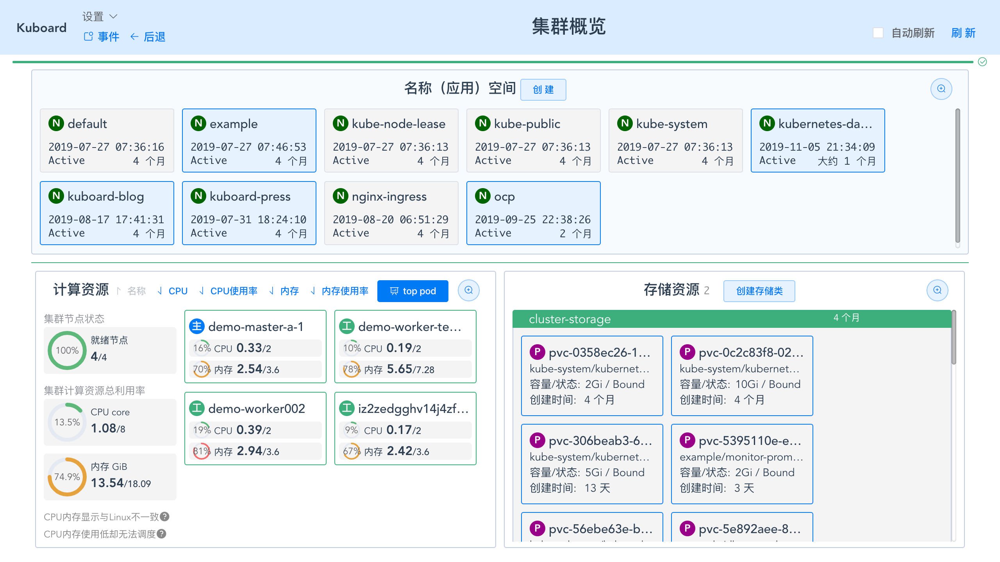

# Kuboard简介

Kuboard 是一款基于 Kubernetes 的微服务管理界面。目的是帮助用户快速在 Kubernetes 上落地微服务。在 [https://kuboard.cn](https://kuboard.cn) 上，您可以获得：
* 最新版本的 Kubernetes 安装文档
* 免费的 Kubernetes 中文教程
* 免费的 Kubernetes 图形化管理界面 Kuboard
* 在 Kubernetes 上部署 Spring Cloud 的实战分享

## Kubernetes安装文档

* <a href="https://kuboard.cn/install/install-k8s.html">Kubernetes (K8S)v1.16.3 安装文档</a>
  * 每天超过 300 名网友参考此文档完成Kubernetes安装
  * QQ群在线答疑
* <a href="https://kuboard.cn/install/install-kubernetes.html">Kubernetes 高可用安装文档</a>
* <a href="https://kuboard.cn/install/upgrade-k8s/1.15.x-1.16.x.html">Kubernetes升级到1.16.x</a>
* <a href="https://kuboard.cn/install/install-dashboard.html">Kuboard 安装文档</a>

## Kubernetes免费教程

Kubernetes教程的主要依据是：Kubernetes 官网文档，以及使用 Kuboard 落地 Spring Cloud 微服务的实战经验

### **Kubernetes 介绍**

  * <a href="https://kuboard.cn/learning/k8s-bg/what-is-k8s.html">什么是Kubernetes</a>
  * <a href="https://kuboard.cn/learning/k8s-bg/component.html">Kubernetes组件</a>

### Kubernetes入门
  * <a href="https://kuboard.cn/learning/k8s-basics/kubernetes-basics.html">0. 学习Kubernetes基础知识</a> (10分钟)
    * <a href="https://kuboard.cn/learning/k8s-basics/deploy-app.html">1. 部署一个应用程序</a> (5分钟)
    * <a href="https://kuboard.cn/learning/k8s-basics/explore.html">2. 查看 Pods / Nodes</a> (10分钟)
    * <a href="https://kuboard.cn/learning/k8s-basics/expose.html">3. 公布应用程序</a> (10分钟)
    * <a href="https://kuboard.cn/learning/k8s-basics/scale.html">4. 伸缩应用程序</a> (10分钟)
    * <a href="https://kuboard.cn/learning/k8s-basics/update.html">5. 执行滚动更新</a> (10分钟)
  * <a href="https://kuboard.cn/learning/k8s-basics/k8s-core-concepts.html">6. 复习Kubernetes核心概念</a> (10分钟)

### Kubernetes进阶
  * 架构
    * <a href="https://kuboard.cn/learning/k8s-bg/architecture/nodes.html">节点</a>
    * <a href="https://kuboard.cn/learning/k8s-bg/architecture/com.html">集群内通信</a>
    * <a href="https://kuboard.cn/learning/k8s-bg/architecture/controller.html">控制器</a>
  * 操作Kubernetes
    * <a href="https://kuboard.cn/learning/k8s-intermediate/obj/k8s-object.html">什么是Kubernetes对象</a>
    * <a href="https://kuboard.cn/learning/k8s-intermediate/obj/manage.html">管理Kubernetes对象</a>
    * <a href="https://kuboard.cn/learning/k8s-intermediate/obj/names.html">名称</a>
    * <a href="https://kuboard.cn/learning/k8s-intermediate/obj/namespaces.html">名称空间</a>
    * <a href="https://kuboard.cn/learning/k8s-intermediate/obj/namespace-op.html">使用名称空间共享集群</a>
    * <a href="https://kuboard.cn/learning/k8s-intermediate/obj/labels.html">标签和选择器</a>
    * <a href="https://kuboard.cn/learning/k8s-intermediate/obj/annotations.html">注解</a>
    * <a href="https://kuboard.cn/learning/k8s-intermediate/obj/field.html">字段选择器</a>
  * 容器
    * <a href="https://kuboard.cn/learning/k8s-intermediate/container/images.html">容器镜像</a>
    * <a href="https://kuboard.cn/learning/k8s-intermediate/container/env.html">容器的环境变量</a>
  * 工作负载
    * <a href="https://kuboard.cn/learning/k8s-intermediate/workload/pod.html">容器组 - 概述</a>
    * <a href="https://kuboard.cn/learning/k8s-intermediate/workload/pod-lifecycle.html">容器组 - 生命周期</a>
    * <a href="https://kuboard.cn/learning/k8s-intermediate/workload/init-container.html">容器组 - 初始化容器</a>
    * <a href="https://kuboard.cn/learning/k8s-intermediate/workload/workload.html">控制器 - 概述</a>
    * <a href="https://kuboard.cn/learning/k8s-intermediate/workload/wl-deployment/">控制器 - Deployment</a> 
    * <a href="https://kuboard.cn/learning/k8s-intermediate/workload/wl-statefulset/">控制器 - StatefulSet</a> 
    * <a href="https://kuboard.cn/learning/k8s-intermediate/workload/wl-daemonset/">控制器 - DaemonSet</a> 
    * <a href="https://kuboard.cn/learning/k8s-intermediate/workload/wl-job/">控制器 - Job</a> 
    * <a href="https://kuboard.cn/learning/k8s-intermediate/workload/wl-cronjob/">控制器 - CronJob</a> 
  * 服务发现、负载均衡、网络
    * <a href="https://kuboard.cn/learning/k8s-intermediate/service/service.html">Service</a> 
    * <a href="https://kuboard.cn/learning/k8s-intermediate/service/service-details.html">Service 详细描述</a>
    * <a href="https://kuboard.cn/learning/k8s-intermediate/service/service-types.html">Service 类型</a>
    * <a href="https://kuboard.cn/learning/k8s-intermediate/service/dns.html">Service/Pod 的 DNS</a> 
    * <a href="https://kuboard.cn/learning/k8s-intermediate/service/host-alias.html">配置Pod的 /etc/hosts</a> 
    * <a href="https://kuboard.cn/learning/k8s-intermediate/service/connecting.html">Service 连接应用程序</a> 
    * <a href="https://kuboard.cn/learning/k8s-intermediate/service/ingress.html">Ingress 通过互联网访问您的应用</a>
  * 存储
    * <a href="https://kuboard.cn/learning/k8s-intermediate/persistent/volume.html">数据卷 Volume</a>
    * <a href="https://kuboard.cn/learning/k8s-intermediate/persistent/pv.html">存储卷 PV 和存储卷声明 PVC</a>
    * <a href="https://kuboard.cn/learning/k8s-intermediate/persistent/storage-class.html">存储类 StorageClass</a>
    * <a href="https://kuboard.cn/learning/k8s-intermediate/persistent/nfs.html">自建 NFS 服务</a> 
  * 配置
    * <a href="https://kuboard.cn/learning/k8s-intermediate/private-registry.html">使用私有 registry 中的 docker 镜像</a>
    * <a href="https://kuboard.cn/learning/k8s-intermediate/config/config-map.html">使用 ConfigMap 配置您的应用程序</a>
    * <a href="https://kuboard.cn/learning/k8s-intermediate/config/computing-resource.html">管理容器的计算资源</a> 
    * <a href="https://kuboard.cn/learning/k8s-intermediate/config/assign-pod-node.html">将容器调度到指定的节点</a> 
    * <a href="https://kuboard.cn/learning/k8s-intermediate/config/taints-toleration/">污点和容忍 taints and toleration</a> 
    * <a href="https://kuboard.cn/learning/k8s-intermediate/config/secrets/">Secrets</a> 

### Kubernetes高级

  * 问题诊断
    * <a href="https://kuboard.cn/learning/k8s-advanced/ts/application.html">诊断应用程序</a>
    * <a href="https://kuboard.cn/learning/k8s-advanced/ts/cluster.html">诊断集群问题</a>
    * <a href="https://kuboard.cn/learning/k8s-advanced/ts/deployment.html">Deployment故障排除图解</a>
  * 日志
    * <a href="https://kuboard.cn/learning/k8s-advanced/logs/">日志</a>
  * 调度
    * <a href="https://kuboard.cn/learning/k8s-advanced/schedule/">调度</a>
    * <a href="https://kuboard.cn/learning/k8s-advanced/schedule/tuning.html">调度调优</a>
    * <a href="https://kuboard.cn/learning/k8s-advanced/schedule/framework.html">调度框架</a>
  * 策略
    * <a href="https://kuboard.cn/learning/k8s-advanced/policy/lr.html">Limit Range</a>
    * <a href="https://kuboard.cn/learning/k8s-advanced/policy/rq.html">Resource Quota</a>
  * 安全
    * <a href="https://kuboard.cn/learning/k8s-advanced/sec/rbac/api.html">RBAC 授权接口</a>
    * <a href="https://kuboard.cn/learning/k8s-advanced/sec/rbac/example.html">RBAC Example</a>
  * 监控
  * 联邦

### Kubernetes实战

在 Kubernetes 上部署 Spring Cloud 微服务：

* <a href="https://kuboard.cn/learning/k8s-practice/spring-cloud/">概述</a>

在 Kubernetes 上部署 Spring Cloud 微服务：(Open Capacity Platform)

* 准备
  * <a href="https://kuboard.cn/learning/k8s-practice/ocp/prepare.html">准备OCP的构建环境和部署环境</a>
  * <a href="https://kuboard.cn/learning/k8s-practice/ocp/build.html">构建docker镜像并推送到仓库</a>
* 部署
  * <a href="https://kuboard.cn/learning/k8s-practice/ocp/sequence.html">部署顺序</a>
  * <a href="https://kuboard.cn/learning/k8s-practice/ocp/eureka-server.html">在K8S上部署eureka-server</a>
  * <a href="https://kuboard.cn/learning/k8s-practice/ocp/mysql.html">在K8S上部署mysql</a>
  * <a href="https://kuboard.cn/learning/k8s-practice/ocp/redis.html">在K8S上部署redis</a>
  * <a href="https://kuboard.cn/learning/k8s-practice/ocp/auth-server.html">在K8S上部署auth-server</a>
  * <a href="https://kuboard.cn/learning/k8s-practice/ocp/user-center.html">在K8S上部署user-center</a>
  * <a href="https://kuboard.cn/learning/k8s-practice/ocp/api-gateway.html">在K8S上部署api-gateway</a>
  * <a href="https://kuboard.cn/learning/k8s-practice/ocp/back-center.html">在K8S上部署back-center</a>
  * <a href="https://kuboard.cn/learning/k8s-practice/ocp/review.html">重新审视配置信息</a>
* 多环境
  * <a href="https://kuboard.cn/learning/k8s-practice/ocp/export.html">导出部署配置</a>
  * <a href="https://kuboard.cn/learning/k8s-practice/ocp/import.html">导入部署配置</a>

Kuboard官网免费提供Kubernetes教程、K8S教程、K8S安装文档、Kubernetes+SpringCloud实战文档，学习过程中如有疑问，请加QQ群在线答疑。
