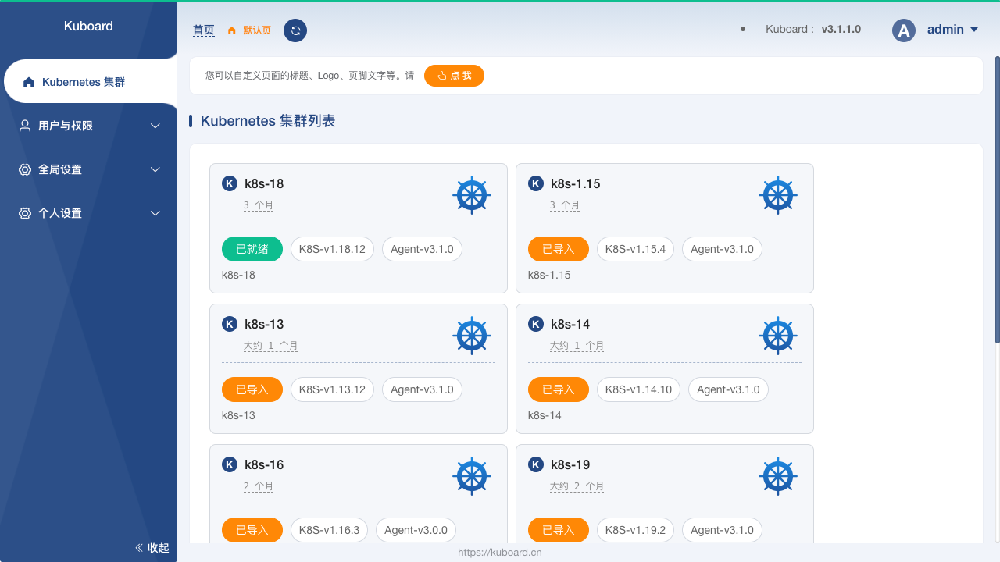
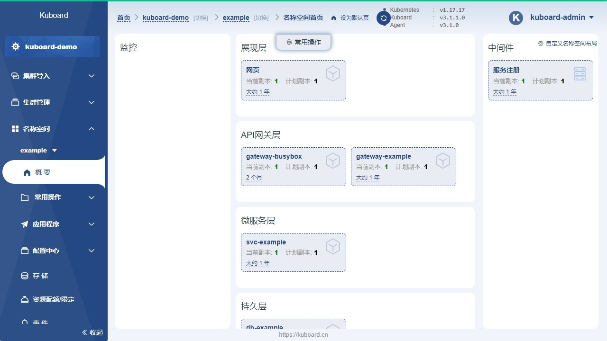
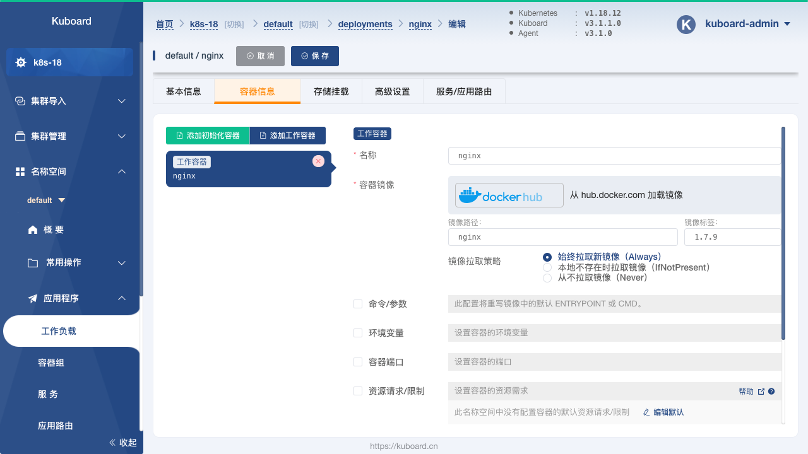
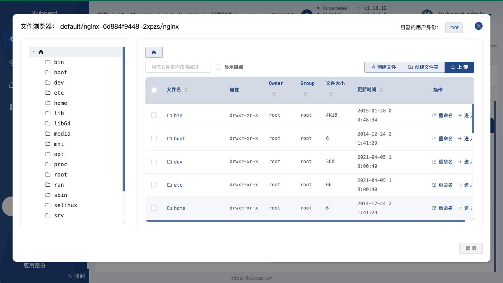

# Kuboard for Kubernetes

Kuboard 是一款专为 Kubernetes 设计的免费管理界面，兼容 Kubernetes 版本 1.13 及以上。Kuboard 每周发布一个 beta 版本，最长每月发布一个正式版本，经过两年的不断迭代和优化，已经具备多集群管理、权限管理、监控套件、日志套件等丰富的功能，并且有 1000+ 的企业将 Kuboard 应用于其生产环境。Kuboard 自 2019年8月发布第一个版本以来，得到了众多用户的认可，目前已经获得了 9300+ GitHub Star

点击这里可以查看 [Kuboard 的安装文档](https://kuboard.cn/install/v3/install.html)

## 在线演示

  在线演示环境中，您具备 只读 权限，只能体验 Kuboard 的一部分功能。 

  <a href="https://demo.kuboard.cn" target="_blank">https://demo.kuboard.cn</a>  
  
用&nbsp;户

  demo  
  
密&nbsp;码

  demo123

## 特点介绍

相较于 Kubernetes Dashboard 等其他 Kubernetes 管理界面，Kuboard 的主要特点有：

* 多种认证方式

  Kuboard 可以使用内建用户库、gitlab / github 单点登录或者 LDAP 用户库进行认证，避免管理员将 ServiceAccount 的 Token 分发给普通用户而造成的麻烦。使用内建用户库时，管理员可以配置用户的密码策略、密码过期时间等安全设置。

  

* 多集群管理

  管理员可以将多个 Kubernetes 集群导入到 Kuboard 中，并且通过权限控制，将不同集群/名称空间的权限分配给指定的用户或用户组。

  

* 微服务分层展示

  在 Kuboard 的名称空间概要页中，以经典的微服务分层方式将工作负载划分到不同的分层，更加直观地展示微服务架构的结构，并且可以为每一个名称空间自定义名称空间布局。

  

* 工作负载的直观展示

  Kuboard 中将 Deployment 的历史版本、所属的 Pod 列表、Pod 的关联事件、容器信息合理地组织在同一个页面中，可以帮助用户最快速的诊断问题和执行各种相关操作。

  

* 工作负载编辑

  Kuboard 提供了图形化的工作负载编辑界面，用户无需陷入繁琐的 YAML 文件细节中，即可轻松完成对容器的编排任务。支持的 Kubernetes 对象类型包括：Node、Namespace、Deployment、StatefulSet、DaemonSet、Secret、ConfigMap、Service、Ingress、StorageClass、PersistentVolumeClaim、LimitRange、ResourceQuota、ServiceAccount、Role、RoleBinding、ClusterRole、ClusterRoleBinding、CustomResourceDefinition、CustomResource 等各类常用 Kubernetes 对象，

  

* 存储类型支持

  在 Kuboard 中，可以方便地对接 NFS、CephFS 等常用存储类型，并且支持对 CephFS 类型的存储卷声明执行扩容和快照操作。

  

* 丰富的互操作性

  可以提供许多通常只在 `kubectl` 命令行界面中才提供的互操作手段，例如：

  * Top Nodes / Top Pods
  * 容器的日志、终端
  * 容器的文件浏览器（支持从容器中下载文件、上传文件到容器）
  * KuboardProxy（在浏览器中就可以提供 `kubectl proxy` 的功能）

  

* 套件扩展

  Kuboard 提供了必要的套件库，使得用户可以根据自己的需要扩展集群的管理能力。当前提供的套件有：

  * 资源层监控套件，基于 Prometheus / Grafana 提供 K8S 集群的监控能力，可以监控集群、节点、工作负载、容器组等各个级别对象的 CPU、内存、网络、磁盘等资源的使用情况；
  * 日志聚合套件，基于 Grafana / Loki / Promtail 实现日志聚合；
  * 存储卷浏览器，查看和操作存储卷中的内容；

  

访问 Kuboard 网站 https://kuboard.cn 可以加入 Kuboard 社群，并获得帮助。
