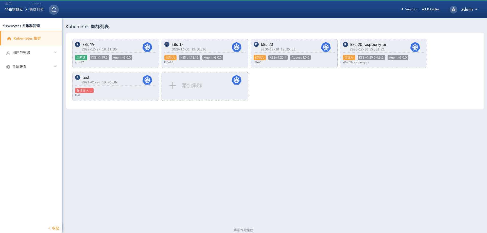

# Kuboard简介

Kuboard 是一款基于 Kubernetes 的微服务管理界面。目的是帮助用户快速在 Kubernetes 上落地微服务。在 [https://kuboard.cn](https://kuboard.cn) 上，您可以获得：
* 最新版本的 Kubernetes 安装文档
* 免费的 Kubernetes 中文教程
* 免费的 Kubernetes 图形化管理界面 Kuboard
* 在 Kubernetes 上部署 Spring Cloud 的实战分享

## Kubernetes安装文档

* <a href="https://kuboard.cn/install/install-k8s.html">Kubernetes (K8S)v1.20.1 安装文档</a>
  * 每天超过 300 名网友参考此文档完成Kubernetes安装
  * QQ群在线答疑
* <a href="https://kuboard.cn/install/install-kubernetes.html">Kubernetes 高可用安装文档</a>
* <a href="https://kuboard.cn/install/upgrade-k8s/1.15.x-1.16.x.html">Kubernetes升级到1.16.x</a>
* <a href="https://kuboard.cn/install/v3/install.html">Kuboard 安装文档</a>

## Kubernetes免费教程

Kubernetes教程的主要依据是：Kubernetes 文档，以及使用 Kuboard 落地 Spring Cloud 微服务的实战经验

### **Kubernetes 入门**
  * [0. 学习Kubernetes基础知识](/learning/k8s-basics/kubernetes-basics.html) (10分钟)
    * [1. 部署一个应用程序](/learning/k8s-basics/deploy-app.html) (5分钟)
    * [2. 查看 Pods / Nodes](/learning/k8s-basics/explore.html) (10分钟)
    * [3. 公布应用程序](/learning/k8s-basics/expose.html) (10分钟)
    * [4. 伸缩应用程序](/learning/k8s-basics/scale.html) (10分钟)
    * [5. 执行滚动更新](/learning/k8s-basics/update.html) (10分钟)
  * [6. 复习Kubernetes核心概念](/learning/k8s-basics/k8s-core-concepts.html) (10分钟)

  ::: tip 学习路径建议
  * 入门教程是经典。推荐初学者学习入门教程 2 - 3 遍，甚至更多。
  * 完成入门教程之后，建议首先阅读的文章内容是：
    * [控制器](/learning/k8s-bg/architecture/controller.html)
    * [Pod容器组](/learning/k8s-intermediate/workload/pod.html)
    * [Deployment](/learning/k8s-intermediate/workload/wl-deployment/)
    * [诊断应用程序](/learning/k8s-advanced/ts/application.html)
    * [使用私有 registry 中的 docker 镜像](/learning/k8s-intermediate/private-registry.html)
    * [Service 连接应用程序](/learning/k8s-intermediate/service/connecting.html)
    * [Ingress 通过互联网访问您的应用](/learning/k8s-intermediate/service/ingress.html)
    * [Deployment故障排除](/learning/k8s-advanced/ts/deployment.html)
    * [数据卷 Volume](/learning/k8s-intermediate/persistent/volume.html)
    * [使用KuboardProxy](/guide/proxy/)
    * [使用port-forward访问集群中的应用程序](/learning/k8s-practice/access/port-forward.html)
    * [Kubernetes网络模型](/learning/k8s-intermediate/service/network.html)
    * [容器应用的设计原则、模式和反模式](/learning/k8s-practice/micro-service/design-pattern.html)
    * [尝试部署完整的微服务](/learning/k8s-practice/ocp/)
    * [自动伸缩](/learning/k8s-advanced/hpa/hpa.html)
    * [自动伸缩-例子](/learning/k8s-advanced/hpa/walkthrough.html)
  * 完善工具配置
    * [掌握快速部署高可用Kubernetes集群的窍门](https://github.com/fanux/sealos)
    * [自定义Kuboard名称空间布局](/install/install-kuboard-layout.html)
    * [创建ServiceAccount并授权其访问指定的名称空间](/learning/k8s-advanced/sec/kuboard.html)
    * [实现Kubernetes与GitLab/GitHub的单点登录](/learning/k8s-advanced/sec/authenticate/install.html)
    * [了解日志聚合](/learning/k8s-advanced/logs/)
    * [了解Kubernetes的监控](/guide/example/monitor-v2.html)
    * [免费获得Kuboard授权](/support/)
  * 按教程章节顺序对 Kubernetes 各种概念进行深入理解
  * CI/CD 工具链
    * 私有 Docker 镜像仓库
    * CI/CD pipeline
    * [CI/CD集成](/guide/cicd/)
  * 投产准备
    * 集群规划
  * 长期维护
    * 可观察性
    * 升级
    * kubeadm 更新证书
    * 增加、删除节点
    * 备份恢复 etcd
    * 故障排除
    :::

### **Kubernetes 进阶**
  * 架构
    * [节点](/learning/k8s-bg/architecture/nodes.html)
    * [集群内通信](/learning/k8s-bg/architecture/com.html)
    * [控制器](/learning/k8s-bg/architecture/controller.html)
  * 操作Kubernetes
    * [什么是Kubernetes对象](/learning/k8s-intermediate/obj/k8s-object.html)
    * [管理Kubernetes对象](/learning/k8s-intermediate/obj/manage.html)
    * [名称](/learning/k8s-intermediate/obj/names.html)
    * [名称空间](/learning/k8s-intermediate/obj/namespaces.html)
    * [使用名称空间共享集群](/learning/k8s-intermediate/obj/namespace-op.html)
    * [标签和选择器](/learning/k8s-intermediate/obj/labels.html)
    * [注解](/learning/k8s-intermediate/obj/annotations.html)
    * [字段选择器](/learning/k8s-intermediate/obj/field.html)
  * 容器
    * [容器镜像](/learning/k8s-intermediate/container/images.html)
    * [容器的环境变量](/learning/k8s-intermediate/container/env.html)
  * 工作负载
    * [容器组 - 概述](/learning/k8s-intermediate/workload/pod.html)
    * [容器组 - 生命周期](/learning/k8s-intermediate/workload/pod-lifecycle.html)
    * [容器组 - 初始化容器](/learning/k8s-intermediate/workload/init-container.html)
    * [控制器 - 概述](/learning/k8s-intermediate/workload/workload.html)
    * [控制器 - ReplicaSet](/learning/k8s-intermediate/workload/wl-replicaset/)
    * [控制器 - ReplicationController](/learning/k8s-intermediate/workload/wl-replication-con/)
    * [控制器 - Deployment](/learning/k8s-intermediate/workload/wl-deployment/)
    * [控制器 - StatefulSet](/learning/k8s-intermediate/workload/wl-statefulset/)
    * [控制器 - DaemonSet](/learning/k8s-intermediate/workload/wl-daemonset/)
    * [控制器 - 垃圾回收](/learning/k8s-intermediate/workload/gc)
    * [控制器 - TTL](/learning/k8s-intermediate/workload/wl-ttl/)
    * [控制器 - Job](/learning/k8s-intermediate/workload/wl-job/)
    * [控制器 - CronJob](/learning/k8s-intermediate/workload/wl-cronjob/)
  * 服务发现、负载均衡、网络
    * [Service 概述](/learning/k8s-intermediate/service/service.html)
    * [Service 详细描述](/learning/k8s-intermediate/service/service-details.html)
    * [Service 类型](/learning/k8s-intermediate/service/service-types.html)
    * [Service/Pod 的 DNS](/learning/k8s-intermediate/service/dns.html)
    * [配置Pod的 /etc/hosts](/learning/k8s-intermediate/service/host-alias.html)
    * [Service 连接应用程序](/learning/k8s-intermediate/service/connecting.html)
    * [Ingress 通过互联网访问您的应用](/learning/k8s-intermediate/service/ingress.html)
    * [如何选择网络插件](/learning/k8s-intermediate/service/cni.html)
  * 存储
    * [数据卷 Volume](/learning/k8s-intermediate/persistent/volume.html)
    * [存储卷 PV 和存储卷声明 PVC](/learning/k8s-intermediate/persistent/pv.html)
    * [存储类 StorageClass](/learning/k8s-intermediate/persistent/storage-class.html)
    * [自建 NFS 服务](/learning/k8s-intermediate/persistent/nfs.html)
  * 配置
    * [使用私有 registry 中的 docker 镜像](/learning/k8s-intermediate/private-registry.html)
    * [使用 ConfigMap 配置您的应用程序](/learning/k8s-intermediate/config/config-map.html)
    * [管理容器的计算资源](/learning/k8s-intermediate/config/computing-resource.html)
    * [将容器调度到指定的节点](/learning/k8s-intermediate/config/assign-pod-node.html)
    * [污点和容忍 taints and toleration](/learning/k8s-intermediate/config/taints-toleration/)
    * [Secrets](/learning/k8s-intermediate/config/secrets/)
    * [Security Context](/learning/k8s-intermediate/config/sec-ctx/)

### **Kubernetes 高级**

  * 问题诊断
    * [诊断应用程序](/learning/k8s-advanced/ts/application.html)
    * [诊断集群问题](/learning/k8s-advanced/ts/cluster.html)
  * 日志
    * [日志](/learning/k8s-advanced/logs/)
    * [日志聚合套件](/learning/k8s-advanced/logs/loki-addon.html)
  * 调度
    * [调度](/learning/k8s-advanced/schedule/)
    * [调度调优](/learning/k8s-advanced/schedule/tuning.html)
    * [调度框架](/learning/k8s-advanced/schedule/framework.html)
  * 策略
    * [Limit Range](/learning/k8s-advanced/policy/lr.html)
    * [Resource Quota](/learning/k8s-advanced/policy/rq.html)
  * 安全
    * [用户认证概述](/learning/k8s-advanced/sec/authenticate/)
    * [使用GitLab/GitHub等账号登录Kubernetes/Kuboard](/learning/k8s-advanced/sec/authenticate/install.html)
    * [使用 LDAP 用户登录Kubernetes/Kuboard](/learning/k8s-advanced/sec/authenticate/ldap.html)
    * [RBAC授权](/learning/k8s-advanced/sec/rbac/api.html)
    * [授权用户访问名称空间](/learning/k8s-advanced/sec/rbac/user-namespace.html)
    * [授权用户访问名称空间列表](/learning/k8s-advanced/sec/rbac/list-namespace.html)

    <!-- <Course courseId="484058" /> -->
  * 监控
    
    * [kube-prometheus](/learning/k8s-advanced/observe/kube-prometheus.html)
  * 联邦

### **Kubernetes 实战**

* [从微服务视角理解 Kubernetes](/learning/k8s-practice/micro-service/kuboard-view-of-k8s.html)

在 Kubernetes 上部署 Spring Cloud 微服务：

* [概述](/learning/k8s-practice/spring-cloud/)
* [导入 example 微服务应用](/guide/example/import.html) （15分钟）
  * 导入一个完整的 example 微服务应用，体验 Spring Cloud 在 Kubernetes 上的部署过程。
* [在微服务上下文中监控 example](/guide/example/monitor-v2.html) 
  * 根据微服务上下文查看监控结果

在 Kubernetes 上部署 Spring Cloud 微服务：(Open Capacity Platform)

* 准备
  * [准备OCP的构建环境和部署环境](/learning/k8s-practice/ocp/prepare.html)
  * [构建docker镜像并推送到仓库](/learning/k8s-practice/ocp/build.html)
* 部署
  * [部署顺序](/learning/k8s-practice/ocp/sequence.html)
  * [在K8S上部署eureka-server](/learning/k8s-practice/ocp/eureka-server.html)
  * [在K8S上部署mysql](/learning/k8s-practice/ocp/mysql.html)
  * [在K8S上部署redis](/learning/k8s-practice/ocp/redis.html)
  * [在K8S上部署auth-server](/learning/k8s-practice/ocp/auth-server.html)
  * [在K8S上部署user-center](/learning/k8s-practice/ocp/user-center.html)
  * [在K8S上部署api-gateway](/learning/k8s-practice/ocp/api-gateway.html)
  * [在K8S上部署back-center](/learning/k8s-practice/ocp/back-center.html)
  * [重新审视配置信息](/learning/k8s-practice/ocp/review.html)
* 多环境
  * [导出部署配置](/learning/k8s-practice/ocp/export.html)
  * [导入部署配置](/learning/k8s-practice/ocp/import.html)
Kuboard免费提供Kubernetes教程、K8S教程、K8S安装文档、Kubernetes+SpringCloud实战文档，学习过程中如有疑问，请加QQ群在线答疑。
