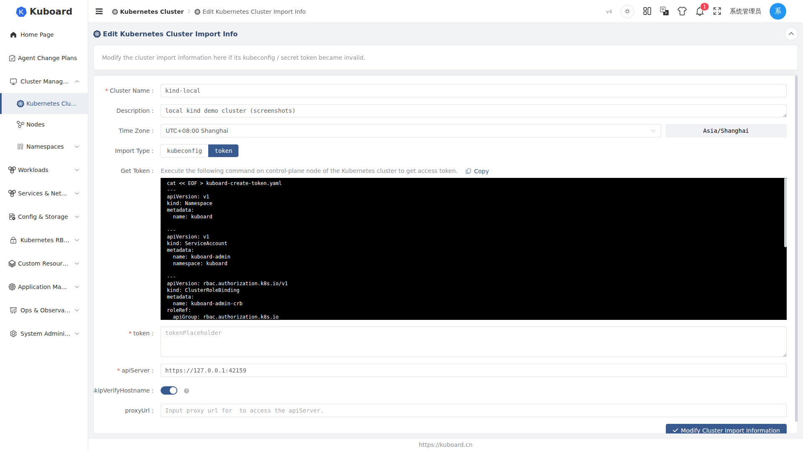

# Editing a Cluster

After a cluster is imported, you can modify its configuration through the **Edit** action. When a kubeconfig or secret token expires, the API Server address changes, or you need to adjust the cluster name, description or time zone, everything can be done on the edit page. Once saved, Kuboard **re-validates the connection and rebuilds the connection client** with the new parameters, then runs a **full sync** against that cluster.

::: tip When to use
- The kubeconfig or secret token is invalid (the top of the edit page already reminds you: after a kubeconfig or secret token expires, you can update the cluster's kubeconfig / secret token here so that the cluster can be reached correctly);
- The API Server address or proxy has changed;
- You need to modify the cluster name, description or time zone.
:::

## Where to find the entry

There are two entry points for editing a cluster, and both require the current account to have the `update` permission on the `cluster.kuboard.cn` / `cluster` resource:

1. **Cluster list page**: find the target cluster on the [cluster list](./import) (`/cluster/clusters`) and click the **Edit** button in the Actions column of its row;
2. **Cluster detail page**: open the cluster detail page and click the **Edit** button at the top right (above the cluster basic information).

Both entries eventually navigate to the `/cluster/clusters/{uid}/edit` route and edit the same form page.

## Editable fields

The form fields on the edit page are essentially the same as on the [import cluster](./import) page and are split into two sections: **Basic Information** and **Connection Configuration**.

### Basic Information

| Form field | Corresponding resource field | Description |
| --- | --- | --- |
| Cluster name | `metadata.name` | Required. Length 3 - 24, must conform to the Kubernetes object naming conventions. After the name is changed, Kuboard refreshes the cluster name cache accordingly |
| Cluster description | `spec.description` | Optional. Free-text remark about the cluster |
| Time zone | `spec.timeZone` | Set via the time picker; the field shows the current time zone text in real time to the right of the input. When left empty, the server default time zone is used |

### Connection Configuration

The connection configuration varies by **import method** (`spec.importType`). On the edit page you can switch directly between kubeconfig and token (a radio button group).

**When using kubeconfig:**

| Form field | Corresponding resource field | Description |
| --- | --- | --- |
| kubeconfig content | `spec.importSecretInfo` | Paste the content of `/etc/kubernetes/admin.conf` (run `cat /etc/kubernetes/admin.conf` on a control-plane node of the cluster to obtain it). The content must contain the `clusters`, `contexts` and `users` fields, otherwise parsing fails and an error is shown |
| Cluster context | — | The context parsed from the kubeconfig; required. Selecting it automatically fills in the corresponding API Server address and certificate |
| API Server address | `spec.apiServerUrl` | Required. Validation rules are described below in "Address validation rules" |
| Skip hostname verification | `spec.apiServerSkipVerifyHostname` | Switch. Turn it on when you see certificate errors like `Certificate for 10.99.15.32 doesn't match any of the subject alternative names` |
| Proxy URL | `spec.proxyUrl` | Optional. Fill in when the server hosting Kuboard can only reach the apiServer through a proxy |

**When using token:**

| Form field | Corresponding resource field | Description |
| --- | --- | --- |
| Token | `spec.importSecretInfo` | Required. Run the shell script shown on the page on a control-plane node of the cluster to create the `kuboard-admin` service account, then paste the token it returns |
| API Server address | `spec.apiServerUrl` | Required. Validation rules are described below in "Address validation rules" |
| Skip hostname verification | `spec.apiServerSkipVerifyHostname` | Switch, same as the kubeconfig method |
| Proxy URL | `spec.proxyUrl` | Optional, same as the kubeconfig method |

#### API Server address validation rules

The API Server address validation rules are identical for both the kubeconfig and token methods:

- Must start with `http://` or `https://`;
- Must include a port number (a `:port` part like `:8443`);
- Must not end with `/`.

::: tip Re-validate after changing the Token
Every time you save, Kuboard **re-establishes and validates the connection** to the target cluster with the new parameters (see [Saving and connection rebuild](#saving-and-connection-rebuild)). Therefore, after changing the Token, the API Server address or the proxy, the save only succeeds if the re-validation passes.
:::

## Saving and connection rebuild

When you submit with the **Update cluster import information** button, the full frontend flow is as follows:

1. **Validate connection parameters**: the frontend first submits the form content to the `ping-apiserver` endpoint (with uid passed as `0`). This endpoint uses the new parameters to reach the target cluster's `/apis/authorization.k8s.io/v1/selfsubjectrulesreviews` (scoped to the `kube-system` namespace) to verify connectivity and permissions. On failure, the page stays on the edit page with an error and nothing is persisted;
2. **Update the cluster**: on success, it calls `PUT /api/cluster.kuboard.cn/v4/cluster/{uid}` to submit the cluster configuration. `metadata.uid` in the request body must match the uid in the URL path, otherwise a 400 `Input parameter uid mismatch` is returned;
3. **Redirect to the detail page**: after a successful save, it automatically navigates to the cluster's detail page (`/cluster/clusters/{uid}`).

The backend update logic (`ClusterService.importOrUpdateCluster` and `restartSync`) runs the following steps in order once the request is received:

1. **Re-detect the Kubernetes version**: it first issues `GET /version` against the target cluster with the new connection parameters; this must succeed and return a version. If no version can be obtained, an exception is raised and the save fails (HTTP 502 `Cannot get K8S version`). For this reason, a save cannot succeed while the connection parameters are wrong;
2. **Persist the configuration**: it writes the new name, description, import method, connection parameters and time zone, and at the same time sets `importStatus` to `importing` and `cacheHealthStatus` to `unknown` (to be re-probed by the next health check, see [Sync status](./sync-status));
3. **Rebuild the connection client**: it clears the cluster's client builder caches (`evictClientBuilderCacheElementCachedHashCode` and `evictClusterHttpClientBuilderFromSimpleCacheManager`); all subsequent access rebuilds the connection with the new parameters;
4. **Refresh caches**: if the cluster name changed, it removes the old "cluster name → id" mapping cache so that `getClusterIdByName` does not hit the stale record; it also pre-warms the capability cache with the live-detected version and notifies the invalidation of the cluster's capability decision cache;
5. **Trigger a full sync** (`restartSync`): it deletes all sync tasks of the cluster except the management task, resets the full sync status to `created` and the start time to the current time. The cluster then re-enters the "importing" state and runs one full data sync with the new configuration.

::: warning The connection is rebuilt and a full sync is triggered after saving
After a save, `importStatus` becomes `importing` and `cacheHealthStatus` becomes `unknown`. Until the health check re-probes and the full sync completes, the health status in the cluster list will temporarily show as "Unknown". A full sync on a large cluster may take a while; you can watch the progress on the **Sync Status** tab of the cluster detail page.
:::

## Fields that cannot be changed

The following cannot be modified on the edit page:

| Item | Description |
| --- | --- |
| Cluster uid (`metadata.uid`) | The unique identifier of the cluster; cannot be changed after import. The backend strictly validates that the request body uid matches the uid in the URL path |
| Kubernetes version | Not a form field. Kuboard re-detects and refreshes it automatically via `GET /version` on every save; it cannot be set manually |
| Existing Token / kubeconfig (`spec.importSecretInfo`) | For security reasons, the server **never echoes back** saved credentials when the cluster detail is read, so this field is always empty when the edit page loads |
| Status fields such as `importStatus` / `cacheHealthStatus` | Maintained by the sync and health-check mechanisms; they are automatically reset to `importing` / `unknown` after a save |
| `createTime` / `updateTime` | Maintained by the system; users cannot modify them |

::: warning Credentials must be re-entered on every save
Because the server does not echo back the saved Token / kubeconfig and `importSecretInfo` is a `@NotNull` required field on the server side, **no matter what you change this time (even if it is only the cluster description)**, you must re-paste the token or kubeconfig content before clicking save, otherwise validation fails.
:::

## Related pages

- [Import cluster](./import): bring a cluster under Kuboard management for the first time
- [Sync status](./sync-status): view full / incremental sync progress and status
- [Export / import](./export-import): export and re-import cluster configurations
