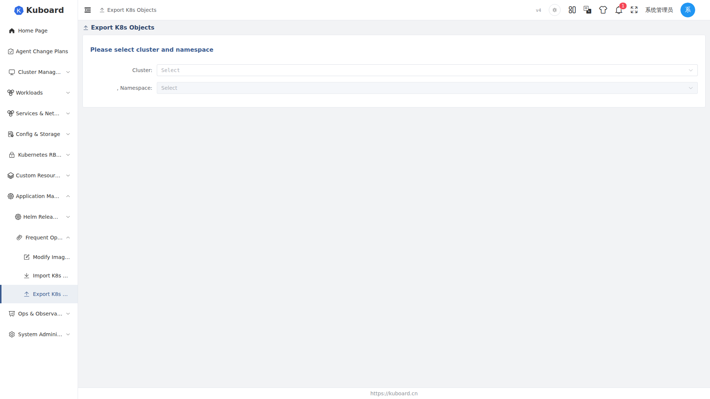

# Resource Export and Import

Kuboard V4 provides two wizards — "Export K8S Objects" and "Import K8S Objects" (entry: the "Frequent Operations" item in the left menu) — for migrating, backing up or reusing the resources inside a Namespace across clusters: Workloads, Services, Ingresses, ConfigMaps, Secrets and other custom objects.

::: tip Typical scenarios
- **Cross-cluster migration**: copy an entire application from a namespace in cluster A to cluster B;
- **Backup and restore**: export resource definitions to a YAML file for archival, and re-import them when needed;
- **Template reuse**: export a proven Workload + Service + Ingress combination as a template and deploy it to multiple clusters in batch.
:::

## How it works

Export and import both run entirely in the browser; the backend only provides a generic proxy that mirrors the Kubernetes API path (`/k8s-api/{clusterId}/...`):

- **Export**: Kuboard performs a GET for each selected object, retrieves its latest definition, cleans up cluster runtime fields according to fixed rules, then concatenates the objects into a single multi-document YAML file (documents separated by `---`) and downloads it to your local machine;
- **Import**: Kuboard parses the uploaded YAML file → shows the object list → lets you adjust environment-dependent parameters such as volumes, NodePorts and Ingress hostnames one by one → writes the objects back to the target cluster using `apply` / `create` / `delete`.

Export and import operate at the **resource definition (manifest) level** and do not include runtime content such as stored data.

## Export Resources

Entry: menu "Frequent Operations" → "Export K8S Objects". The first step of the wizard selects the source cluster and namespace (the export scope is fixed to **one namespace**), then objects are selected type by type in the following steps:

| Step | Object type | Description |
| --- | --- | --- |
| 1 | Workload | Deployment / StatefulSet / DaemonSet (apps/v1), showing ready replica counts and image/version |
| 2 | Service | Services, showing type (ClusterIP / NodePort, etc.) and label selector |
| 3 | Ingress | Ingresses, listed by the networking API version supported by the cluster |
| 4 | Config | ConfigMaps, showing the number of key-value pairs |
| 5 | Secrets | Secrets, showing the number of data entries |
| 6 | Other objects | Namespace-scoped objects of any kind (see below) |
| 7 | Confirm and export | Can turn off the "Export compact YAML" toggle; generates the file after confirming the object list |

<!-- screenshot-todo: Export wizard step 2 "Select Workloads" (English UI, Deployment/StatefulSet/DaemonSet list); not captured because the namespace dropdown could not be loaded in the local environment -->

Selected objects are collected into the shopping-cart button in the upper-right corner of the page, from which they can be removed at any time.

### Workloads

The Workload step lists the Deployment, StatefulSet and DaemonSet objects from apps/v1 in the namespace. For each object you can view its ready replica count and the images used by its containers (including initContainers). Check the objects you want to export by name.

### Other Objects (any K8s object)

The "Other objects" step provides three linked panels:

1. **ApiService**: lists the API groups registered in the cluster (e.g. `v1.`, `apps`, `networking.k8s.io`, etc.);
2. **Object type (Kind)**: shows the resource types under that API group, annotated with their Namespaced / Cluster scope;
3. **Objects**: lists the instances of that type in the current namespace; click to select.

Selection constraints:

- Only **Namespaced** resources can be exported; Cluster-scoped resources are disabled in the panels;
- You need the `list` permission on the resource, otherwise it cannot be selected;
- Subresources (names shaped like `deployments/scale`) are not exported.

### Export Compact YAML (cleanup rules)

The final step enables the "Export compact YAML" toggle by default. When enabled, the export output is cleaned up according to the following rules:

| Location | Cleaned-up fields | Description |
| --- | --- | --- |
| `metadata` | `selfLink` / `uid` / `resourceVersion` / `generation` / `creationTimestamp` / `managedFields` | Cluster runtime fields; keeping them may cause conflicts on import |
| `metadata.annotations` | `deployment.kubernetes.io/revision`, `kubectl.kubernetes.io/last-applied-configuration`, `objectset.rio.cattle.io/applied` | Annotations written by tools such as kubectl and Rancher |
| `status` | The whole `status` field | Runtime state |
| Service | `spec.clusterIP` / `spec.clusterIPs` | Removed only when `clusterIP` is not `None`; Headless Services (`clusterIP: None`) are kept |
| Ingress | `spec.tls` | TLS configuration is not carried along with the export |

After the export finishes, the browser downloads a YAML file named `kuboard_{cluster name}_{export time}.yaml`. Since cluster runtime fields have been removed, the file is compatible with `kubectl` and can be applied directly with `kubectl apply -f`, or used with the import wizard on this page.

::: warning Note on the Ingress API version
When exporting Ingresses, Kuboard prefers the API version detected by cluster capability probing; when probing is unavailable it falls back based on the cluster version: `networking.k8s.io/v1` for Kubernetes ≥ 1.19, otherwise `networking.k8s.io/v1beta1`.
:::

::: warning Keep exported Secrets confidential
The `data` of a Secret is written to the YAML file Base64-encoded, so an exported file is the equivalent of plaintext credentials. Keep it safe — do not commit it to a public repository or forward it carelessly.
:::

## Import Resources

Entry: menu "Frequent Operations" → "Import K8S Objects". The import wizard has 6 steps: choose the import file → select the objects to import → adjust volume parameters → adjust NodePorts → adjust Ingress parameters → confirm and execute.

### Step 1: Choose the import file

- **Target cluster and namespace**: the imported objects are written to the cluster and namespace selected here; if no suitable namespace exists, click "Create namespace" to create one directly (requires the namespace `create` permission);
- **Operation mode**: `apply` (default) / `create` / `delete`; the conflict behavior of the three modes is described in step 6;
- **Upload file**: YAML files can be uploaded by drag-and-drop or by clicking (`text/yaml`, `text/x-yaml`, `application/x-yaml`). The file may contain multiple `---`-separated documents. Parsing runs entirely in the browser; a failure shows an error message;
- **Namespace rewrite**: by default, `metadata.namespace` of every object in the file is rewritten to the target namespace selected in step 1 (keeping the original namespace is reserved for special entries such as installing Kuboard add-on suites).

After the upload is parsed, the page summarizes the counts grouped by object type (Deployment, Service, ConfigMap, ...).

**Required images**: if the YAML contains workloads, all required images are listed here. Enabling "Replace image tags" lets you map each image to a private registry (commonly used for intranet deployments) and generates a ready-to-run `docker pull / tag / push` script.

### Step 2: Select the objects to import

All objects parsed from the file are shown in a tree (grouped by type), all selected by default; you can check only the objects you want to import. If a ConfigMap in the file carries the Kuboard monitoring marker (label `k8s.kuboard.cn/monitor=configMap`), that ConfigMap must be selected — unchecking it shows a prompt and automatically restores the selection.

### Step 3: Adjust volume parameters

Only workloads that contain volumes (PVC / NFS / StatefulSet volume claim templates) appear in this step.

| Original volume type | Handling on import |
| --- | --- |
| `persistentVolumeClaim` | Choose to: use an existing volume claim, create a new volume claim, or switch to emptyDir |
| `nfs` | NFS is kept; the NFS server address and path must be re-entered |
| `emptyDir` | Kept; it is an empty directory after import |

**Volume claims (PVC, PersistentVolumeClaim)**: Kuboard first probes whether the original `claimName` already exists in the target namespace — if it does, "Use existing volume claim" is selected automatically; if not, it switches to "Create new volume claim". Creating a new PVC requires: name, StorageClass, allocation mode (only dynamic allocation is currently supported), access mode (ReadWriteOnce / ReadOnlyMany / ReadWriteMany) and capacity (e.g. `2Gi`, `5Mi`).

**StatefulSet volume claim templates (volumeClaimTemplates)**: their `storageClassName` is emptied when the file is parsed; you must choose a StorageClass for the target cluster again, and confirm the access mode and capacity.

::: warning Stored data does not migrate with the import
The import only recreates the volume claim (PVC) definition; the physical data behind the PVC (e.g. files on the PV) is not migrated across clusters. A newly created PVC is usually an empty volume — migrate the data yourself in combination with a data backup.
:::

### Step 4: Adjust NodePorts

If any Service of type `NodePort` is selected, this step lists the protocol, service port and node port of each service port:

- Check "Use random ports for all NodePorts": all `nodePort` values are set to `0` and the target cluster assigns random ports automatically;
- Leave it unchecked: assign a node port manually for each port (Kubernetes default range 30000–32767).

### Step 5: Adjust Ingress parameters

Fill in the actual hostname (host) for each rule of every Ingress. If a hostname carries a placeholder suffix such as `--must-modify-hostname--`, it is cleared automatically when the input box gains focus, prompting you to enter the real hostname for the target cluster.

### Step 6: Confirm and execute

This step shows the list of objects to be imported (grouped by type). If Deployments or StatefulSets are selected, you can also enable "Reset replicas to 1" so that after import the workload runs with a single replica first, and you scale it up after confirming everything is fine.

After clicking "OK", Kuboard shows a dialog that executes the objects one by one and displays the result of each; failed objects show their error messages. The `delete` mode requires typing `OK` to confirm, and lets you set a grace period.

**Conflict handling for same-name resources** depends on the operation mode selected in step 1:

| Operation mode | Target resource exists | Target resource does not exist |
| --- | --- | --- |
| `apply` (default) | Update: GET the `resourceVersion` first, then PUT to overwrite the whole object | Create (POST) |
| `create` | Error (HTTP 409 conflict); that object fails to import | Create (POST) |
| `delete` | Delete (DELETE); requires typing `OK` to confirm | 404; marked as failed |

::: tip Recommendation
Prefer `apply` when importing into an existing production environment — it is equivalent to kubectl's apply semantics (update if it exists, create if it does not); `create` is better suited to brand-new namespaces and avoids accidental overwrites.
:::

## Terms and Conventions

| Term | Description |
| --- | --- |
| Namespace | The basic scope of export and import; one operation targets a single namespace |
| Workload | The collective name for Deployment, StatefulSet and DaemonSet |
| Ingress | The object that provides the external HTTP/HTTPS access entry |
| PVC (PersistentVolumeClaim) | A request for persistent storage; it must be re-bound on import |
| apply / create / delete | The three write-back modes for import (corresponding to HTTP PUT / POST / DELETE) |

## Limitations

- The export scope covers **Namespaced** objects within one namespace; cluster-scoped objects (e.g. ClusterRole, PersistentVolume) cannot be selected from the export wizard;
- PVCs / PVs, stored data and Ingress TLS configuration are not exported;
- Environment-dependent parameters such as Ingress hostnames and NodePorts must be re-adjusted on import;
- Both export and import operate on a single namespace; migrating across multiple namespaces requires running the operation multiple times;
- The backend performs no additional object validation on import; parsing and parameter adjustment both happen in the browser, so please make sure the YAML file comes from a trusted source.

<!-- NOTE: The content of this page follows the frontend implementation in the kuboard-v4-oc3 repository: export (cluster/export/*) and import (cluster/import/*) are both implemented through the generic Kubernetes API proxy /k8s-api/{clusterId}/...; the ClusterController of the current kuboard-server release only contains cluster-connect endpoints (kubeconfig/token) and no dedicated resource export/import validation endpoints were found. If such endpoints are added in a later release, please verify the descriptions in the "How it works" and "Limitations" sections of this page. -->
