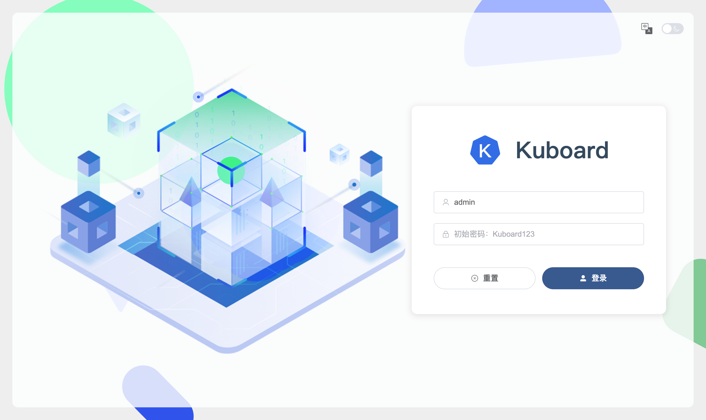
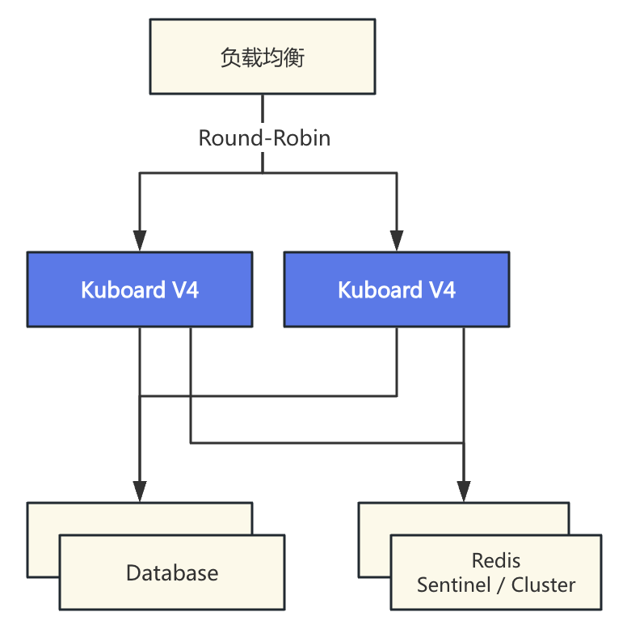

# Install Kubernetes Multi-cluster Management Platform - Kuboard v4

## A Note for Kuboard v3 Users

Compatibility

- Kuboard v4 uses a different technical architecture than Kuboard v3 and **cannot** be upgraded directly from Kuboard v3.
- You can import the same cluster into both Kuboard v3 and Kuboard v4. Both versions can manage the cluster effectively.
  - If the cluster has the same name in v3 and v4, Kuboard add-ons are not affected and keep working in both.

Key differences between Kuboard v4 and v3:

- Supported Kubernetes versions:
  - v3 supports Kubernetes 1.13 - 1.33
  - v4 supports Kubernetes 1.15 - 1.34 (continuously tracking the latest Kubernetes releases)
- User experience
  - Kuboard v4 covers all the major features of v3
  - Kuboard v4 is compatible with the major v3 add-ons
  - Kuboard v4 caches common Kubernetes objects locally with fuzzy search for much faster retrieval
  - Kuboard v4 shows objects across clusters and namespaces in a single list
  - Kuboard v4 ships a cleaner, clearer authorization model
- Architecture
  - Tech stack:
    - Kuboard v3: vue 2.7 + golang 1.18 + etcd 3.4
    - Kuboard v4: vue 3.5 + java 1.17 + MySQL/MariaDB/PostgreSQL (pick any one)
  - Kuboard v4 supports high-availability deployment
  - Kuboard v4 exposes a richer API for you to call

## Prerequisites

Kuboard v4 uses a database for storage. Supported databases:

- MySQL >= 5.7
- MariaDB >= 8.0
- OpenGauss >= 3.0

You can also follow the [Quick Start](./quickstart.md) to spin up a Kuboard instance with docker compose for testing.

## Prepare the Database

### MySQL / MariaDB

Create the database with the following script:

```sql
CREATE DATABASE kuboard DEFAULT CHARACTER SET = 'utf8mb4' DEFAULT COLLATE = 'utf8mb4_unicode_ci';
create user 'kuboard'@'%' identified by 'Kuboard123';
grant all privileges on kuboard.* to 'kuboard'@'%';
FLUSH PRIVILEGES;
```

### OpenGauss

Create the database from the OpenGauss command line:

```sql
CREATE USER kuboard PASSWORD 'Kuboard123';
CREATE DATABASE kuboard OWNER=kuboard ENCODING='UTF8' DBCOMPATIBILITY='PG';
\c kuboard
CREATE SCHEMA kuboard AUTHORIZATION kuboard;
```

> With OpenGauss, Kuboard operates the database using PostgreSQL syntax.

## Start Kuboard

Start the Kuboard container with `docker run`:

- With MySQL:

  ```sh
  docker run -d \
    --restart=unless-stopped \
    --name=kuboard \
    -p 80:80/tcp \
    -e TZ="Asia/Shanghai" \
    -e DB_DRIVER=com.mysql.cj.jdbc.Driver \
    -e DB_URL="jdbc:mysql://10.99.0.8:3306/kuboard?serverTimezone=Asia/Shanghai" \
    -e DB_USERNAME=kuboard \
    -e DB_PASSWORD=Kuboard123 \
    -v ./kuboard-log:/app/logs \
    swr.cn-east-2.myhuaweicloud.com/kuboard/kuboard:v4
    # eipwork/kuboard:v4
  ```

- With MariaDB:

  ```sh
  docker run -d \
    --restart=unless-stopped \
    --name=kuboard \
    -p 80:80/tcp \
    -e TZ="Asia/Shanghai" \
    -e DB_DRIVER=org.mariadb.jdbc.Driver \
    -e DB_URL="jdbc:mariadb://10.99.0.8:3306/kuboard?&timezone=Asia/Shanghai" \
    -e DB_USERNAME=kuboard \
    -e DB_PASSWORD=Kuboard123 \
    -v ./kuboard-log:/app/logs \
    swr.cn-east-2.myhuaweicloud.com/kuboard/kuboard:v4
    # eipwork/kuboard:v4
  ```

- With OpenGauss:

  ```sh
  docker run -d \
    --restart=unless-stopped \
    --name=kuboard \
    -p 80:80/tcp \
    -e TZ="Asia/Shanghai" \
    -e DB_DRIVER=org.postgresql.Driver \
    -e DB_URL="jdbc:postgresql://10.99.0.8:5432/kuboard?currentSchema=kuboard&characterEncoding=UTF8" \
    -e DB_USERNAME=kuboard \
    -e DB_PASSWORD=Kuboard123 \
    -v ./kuboard-log:/app/logs \
    swr.cn-east-2.myhuaweicloud.com/kuboard/kuboard:v4
    # eipwork/kuboard:v4
  ```

::: tip Parameter reference

- `TZ` sets the JDK timezone.
- `DB_DRIVER` selects the JDBC driver: `com.mysql.cj.jdbc.Driver`, `org.mariadb.jdbc.Driver`, or `org.postgresql.Driver`.
- `DB_URL` is the JDBC URL. Do not use `localhost`; point directly at the database IP (e.g. `10.99.0.8` in the examples above). It must match the database created in the previous step — usually you only need to replace the IP and port.
- `DB_USERNAME` must match the database user created in the previous step.
- `DB_PASSWORD` must match the database password created in the previous step.

:::

## Open the Kuboard UI

- Open the Kuboard address in a browser, e.g.:

  `http://10.99.0.10/login`

  The login page looks like this:

  

- Log in:

  - Administrator: `admin`
  - Default password: `Kuboard123`

  **You have finished installing Kuboard v4.** Next, use the UI to:

  - Change the `admin` password
  - Create users and grant authorizations
  - Import your Kubernetes cluster

## Integrate an External User Repository

Kuboard v4 integrates with external user repositories (e.g. LDAP) through a webhook interface. See [https://github.com/eip-work/kuboard-v4-ldap-example](https://github.com/eip-work/kuboard-v4-ldap-example)

## Reverse Proxy and HTTPS

Kuboard uses plain HTTP by default so that you can try it quickly. **In production, always enable HTTPS.** The recommended approaches are:

- Configure a Kubernetes Ingress in front of Kuboard and terminate TLS there
- Or use your own Nginx server as a reverse proxy and terminate TLS on Nginx

Please note:

- **WebContextRoot** — Kuboard must be served from the root path (e.g. `https://kuboard.yourcompany.com/`). Sub-paths like `https://yourcompany.com/kuboard/` are not supported.
- **WebSocket** — the terminal and log features rely on WebSocket. Your reverse proxy must allow WebSocket upgrades, otherwise those features will not work.

See [Reverse Proxy](./reverse-proxy) for complete Nginx and Ingress configuration examples.

## High Availability Deployment

For HA deployment, Kuboard V4 needs Redis as the distributed cache:



You are expected to provide:

- A load balancer
- An HA database (MySQL/MariaDB/OpenGauss etc. all support HA deployment)
- A distributed Redis cache (sentinel or cluster mode)

By default Kuboard uses Caffeine in-memory cache in single-replica mode. In HA mode, use these environment variables to switch to Redis:

- `KUBOARD_CACHE_PROVIDER` — cache provider (optional):
  - `caffeine` (default) — in-memory cache, single-replica mode only
  - `redis` — distributed cache
- `KUBOARD_CACHE_REDIS_MODE` — Redis connection mode (optional):
  - `standalone` (default)
  - `sentinel`
  - `cluster`
- `KUBOARD_CACHE_REDIS_SENTINEL_MASTER` — sentinel master name (optional, default `master`)
- `KUBOARD_CACHE_REDIS_NODES` — Redis node addresses, comma-separated (optional, default `localhost:6379`):
  - `standalone`: a single address, e.g. `10.99.0.8:6379`
  - `sentinel`: all sentinel addresses, e.g. `10.99.0.10:6379,10.99.0.11:6379,10.99.0.12:6379`
  - `cluster`: all node addresses, e.g. `10.99.0.20:6379,10.99.0.21:6379,10.99.0.22:6379`
- `KUBOARD_CACHE_REDIS_PASSWORD` — Redis password (optional, default empty)
- `KUBOARD_CACHE_REDIS_DATABASE` — Redis database number (optional, default `0`)
