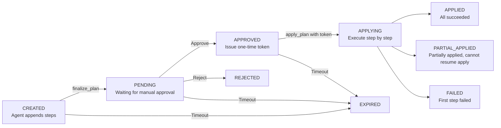

# Agent Change Approval Flow

An agent cannot modify the cluster directly: it first submits a "Change Plan", and only after you approve it and the agent obtains a one-time approval token does the actual write happen.

This page is for **users who approve AI changes in the Kuboard Web UI** and **developers who configure the change flow for agents**. It expands on the "Agent Change Approval" section of the [MCP integration overview](./index).

## 5-Phase Flow Overview

A change plan's full approval flow (Approval Flow) consists of 5 phases, mapped to the various statuses of the plan on the server:



The plan moves forward one way along the arrows: the agent proposes a plan → you approve it in the UI → the agent receives the token → the agent executes step by step → results are collected. Execution can land in one of three terminal states; "Rejected" or "Expired" voids the plan outright.

## Phase 1: The Agent Proposes a Plan

The agent builds and submits a plan using 3 tools:

1. **`create_plan(description)`** creates an empty plan. `description` is the purpose of the operation shown to the approver (e.g. "restore the nginx deployment and open its port"), displayed at the top of the approval screen.
2. **`append_step_to_plan(planId, tool, args, description)`** appends each object to be changed as a step of the plan. A **dry-run rehearsal** is performed before appending:
   - Rehearsal passes → the step enters the plan;
   - The cluster does not support dry-run (Kubernetes 1.15~1.17) → degraded pass;
   - Rehearsal fails → the step is rejected; the agent must fix the parameters and retry, or drop the object.
3. **`finalize_plan(planId)`** submits the plan so it appears on the approval page. After submission, no more steps can be appended; an empty plan cannot be submitted.

The tools that can be appended form the **write-operation whitelist** (also the criterion for "whether approval is mandatory"):

```json
["apply_k8s", "patch_k8s", "delete_k8s", "delete_k8s_collection",
 "drain_node", "evict_pod",
 "restart_workload", "scale_workload", "update_image_tag", "rollback_workload"]
```

::: tip One plan = one operation intent
Multiple objects to be changed under the same intent should be aggregated into the same plan as much as possible, so that it is approved only once.
:::

## Phase 2: Approval in the Kuboard UI

After logging into Kuboard, open **"Agent Change Approval"** at the top of the left-side menu (path `/agent-change-plans`). Plans awaiting approval expand automatically, showing each step's purpose, cluster, namespace, resource and action. You can perform three operations:

- **Approve All**: confirm directly without selecting anything; every step is approved.
- **Approve Selected**: in the step selection table, uncheck the objects you do not want to run, then click "Approve Selected". Unchecked steps are skipped and nothing changes in the cluster; the confirm button is disabled when 0 steps are selected.
- **Reject**: after filling in the rejection reason (required), the plan is voided and the cluster is not modified. Rejection is allowed in both the "Pending" and "Approved" states.

::: tip Verify after partial approval
After a partial approval, the agent can use `get_plan_approve_status(planId)` to query the approval result of each step and clearly tell you in the session: which objects were approved, which were skipped, and the potential consequences.
:::

To abandon a submitted plan, reject it (the cancel operation is currently not exposed to users).

## Phase 3: The One-Time Token

After approval, the server issues a **one-time token** (approval token). In the UI, click **"View Token"** to copy it (this button appears only when the plan is approved and not expired). Token rules:

| Rule | Description |
|---|---|
| Format | `at-{uuid}`, e.g. `at-9f2c8e6d…` |
| Validity | 15 minutes; after expiry, execution is rejected and you need to approve again |
| One-time | Consumed by `apply_plan`; a second use returns an error |
| Bound to the plan | Can only be used for the plan it belongs to; a token/plan mismatch is rejected |
| Holder only | Only the user who owns the plan can execute with it |
| Idempotent re-view | Re-approving does not issue a new token; the original token is returned |

Hand the `planId` and the token **together** to the agent so that it can execute.

::: warning A token equals write authorization
The token is the credential authorizing writes to the cluster. Do not leak it to anyone other than the plan holder; it expires if unused within 15 minutes, and you must approve again afterwards.
:::

## Phase 4: Step-by-Step Execution

After the agent calls `apply_plan(planId, approvalToken)`, the server executes the steps in order:

- Validates that the token matches the plan and is not expired, then executes each step in turn;
- After each step completes, the approval page refreshes the execution progress in real time;
- **Stops at the first failure**: all subsequent steps are marked as skipped and execution does not continue.

The execution outcomes map to three terminal states:

| Execution outcome | Terminal state |
|---|---|
| All steps succeeded | `APPLIED` |
| Partially succeeded (stopped at the first failure) | `PARTIAL_APPLIED` |
| The first step failed | `FAILED` |

::: danger No resuming apply after partial success
When apply fails halfway or the process is interrupted, unexecuted steps are not retried automatically and you are never asked "continue?" — you must create a new plan and go through the full approval again. This is a deliberate design to avoid retrying failed changes without the user's knowledge.
:::

Special skip rules during execution:

- Steps unchecked under partial approval → skipped;
- Steps already succeeded or already skipped → skipped (idempotent);
- Steps that failed dry-run but stayed in the plan → converted to skipped during execution.

## Phase 5: Result Collection

Once the plan reaches a terminal state, all parties collect the results:

**Agent side**

- `apply_plan` returns the plan's terminal state with `applied` / `failed` / `skipped` counts, plus each step's status and error message;
- `get_plan_approve_status` is used before execution to check which objects were approved / skipped.

**User side (UI)**

- The list and detail views show each step's rehearsal and execution results;
- **Rollback**: works only on `apply_k8s` steps that carry a pre-execution snapshot in `PARTIAL_APPLIED` / `APPLIED` plans, restoring to the pre-change state in one click; objects created by the change (did not exist before) cannot be rolled back automatically;
- **Delete**: only plans that are "expired and not fully successful" can be deleted (physical deletion, unrecoverable); successfully executed plans are kept forever as evidence of the change.

## Timeouts and Recovery

::: tip
- A plan not handled within **30 minutes** by default expires automatically, and its list status becomes "Expired"; plans in the "Building / Pending / Approved" states are converted to expired automatically when read.
- After approval, the token is valid for **15 minutes**; after expiry, execution is rejected and you must create a new plan and approve again.
- If apply fails halfway and the plan enters the `PARTIAL_APPLIED` terminal state, it cannot be re-approved or re-applied; you must create a new plan.
- Each user can hold at most **50** plans that have not reached a terminal state at the same time.
:::

## Danger Levels and Approval

Every plan and step carries a danger level:

| Level | Meaning |
|---|---|
| `LOW` | Read-type / single-resource restart-image |
| `MEDIUM` | apply / patch / single-resource delete |
| `HIGH` | High-risk operations such as bulk delete |

The danger level only affects the emphasis on the approval screen (`LOW` blue / `MEDIUM` yellow / `HIGH` red highlight); it does **not** decide whether approval is mandatory.

::: warning Mandatory approval is decoupled from the danger level
The criterion is the **write-operation whitelist**: every MCP tool that issues a persistent write to the cluster is on the whitelist and must go through approval, regardless of its labeled danger level — an operation marked `LOW` cannot bypass approval. See [Danger level mechanism](./danger-levels). The mandatory-approval switch is in [Server configuration](./server-config).
:::

## Related Pages

- [MCP integration overview](./index)
- [MCP tools](./tools)
- [Danger level mechanism](./danger-levels)
- [Server configuration](./server-config)