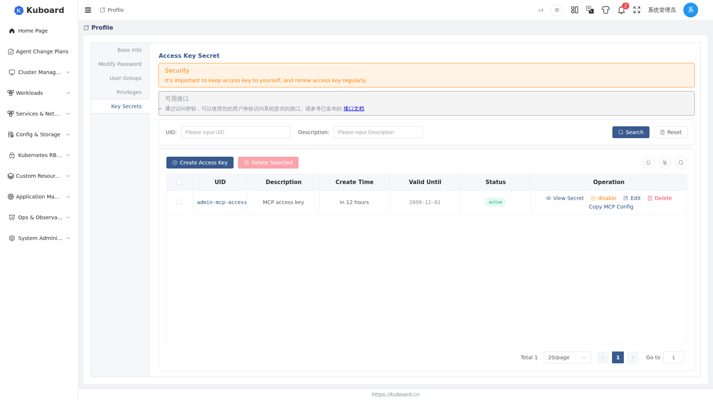
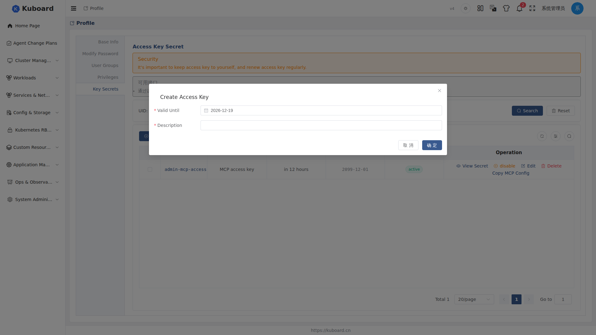

# Kuboard API Access Key

The Access Key (AK) and the Secret Key (SK) are a pair of API credentials that provide password-free authentication for programmatic access such as scripts, CI, and MCP.

::: tip Difference from the login password
The login password is used for Web login; access keys are for **programmatic access** (API / MCP). The two are independent of each other and can coexist; keys only affect programmatic access and do not affect Web login.
:::

## Create an Access Key

1. Click the **user avatar** at the top right → "**Key Secrets**" to enter the key management page (the "Key Secrets" tab on the "Personal Info" page is the same page).
2. Click "**Create Access Key**", fill in the **Description** (required, e.g. `ci-script`, `opencode-mcp`) and the **Valid Until** (required, default 90 days, optional from one week to one year).
3. Click "**OK**"; the key is created successfully and appears in the list.

The list shows the **Access Key ID** (AK, globally unique), **Description**, **Create Time**, **Valid Until** (becomes invalid automatically after expiry), and **Status**.




## Call APIs with a Key

Add the **`Kb-Access-Key`** request header, with value `<Access Key ID>.<Access Key>` (AK and SK joined with an English period), to call APIs without a login session. To verify that a key is valid — view the current user info:

```sh
curl -X GET \
  -H "content-type: application/json" \
  -H "Kb-Access-Key: <Access Key ID>.<Access Key>" \
  http://<kuboard-host>/api/login.kuboard.cn/v4/login-get-profile
```

If the current user's profile is returned, the key is valid. For more available APIs, see the "Available APIs" notice at the top of the key management page.

::: tip Alternative: Authorization: Bearer
You can also use the `Authorization: Bearer <AK>.<SK>` request header; the format is the same. The MCP Server authenticates this way; see [Kuboard MCP integration](../mcp/).
:::

## Copy the MCP Config in One Click

On the key list, click "**Copy MCP Config**"; in the dialog:

1. Select the **Access Key** to use;
2. Select the target **Agent** (Claude Desktop, Cursor, VS Code, opencode, Claude Code, curl, etc.);
3. Click "**Copy**" to get an MCP Server config snippet that can be written directly into that client's config file.

The dialog tells you where each client's config file is stored; the MCP Server URL is `https://<kuboard-host>/mcp`. For the full integration steps, see [MCP integration guide](../mcp/).

::: warning Do not commit this to a code repository
The MCP config snippet contains the Secret, a sensitive credential; **do not commit it to a code repository** to avoid the key leaking along with your code.
:::

## View Secret

The list only shows the key ID; the Secret must be viewed by clicking "**View Secret**" (or clicking the key ID). The dialog shows:

| Item | Description |
| --- | --- |
| Access Key ID | AK |
| Access Key | The SK, shown in plaintext; treat it like a password, do not leak it |
| Kb-Access-Key | The assembled `AK.SK`, with a one-click copy button, ready for direct use in the request header |

A verification command (curl to view the current user info) is also included; copy and run it directly to verify.

## Manage Keys

- **Disable / Enable**: click "Disable" and confirm, and the key becomes **invalid immediately**; restore it at any time with "Enable"; "Edit" lets you modify the Description and the Valid Until (the AK and SK do not change).
- **Delete**: supports deleting a single key and batch-deleting selected rows. After deletion the key becomes invalid immediately and **cannot be recovered**; first make sure the scripts/Agents using this key no longer need it.
- **Status**: Active (can be used for authentication); Disabled (manually disabled, can be re-enabled); Expired (past the Valid Until date, automatically invalid).
- **Authentication failed (401)**: confirm the `Kb-Access-Key` header format is `<AK>.<SK>` (an English period), the status is "Active", and the Valid Until date has not passed; disabling/deleting a key takes effect immediately.
- **Key expired**: an expired key cannot be re-enabled; create a new key and replace the old config in scripts/Agents.

::: tip Security habits
- The Secret is as sensitive as a password: keep it safe; do not write it into code repositories or public documentation;
- Create separate keys for different purposes, to make auditing and individual revocation easier;
- Rotate regularly; delete old keys that are no longer in use;
- If you suspect a leak, immediately "Disable" or "Delete" the key and create a new key to replace it.
- The top of the key management page provides a security reminder: replace and keep access keys safe on a regular basis.
:::

## API Documentation

For the APIs involved in this section, see the [Swagger UI "Login APIs" group](../reference/api).

## Related Documentation

- [Kuboard MCP integration](../mcp/) — integrate AI Agents (Claude Code, opencode, etc.) with access keys
- [Login](./login) — Web login and password
- [Multi-factor authentication (MFA)](./mfa) — the second verification at login
- [User management](./users) — account management and password reset