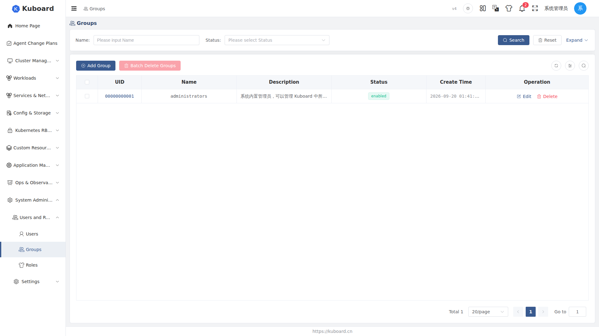

# User Groups

A user group (User Group) organizes multiple users and binds roles (Role) to the group uniformly; every member automatically gets the role permissions, enabling batch authorization. **Applicable to**: administrators.

Permission chain: User → User Group → Role → Permissions.

::: tip Applicable scenarios
- **New employee onboarding**: add the account to a user group; it immediately gets the group's permissions
- **Employee job transfer**: only adjust the roles bound to the group; all members take effect simultaneously
- **Employee departure / temporary freeze**: remove the member, or disable the user group; permissions become invalid immediately
:::

## Entering the User Groups Page

UI path: **System Administration → Users and Roles → Groups**. The list shows the existing user groups: **Name** (searchable by name), **Description**, **Status** (enabled / disabled), and **Creation Time** (filterable by time range). The top-right provides **Add Group** and **Batch Delete Groups**; each row's Operation column provides **Edit** and **Delete**.

## Creating a User Group

1. Click **Add Group**; in the drawer that slides out from the right, fill in the **Name** (required) and **Description**. The ID is generated automatically by the system.
2. Click **Confirm**; you are redirected to the detail page of that user group, where you can start adding members and binding roles right away.

::: tip The name cannot be changed after creation
User group names are globally unique and cannot be edited after creation; if you get it wrong, delete it and create it again. The description and status can be changed at any time.
:::

## Adding Members (Bounded Users)

1. On the **Bounded Users** tab, click **Add User-Group Binding**; a dialog for selecting users pops up (members already bound to this group are automatically excluded).
2. **Select multiple users**, and specify the **Expiry Date** (required).
3. Click **Confirm**; the binding record appears in the list, and the member immediately gets all role permissions bound to the group.

The **Bounded Users** list shows each member's account information (Username / Full Name / Email / Source), user status, binding status, and expiry date.

::: tip The expiry date only applies to this binding
After it expires, the member automatically loses the group's permissions; for long-term validity, just specify a far-future date again.
:::

<!-- screenshot-todo: "Bounded Users" tab of the detail page + the "Add User-Group Binding" dialog (multi-select users + expiry date) -->

## Assigning Roles to a User Group

On the **Bounded Roles** tab of the user group detail page, bind roles to this group (one binding = User Group + Role + Scope). Click **Add Group-Role Binding**:

1. Select the **Scope Type** (determines in which range the role takes effect):

| Scope Type | Meaning | What to select additionally |
| --- | --- | --- |
| kuboard | Kuboard platform level | No cluster / namespace needed |
| cluster | Kubernetes cluster level | Bind clusters (multiple selection, or **Any Cluster**) |
| namespace | Namespace level | Bind cluster + bind namespaces (either can be set to **Any**) |

2. Select the cluster / namespace according to the scope type (you can directly check **Any**).
3. Select the **role**: the dropdown options are already filtered by the selected scope type and only show the roles available in that range.
4. Click **Confirm**; the binding takes effect for **all members** of the group immediately. A group can be bound to multiple roles, and the same role can also be bound to different clusters / namespaces separately.

::: warning The scope must be consistent with the role
For example, a role defined only for the namespace scope will not appear in the candidate list for the cluster scope; select the scope type first, then select the role.
:::

<!-- screenshot-todo: "Bounded Roles" tab of the detail page + the "Add Group-Role Binding" dialog (scope type → cluster/namespace → role) -->

## Viewing the Permissions a User Group Has

On the **Has Access Privileges** tab, the authorization details the group **actually holds** (derived from all its role bindings) are aggregated and shown: each record lists the scope, API group, resource, and executable verbs; hovering over a permission shows where it is "obtained from the following roles". If the expected permissions do not appear here, check step by step: "is the member in the group → does the group-role binding exist and is it enabled → does the scope cover the target cluster / namespace → is the role itself disabled".

## Managing User Groups

- **Edit**: modify the description, switch the status (enabled / disabled), etc.
- **Disable**: after switching the status to disabled, all group members temporarily lose the group's permissions; re-enabling restores them.
- **Delete**: deleting a user group **cascades the deletion** of all its user bindings and role bindings, and the related permissions become invalid immediately. Both single-item deletion and **Batch Delete Groups** are supported.

::: tip You can also manage from the user and role ends
On the [User](./users) detail page, you can look up which groups a user has joined, and modify the bindings and expiry dates; on the [Role](./roles) detail page, you can look up which user groups a role is bound to, and bind groups to the role in batch.
:::

## API Reference

See the [Swagger UI "Users and Roles" group](../reference/api) for the endpoints involved in this page.