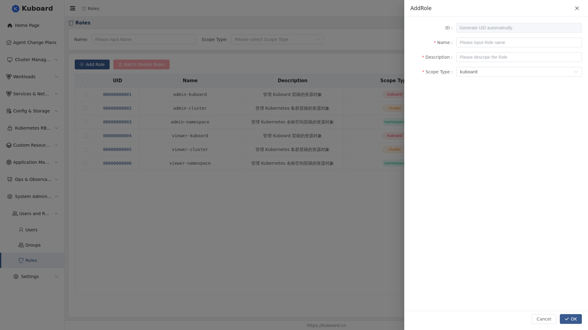
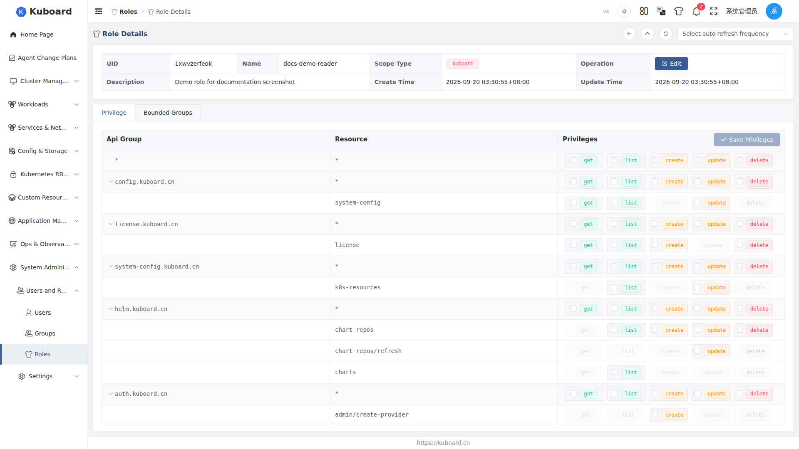
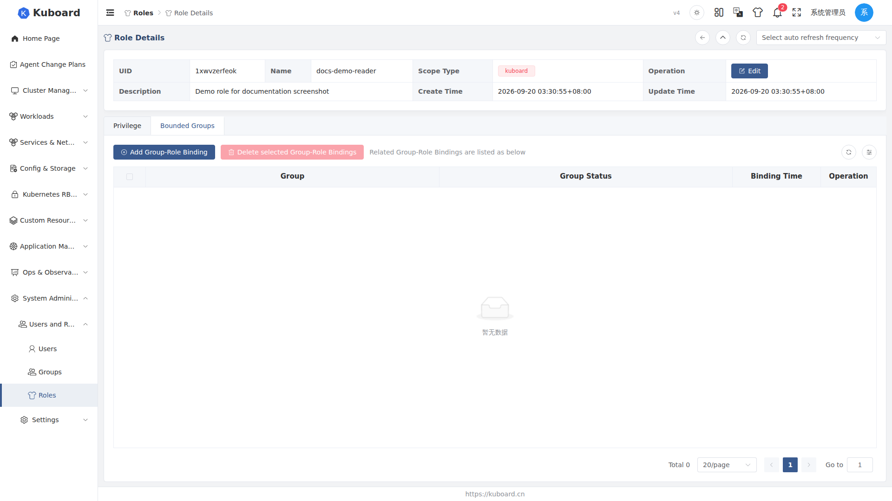

# Roles and Permissions

A role is a collection of permissions. An administrator creates a role and configures its permissions, then binds it to user groups; group members automatically get the permissions. **Applicable to**: administrators.

## Role Levels (Scope Type)

Every role must specify a **scope type** when it is created; it determines at which level the role's permissions take effect, and cannot be modified after creation. It is not the same as the "binding scope" you choose again when binding the role to a user group (down to a specific cluster / namespace, or "any") — see [Assigning Roles to User Groups](#assigning-roles-to-user-groups) below:

| Scope type | Level | Examples of controlled objects |
| --- | --- | --- |
| kuboard | Kuboard platform level | Platform objects such as users, user groups, and roles |
| cluster | Kubernetes cluster level | Resources across namespaces, such as nodes, Namespace, and storage classes |
| namespace | Kubernetes namespace level | Resources within a namespace, such as workloads, Service, and ConfigMap |

A role's permission rules are described by "resource + operation verb". The verbs are get / list / create / update / delete, corresponding to read, list, create, modify, and delete respectively.

## Built-in Roles and Custom Roles

Kuboard ships with 6 built-in roles (admin / viewer, one for each level), covering the two typical needs of "full administration" and "read-only viewing":

| Built-in role | Scope | Permissions |
| --- | --- | --- |
| admin-kuboard | kuboard | All operations on all platform-level resources |
| admin-cluster | cluster | All operations on all cluster-level resources |
| admin-namespace | namespace | All operations on all namespace-level resources |
| viewer-kuboard | kuboard | Read-only on all platform-level resources |
| viewer-cluster | cluster | Read-only on all cluster-level resources |
| viewer-namespace | namespace | Read-only on all namespace-level resources |

Built-in roles are **system objects**: they can only be viewed, not modified or deleted. The built-in user group `administrators` is already bound to the three admin built-in roles (platform level, any cluster, any cluster and any namespace), so the initial administrator account can manage everything out of the box. Besides the built-in roles, you can create any number of **custom roles**, named according to your team's division of work (e.g. `dev-namespace-admin`), and edit or delete them at any time.

## Creating a Custom Role

1. Go to **System Administration → Users and Roles → Roles** and click **Add Role**; a form drawer slides out on the right.
2. Fill in the fields:

| Field | Description |
| --- | --- |
| Name | Required; starts with a letter, may contain digits, length at least 3; **cannot be modified after creation** |
| Description | Required; describes roughly what permissions this role has |
| Scope Type | Required; one of kuboard / cluster / namespace; **cannot be modified after creation** |
| ID | Auto-generated by the system; no need to fill in |

3. Click **Confirm**; you are automatically taken to the role's detail page, where you can start configuring permissions right away.

<!-- screenshot-todo: en screenshot of the Add Role drawer (Name / Description / Scope Type, ID auto-generated) -->

::: warning Name and Scope Type Cannot Be Modified After Creation
Decide on the name and the level before creating: neither can be edited once set. If you chose wrong, delete it and recreate it (custom roles can be deleted).
:::

## Configuring a Role's Privileges

1. On the **Privilege** tab of the role detail page, the permission table lists all authorizable items ordered by **API group → resource → verb** (a kuboard-level role lists platform object permissions; cluster / namespace-level roles list cluster and namespace object permissions), with the `*` (all resources) wildcard row at the top.
2. Check the verbs you need in each row (get / list / create / update / delete) and click **Save Privileges**.

After checking a verb in the `*` wildcard row, the corresponding verb on the specific resource rows takes effect automatically and is shown greyed out. It takes effect immediately after saving — the permissions of all members of the user groups bound to this role refresh right away.

## Assigning Roles to User Groups

1. On the **Bounded Groups** tab of the role detail page, click **Add Group-Role Binding**; the binding dialog pops up.
2. **Select multiple user groups** (groups already bound to this role are automatically excluded from the candidate list).
3. Choose the **binding scope** according to the role's scope type:

| Role scope type | What to select | Possible values |
| --- | --- | --- |
| kuboard | Nothing to select | — |
| cluster | Binding cluster | A specific cluster, or **Any Cluster** |
| namespace | Binding cluster + binding namespace | A specific value for each, or **Any** |

4. Click **Confirm**. **All members of these user groups immediately gain** this role's permissions. The binding list shows different columns depending on the role type ("any" is marked with a yellow tag); the same role can be bound to different clusters / namespaces separately.

::: tip You can also bind from the user group side
The same binding can also be done on the **Bounded Roles** tab of the user group detail page — first select the scope, then select a role available under that scope. The two entries are essentially the same; see [User Groups](./groups).
:::

## Managing Roles

- **View final permissions**: on the **Has Access Privileges** tab of the user / user group detail page, view the authorization details derived from all role bindings; hovering over each permission shows the role it comes from. Troubleshooting order: is the user in the group → does the group-role binding exist and is it enabled → does the binding scope cover the target cluster / namespace → are the role's permissions complete.
- **Edit**: modify the **Description** and the authorization rules on the **Privilege** tab; Name, Scope Type, and ID cannot be modified.
- **Delete**: deleting a role **cascade-deletes** all of its user group bindings, and members' permissions become invalid immediately; both single-row deletion and **Batch Delete Roles** are supported.
- **Built-in roles**: system objects; neither the list nor the detail page provides Edit / Delete entries.

Related pages: [Users](./users) and [User Groups](./groups); for the detailed authorization model of roles, see [RBAC Scope Reference](../reference/rbac-scopes).