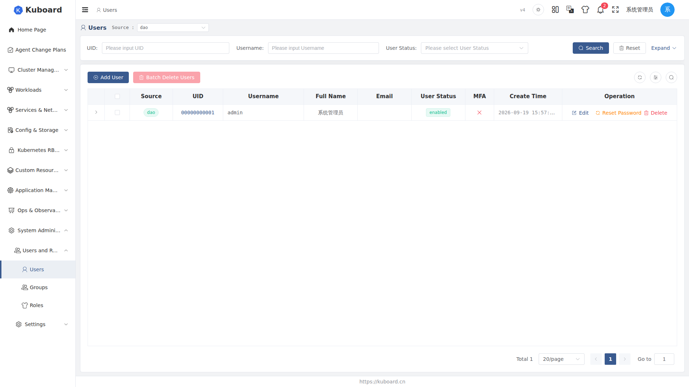
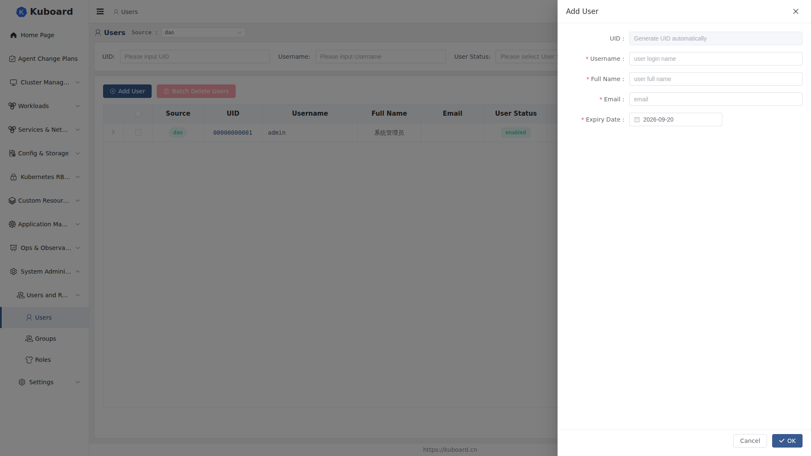

# User Management

This page explains how administrators create and maintain Kuboard user accounts, assign permissions to users, and handle day-to-day operations such as enable/disable, lock/unlock, password reset, and deletion.

Permissions are conveyed level by level through **User → User Group → Role**: assigning permissions to a user is in fact "adding the user to a user group that already has roles bound to it". See [User Groups](./groups) and [Roles and Permissions](./roles) for the concepts.

## Opening the User List

1. After logging in, go to **System Administration → Users and Roles → Users**.
2. The top-left of the page is the **Source** dropdown, showing **Built-in user repository** by default; once external user repositories are enabled, you can also switch to **Webhook user repository** and **OIDC user repository** (see [Webhook User Repository](./webhook-users) and [OIDC Single Sign-On](./oidc) for how to connect them).

Main columns of the list: **Username** (searchable; users who have never logged in show a "Not Logged In" tag), **Full Name**, **Email**, **User Status** (filterable by status), MFA binding status, and **Expiry Date**; click the expand arrow at the start of a row to see the user's account and security information.

## Creating a User

1. Click **Add User** on the user list page.
2. Fill in the drawer form:

| Field | Description |
|---|---|
| Username | Must start and end with a letter; may contain letters, digits, `-`, `_`, `.`; length no less than 3; cannot be modified after creation |
| Full Name | Display name, e.g. "Zhang San" |
| Email | A valid email format |
| Expiry Date | The account's valid-until date; once it expires, the user cannot log in |

The ID is generated automatically by the system; no need to fill it in. Click **Confirm**, and the user is created and you are automatically taken to that user's detail page.

::: tip Initial Password
Creating a user does not require setting a password. New users log in with the initial password `Kuboard123` and must change it within 3 days by default (adjustable in the system configuration); see [Password policy and changing your password](./password).
:::

## User Detail and Assigning Roles

Click a user in the list to enter the detail page (navigated there automatically after creation succeeds). Tabs on the detail page:

- **Bounded Groups**: the user groups this user has joined and their binding expiry dates.
- **Has Access Privileges**: displays in real time all the permissions the user currently has and their sources; **MFA**: view/reset the user's MFA binding, shown only when MFA is globally enabled.

To assign roles to a user (join user groups):

1. Open the detail page and switch to the **Bounded Groups** tab.
2. Click **Add User-Group Binding**, select one or more user groups, and specify the binding validity period.
3. Click **Confirm**. The user immediately gets all the permissions of the roles bound to these user groups; you can verify them on the **Has Access Privileges** tab.

::: tip
If a user group has no roles bound yet, joining it brings no permissions — first confirm the group-role bindings on the [User Groups](./groups) page.
:::

## Managing Users

| Operation | How to do it | Description |
|---|---|---|
| Enable / Disable | Click **Edit** in the list's **Operation** column or on the detail page, toggle the **User Status** switch, then click Confirm | Once disabled, the user immediately cannot log in; the account and its bindings are retained |
| Unlock | When the account is locked due to too many consecutive wrong passwords, click **Unlock** and confirm | The attempt counter is reset to zero and normal login is restored |
| Reset Password | Click **Reset Password** and confirm | The password is reset to `Kuboard123`; the old password becomes invalid immediately; must be changed within 3 days by default |
| Reset MFA | When the user's MFA can no longer be verified, click **Reset MFA** | Clears the MFA binding; the user re-binds at the next login; see [MFA multi-factor authentication](./mfa) |
| Delete | Single: click the delete button in the list's **Operation** column; batch: check multiple rows and click **Batch Delete Users** | Cannot be undone; also clears the user group bindings and access key records |

::: warning
For system built-in accounts whose usernames start with `000000`, the status and expiry date cannot be modified, and they cannot be deleted.
:::

::: warning
Deleting a user is a permanent operation: the account, password, and all authorization relationships are lost. It is recommended to use **Disable** instead of deletion first, and clean up only after confirming there is no impact.
:::

## User Source Differences

Users from different sources support different operations on this page:

| Source | Account password | What administrators can do on this page |
|---|---|---|
| Built-in user repository | Password stored in Kuboard | Create, edit, enable/disable, unlock, reset password, delete, bind user groups, reset MFA |
| Webhook user repository | Password validated by the external service; not stored locally | View, bind user groups, reset MFA, delete (clears only the local record; recreated on the next sync) |
| OIDC user repository | No password; authenticated by the identity provider (IdP) | View, delete (clears only the local record), pre-create placeholder users by email |

::: tip
Switching the **Source** dropdown only switches the account system displayed in the list; it does not convert users from one source to another. Accounts from different sources with the same name are independent records.
:::

## API Documentation

The APIs involved in this section are described in the "Users and Roles" group of the [Swagger UI](../reference/api).