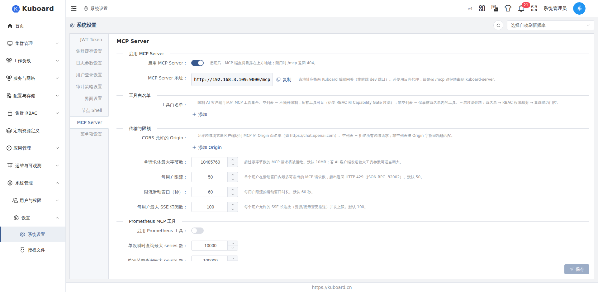
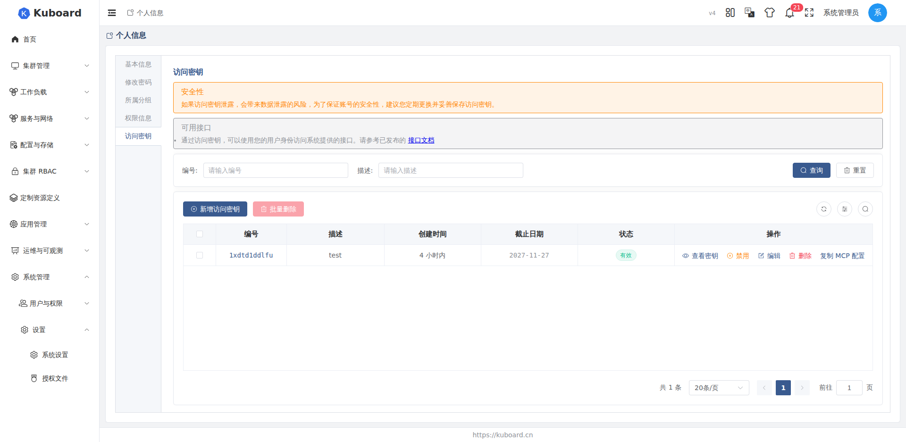
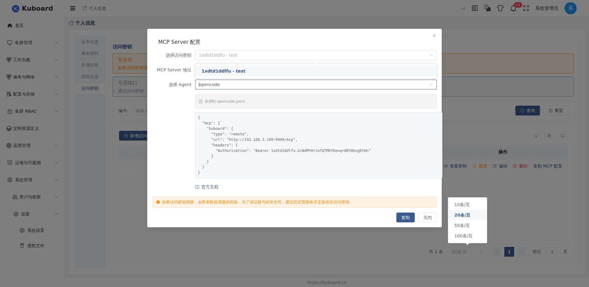

# 使用智能体连接 Kuboard MCP

Kuboard V4 提供 MCP（Model Context Protocol）Server，允许 AI 智能体直接与 Kubernetes 集群交互。

支持的智能体客户端：Claude Desktop、Cursor、Windsurf、Zed、VS Code、Trae、Cline、Continue、**opencode**、Claude Code、Goose、OpenClaw、Hermes Agent 等。

**MCP 提供的能力：**

| 类别 | 能力 |
|---|---|
| 集群管理 | 查询集群列表、集群详情、集群版本、节点状态 |
| 工作负载 | 查询 Deployment、StatefulSet、DaemonSet、Pod；支持重启、更新镜像、扩缩容、回滚 |
| 资源管理 | 查询 ConfigMap、Secret、Service、Ingress、PVC、ServiceAccount、NetworkPolicy 等 |
| 节点操作 | Pod 驱逐、节点排水 |
| 自定义资源 | 查询 CRD 及自定义资源实例 |
| 事件监控 | 查询集群/命名空间事件 |
| 指标查询 | 通过 Prometheus 查询 CPU、内存、网络等指标 |
| **Agent 变更审批** | **所有写入操作（修改、删除、重启等）都需要先在 Kuboard UI 中审批通过后才会真正执行** |

---

## 前置条件

- 已安装支持 MCP 的智能体客户端（如 [opencode](https://opencode.ai)）
- 已部署 Kuboard V4（v4.1.0+）

---

## 配置步骤（以 opencode 为例）

### 1. 启用 MCP Server

在 Kuboard 中进入 **系统设置 → MCP Server**，启用 **MCP Server 总开关** 并保存。



> 在设置页面你还可以：
> - 调整每用户访问频率限制（默认每分钟 50 次）
> - 配置允许的跨域来源（CORS）
> - 配置 Prometheus 数据源（用于指标查询工具）

### 2. 获取 MCP 配置

在右上角用户菜单中点击 **访问密钥**，进入访问密钥管理页。点击 **新增访问密钥** 创建密钥，然后点击 **复制 MCP 配置**。



在弹出的对话框中选择 Agent 为 **opencode**，点击 **复制**。



### 3. 配置到 opencode

在 opencode 中输入以下提示：

```
将下面这段 MCP server 配置好
<粘贴复制过来的配置片段>
```

opencode 会自动将配置写入 `opencode.json` 的 `mcp` 字段。

### 4. 验证连接

重启 opencode 后输入提示词：

```
使用 kuboard mcp 查询当前有哪些集群，哪些工作负载
```

opencode 将调用 Kuboard MCP 工具并返回结果。

---

## Agent 变更审批

为了避免 AI 智能体误操作或越权修改集群，Kuboard MCP 默认对**所有写入操作**强制启用变更审批 —— 智能体不能直接修改集群，必须经过你确认。

### 它是如何工作的

当你让智能体执行修改类操作时（例如「把这个 Deployment 扩容到 5 副本」、「把镜像升级到 v2」、「删除这个 ConfigMap」）：

1. **智能体先提交一个变更计划**（Plan），列出它打算做的所有操作
2. **Plan 出现在 Kuboard Web UI 的「Agent 变更审批」页面**（左侧菜单入口）
3. **你在 UI 中查看每个操作的详情**，可以选择：
   - **全部批准** —— 执行所有操作
   - **部分批准** —— 只勾选部分操作执行，未勾选的会被跳过
   - **拒绝** —— 取消整个计划，集群不会被修改
4. **审批通过后**，智能体拿到一个一次性令牌，集群才会真正被修改
5. **执行过程实时显示进度**，每一步的成功 / 失败都能看到

### 为什么要这样做

- **可控**：所有修改都在你眼皮底下发生，不会出现智能体「偷偷」改了什么东西
- **可审计**：每次变更都有完整记录（哪个智能体、什么时间、改了什么、谁批准的）
- **可回滚**：你可以在审批前看到每个操作的细节（dry-run 预演），避免误操作
- **支持部分批准**：智能体提出 10 个操作，你可以批准其中 8 个、跳过 2 个

### 适用范围

| 操作类型 | 是否需要审批 |
|---|---|
| 读取集群信息、查询资源、查看日志 | 不需要 |
| 查询指标（Prometheus / metrics-server） | 不需要 |
| 创建 / 修改 / 删除 K8s 资源 | **需要** |
| 重启 / 扩缩容 / 回滚工作负载 | **需要** |
| Pod 驱逐、节点排水 | **需要** |

### 审批页面入口

登录 Kuboard 后，左侧菜单顶部会出现 **「Agent 变更审批」** 入口（路径 `/agent-change-plans`）。所有待审批、已批准、已拒绝、已执行的历史计划都在这里查看。

> 如需关闭强制审批（不推荐用于生产环境），可在 MCP Server 设置中关闭「Agent 操作强制审批」开关。

---

## 配置参考

配置写入后，`opencode.json` 中 `mcp` 字段的格式如下：

```json
{
  "mcp": {
    "kuboard": {
      "type": "remote",
      "url": "http://<kuboard-address>:9090/mcp",
      "headers": {
        "Authorization": "Bearer <key-id>.<key-secret>"
      }
    }
  }
}
```

- `url` 中的主机地址需替换为 Kuboard 实际可达的地址
- `Authorization` 值由 Kuboard 复制 MCP 配置时自动生成
