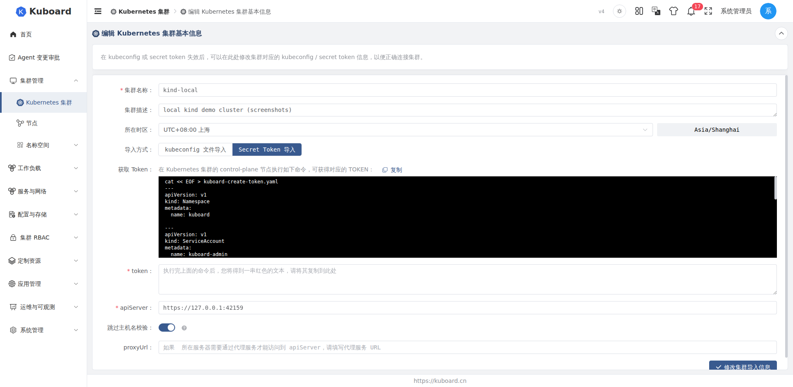

# 编辑集群

集群导入后，可以通过"编辑"功能修改集群的配置。当 kubeconfig 或 secret token 失效、API Server 地址发生变化，或者需要调整集群名称、描述与时区时，都可以在编辑页完成。修改保存后，Kuboard 会按新参数**重新校验连接并重建连接客户端**，随后对该集群执行一次**全量同步**。

页面入口、可编辑字段与保存行为均以 `kb-portal` 编辑集群页（`src/views/cluster/clusters/edit/index.vue`）与 `kuboard-server` 的 `ClusterController` / `ClusterService` 源码实现为准。

::: tip 适用场景
- kubeconfig 或 secret token 失效（编辑页顶部即提示：在 kubeconfig 或 secret token 失效后，可以在此处修改集群对应的 kubeconfig / secret token 信息，以便正确连接集群）；
- API Server 地址或代理（proxy，代理）发生变更；
- 需要修改集群名称、描述或所在时区。
:::

## 入口位置

编辑集群的入口有两处，均需要当前账号具备 `cluster.kuboard.cn` / `cluster` 资源上的 `update` 权限：

1. **集群列表页**：在[集群列表](./import)（`/cluster/clusters`）中找到目标集群，点击该行操作列中的"编辑"按钮；
2. **集群详情页**：进入集群详情页后，点击页面右上角的"编辑"按钮（集群基本信息上方）。

两种入口最终都跳转到 `/cluster/clusters/{uid}/edit` 路由，编辑的是同一个表单页面。

## 可编辑的字段

编辑页的表单字段与[导入集群](./import)页基本一致，分为**基础信息**与**连接配置**两部分。

### 基础信息

| 表单字段 | 对应资源字段 | 说明 |
| --- | --- | --- |
| 集群名称 | `metadata.name` | 必填。长度 3 - 24，须符合 Kubernetes 对象命名规范。修改名称后，Kuboard 会同步刷新集群名称缓存 |
| 集群描述 | `spec.description` | 可选，集群的备注信息，自由文本 |
| 所在时区 | `spec.timeZone` | 通过时间选择器设置，字段右侧实时展示当前时区文本；留空时使用服务端默认时区 |

### 连接配置

连接配置随**导入方式**（`spec.importType`）的不同而不同，编辑页可直接在 kubeconfig 与 token 两种方式之间切换（单选按钮组）。

**使用 kubeconfig 时：**

| 表单字段 | 对应资源字段 | 说明 |
| --- | --- | --- |
| kubeconfig 内容 | `spec.importSecretInfo` | 粘贴 `/etc/kubernetes/admin.conf` 的内容（在集群 control-plane（控制平面）节点执行 `cat /etc/kubernetes/admin.conf` 获取）。内容必须包含 `clusters`、`contexts`、`users` 三个字段，否则会解析失败并提示错误 |
| 集群上下文（context） | — | 从 kubeconfig 解析出的上下文，必选；选择后自动带入对应的 API Server 地址与证书 |
| API Server 地址 | `spec.apiServerUrl` | 必填，校验规则见下方"地址校验规则" |
| 跳过主机名校验 | `spec.apiServerSkipVerifyHostname` | 开关。当出现 `Certificate for 10.99.15.32 doesn't match any of the subject alternative names` 之类的证书错误时开启 |
| 代理地址 | `spec.proxyUrl` | 可选。Kuboard 所在服务器需要通过代理服务才能访问到 apiServer 时填写 |

**使用 token 时：**

| 表单字段 | 对应资源字段 | 说明 |
| --- | --- | --- |
| Token | `spec.importSecretInfo` | 必填。在集群 control-plane 节点执行页面给出的 shell 脚本创建 `kuboard-admin` 服务账号并获取 Token 后粘贴 |
| API Server 地址 | `spec.apiServerUrl` | 必填，校验规则见下方"地址校验规则" |
| 跳过主机名校验 | `spec.apiServerSkipVerifyHostname` | 开关，同 kubeconfig 方式 |
| 代理地址 | `spec.proxyUrl` | 可选，同 kubeconfig 方式 |

#### API Server 地址校验规则

kubeconfig 与 token 两种方式的 API Server 地址校验规则一致：

- 必须以 `http://` 或 `https://` 开头；
- 必须包含端口号（形如 `:8443` 的 `:端口` 部分）；
- 不能以 `/` 结尾。

::: tip 修改 Token 后需重新验证
每次编辑保存时，Kuboard 都会使用新的连接参数与目标集群**重新建立连接并校验**（见[保存与连接重建](#保存与连接重建)）。因此修改 Token、API Server 地址或 proxy 后，只有重新校验通过，保存才会成功。
:::

## 保存与连接重建

点击"修改集群导入信息"按钮提交时，前端的完整流程如下：

1. **校验连接参数**：前端先将表单内容提交到 `ping-apiserver` 接口（此时 uid 传 `0`），该接口使用新参数访问目标集群的 `/apis/authorization.k8s.io/v1/selfsubjectrulesreviews`（作用于 `kube-system` 命名空间）验证连通性与权限。校验失败则停留在编辑页并提示错误，不会写入任何数据；
2. **更新集群**：校验通过后，调用 `PUT /api/cluster.kuboard.cn/v4/cluster/{uid}` 提交集群配置。请求体中 `metadata.uid` 必须与 URL 路径中的 uid 一致，否则返回 400「输入参数 uid 不匹配」；
3. **跳转详情页**：保存成功后，自动跳转到该集群的详情页（`/cluster/clusters/{uid}`）。

后端的更新逻辑（`ClusterService.importOrUpdateCluster` 与 `restartSync`）收到请求后依次执行：

1. **重新探测 Kubernetes 版本**：先使用新连接参数向目标集群发起 `GET /version`，必须成功并返回版本号；拿不到版本即抛出异常、保存失败（HTTP 502 `Cannot get K8S version`）。因此连接参数错误时，保存不可能成功；
2. **持久化配置**：写入新的名称、描述、导入方式、连接参数与时区，同时将 `importStatus` 置为 `importing`、`cacheHealthStatus` 置为 `unknown`（等待下一次探活重新探测，参[同步状态](./sync-status)）；
3. **重建连接客户端**：清空该集群的 client builder 缓存（`evictClientBuilderCacheElementCachedHashCode` 与 `evictClusterHttpClientBuilderFromSimpleCacheManager` 两处），后续所有访问都按新参数重建连接；
4. **刷新缓存**：若集群名称发生变更，清除旧的"集群名 → id"映射缓存，避免 `getClusterIdByName` 命中旧记录；同时以实时探测到的版本预热 capability 缓存，并通知清除该集群的 capability 决策缓存；
5. **触发全量同步**（`restartSync`）：删除该集群除管理任务外的全部同步任务，将全量同步状态重置为 `created`、开始时间重置为当前时间。集群随即重新进入"导入中"状态，按新配置执行一次全量数据同步。

::: warning 保存后将重建连接并触发全量同步
编辑保存后，`importStatus` 会变为 `importing`、`cacheHealthStatus` 会变为 `unknown`。在重新探活与全量同步完成前，集群列表中的健康状态将暂时显示为"未知"，大集群的全量同步可能需要较长时间，进度可在集群详情的「同步状态」页签查看。
:::

## 不可修改的字段

以下内容不能在编辑页修改：

| 内容 | 说明 |
| --- | --- |
| 集群 uid（`metadata.uid`） | 集群唯一标识，导入后不可更改；后端强制校验请求体 uid 与 URL 路径 uid 一致 |
| Kubernetes 版本 | 不是表单字段，由 Kuboard 在每次保存时自动通过 `GET /version` 重新探测并刷新，用户无法手工指定 |
| 已有的 Token / kubeconfig（`spec.importSecretInfo`） | 出于安全考虑，服务端读取集群详情时**不回显**已保存的凭据，编辑页加载后该字段始终为空 |
| `importStatus` / `cacheHealthStatus` 等状态字段 | 由同步与探活机制维护，保存后自动重置为 `importing` / `unknown` |
| `createTime` / `updateTime` | 由系统维护，用户不可修改 |

::: warning 每次保存都需重新填写凭据
由于服务端不回显已保存的 Token / kubeconfig，且 `importSecretInfo` 为服务端 `@NotNull` 必填字段，因此**无论本次修改点是什么（哪怕只改了集群描述）**，点击保存前都需要重新粘贴 token 或 kubeconfig 文件内容，否则校验无法通过。
:::

## 相关页面

- [导入集群](./import)：首次将集群纳入 Kuboard 管理
- [同步状态](./sync-status)：查看全量 / 增量同步进度与状态
- [导出 / 导入](./export-import)：集群配置的导出与再导入