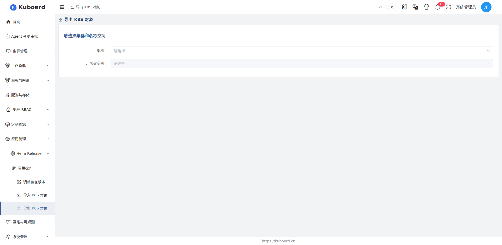
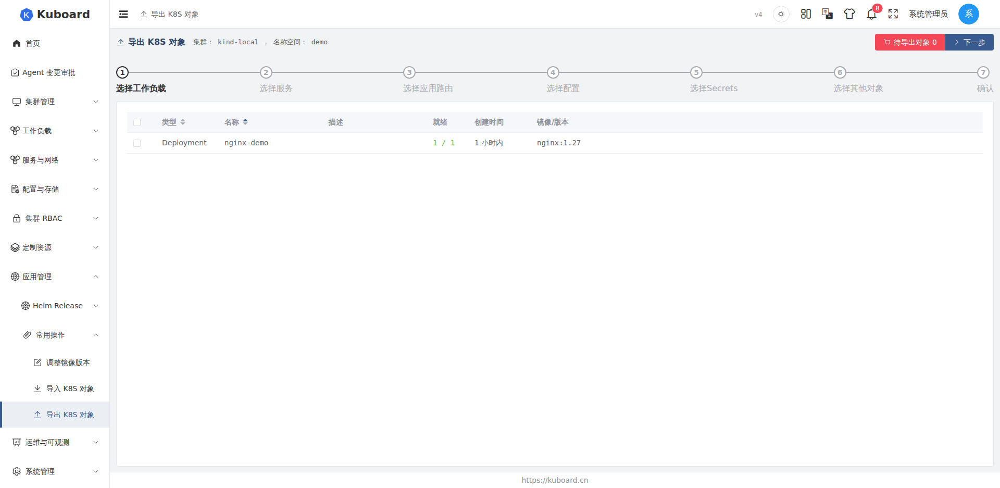

# 资源导出与导入

Kuboard V4 提供「导出 K8S 对象」与「导入 K8S 对象」两个向导（入口：左侧菜单「常用操作」），可以在集群之间迁移、备份或复用名称空间（Namespace）内的各类资源：工作负载（Workload）、服务（Service）、应用路由（Ingress）、配置（ConfigMap）、Secret 以及其他自定义对象。

::: tip 典型场景
- **跨集群迁移**：把 A 集群某名称空间中的应用整体复制到 B 集群；
- **备份与恢复**：将资源定义导出为 YAML 文件留档，需要时再导入；
- **样板复用**：把一套成型的工作负载 + 服务 + 路由组合导出为样板，批量部署到多个集群。
:::

## 工作原理

导出与导入均在浏览器端完成，后端只提供与 Kubernetes API 路径一致的通用代理（`/k8s-api/{clusterId}/...`）：

- **导出**：Kuboard 对每个被选中的对象执行 GET，取回最新定义，按规则清理集群运行时字段后，将多个对象拼接为一个多文档 YAML（document）文件（以 `---` 分隔）下载到本地；
- **导入**：Kuboard 解析上传的 YAML 文件 → 展示对象清单 → 逐项调整存储卷、NodePort、Ingress 域名等与环境相关的参数 → 通过 apply / create / delete 三种方式写回目标集群。

导出与导入是**资源定义（manifest）级别**的操作，不包含存储数据等运行时内容。

## 导出资源

入口：菜单「常用操作」→「导出 K8S 对象」。向导第一步选择源集群与名称空间（导出范围固定为**一个名称空间**），随后按步骤逐类选择对象：

| 步骤 | 对象类型 | 说明 |
| --- | --- | --- |
| 1 | 工作负载 | Deployment / StatefulSet / DaemonSet（apps/v1），展示就绪副本数与镜像/版本 |
| 2 | 服务 | Service，展示类型（ClusterIP / NodePort 等）与标签选择器 |
| 3 | 应用路由 | Ingress，按集群支持的 networking API 版本列出 |
| 4 | 配置 | ConfigMap，展示键值数量 |
| 5 | Secrets | Secret，展示数据条目数量 |
| 6 | 其他对象 | 任意类型的名称空间级对象（见下文） |
| 7 | 确认并导出 | 可关闭「导出精简的 YAML」开关，确认对象清单后生成文件 |

已选中的对象会汇总到页面右上角的购物车按钮中，可随时移除。

### 工作负载

工作负载步骤列出名称空间内 apps/v1 的 Deployment、StatefulSet、DaemonSet 三类对象，可查看每个对象的就绪副本数（ready replicas）与各容器使用的镜像（含 initContainers），按名称勾选需要导出的对象。

### 其他对象（任意 K8s 对象）

「其他对象」步骤提供三个联动面板：

1. **ApiService**：列出集群注册的 API 分组（如 `v1.`、`apps`、`networking.k8s.io` 等）；
2. **对象类型（Kind）**：展示该 API 分组下的资源类型，标注 Namespaced / Cluster 作用域；
3. **对象**：列出该类型在当前名称空间下的实例，点击选择。

选择限制：

- 仅**名称空间级**（Namespaced）资源可导出，集群级（Cluster）资源在面板中禁用；
- 需要具备该资源的 `list` 权限，否则不可选；
- 子资源（名称形如 `deployments/scale`）不参与导出。

### 导出精简的 YAML（清理规则）

最后一步默认开启「导出精简的 YAML」开关。开启后按以下规则清理导出产物：

| 位置 | 被清理的字段 | 说明 |
| --- | --- | --- |
| `metadata` | `selfLink` / `uid` / `resourceVersion` / `generation` / `creationTimestamp` / `managedFields` | 集群运行时字段，导入时若保留可能导致冲突 |
| `metadata.annotations` | `deployment.kubernetes.io/revision`、`kubectl.kubernetes.io/last-applied-configuration`、`objectset.rio.cattle.io/applied` | kubectl、Rancher 等工具写入的注解 |
| `status` | 整个 `status` 字段 | 运行时状态 |
| Service | `spec.clusterIP` / `spec.clusterIPs` | 仅当 `clusterIP` 不为 `None` 时删除；Headless Service（`clusterIP: None`）保留 |
| Ingress | `spec.tls` | TLS 配置不随导出带走 |

导出完成后，浏览器下载一个命名规则为 `kuboard_{集群名}_{导出时间}.yaml` 的 YAML 文件。由于已清除集群运行时字段，该文件与 `kubectl` 兼容，可直接 `kubectl apply -f`，也可通过本页的导入向导使用。

::: warning 注意 Ingress API 版本
导出应用路由时，Kuboard 优先使用集群能力探测（capability）得到的首选 API 版本；无法探测时按集群版本回退：Kubernetes ≥ 1.19 使用 `networking.k8s.io/v1`，否则使用 `networking.k8s.io/v1beta1`。
:::

::: warning Secret 导出后需注意保密
Secret 的 `data` 以 Base64 编码写入 YAML 文件，导出文件等同明文凭据，请妥善保管，不要提交到公开仓库或随意转发。
:::

## 导入资源

入口：菜单「常用操作」→「导入 K8S 对象」。导入向导共 6 步：选择导入文件 → 选择导入对象 → 调整存储卷参数 → 调整 NodePort → 调整 Ingress 参数 → 确认并执行。

### 第 1 步：选择导入文件

- **目标集群与名称空间**：导入对象将写入此处选择的集群与名称空间；没有合适的名称空间时，可点击「新增名称空间」直接创建（需要名称空间 `create` 权限）；
- **操作方式**：`apply`（默认）/ `create` / `delete`，三种方式的冲突行为见第 6 步；
- **上传文件**：支持拖拽或点击上传 YAML 文件（`text/yaml`、`text/x-yaml`、`application/x-yaml`），文件内可包含多个 `---` 分隔的文档，解析在浏览器端完成，解析失败会提示错误信息；
- **名称空间改写**：解析时默认把文件内所有对象的 `metadata.namespace` 改写为第 1 步选择的目标名称空间（保留原名称空间仅用于安装 Kuboard 套件等特殊入口）。

上传解析完成后，页面按对象类型（Deployment、Service、ConfigMap……）汇总数量。

**依赖镜像**：如果 YAML 中包含工作负载，此处会列出全部依赖镜像。开启「替换镜像标签」后，可将每个镜像映射为私有镜像仓库（内网部署时常用），并生成可直接执行的 `docker pull / tag / push` 脚本。

### 第 2 步：选择导入对象

以树形结构展示文件解析出的全部对象（按类型分组），默认全选，也可以只勾选需要导入的对象。若文件中的 ConfigMap 带有 Kuboard 监控标记（标签 `k8s.kuboard.cn/monitor=configMap`），该 ConfigMap 必须被选中，取消勾选时会提示并自动恢复。

### 第 3 步：调整存储卷参数

只有包含存储卷（PVC / NFS / StatefulSet 存储卷声明模板）的工作负载才会出现在本步。

| 原卷类型 | 导入时的处理 |
| --- | --- |
| `persistentVolumeClaim` | 可选择：使用已有存储卷声明、创建新存储卷声明，或改为 emptyDir |
| `nfs` | 保留 NFS，需重新填写 NFS 服务器地址与路径 |
| `emptyDir` | 保留，导入后为空目录 |

**存储卷声明（PVC，PersistentVolumeClaim）**：Kuboard 会先探测原 `claimName` 在目标名称空间是否已存在——存在则自动选择「使用已有存储卷声明」，不存在则自动切换到「创建新存储卷声明」。新建 PVC 需要填写：名称、存储类（StorageClass）、分配模式（当前仅支持动态分配）、读写模式（ReadWriteOnce / ReadOnlyMany / ReadWriteMany）与容量（如 `2Gi`、`5Mi`）。

**StatefulSet 存储卷声明模板（volumeClaimTemplates）**：解析文件时其 `storageClassName` 会被置空，必须为目标集群重新选择存储类，并确认读写模式与容量。

::: warning 存储数据不随导入迁移
导入只重建存储卷声明（PVC）的定义，PVC 背后的物理数据（例如 PV 上的文件）不会跨集群迁移。新建的 PVC 通常是空卷，请结合数据备份自行迁移数据。
:::

### 第 4 步：调整 NodePort

如果选中了类型为 `NodePort` 的 Service，本步会列出每个服务端口的协议、服务端口与节点端口：

- 勾选「全部 NodePort 使用随机端口」：所有 `nodePort` 置为 `0`，由目标集群自动分配随机端口；
- 不勾选：为每个端口手工指定节点端口（Kubernetes 默认范围 30000–32767）。

### 第 5 步：调整 Ingress 参数

为每个 Ingress 的每条规则填写实际域名（host）。如果域名带有 `--必须修改域名--` 这类占位后缀，点击输入框聚焦时会自动清除，提示您改为目标集群对应的真实域名。

### 第 6 步：确认并执行

本步展示将要导入的对象清单（按类型分组）。若选中了 Deployment 或 StatefulSet，还可开启「重置副本数为 1」，导入后先以单副本运行，确认无误后再扩容。

点击「确定」后，Kuboard 弹窗逐对象执行并展示每个对象的执行结果，失败对象会显示错误信息。`delete` 方式要求输入 `OK` 确认，并可设置宽限期（grace period）。

**同名资源冲突处理**取决于第 1 步选择的操作方式：

| 操作方式 | 目标资源已存在 | 目标资源不存在 |
| --- | --- | --- |
| `apply`（默认） | 更新：先 GET 获取 `resourceVersion`，再 PUT 整体覆盖 | 创建（POST） |
| `create` | 报错（HTTP 409 冲突），该对象导入失败 | 创建（POST） |
| `delete` | 删除（DELETE），需输入 `OK` 确认 | 报 404，标记失败 |

::: tip 建议
向已有生产环境导入时优先使用 `apply`，它等价于 kubectl 的 apply 语义（存在则更新、不存在则创建）；`create` 更适合全新名称空间，可避免误覆盖。
:::

## 术语与约定

| 术语 | 说明 |
| --- | --- |
| 名称空间（Namespace） | 导出与导入的基本作用域，一次操作针对一个名称空间 |
| 工作负载（Workload） | Deployment、StatefulSet、DaemonSet 的总称 |
| 应用路由（Ingress） | 对外提供 HTTP/HTTPS 访问入口的对象 |
| 存储卷声明（PVC，PersistentVolumeClaim） | 对持久化存储的申请，导入时需重新绑定 |
| apply / create / delete | 导入的三种写回方式（对应 HTTP PUT / POST / DELETE） |

## 限制

- 导出范围是一个名称空间内的**名称空间级**对象；集群级对象（如 ClusterRole、PersistentVolume）不能从导出向导选择；
- 不导出 PVC / PV 与存储数据本身，也不导出 Ingress 的 TLS 配置；
- Ingress 域名、NodePort 端口等与环境相关的参数，导入时需要重新调整；
- 导出与导入均为单名称空间操作，跨多个名称空间的迁移需要分多次执行；
- 导入时后端不提供额外的对象校验，解析与参数调整均在浏览器端完成，请确认 YAML 文件来源可信。

<!-- NOTE: 本页内容以 kv4-oc3 仓库前端实现为准：导出（cluster/export/index.vue + cleanK8sObject.ts）与导入（cluster/import/*）均通过通用 Kubernetes API 代理 /k8s-api/{clusterId}/... 完成；当前版本 kuboard-server 的 ClusterController 仅包含集群接入（kubeconfig/token）相关端点，未发现独立的资源导出/导入校验端点，若后续版本新增此类端点，请核对本页「工作原理」与「限制」两节的描述。 -->
