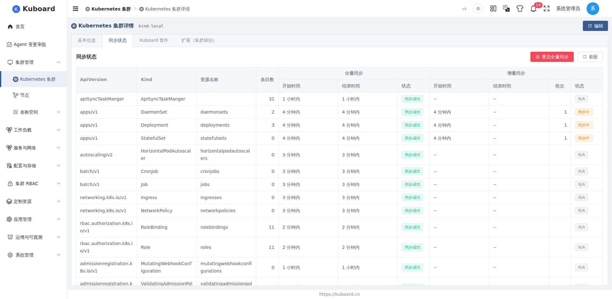

# 集群状态同步与缓存

Kuboard 将常用 Kubernetes 对象同步到本地数据库（缓存），资源列表从缓存查询，而不是每次请求都穿透到集群，从而降低对集群的访问压力。

缓存让列表的分页、筛选、排序等功能得以在本地实现。**适用对象**：集群运维 / 管理员。本文说明缓存如何同步、参数在哪配置，以及「同步状态」页上能做哪些操作。

## 三种同步模式

每种资源的同步方式，在**设置 → 系统设置 → 集群缓存设置**中指定：

| 模式 | 数据更新方式 | 适用场景 |
| --- | --- | --- |
| **watch**（实时监听） | 集群中对象变更后立即更新缓存 | Pod、Deployment、Service 等频繁变更的资源 |
| **polling**（定时轮询） | 每隔固定时间整体刷新一次 | Namespace、Secret、Ingress 等变更不频繁的资源 |
| **nocache**（直连不缓存） | 不写入缓存，每次查询直接访问集群 | 冷门资源、未列入缓存配置的资源 |

::: tip 默认行为
未在缓存设置中列出的资源，默认按 **nocache** 直连处理，不产生本地缓存。
:::

## 缓存资源配置

在**设置 → 系统设置 → 集群缓存设置**中集中维护，保存后立即生效，无需重启服务。配置分三部分：

- **同步线程池**：设置同时执行同步任务的最小 / 最大线程数；
- **同步时间控制**：全量同步的超时与失败重试、增量同步每轮监听的周期与间隔等；
- **缓存对象设置**：为每种资源选择同步方式（watch 或 polling）及轮询间隔；events 资源可单独设置删除后的保留时长。

**默认缓存资源**如下，可按需调整：

- **watch**：pod、deployment、statefulset、daemonset、service、endpoint、endpointslice、event（默认删除后保留 168 小时）及 DRA 资源；
- **polling（每 5 分钟）**：namespace、configmap、secret、persistentvolumeclaim、ingress、networkpolicy、horizontalpodautoscaler、job、cronjob、role、rolebinding、serviceaccount、customresourcedefinition；
- **polling（每 300 分钟）**：各类 admission webhook 配置、validatingadmissionpolicy 及其绑定、flowschema、prioritylevelconfiguration、runtimeclass。

## 集群状态（缓存健康）

集群管理列表中，每个集群的**集群状态**列显示缓存健康状态：

| 状态 | 含义 |
| --- | --- |
| unknown | 集群刚导入时的初始状态 |
| ready | 缓存可用，资源列表正常从缓存读取 |
| error | 与集群失联，缓存查询返回空结果 |

集群失联（error）后无需人工干预：集群恢复连通后会自动回到 ready。想查看失联原因，可在集群管理列表点开集群，查看**失联原因**与**检查时间**。

## 状态同步页

在**集群详情 → 同步状态**标签页，可以查看该集群每种资源的同步明细。

表格每个资源一行，主要列：

| 列 | 说明 |
| --- | --- |
| 资源类型（ApiVersion / Kind / 资源名称） | 同步的资源 |
| 条目数 | 当前缓存中该资源的对象数量 |
| 全量同步 | 开始时间、结束时间与状态 |
| 增量同步 | 开始时间、结束时间、轮次与状态 |

同步状态取值为：`created`（任务已创建，等待执行）、`processing`（执行中）、`failed`（失败）、`success`（成功）。页面上有两个操作按钮：

- **重启全量同步**（危险操作）：删除该集群全部同步任务，按当前缓存设置重新生成任务并逐资源执行全量同步，相当于重建一次缓存；
- **刷新**：重新加载表格数据。

::: warning 重启全量同步须知
该操作会把集群导入状态改回「导入中」；单个资源会先删除旧缓存、再写入新数据，期间对应资源列表可能短暂为空或不完整。集群较多、资源量大时应避开业务高峰。
:::

## 常见问题

### 某个资源的列表始终为空

依次检查：该资源是否已加入**集群缓存设置**（未配置的资源走直连，无本地缓存）；集群健康状态是否为 `ready`（失联集群查询返回空）；若是新加入缓存的资源，需在**同步状态**页点一次**重启全量同步**。

### 切换同步方式后，缓存没有按预期工作

已存在的任务会在下一轮按新配置生效；但新增或移除资源不会自动生成、清理任务。修改缓存设置后，请在各集群的**同步状态**页点击**重启全量同步**，按最新配置重建同步任务与缓存。

### 集群失联后，资源列表不可用

失联集群的健康状态为 `error`，缓存查询返回空结果。恢复集群连通后会自动回到 `ready`，无需操作。

### events 在集群中删除后仍能看到

events 默认在删除后保留 168 小时，便于事后排查问题。可在**集群缓存设置**中调整该保留时长。

### 提示 resourceVersion 过期（410 Gone）

watch 监听携带的版本号过期（如集群重启）时会提示 410 Gone，属正常现象。Kuboard 会自动重新建立监听，无需处理。

## 接口文档

本节涉及的接口详见 [Swagger UI 的「集群管理接口」分组](../../reference/api)。