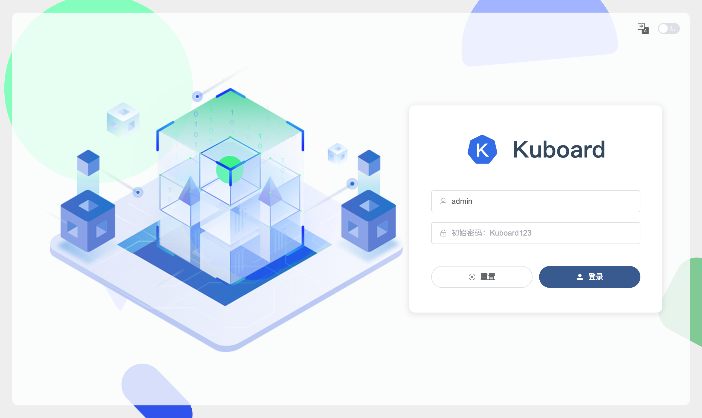

# 安装 Kubernetes 多集群管理工具 - Kuboard v4

## 致 Kuboard v3 用户

兼容性

- Kuboard v4 使用了与 Kuboard v3 不同的技术架构，不能直接从 Kuboard v3 升级到 Kuboard v4；
- 您可以将同一个集群同时导入到 Kuboard v3 和 Kuboard v4。此时 Kuboard v3 / v4 都可以有效管理该集群。
  - 如果集群在 v3 以及 v4 中的名字相同，Kuboard 套件不受影响，在 V3 / V4 中都可以正常使用。

Kuboard v4 相较于 v3 主要差异如下：

- Kubernetes 版本适配范围：
  - v3 支持 Kubernetes 1.13 - 1.33
  - v4 支持 Kubernetes 1.15 - 1.34（持续跟进 Kubernetes 最新版本）
- 用户体验提升
  - Kuboard v4 覆盖 v3 的所有主要功能
  - Kuboard v4 兼容 v3 的主要套件，升级到 V4 时，已安装套件不受影响
  - Kuboard v4 将常用 Kubernetes 对象缓存到本地，支持模糊查询，支持更快的检索速度
  - Kuboard v4 可以在一个列表中同时显示多个集群、名称空间的对象，查询操作更快捷
  - Kuboard v4 提供更简洁更清晰的授权模型，给用户授权时更灵活更方便
- 技术架构
  - 技术栈差异：
    - Kuboard v3 技术栈： vue 2.7 + golang 1.18 + etcd 3.4
    - Kuboard v4 技术栈： vue 3.5 + java 1.17 + MySQL/MariaDB/Postgre（三种数据库选一）
  - Kuboard v4 支持高可用部署
  - Kuboard v4 提供更丰富的 API 供用户调用

## 依赖条件

Kuboard v4 需要使用数据库作为存储，支持的数据库类型有：

- MySQL >= 5.7
- MariaDB >= 8.0
- OpenGauss >= 3.0

您也可以参考 [快速开始](./quickstart.md) 使用 docker compose 迅速拉起一个 Kuboard 实例用于测试。

## 准备并启动 Kuboard

按你使用的数据库类型选择页签，每个页签内包含「准备数据库」与「启动 Kuboard」两步：

<KbTabs :tabs="['MySQL', 'MariaDB', 'OpenGauss']">
  <template #mysql>

### 准备数据库

在 MySQL 中创建数据库与用户，建库脚本如下：

```sql
CREATE DATABASE kuboard DEFAULT CHARACTER SET = 'utf8mb4' DEFAULT COLLATE = 'utf8mb4_unicode_ci';
create user 'kuboard'@'%' identified by 'Kuboard123';
grant all privileges on kuboard.* to 'kuboard'@'%';
FLUSH PRIVILEGES;
```

### 启动 Kuboard

使用 `docker run` 启动 Kuboard 容器：

```sh
docker run -d \
  --restart=unless-stopped \
  --name=kuboard \
  -p 80:80/tcp \
  -e TZ="Asia/Shanghai" \
  -e DB_DRIVER=com.mysql.cj.jdbc.Driver \
  -e DB_URL="jdbc:mysql://10.99.0.8:3306/kuboard?serverTimezone=Asia/Shanghai" \
  -e DB_USERNAME=kuboard \
  -e DB_PASSWORD=Kuboard123 \
  -v ./kuboard-log:/app/logs \
  swr.cn-east-2.myhuaweicloud.com/kuboard/kuboard:v4
  # eipwork/kuboard:v4
```

  </template>
  <template #mariadb>

### 准备数据库

在 MariaDB 中创建数据库与用户，建库脚本如下（与 MySQL 相同）：

```sql
CREATE DATABASE kuboard DEFAULT CHARACTER SET = 'utf8mb4' DEFAULT COLLATE = 'utf8mb4_unicode_ci';
create user 'kuboard'@'%' identified by 'Kuboard123';
grant all privileges on kuboard.* to 'kuboard'@'%';
FLUSH PRIVILEGES;
```

### 启动 Kuboard

使用 `docker run` 启动 Kuboard 容器：

```sh
docker run -d \
  --restart=unless-stopped \
  --name=kuboard \
  -p 80:80/tcp \
  -e TZ="Asia/Shanghai" \
  -e DB_DRIVER=org.mariadb.jdbc.Driver \
  -e DB_URL="jdbc:mariadb://10.99.0.8:3306/kuboard?&timezone=Asia/Shanghai" \
  -e DB_USERNAME=kuboard \
  -e DB_PASSWORD=Kuboard123 \
  -v ./kuboard-log:/app/logs \
  swr.cn-east-2.myhuaweicloud.com/kuboard/kuboard:v4
  # eipwork/kuboard:v4
```

  </template>
  <template #opengauss>

### 准备数据库

在 OpenGauss 命令行中创建数据库，建库脚本如下：

```sql
CREATE USER kuboard PASSWORD 'Kuboard123';
CREATE DATABASE kuboard OWNER=kuboard ENCODING='UTF8' DBCOMPATIBILITY='PG';
\c kuboard
CREATE SCHEMA kuboard AUTHORIZATION kuboard;
```

> 如果使用 OpenGauss 数据库，Kuboard 将使用 postgre SQL 语法操作数据库

### 启动 Kuboard

使用 `docker run` 启动 Kuboard 容器：

```sh
docker run -d \
  --restart=unless-stopped \
  --name=kuboard \
  -p 80:80/tcp \
  -e TZ="Asia/Shanghai" \
  -e DB_DRIVER=org.postgresql.Driver \
  -e DB_URL="jdbc:postgresql://10.99.0.8:5432/kuboard?currentSchema=kuboard&characterEncoding=UTF8" \
  -e DB_USERNAME=kuboard \
  -e DB_PASSWORD=Kuboard123 \
  -v ./kuboard-log:/app/logs \
  swr.cn-east-2.myhuaweicloud.com/kuboard/kuboard:v4
  # eipwork/kuboard:v4
```

  </template>
</KbTabs>

::: tip 参数说明

- 环境变量 `TZ` 指定 JDK 的时区；
- 环境变量 `DB_DRIVER` 指定数据库驱动类，可选值有三个：
  - `com.mysql.cj.jdbc.Driver`
  - `org.mariadb.jdbc.Driver`
  - `org.postgresql.Driver`
- 环境变量 `DB_URL` 指定 JDBC 连接 url，参数中的主机地址不用写 `localhost`，应该直接指定数据库的 IP 地址，例如，样例中使用了数据库的 IP 地址 `10.99.0.8`；JDBC 连接 url 应与前一个步骤中创建的数据库相匹配；通常，您只需替换样例中的 IP 地址以及端口号即可；
- 环境变量 `DB_USERNAME` 指定数据库用户，应该与前一个步骤中创建的数据库用户名相同；
- 环境变量 `DB_PASSWORD` 指定数据库密码，应该与前一个步骤中创建的数据库密码相同；
  :::

## 打开 Kuboard 界面

- 在浏览器打开 Kuboard 的地址，例如：

  `http://10.99.0.10/login`

  Kuboard 的登录界面如下图所示：

  

- 登录 Kuboard 界面：

  - 管理员用户为： `admin`
  - 默认密码为 ： `Kuboard123`

  **此时您已完成了 Kuboard v4 的安装**。后续请在 Kuboard 界面上执行如下操作：

  - 修改 `admin` 的密码
  - 创建普通用户并授权
  - 导入 Kubernetes 集群

## 集成外部用户库

Kuboard v4 通过 webhook 接口与外部用户库（例如 LDAP）集成，具体请参考 [https://github.com/eip-work/kuboard-v4-ldap-example](https://github.com/eip-work/kuboard-v4-ldap-example)

## 反向代理与 HTTPS

Kuboard 默认使用 HTTP，便于快速试用。**生产环境请务必启用 HTTPS**，推荐方式：

- 使用 Kubernetes Ingress 终止 TLS 并将流量转发到 Kuboard Service
- 或使用自建的 Nginx 反代 Kuboard 并在 Nginx 上配置 HTTPS

请注意：

- **WebContextRoot**：Kuboard 必须挂在根路径（如 `https://kuboard.yourcompany.com/`），不支持 `https://yourcompany.com/kuboard/` 这样的二级路径
- **WebSocket**：终端和日志功能依赖 WebSocket，反代必须放行 WebSocket 升级请求

详细的 Nginx 与 Ingress 配置样例参见 [反向代理](./reverse-proxy)。

## 高可用部署

Kuboard V4 支持多副本高可用部署：多个 Kuboard 实例组成服务集群，由负载均衡器分发流量，并使用 Redis 分布式缓存共享跨实例状态。部署拓扑、Redis 环境变量、数据库高可用建议与故障切换行为等完整说明，请参考 [高可用部署](./ha)。
