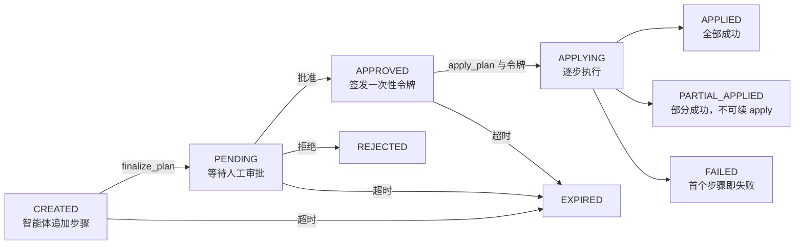

# Agent 变更审批流程

智能体不能直接改动集群：它先提交「变更计划」（Change Plan），经你审批并拿到一次性令牌（approval token）后，真正的写入才会发生。

本页面向**在 Kuboard Web UI 审批 AI 变更的用户**，以及**为智能体配置变更流程的开发者**，是 [MCP 接入总览](./index) 中「Agent 变更审批」一节的展开。

## 5 阶段流程总览

一条变更计划的完整审批流程（Approval Flow）分 5 个阶段，对应计划（plan）在服务端的各个状态：



计划按箭头单向推进：智能体提出计划 → 你在 UI 审批 → 拿到令牌 → 智能体逐步执行 → 回收结果。执行可能落到三种终态；「拒绝」「超时」则把计划直接作废。

## 阶段一：智能体提出计划

智能体用 3 个工具构建并提交计划：

1. **`create_plan(description)`** 创建空计划。`description` 是给审批者看的操作目的（如「恢复 nginx 部署并开放端口」），显示在审批界面顶部。
2. **`append_step_to_plan(planId, tool, args, description)`** 把每个要变更的对象追加为计划的一个步骤。追加前会先做 **dry-run 预演**：
   - 预演通过 → 步骤进入计划；
   - 集群不支持 dry-run（Kubernetes 1.15~1.17）→ 降级通过；
   - 预演失败 → 步骤被拒绝，智能体需要修复参数后重试、或放弃该对象。
3. **`finalize_plan(planId)`** 提交计划，让它出现在审批页面。提交后不能再追加步骤；空计划不允许提交。

可追加的工具是**写操作白名单**（也是「是否强制审批」的判据）：

```json
["apply_k8s", "patch_k8s", "delete_k8s", "delete_k8s_collection",
 "drain_node", "evict_pod",
 "restart_workload", "scale_workload", "update_image_tag", "rollback_workload"]
```

::: tip 一个计划 = 一个操作意图
同一意图下要变更的多个对象，尽量聚合进同一个计划，只审批一次。
:::

## 阶段二：Kuboard UI 审批

登录 Kuboard 后，进入左侧菜单顶部的 **「Agent 变更审批」**（路径 `/agent-change-plans`）。待审批计划会自动展开，逐条展示每个步骤的目的、集群、命名空间、资源与动作。你可以执行三种操作：

- **全部批准**：不做勾选直接确认，所有步骤全部通过。
- **部分批准**：在步骤勾选表中取消勾选不想执行的对象，再点「批准所选」。未勾选的步骤会被跳过，集群中完全不会发生改动；勾选数量为 0 时确认按钮不可用。
- **拒绝**：填写拒绝原因（必填）后计划作废，集群不会被修改。「待审批」和「已批准」状态下都允许拒绝。

::: tip 部分批准后的核对
部分批准后，智能体可以用 `get_plan_approve_status(planId)` 查询每个步骤的批准结果，并在会话里明确告诉你：哪些对象获批、哪些被跳过及其潜在后果。
:::

若要放弃一个已提交的计划，拒绝它即可（取消操作当前未对用户开放）。

## 阶段三：一次性令牌

审批通过后，服务端签发**一次性令牌**（approval token）。在 UI 上点「查看 Token」复制（该按钮只在计划已批准且未过期时出现）。令牌规则：

| 规则 | 说明 |
|---|---|
| 格式 | `at-{uuid}`，例如 `at-9f2c8e6d…` |
| 有效期 | 15 分钟，过期后执行被拒，需重新审批 |
| 一次性 | `apply_plan` 消费后即作废，二次使用报错 |
| 与计划绑定 | 只能用于它所属的计划，令牌与计划不匹配会被拒绝 |
| 仅持有者可用 | 只有计划所属用户能凭它执行 |
| 重复查看幂等 | 再次批准不会签发新令牌，返回原令牌 |

把 `planId` 和令牌**一起**交给智能体，它才能执行。

::: warning 令牌等于写入授权
令牌等同于对集群写入的授权凭证，不要泄露给计划持有者之外的任何人；15 分钟内不用就过期，过期后需重新审批。
:::

## 阶段四：逐步执行

智能体调用 `apply_plan(planId, approvalToken)` 后，服务端按步骤顺序执行：

- 校验令牌与计划匹配且未过期，然后逐个步骤执行；
- 每完成一步，审批页面实时刷新执行进度；
- **首个失败即终止**：后续步骤全部标记为跳过，不再继续。

执行结果对应三种终态：

| 执行结果 | 终态 |
|---|---|
| 全部步骤成功 | `APPLIED` |
| 部分成功（首个失败终止） | `PARTIAL_APPLIED` |
| 首个步骤即失败 | `FAILED` |

::: danger 部分成功后不能续 apply
apply 中途失败或进程中断时，未执行的步骤不会自动重试，也不会询问你「是否继续」——必须重新创建计划、再走一遍完整审批。这是刻意设计，避免在用户不知情时重试失败的变更。
:::

执行中的特殊跳过规则：

- 部分批准时未勾选的步骤 → 跳过；
- 已经成功或已经跳过的步骤 → 跳过（幂等）；
- dry-run 阶段失败但仍留在计划中的步骤 → 执行阶段转为跳过。

## 阶段五：结果回收

计划进入终态后，各方回收结果：

**智能体侧**

- `apply_plan` 返回计划终态与 `applied` / `failed` / `skipped` 统计，以及每个步骤的状态与错误信息；
- `get_plan_approve_status` 用于执行前核对哪些对象获批 / 被跳过。

**用户侧（UI）**

- 列表与详情展示每个步骤的预演与执行结果；
- **回滚**：仅对 `PARTIAL_APPLIED` / `APPLIED` 计划中含执行前快照的 `apply_k8s` 步骤有效，一键恢复到变更前；创建类对象（变更前不存在）无法自动回滚；
- **删除**：仅允许删除「已过期且非全部成功」的计划（物理删除，不可恢复）；已成功执行的计划永远保留，作为变更证据。

## 超时与恢复

::: tip
- 计划默认 **30 分钟**内未被处理会自动过期，列表状态变为「已过期」；「构建中 / 待审批 / 已批准」状态的计划在读取时自动转为过期。
- 审批通过后令牌 **15 分钟**有效，过期后执行被拒，需重新创建计划并再次审批。
- apply 中途失败进入 `PARTIAL_APPLIED` 终态，不可续批、不可续 apply，需重新创建计划。
- 每个用户最多同时持有 **50** 个未终态的计划。
:::

## 危险级别与审批的关系

每个计划与步骤都带危险度（danger level）：

| 级别 | 含义 |
|---|---|
| `LOW` | 读取类 / 单资源重启镜像 |
| `MEDIUM` | apply / patch / 单资源 delete |
| `HIGH` | 批量删除等高危操作 |

危险度只影响审批界面的提示强度（`LOW` 蓝 / `MEDIUM` 黄 / `HIGH` 红高亮），**不决定是否强制审批**。

::: warning 是否强制审批与危险度解耦
判据是**写操作白名单**：凡是会向集群发起持久化写入的 MCP 工具都在白名单中、都必须走审批，与它标注的危险度无关——不能因为某个操作标了 `LOW` 就绕过审批。详见 [危险级别机制](./danger-levels)。强制审批开关见 [服务端配置](./server-config)。
:::

## 相关页面

- [MCP 接入总览](./index)
- [MCP 工具全集](./tools)
- [危险级别机制](./danger-levels)
- [服务端配置](./server-config)
