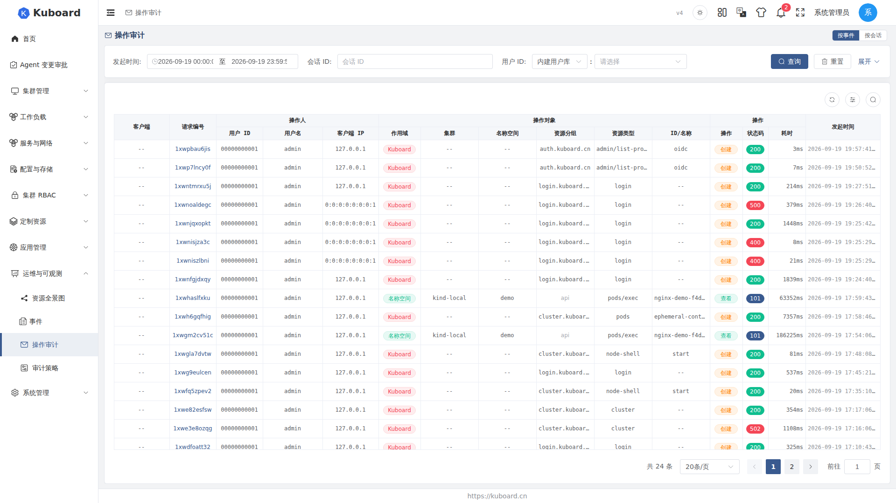
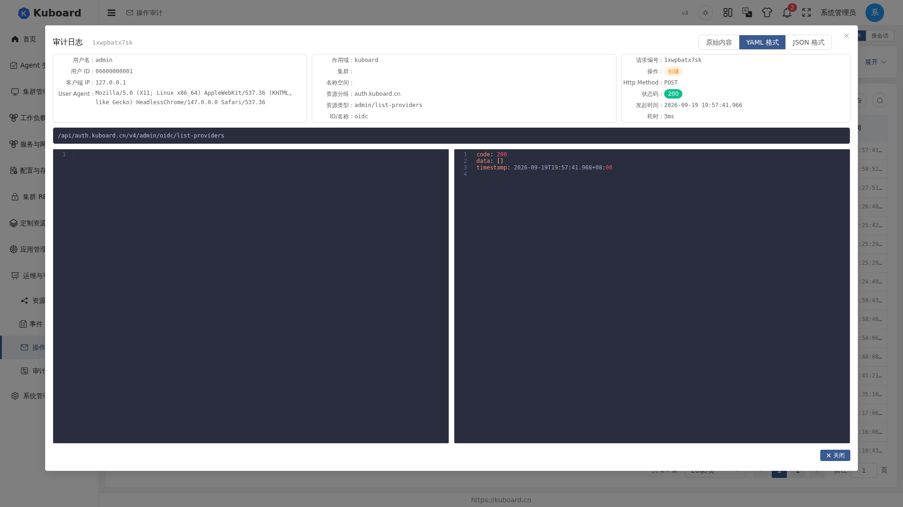
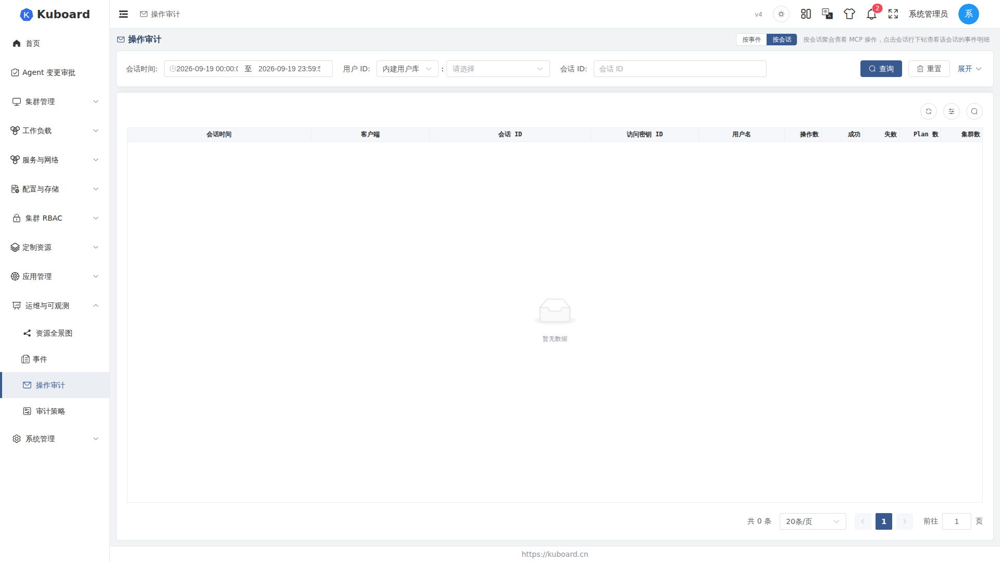

# 操作审计（Audit Log）

本页介绍操作审计日志的查看与检索：谁在何时对哪个对象做了什么操作、结果如何，并查看请求/响应报文与 MCP 会话明细。入口：「运维与可观测」→「操作审计」。

::: tip 典型场景
- **定位问题操作**：谁删除了某对象、为何失败（4xx/5xx）；
- **权限与合规审查**：核对某用户在指定时间窗口内的变更；
- **追踪 MCP 行为**：AI 助手（agent）在一次会话中执行了哪些操作、成功/失败各多少。
:::

::: warning 权限要求
操作审计是管理员级别的功能，只有具备 Kuboard 作用域（kuboard）下审计资源读权限的用户才能看到，普通用户默认不可见。
:::

## 审计覆盖的范围

是否记录一次操作由**审计策略**决定（详见 [审计策略](./audit-policy)），默认只记录写操作（create / update / delete / patch 等），不记录读操作（get / list）。

| 操作入口 | 是否记录 | 说明 |
| --- | --- | --- |
| Kuboard 界面 / API（含访问密钥 AK/SK 调用） | 写操作记录 | 增删改、扩缩容、配置变更；记录访问密钥 ID |
| MCP 工具调用 / Helm 操作 | 记录 | 各工具函数、release 增删改及仓库维护；附会话标识 |
| kubectl 直连集群 / WebSocket 长连接 | 不记录 | 审计只在 Kuboard 侧生效；终端、日志流、SSE 不产生事件 |

审计事件在请求完成后落盘，连同响应报文一并记录；密码、Token、Secret 等敏感字段记录前替换为 `<encrpyted>`，不会以明文保存。

## 查看操作审计

页面打开后默认查询**今天**的审计事件，按发起时间倒序排列，可直接滚动翻页。

### 筛选与定位

点击表格上方的筛选条件展开搜索栏：

| 筛选条件 | 说明 |
| --- | --- |
| 时间范围 | 必填，默认今天；一次查询只能覆盖**同一月份**，跨月会被拒绝 |
| 用户 / 状态码 | 按用户 ID 选择；状态码为 100–599 的数字 |
| 客户端 | 客户端类型（browser / mcp / helm / cli / internal）及名称（如 opencode） |
| 会话上下文 | 会话 ID、关联 Plan、访问密钥 ID（不含 SK），三者可交叉筛选 |
| 操作对象 | 作用域（kuboard / cluster / namespace）→ 集群 → 名称空间 → 资源分组（apiGroup，`api` 为 core 组）→ 资源类型 → ID/名称；选择上级后限制下级 |
| 操作 | verb（如 create / delete），可多选；选项取决于已选的资源分组与资源类型 |

**定位一次操作的典型步骤**：

1. 设置时间范围（必填，建议先缩小到分钟级窗口）；
2. 按「用户」或「客户端 IP」定位操作人；
3. 按「作用域 → 集群 → 名称空间 → 资源分组 → 资源类型」逐级收窄操作对象，或在「ID/名称」中直接输入对象名；
4. 按「操作」选 verb（如 delete）、按「状态码」输入失败码（如 500）快速找到失败操作。

::: warning 一次查询只能覆盖一个月
审计数据按月分表存储，跨月查询会提示「一次查询只能获得同一月份中的审计事件」。跨月排查时请分月查询，或到审计策略页面调大保留时长。
:::

### 事件详情

点击列表中的任意一行，弹出该事件的完整详情：

| 区块 | 字段 |
| --- | --- |
| 操作人 | 用户名、用户 ID、客户端 IP、User Agent |
| 操作对象 | 作用域、集群、名称空间、资源分组、资源类型、ID/名称、对象 UID |
| 执行信息 | 请求编号、操作（verb）、HTTP Method、状态码、发起时间、耗时 |
| MCP 客户端（仅客户端类型为 mcp） | 客户端类型/名称/版本、会话 ID、访问密钥 ID、关联 Plan、Plan 步骤 ID |

详情底部展示**请求 URL**（密码类参数以 `<encrpyted>` 隐藏）以及**请求报文 / 响应报文**，报文支持**原始 / YAML / JSON** 三种格式切换。

### 按会话查看 MCP 操作

页面右上角可将视图从「按事件」切换为「按会话」，把 MCP 操作按会话（Session）聚合成一行，适合审查 AI 助手一次对话做了什么。

| 列 | 说明 |
| --- | --- |
| 会话时间 | 该会话首条与最后一条操作的起止时间 |
| 客户端 / 会话 ID | MCP 客户端名/版本；会话标识来源为 agent 自报（标记 agent）或后端兜底生成（标记 fb） |
| 访问密钥 ID / 用户名 | 会话使用的 AK 与所属用户 |
| 操作数 / 成功 / 失败 | 会话内操作总次数与成功（2xx）、失败（非 2xx）次数 |
| Plan 数 / 集群数 | 会话内涉及的 Plan 任务、集群数量（去重） |

**下钻到会话明细**：点击某个会话行，页面自动把该会话 ID 填入筛选条件并切回「按事件」视图，展示该会话内的每一条操作。如需与 agent 端日志对齐，复制会话 ID 到 agent 侧搜索即可。

## 数据保留

::: tip
- 审计数据按月分表存储，请求/响应报文体以压缩形式保存；保留时长默认 6 个月，可在**审计策略**页面配置，设为 0 表示不自动删除；
- 「记录到数据库」与「记录到文件」两个开关可独立启停；记录到文件时受请求体/响应体最大长度限制。
:::

## 相关页面

- [审计策略](./audit-policy)：配置审计开关、记录规则（pass / block）与保留时长；
- 资源详情页（如工作负载）中的「变更历史」：同一份审计数据在对象维度的另一种查看入口，用于对比某对象各次变更前后的内容。
