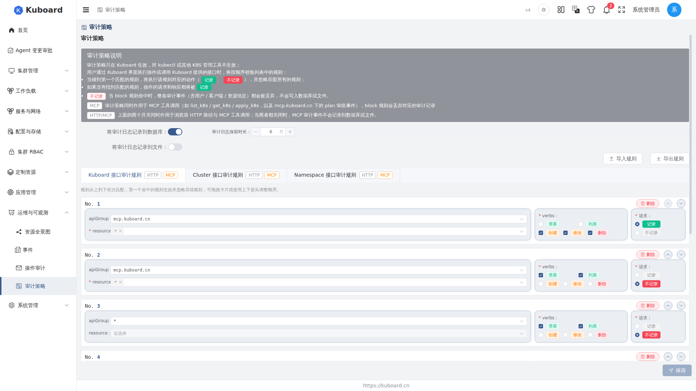
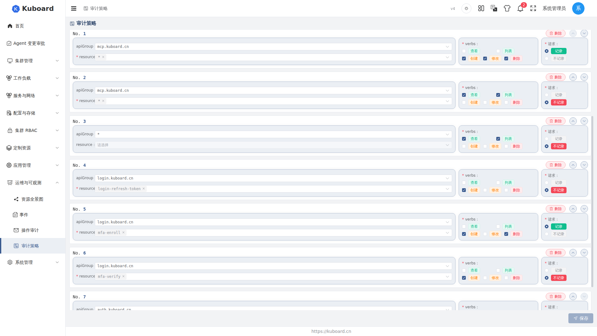

# 审计策略（Audit Policy）

审计策略（Audit Policy）由管理员配置，决定**哪些操作记录审计日志、记到哪里去**（数据库或文件）。

策略**只在 Kuboard 生效**：通过 Kuboard 界面或 Kuboard 接口执行的操作才受约束，对 kubectl 等原生 Kubernetes 管理工具**不生效**。查询与检索已记录的日志见 [操作审计](./audit-log)。

## 进入审计策略页面

登录后进入 **运维与可观测 → 审计策略**。页面自上而下依次为：策略说明、两个记录开关（写数据库 / 写文件）、三类规则标签页（Kuboard / Cluster / Namespace）。同一份配置也可从 **系统管理 → 系统设置 → 审计策略设置** 页签打开，内容一致。



## 规则如何生效

一次操作先按作用域归入对应规则列表（Kuboard / Cluster / Namespace），只在该列表中匹配：

1. 列表内**从上到下**依次校验，**第一个命中的规则生效**，忽略后面所有规则。
2. 命中后执行动作：**记录（pass）** 或 **不记录（block）**；没有任何规则命中时，默认**记录（pass）**。

::: warning block 是「整条丢弃」
block 规则命中时，整条审计事件（含用户、客户端、资源信息）都被丢弃，**不写数据库、不写文件**。
:::

## 记录到哪里：开关与保留策略

| 配置项 | 类型 | 说明 |
|---|---|---|
| 将审计日志记录到数据库 | 开关 | 审计事件写入数据库（按月分表）；开启后出现「审计日志保留时长」 |
| 审计日志保留时长 | 数字 | 保留最近 N 个月，默认 6；设为 0 表示不自动删除 |
| 将审计日志记录到文件 | 开关 | 写入容器内 `/app/logs` 目录；开启后出现下面两个长度参数 |
| 请求体最大长度 | 数字 | 仅作用于文件形式日志，限制请求体大小，范围 0–65535，默认 4096 |
| 响应体最大长度 | 数字 | 仅作用于文件形式日志，限制响应体大小，范围 0–65535，默认 4096 |

审计日志按月分表，保留时长 N 表示保留最近 N 个月（含当月），系统自动删除更早的数据；设为 0 则永不自动删除，请结合磁盘与合规要求评估 N。**两个开关都关闭**时，任何操作（包括 MCP 工具调用）都不会被记录，审计页面查不到数据——如需保留合规审计记录，至少开启其中一个。修改后点右下角 **保存** 立即生效。

## 审计规则：作用域与可配项

三类规则的区别在**作用范围**，其余字段一致：

| 规则类型 | 作用范围 | 典型用途 |
|---|---|---|
| Kuboard 规则 | 整个 Kuboard，不区分集群 / 命名空间 | 全局策略，如「全局不记录读操作」 |
| Cluster 规则 | 指定的一个或多个集群 | 按集群差异化，如「仅记录 prod 集群的写操作」 |
| Namespace 规则 | 指定集群下的指定命名空间 | 精细到命名空间，如「不记录某命名空间的删除操作」 |

每条规则卡片的可配项（命中需作用域、apiGroup、resource、verbs 四层全部匹配，任一不匹配则跳过）：

| 字段 | 说明 |
|---|---|
| action 动作 | **记录（pass）** / **不记录（block）**，二选一 |
| verbs 动作类型 | 多选 get / list / create / update / delete，对应 HTTP 的 GET / POST / PUT / PATCH / DELETE |
| apiGroup API 组 | 规则 API 组，`*` 匹配全部 |
| resource 资源 | 作用资源类型（如 deployment、pod），仅 apiGroup 为具体组时可选；`*` 时自动匹配全部 |
| clusters（仅 Cluster 规则） | 多选作用集群，支持 `*` |
| cluster / namespaces（仅 Namespace 规则） | 单选集群（支持 `*`）+ 多选命名空间（支持 `*`） |



## 管理规则列表

- **新增**：在对应标签页点**添加 Kuboard/Cluster/Namespace 审计规则**，在新增卡片中填字段。新规则默认 `apiGroup=*`、`verbs=[list, get]`、`action=block`（Cluster 默认全部集群，Namespace 默认全部集群），即「不记录全部读操作」。
- **编辑**：直接修改卡片字段。
- **删除**：点卡片右上角删除按钮。
- **排序**：列表**从上到下**匹配，用上下箭头或直接拖拽调整顺序——顺序很重要。

<!-- screenshot-todo: 规则排序操作（拖拽）或上下箭头按钮的特写 -->

## 导入与导出规则

规则支持以 JSON 文件整体导入导出，便于跨环境复用。**导出**：点**导出规则**，下载 `kuboard-audit-rules-*.json`；**导入**：点**导入规则**选文件，已有规则时弹窗确认后**整体替换**三组规则。

```json
{
  "kuboardRules": [
    { "action": "pass", "verbs": ["get", "list", "create", "update", "delete"], "apiGroup": "mcp.kuboard.cn", "resources": ["*"] },
    { "action": "block", "verbs": ["list", "get"], "apiGroup": "*", "resources": [] }
  ],
  "clusterRules": [
    { "action": "pass", "verbs": ["create", "update", "delete"], "apiGroup": "*", "resources": [], "clusters": ["prod"] }
  ],
  "namespaceRules": [
    { "action": "block", "verbs": ["delete"], "apiGroup": "*", "resources": [], "cluster": "prod", "namespaces": ["default"] }
  ]
}
```

::: warning 导入是整组替换
导入**不是合并**，会整体替换现有三组规则，导入前请先导出备份。
:::

## MCP 工具调用

审计策略同样作用于 **MCP 工具调用**（API 组 `mcp.kuboard.cn`）：block 命中时审计事件整条丢弃；上面两个写库 / 写文件开关同样生效，都关闭时 MCP 事件不会记录到任何位置。若 Kuboard 规则列表中没有 `apiGroup=mcp.kuboard.cn` 的规则，会出现警示，提示默认的「不记录 */[get,list]」规则会丢弃 MCP 只读事件——点击**添加 MCP 保护规则**，会在列表**最顶部**插入一条（见下），该规则先于其他规则匹配，保证 `mcp.kuboard.cn` 只读事件始终被记录；若之后手动删除，警示会再次出现。

```json
{ "action": "pass", "verbs": ["get", "list", "create", "update", "delete"], "apiGroup": "mcp.kuboard.cn", "resources": ["*"] }
```

<!-- screenshot-todo: MCP 保护规则缺失时的警示条 + 「添加 MCP 保护规则」按钮 -->
