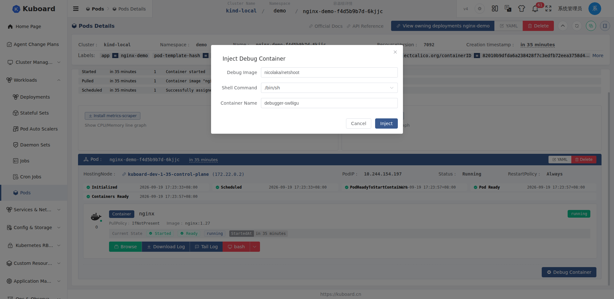
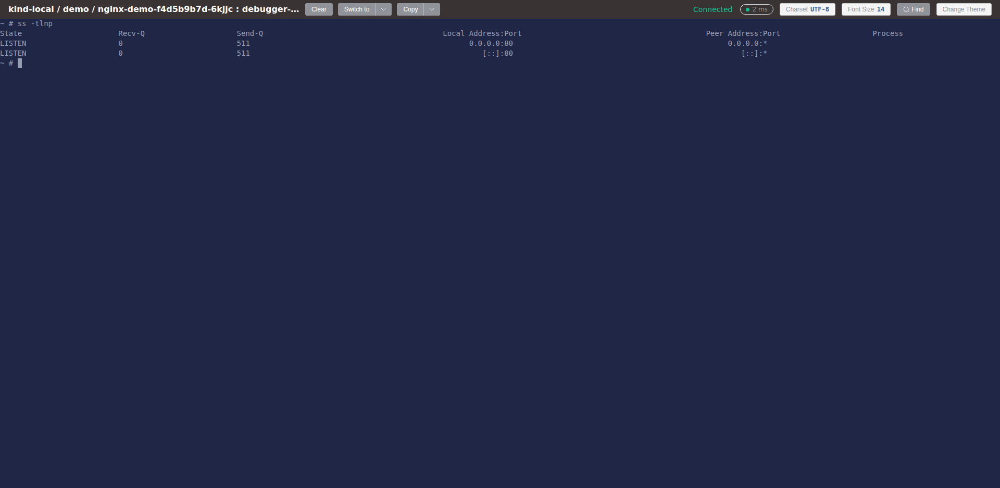

# 调试容器（Debug Container）

当某个容器（组）启动失败、工作异常或需要查看其内部状态时，可以往这个**运行中**的容器组（Pod）里注入一个**调试容器（Debug Container，即 Kubernetes 临时容器 Ephemeral Container）**。它**不需要修改原 Pod / 镜像**，注入后与目标容器共享网络命名空间与存储卷，可以直接用 `curl`、`dig`、`tcpdump` 等工具排查网络、进程与文件问题，排查完随 Pod 一起消失，不留痕迹。

::: tip 典型场景
- 业务容器镜像里没有 `curl`/`dig` 等工具，无法定位网络问题；
- 容器反复重启（CrashLoopBackOff），想在不改镜像的前提下进到它的网络/文件环境里观察；
- 需要临时验证某个端口、抓包或测试到下游服务的连通性。
:::

::: warning 版本要求
调试容器依赖 Kubernetes 1.23+ 的临时容器（ephemeral containers）能力。集群版本低于 1.23 时，入口按钮会置灰并提示「当前集群版本低于 1.23，不支持临时容器」。
:::

入口：**工作负载 / 容器组详情页**，见下文。

## 使用前提

| 前提 | 说明 |
| --- | --- |
| 集群版本 | ≥ 1.23，支持临时容器（ephemeral containers） |
| 目标 Pod | 必须处于 `Running`；已终止（`Succeeded` / `Failed`）或已删除的 Pod 无法注入 |
| 用户权限 | 对容器组（pods）有**更新（update）**权限；集群侧需允许 `pods/ephemeralcontainers` 操作（admin 内置角色默认具备） |

## 注入调试容器

### 入口位置

1. 进入目标工作负载的**容器组（Pod）详情页**，向下滚动到容器列表区域；
2. 在普通容器列表的下方，点击按钮 **「调试容器」**。

<!-- screenshot-todo: Pod 详情页容器列表底部的「调试容器」按钮，以及按钮置灰（Pod 未 Running / 集群版本过低）时的两种提示形态 -->

按钮的可用性提示：

- Pod 不在 `Running` 状态时，按钮置灰，悬浮提示「容器组未处于 Running 状态，仅在 Running 时可注入临时容器」；
- 集群版本低于 1.23 时，按钮置灰，提示版本过低；
- 若该 Pod 已经注入过调试容器，点击后会先弹出确认框「容器组中已有运行中的调试容器 [名称]，确定继续注入？」，确认后继续。

### 填写注入参数

点击「调试容器」后弹出**注入调试容器**对话框，各字段如下：

| 字段 | 默认值 | 说明 |
| --- | --- | --- |
| 调试镜像（Debug Image） | `nicolaka/netshoot` | 调试工具镜像，自带 `curl` / `dig` / `tcpdump` / `ss` 等排查工具；可按需换成其它镜像 |
| Shell 命令（Shell Command） | `/bin/sh` | 下拉选择 `/bin/sh`、`/bin/bash`、`/bin/zsh` 之一 |
| 容器名称（Container Name） | `debugger-<随机后缀>` | 注入后的临时容器名称；若与已存在的调试容器**同名**，则不重复创建、直接重新连接 |



确认无误后点击**「注入」**。

### 注入后的结果

注入过程通常数秒内完成，后端会等待该临时容器进入 `Running` 后再放行，因此：

- 提示「调试容器已注入」后，会自动在**新标签页打开该调试容器的终端**，可直接开始敲命令；
- 回到 Pod 详情页，容器列表末尾会出现带**「临时容器」**标签的新条目（与普通容器样式区分），以后可随时通过该条目上的操作按钮再次打开终端；
- 注入操作会写入[操作审计](./audit-log)日志（对象：pods/ephemeralcontainers）。



## 调试示例

打开终端后（默认 `nicolaka/netshoot`），调试容器与目标容器**共享网络命名空间**，`localhost`、监听端口对二者是一致的，可以直接排查：

```sh
# 确认网络是否可达、端口是否在监听（看到的就是目标容器的网卡）
ss -tlnp

# DNS 解析排查
dig +short myservice.namespace.svc.cluster.local

# 访问下游服务
curl -v http://my-service:8080/health

# 抓本机回环端口流量
tcpdump -ni lo port 8080
```

此外调试容器还共享目标 Pod 的存储卷与进程信息：

```sh
# 查看目标容器进程（依赖 Pod 开启 shareProcessNamespace）
ps aux

# 查看挂载的存储卷内容
ls -la /data
```

排查完毕直接关闭终端即可，无需手动清理。

## 生命周期与清理

临时容器受 Kubernetes 约束，**无法单独删除或修改**，它跟随所在 Pod 的生命周期：

| 场景 | 行为 |
| --- | --- |
| Pod 被删除 / 重建 | 调试容器随之消失，无需额外清理 |
| 再次点击「调试容器」，容器名与已有调试容器同名 | 不重复注入，直接复用并为你打开终端（等价于「重新连接」） |
| 想再开一个全新调试容器 | 在对话框改一个不同的容器名称后注入即可（同一 Pod 可同时存在多个调试容器） |

::: warning 不要依赖调试容器保存数据
调试容器是临时的，Pod 重建即丢失；如需持久保存排障信息，请用文件浏览器下载或转发到外部。
:::

## 常见问题

| 现象 / 提示 | 原因 | 处理 |
| --- | --- | --- |
| 按钮置灰：「当前集群版本低于 1.23，不支持临时容器」 | 集群过旧（DC_004） | 升级集群，或改用[节点终端](./nodeshell)等方式排查 |
| 提示「Pod 不存在」 | Pod 已被删除（DC_001） | 确认目标 Pod 名称与命名空间 |
| 提示「Pod 已终止，无法注入临时容器」 | Pod 已 `Succeeded` / `Failed`（DC_002），或临时容器启动异常（镜像拉取失败、60 秒内未就绪、shell 提前退出） | 回到列表确认 Pod 状态；镜像拉取失败时更换可拉取的调试镜像后重试；shell 提前退出时重新注入一次 |
| 提示同名调试容器冲突（DC_003） | 一般已被「同名复用」逻辑自动处理 | 正常场景不会出现；若出现，换一个容器名称重试 |

## 原理说明

::: tip 工作原理（了解即可）
- 底层调用 Kubernetes 的 **ephemeral containers** 能力，通过 `pods/ephemeralcontainers` 子资源注入，因此要求 K8s ≥ 1.23；注入时不改动原 Pod 的 containers 定义。
- 注入的临时容器与目标容器**共享网络命名空间与存储卷**，前端以 `exec` 方式打开 `/bin/sh` 终端，并强制启用 `stdin` + `tty` 保证 shell 保持存活。
- Kuboard 内置的调试默认值（镜像 `nicolaka/netshoot`、命名空间 `kube-system`、保持命令 `sleep infinity`、会话 TTL 3600 秒）来自集群配置文件，可在集群配置中调整；对话框中的默认镜像即 `nicolaka/netshoot`，实际注入时可按需覆盖。
:::

## 相关页面

- [终端](./terminal)：容器组 / 容器终端的常规入口，适用于容器本身可进入的情况；
- [节点终端 NodeShell](./nodeshell)：容器进不去时，从节点侧创建调试 Pod 排查；
- [操作审计](./audit-log)：查看谁在何时注入过调试容器。
