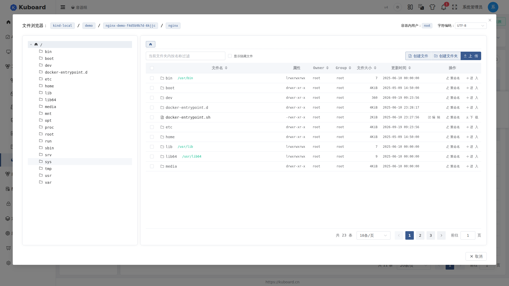
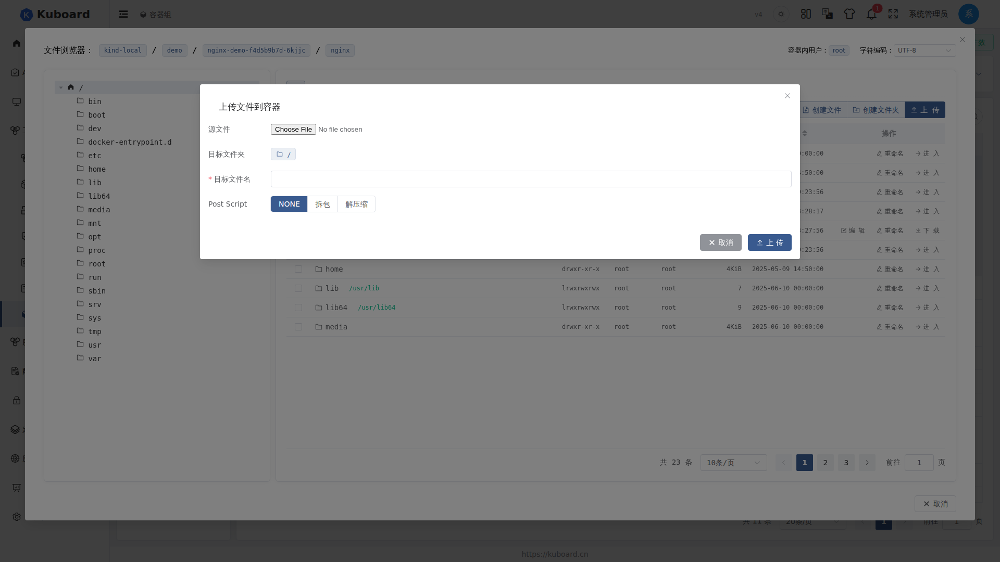

# 文件浏览器 File Browser

文件浏览器用于直接在浏览器中管理 Pod 某个容器**内部**的文件系统：浏览目录、查看文件属性、上传/下载、在线编辑文本、新建/重命名/复制/移动/删除文件与目录、修改权限（chmod）、打包压缩与解压。

它基于容器 **exec** 机制（与 [Web 终端](./terminal) 同一通道）在容器内执行 `ls`、`tar`、`mv` 等命令来完成操作，因此**不需要在浏览器端安装任何客户端**，也不依赖 `kubectl`。

::: warning 使用前提：容器内需有相应命令
文件浏览器的所有操作最终都在容器内部执行系统命令（`ls` / `mkdir` / `touch` / `mv` / `cp` / `rm` / `chmod` / `tar` / `dd` / `sh` 等）。若容器镜像缺少这些命令（例如精简过的二进制镜像），相关功能会执行失败。包含这些命令即可工作——`busybox` 镜像就能满足全部功能。
:::

## 打开文件浏览器

**入口（任一即可）**

- **Pod 列表页**：点击某 Pod 行的 **日志/终端** 按钮，在弹出层中点击目标容器旁的 **文件浏览器**（入口要求 `pods/exec create` 权限）；
- **工作负载页**：在 [Deployment](../guide/workload/deployments)、StatefulSet、DaemonSet 等列表页的 **日志/终端** 弹层中，同样点击目标容器旁的 **文件浏览器**；
- **Pod 详情页**：在 [Pod 详情页](../guide/workload/pods) 的容器卡片底部，点击 **文件浏览器** 按钮。

**权限与前提**

- 需要 `pods/exec` 相关权限，无权限时按钮不显示或点击无响应；
- 目标容器必须处于**已启动（Running）**状态；
- 初始化容器（init）与工作容器均可打开。

点击后弹出大尺寸对话框，标题栏显示 `集群 / 名称空间 / 容器组 / 容器`：

## 界面速览

| 区域 | 内容 |
| --- | --- |
| 顶部 | 集群 / 名称空间 / 容器组 / 容器；**容器内用户**（自动执行 `whoami` 探测）与**字符编码**下拉框 |
| 左栏（约 25%） | 目录树：点击目录进入，展开子目录；根路径为 `/` |
| 右栏（约 75%） | 当前路径面包屑、按名称过滤、显示隐藏文件开关、操作工具栏、文件列表、分页 |

文件列表各列：**文件名**（目录可点击进入）、**属性**（attr，如 `drwxr-xr-x`）、**Owner**、**Group**、**文件大小**、**更新时间**，均支持排序；分页可选 10 / 20 / 50 / 100 条并记忆上次选择。

::: tip 字符编码
右上角 **字符编码** 下拉（UTF-8 / GB18030 / GB2312 / GBK）与[终端](./terminal)共用同一套设置，按“集群 / 名称空间 / 容器组 / 容器”维度记忆。GB18030 等编码用于在中文环境下正确解析文件名与文件内容。
:::

## 浏览与定位

1. 在**左栏目录树**或右栏**面包屑**中点击目录，进入该目录；
2. 当前目录的文件列表显示在右栏；
3. 勾选 **显示隐藏文件** 显示以 `.` 开头的文件（对应 `ls -a`），关闭开关即回到默认视图；
4. 在 **按名称过滤** 输入框输入关键字，可只看名称包含该关键字的文件。

进入目录后，操作工具栏与行内操作针对当前目录生效。

## 常用操作

### 新建文件 / 新建文件夹

工具栏上的 **创建文件** / **创建文件夹** 分别对应容器内的 `touch` / `mkdir`。

1. 点击对应按钮；
2. 在对话框中确认父目录路径，输入名称；
3. 点击 **添加**。

名称不能包含 `/` 或 `\`，且不能与当前目录已有文件/文件夹同名（表单会实时校验并提示）。

### 上传文件到容器

工具栏 **上传** 按钮（上传到当前目录）。

| 表单项 | 说明 |
| --- | --- |
| 源文件 | 选择本地文件，显示其大小 |
| 目标文件夹 | 固定为当前目录（只读） |
| 目标文件名 | 默认取源文件名，可修改；当前目录已存在同名文件时校验不通过 |
| Post Script | 可选：**无**（默认）/ **拆包**（tar 解包）/ **解压缩**（zip 解压） |

- 选择 **拆包** 或 **解压缩** 后，上传完成会自动在容器内执行解包/解压，解包到与目标文件名（不含扩展名）同名的文件夹中；
- 上传过程中显示进度对话框：已上传大小、上传速度、剩余时间，可点击 **取消** 中止；
- 上传完成后自动对本地文件与容器内文件做 **MD5 校验**，确保字节一致。

::: tip 上传不支持覆盖
当前目录已有同名文件时无法上传（表单校验直接拦截）。可先修改目标文件名，或先把冲突文件改名/删除后再上传。
:::

### 下载单个文件

选中一个文件后，点击工具栏或行内的 **下载** 按钮（仅支持单个文件，多选时按钮禁用）。

- 下载前先读取文件大小，以进度条显示：文件大小、已下载、下载速度、剩余时间，可点击 **取消** 中止；
- 下载保存为浏览器文件（文件名与容器内一致），完成后自动做 MD5 校验。

### 在线编辑文本文件

点击文件名或行内 **编辑** 打开内置编辑器（CodeMirror），支持按扩展名自动匹配语法高亮（yaml / xml / markdown / HTML / JavaScript / nginx / shell / go / java / lua / php / python / vue / sql 等），也可在“高亮模式”中手动切换。

| 限制 | 说明 |
| --- | --- |
| 大小 | 超过约 1 MiB 的文件只读，提示“不适合在浏览器中直接编辑” |
| 类型 | 二进制内容（含控制字符）只读，无法编辑 |
| 后缀 | `.zip` / `.tar` / `.gz` / `.jar` / `.bz` / `.rpm` 不提供编辑入口 |
| 编码 | 仅 **UTF-8** 编码下可保存；其他编码（如 GB18030）提示“非 UTF-8 编码，不能保存” |

- 编辑完成后点击 **保存**（未修改时按钮禁用），保存成功即写回容器内文件；
- **重新加载** 会从容器重新读取内容覆盖当前编辑（如有未保存修改会先询问确认）。

<!-- screenshot-todo: 在线编辑界面：代码高亮、保存/重新加载按钮，顶部显示当前文件名 -->

### 重命名文件 / 文件夹

1. 选中文件/文件夹，点击行内 **重命名**；
2. 在对话框中确认当前路径与当前名称，输入新名称；
3. 点击 **重命名**（对应容器内 `mv`）。

### 复制 / 移动

选中一个或多个文件/文件夹后，工具栏出现 **复制**（`cp`）与 **移动**（`mv`）按钮。

1. 点击 **复制** 或 **移动**；
2. 在目标目录选择器（左半屏列出待处理项，右半屏为目录树）中选择目标目录；
3. 若目标目录存在同名文件/文件夹，需选择冲突处理策略：
   - **保留两者 `--backup=numbered`**（默认）：同名文件自动编号保留；
   - **覆盖已有 `-f`**：直接覆盖；
   - **跳过冲突 `-n`**：跳过同名项；
4. 点击 **复制 / 移动** 执行。

目标目录与源文件所在目录相同时，按钮禁用（无意义操作）。

### 删除文件 / 文件夹

选中一个或多个后点击 **删除**。为防止误删，需二次确认：

- **单个**文件/文件夹：输入对话框中红字显示的**完整名称**；
- **多个**：输入 `DELETE`。

确认后执行 `rm -rf` 递归删除，操作不可撤销。

::: warning 删除是永久操作
删除直接在容器内执行 `rm -rf`，不经过回收站，也无法恢复。请谨慎操作，尤其是在生产容器的数据目录（如挂载卷路径）中。
:::

### 修改权限（chmod）

选中文件/文件夹后点击 **chmod**：

1. 左侧列出待修改项及其当前属性（attr）；
2. 右侧分别勾选 Owner / Group / Others 的 **R / W / X**，可开关 **包含子文件（夹）** 递归修改；
3. 界面实时预览将执行的 `chmod` 命令，点击确认执行。

### 压缩（打包 tar） / 解压

选中项为**单个压缩包**时，工具栏与行内显示 **解压**；否则显示 **压缩**。

**压缩**（打包为 tar）：

1. 勾选 **是否压缩**（gzip）决定生成 `.tar` 还是 `.tar.gz`；
2. 输入 tar 包文件名（默认 `archive`）；
3. 点击 **打 包** 在容器内生成压缩包，或点击 **打包并下载** 生成后立即下载到本地。

**解压**：

1. 自动识别压缩类型（tar / tar.gz / tgz / tar.bz2 等）并预填目标文件夹名；
2. 点击 **解 压**，解压内容输出到当前目录下新创建的目标文件夹中。

两个对话框都会实时预览将执行的 `tar` 命令。

<!-- screenshot-todo: 压缩对话框：待打包文件列表、是否压缩开关、tar 包文件名与命令预览 -->

## 使用限制小结

- 依赖容器内命令：`ls`（目录浏览）、`mkdir` / `touch`（新建）、`mv`（重命名/移动）、`cp`（复制）、`rm -rf`（删除）、`chmod`（权限）、`tar` 与 `sh`（压缩/解压）、`dd`（上传/下载）、`whoami`（顶栏用户显示）——`busybox` 即可满足；
- 仅支持**单个文件**下载；上传不支持覆盖同名文件；
- 在线编辑限制约 1 MiB 且仅限 UTF-8 可保存，二进制与压缩类文件不可编辑；
- 文件浏览器与终端共用**字符编码**记忆设置，修改其一会影响另一个。

::: tip 实现说明（了解即可）
文件浏览器通过 WebSocket 向容器的 exec 接口发送命令并读取输出（与终端同一机制），上传/下载以二进制流分块传输。本文不展开实现细节，使用时无需关心。
:::