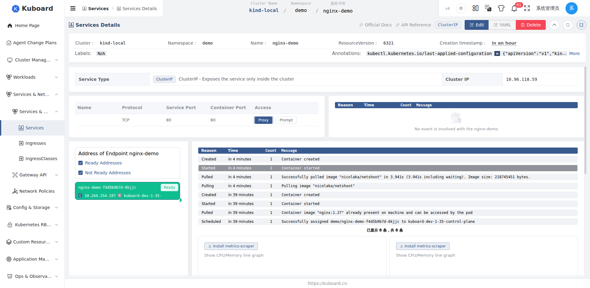
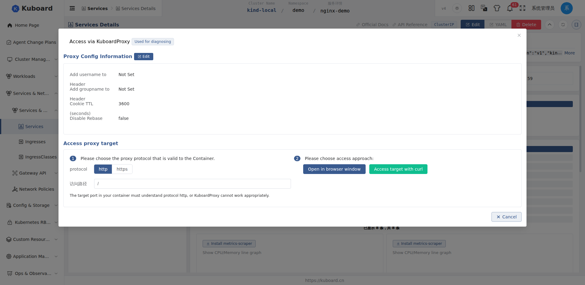

# 集群反向代理 Kuboard Proxy

Kuboard Proxy 为集群内无外部访问入口的 Service 提供临时访问通道：浏览器中访问其 Web 界面，或用 curl 调用其接口。

::: warning 临时诊断工具
Kuboard Proxy 用于**临时诊断**，不是对外发布服务的方式。正式对外提供访问请使用 [服务与 Ingress](../guide/network/services-ingress)。
:::

## 适用场景

- **服务无外部入口**：ClusterIP 类型 Service 只能在集群内部访问，需要从浏览器查看其 Web 界面（如 Grafana、Prometheus 等管理后台）
- **排查问题**：服务表现异常，需要以 http/https 直接访问其端口观察响应
- **接口调试**：用 curl 直接调用服务端口，验证接口行为
- **身份透传**：目标服务需要知道当前登录用户是谁（通过用户名/组名 Header 注入）

## 前提条件

- 账号在目标名称空间（Namespace）拥有 **`services/proxy` 的 `get` 权限**才能打开代理，修改代理配置还需要 **`update` 权限**；无权限时端口列表中的 **代理** 按钮不可见，请联系管理员在 [角色与权限](../user/roles) 中授予。
- 目标 Service 的协议为 **TCP**（UDP 等端口不提供代理入口）。
- 目标端口上运行的应用必须能处理您选择的 **http 或 https** 协议，Kuboard Proxy 只做转发，不做协议转换。

## 打开代理

**入口：** 集群 → 名称空间 → **Service** → 服务详情页。

1. 进入目标 Service 的**详情页**，向下找到**端口**表格；
2. 在目标端口所在行的**访问**列，点击**代理**按钮；
3. 弹出**通过 KuboardProxy 访问**对话框（标题旁带有「用于问题诊断」标签）。



## 在对话框中完成代理配置



### 代理配置信息

仅当目标为 Service 时展示，列出当前代理的生效配置：

| 配置项 | 说明 | 默认值 |
| --- | --- | --- |
| 用户名添加到 Header | 将当前登录用户名注入指定请求头，供目标服务识别用户 | 未设置 |
| 组名添加到 Header | 将当前登录用户的用户组注入指定请求头 | 未设置 |
| Cookie TTL（秒） | 代理会话的有效期 | 3600 秒 |
| 禁用 Rebase | 是否禁用对 HTML 页面内链接的自动改写 | false |

点击**修改 KuboardProxy 设置**可调整以上配置（需 update 权限；代理目标是 Pod 时仅支持固定默认设置，不支持修改，也不支持注入用户名/组名 Header）。这些配置会以注解形式保存到 Service 对象上，仅对配置的端口生效。例如，为 3000 端口配置用户名/组名透传与 2 小时会话：

```yaml
metadata:
  annotations:
    proxy.kuboard.cn/auth-header-user-3000: X-WEBAUTH-USER
    proxy.kuboard.cn/auth-header-groups-3000: X-WEBAUTH-GROUPS
    proxy.kuboard.cn/cookie-ttl-3000: "7200"
```

::: tip Rebase 是什么
被代理页面中指向自身服务的链接会被 Kuboard 改写以继续走代理通道，这称为 Rebase。绝大多数页面无需关心；若个别页面改写后反而打不开（例如前端路由使用绝对路径），可开启「禁用 Rebase」后重试。
:::

### 访问代理目标

**步骤 1：选择协议与访问路径**：协议按目标端口上运行的应用选 `http` 或 `https`；路径默认 `/`，可填写具体路径（如 `/graph`）。

**步骤 2：选择访问方法**：在浏览器新窗口打开代理地址，或使用 curl 访问（弹出可复制的命令）。

## 访问方式

### 浏览器访问

点击**在浏览器窗口中打开**，浏览器新窗口加载代理地址：

```
/k8s-proxy/<集群名>/api/v1/namespaces/<名称空间>/services/http:<服务名>:<端口>/proxy/<路径>
```

### curl 访问

点击**使用 curl 访问**，在任意能访问到 Kuboard 的机器上执行复制出的命令（令牌与签名由 Kuboard 自动生成填入，无需手动构造）：

```sh
curl -X GET -i \
  --cookie "KuboardToken=<您的令牌>; KuboardProxy=<代理签名>" \
  https://<kuboard-地址>/k8s-proxy/<集群名>/api/v1/namespaces/<名称空间>/services/http:<服务名>:<端口>/proxy/<路径>
```

::: tip curl 走同一代理通道
curl 与浏览器使用同一代理通道，同样受 Cookie TTL 与权限约束。返回头中的 `Kuboard-Proxy-Status: Success` 表示请求经过了 Kuboard Proxy。
:::

## 代理会话的有效期

代理会话依赖浏览器中的 **KuboardProxy Cookie**，在以下任一情况发生后，代理将拒绝访问：

- 超过 **Cookie TTL**：默认 3600 秒（可在代理配置中调整）；
- **浏览器会话失效**：关闭浏览器后 Cookie 随之失效。

访问被拒绝后，重新回到 Service 详情页点击**代理**按钮即可重建会话。

::: warning 会话与用户绑定
代理签名中包含当前登录用户的身份信息，且与目标服务、端口绑定，**不能**把代理地址或 curl 命令分享给他人使用。
:::

## 常见问题

| 现象 | 处理方式 |
| --- | --- |
| 「代理」按钮不可用 | 检查是否具备 `services/proxy` 的 get 权限，以及 Service 类型是否为 ExternalName |
| 页面能打开但跳转/资源加载异常 | 目标端口协议与页面实际协议不符，或页面使用绝对路径，尝试修改协议或开启「禁用 Rebase」 |
| 提示代理已失效 / 访问被拒绝 | Cookie 过期或浏览器已关闭，重新点击代理按钮 |
| 目标服务未收到请求头 | 确认代理配置中设置了用户名/组名 Header，且端口号一致 |

## 相关主题

- [服务与 Ingress](../guide/network/services-ingress)：正式对外发布服务的推荐方式
- [终端 Terminal](./terminal)：进入容器内部排查问题
- [文件浏览器](./file-browser)：直接浏览容器内文件