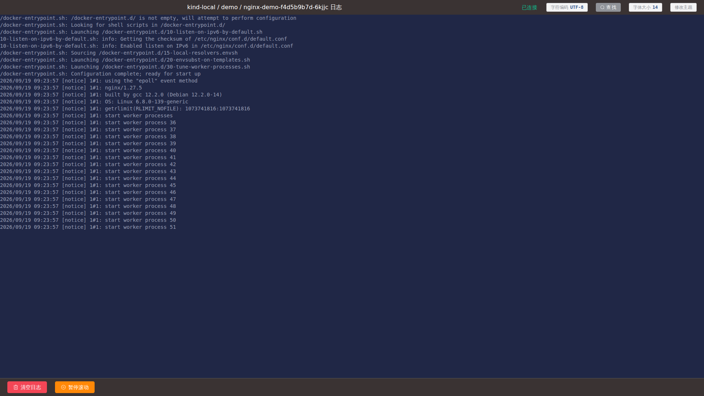
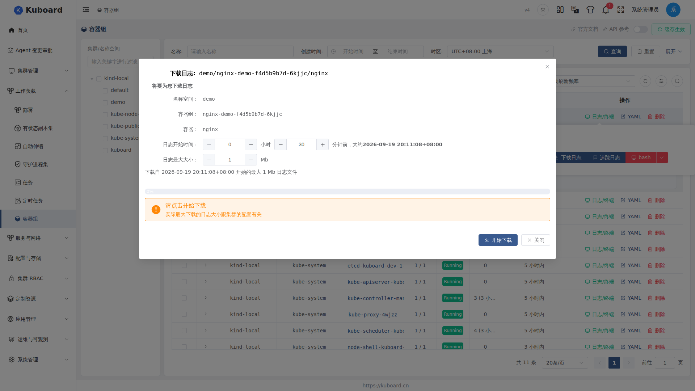

# 日志查看 Logs

日志查看在浏览器中实时读取 Pod 容器输出到 stdout/stderr 的内容（语义等价于 `kubectl logs -f`），无需安装 kubectl 客户端，也不占用服务器磁盘。你可以跟随最新输出、暂停滚动翻看历史、在已加载的日志中查找关键词，也可以把某个时间窗口内的历史日志按大小上限下载为 `.log` 文件。

查看与下载日志需要 `pods/log get` 权限（对应 Kuboard 角色权限点「查看日志」）；无权限时相关按钮不显示，或打开后提示没有权限。

## 打开日志

**入口（任一即可）**

- **Pod 列表页**：点击 Pod 行内 **日志/终端**，在弹出层中选择目标容器，点击 **追踪日志**；
- **Pod 详情页**：在[容器组详情页](../guide/workload/pods)的容器卡片底部点击 **追踪日志**；
- **工作负载列表页**：在 Deployment / StatefulSet / DaemonSet 等列表点击行内 **日志/终端**，弹出「请选择容器组/容器」窗口——与 Pod 入口不同，这里需要先**展开某个实例 Pod**，再选择其中的容器，点击 **追踪日志**；
- **终端**：在[终端](./terminal)中右键 → **查看日志**，在新窗口打开当前容器的日志页（沿用终端当前字符编码）。

点击后，Kuboard 在新标签页打开日志页面并自动建立连接，标题显示 `集群 / 名称空间 / 容器组 日志`，标题右侧显示连接状态（正在连接 / 已连接 / 已断开）。连接成功后即开始输出日志。

<!-- screenshot-todo: 工作负载「日志/终端」容器选择弹窗：Pod 展开 + 容器行（追踪日志/下载日志/文件浏览器/bash） -->

### 界面速览

| 区域 | 内容 |
| --- | --- |
| 顶部标题栏 | 集群 / 名称空间 / 容器组、连接状态、字符编码、查找、字体大小、主题 |
| 日志区域 | 实时滚动的日志内容 |
| 底部工具栏 | 清空日志、暂停滚动 / 恢复滚动；暂停期间显示「缓存日志: N 行」与每次显示行数选择（10/20/50/100） |

## 查看实时日志

打开日志页即处于**跟随（follow）**模式：容器新产生的日志持续追加显示，并自动滚动到底部。

| 操作 | 做法 | 看到什么结果 |
| --- | --- | --- |
| 暂停滚动 | 点击 **暂停滚动** | 新日志不再上屏，转入内存缓存；底部出现「缓存日志: N 行」 |
| 翻看缓存 | 暂停后按 `TAB` 键 | 每次显示 N 行缓存（10/20/50/100 可切换），可反复按 `TAB` 逐批翻看 |
| 恢复跟随 | 点击 **恢复滚动** | 一次性回放全部缓存日志，随后继续实时跟随 |
| 清空日志 | 点击 **清空日志** 并确认 | 只清空当前显示内容，连接与后续输出不受影响 |

::: tip 与 kubectl 对照
| 操作 | Kuboard | kubectl |
| --- | --- | --- |
| 跟随最新日志 | 打开即跟随 | `kubectl logs -f <pod> -c <容器>` |
| 初始显示行数 | 最近 500 行（可配置，见下） | `kubectl logs --tail=500` |
:::

**初始行数（tail）**：日志页默认只取最近 500 行作为起始内容（`tailLines` 语义），再开始实时追加。该数值随你的终端配置一起保存，管理员也可在系统配置的终端配置中设定全局默认值。

::: warning 缓存上限 10000 行
暂停滚动期间，缓存最多保留 10000 行。达到上限后连接被自动断开并提示，但已缓存的内容仍可继续翻看；需要继续跟随最新日志时，刷新页面重新连接即可。
:::

## 在日志中查找

点击顶部 **查找** 按钮，或按 `Ctrl+Shift+F`（macOS `⌘+Shift+F`）打开查找栏。输入关键词后回车或点击 **查找**，命中内容被高亮选中；未命中时提示「未找到」。

| 选项 | 说明 |
| --- | --- |
| 向后 / 向前 | 从当前位置向历史方向或向最新方向查找 |
| 正则表达式 | 按正则匹配 |
| 大小写敏感 | 区分大小写 |
| 完整单词 | 只匹配完整单词 |

查找只作用于**当前页面已加载**的日志内容，不向集群发起额外请求；日志量较大时可先暂停滚动，再在缓存内容中查找。

## 字符编码 charset

日志中出现中文乱码时，点击顶部 **字符编码**（按钮显示当前编码，默认 UTF-8），切换为 **GB18030 / GB2312 / GBK**，也可直接输入其他编码；切换后页面自动重新加载并重新连接。

Kuboard 按「集群/名称空间/容器组/容器」分别记忆最近使用的编码（保留约一个月），与[终端](./terminal)、[文件浏览器](./file-browser)共用这套设置。

::: tip 非 UTF-8 编码的限制
Kubernetes 的 pod 日志接口在非 UTF-8 编码模式下会先转换编码，因此切换到非 UTF-8 后，日志中的中文可能无法正常显示——这是 API server 的行为，Kuboard 无法在页面端修复。
:::

## 下载日志

日志页不需要保持打开即可下载。从上述任意入口点击 **下载日志**，弹出下载窗口（标题显示 `下载日志: 名称空间/容器组/容器`）。

**操作步骤**

1. 设置 **日志开始时间**：填写小时与分钟（默认 30 分钟前），只下载该时间点之后产生的日志；
2. 设置 **日志最大大小**：1 – 50 Mb（默认 1 Mb），达到上限即停止拉取；
3. 点击 **开始下载**。

**交互流程**：点击后弹窗提示「Kubernetes 正在为您查找日志内容，请稍候…」→「正在传输，请稍候…」，同时显示进度条；完成后浏览器自动保存文件。

| 可能的结果 | 含义 |
| --- | --- |
| 已下载成功 | 日志完整导出，提示文件名为 `名称空间_容器组_容器.log` |
| 只下载到一部分 | 日志总量超出所选上限，只保存了前 N Mb |
| 下载出错 | 集群返回错误（如权限不足、容器不存在），弹窗展示错误信息 |
| 放弃下载 | 点击 **放弃下载** 取消传输，已获取内容不保存 |

下载得到的文件为纯文本，文件名格式：`{名称空间}_{容器组名称}_{容器名称}.log`。

::: warning 实际大小可能与设置不一致
设置的最大大小会传给 Kubernetes API server，而 API server 对单次日志拉取有自己的限制（与集群配置有关）。因此实际下载到的文件可能小于你设置的上限，并提示「只下载到一部分」——需要更完整的日志时，可将开始时间与上限调大后重试，或到容器内直接读取日志文件。
:::

## 限制与常见问题

| 情况 | 现象与处理 |
| --- | --- |
| 连接意外断开（网络抖动 / 服务重启） | 状态显示「已断开」，日志页不会自动重连；刷新页面重新建立连接即可 |
| 无 `pods/log get` 权限 | 相关按钮不显示或打开后提示无权限；请联系管理员授权 |
| 容器组已被删除或重启 | 连接断开或提示容器不存在；返回列表重新进入 |
| 日志量极大 | 页面缓存与浏览器内存占用随之增大；建议暂停滚动并按需查找，或改用「下载日志」保存后离线分析 |
| 需要检查容器内文件而非标准输出 | 日志查看只能读取 stdout/stderr；容器内文件请使用[文件浏览器](./file-browser)或[终端](./terminal) |

::: tip 实现说明
日志查看页面本质是到 Kubernetes pod 日志接口的 WebSocket 长连接（参数含跟随、初始行数、容器名、字符编码）；下载功能以开始时间 + 大小上限向同一接口拉取历史快照。普通使用者无需关心这些细节。
:::