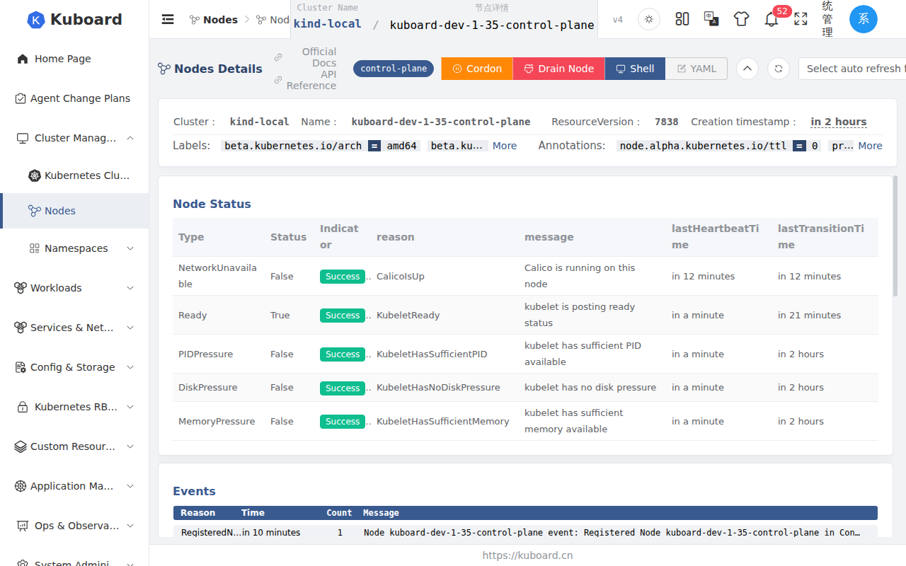
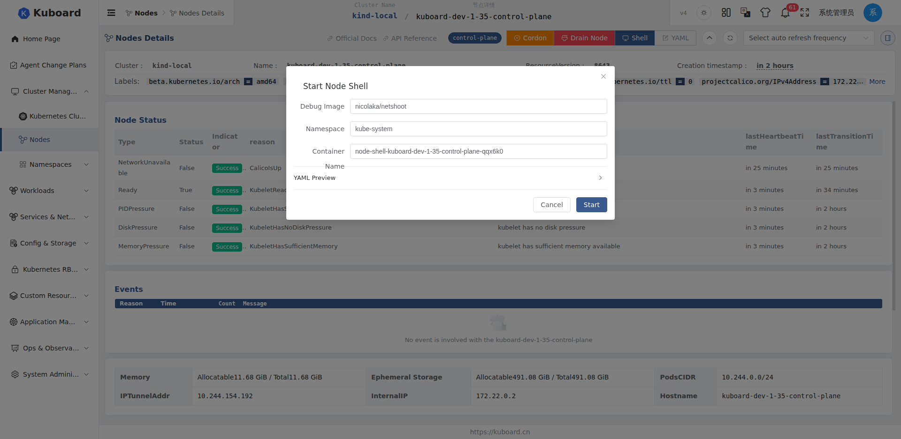
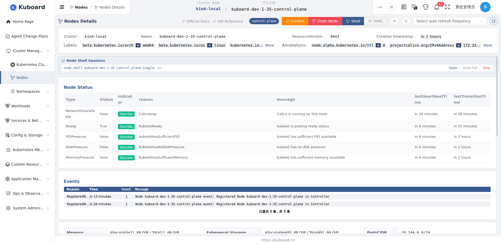

# 节点终端 NodeShell

节点终端（NodeShell）让你无需 SSH、无需安装 kubectl，直接在浏览器里进入某个节点的操作系统执行命令——查看进程、检查磁盘与网络、修改文件等。

**适用对象**：需要排查节点问题的集群运维与平台工程师。如果你只是想进入正在运行的 **Pod** 内部调试，请见[调试容器 Debug Container](./debug-container)。

## 前提条件

- 目标节点处于 **Ready** 状态，账号拥有更新节点的权限（工具栏才会显示 **Shell** 按钮），并在调试命名空间（默认 `kube-system`）中有创建 / 删除 Pod 的权限，详见[节点与权限](../guide/cluster-resources/nodes)；
- 集群能拉取调试镜像（默认 `nicolaka/netshoot`），离线环境请改用内网镜像仓库中的镜像，见[全局配置](#全局配置)。

## 启动节点终端

1. 进入集群，在左侧导航 **节点** 中点击目标节点，在详情页右上角工具栏点击 **Shell** 按钮；
2. 在 **启动节点 Shell** 对话框中按需修改字段（一般保持默认即可），点击 **确认启动**。

确认后对话框关闭，节点详情页顶部出现 **节点 Shell 会话** 横幅。会话先显示 **Starting**——后台正在目标节点上创建调试容器，首次拉取镜像可能较慢——就绪后变为 **Running**，即可点击 **打开终端**。

### 对话框字段

| 字段 | 说明 | 默认值 |
| --- | --- | --- |
| 调试镜像（Debug Image） | 创建调试容器使用的镜像 | `nicolaka/netshoot` |
| 命名空间（Namespace） | 调试容器所在命名空间，必须存在且有创建权限 | `kube-system` |
| 容器名称（Container Name） | 一般无需修改 | 自动生成 `node-shell-<节点名>-<随机后缀>` |

## 打开终端执行命令

在 **节点 Shell 会话** 横幅中点击会话项右侧的 **打开终端**（状态为 Running 时可用），浏览器新标签页打开交互式终端，复制粘贴、查找、命令历史等操作与[容器终端](./terminal)一致。

终端内即调试容器，操作系统与节点相同：调试容器以特权模式运行并共享主机的进程 / 网络命名空间，主机根目录挂载在 `/host`，命令效果近似于直接操作节点系统。常见操作：

| 你想做什么 | 在终端中执行 |
| --- | --- |
| 查看节点文件系统 | `ls /host`、`cat /host/etc/...` |
| 查看主机进程 | `ps aux` |
| 查看磁盘与挂载 | `df -h /host` |
| 网络连通性排查 | `ping`、`curl`、`nc` |
| 修改节点上的文件 | `vi /host/etc/...` |

## 停止会话与生命周期

- **手动停止**：在横幅中点击会话项的 **停止** 并确认后，调试容器被删除，会话立即结束；
- **查看 Pod**：点击 **查看 Pod** 跳转到调试 Pod 详情页，可查看事件与日志；
- **到期自动清理**：会话默认最长存活 **3600 秒（1 小时）**，到期自动清理，剩余时间显示在横幅的 **存活时间**；
- **刷新后仍可管理**：会话在集群中以后台 Pod 形式存在，刷新页面后横幅仍会恢复列出活跃会话，可继续管理。

## 全局配置

管理员在 **系统配置 → 节点 Shell** 中调整适用于整个 Kuboard 实例的默认值（仅对新建会话生效）：

| 配置项 | 说明 | 默认值 |
| --- | --- | --- |
| 镜像（Image） | 调试容器镜像 | `nicolaka/netshoot` |
| 启动命令（Command） | 容器启动命令，保持容器存活以便进入 | `sleep infinity` |
| 命名空间（Namespace） | 调试容器所在命名空间 | `kube-system` |
| 会话时长（秒，TTL） | 会话最大存活时长 | `3600` |
| 资源限制（Requests / Limits） | CPU / 内存请求与限制 | requests `100m` / `128Mi`；limits `500m` / `512Mi` |

## 启动失败排查

| 现象 | 错误码 | 常见原因 | 处理 |
| --- | --- | --- | --- |
| 提示节点 NotReady 或不存在 | 40001 | 节点处于 NotReady / 已移除 | 待节点恢复 Ready 后重试 |
| 长时间停留在 Starting 后失败 | 50001 | 调试容器创建超时（首次拉取镜像较慢） | 改用内网可快速拉取、且含所需调试工具的镜像后重试 |
| 镜像拉取失败（ImagePullBackOff / ErrImagePull） | 50002 | 镜像不在集群可达的仓库，或仓库需要认证 | 改用可达仓库中的镜像，或先在节点上手动拉取验证 |
| 无权限提示 | — | 缺少创建 / 删除 Pod 或更新节点权限 | 联系管理员调整权限 |

::: warning 特权容器有风险
调试容器以特权模式运行并挂载主机根目录，持有等同于节点的系统权限。请只授予可信人员使用节点终端，排障结束后及时 **停止** 会话。
:::
