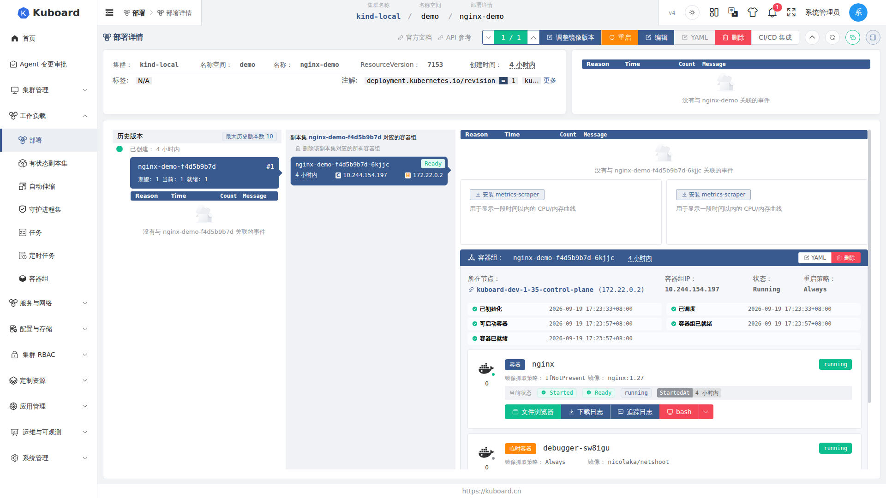

# 实时事件推送（SSE）

登录 Kuboard 后，浏览器与服务器保持一条长连接，服务器把集群资源变更、K8s 事件、会话状态等实时推送到界面，对应区域自动刷新或闪烁提醒。

## 界面上的实时表现

资源详情页等页面的工具栏上有一个**连接图标按钮**（刷新按钮旁），颜色反映连接状态：

- **绿色** = 已连接，**橙色** = 正在关闭，**红色** = 已断开；
- 收到新事件时图标闪烁约 1.5 秒，提示「有新事件」；
- 点击图标打开**事件监听面板**。

<!-- screenshot-todo: 点击 SSE 连接图标后打开的"事件监听"面板（含开关、监听状态、总事件数/相关事件数、最近 10 条事件列表） -->

| 面板内容 | 说明 |
| --- | --- |
| 监听状态 | 正在连接 / 已连接 / 正在关闭 / 已关闭 |
| 事件监听开关 | 关闭后不再接收推送，页面退回手动/定时刷新 |
| 监听总事件数 | 当前连接收到的所有事件数量 |
| 相关事件数 | 与当前页面订阅主题相关的、已消费的事件数量 |
| 最新事件列表 | 最近 10 条相关事件，显示资源类型（Kind）、名称与 ADDED / MODIFIED / DELETED 标识 |

除面板外，SSE 还驱动着以下几种「不用点刷新」的体验：

| 场景 | 界面表现 |
| --- | --- |
| 资源详情页 | 被查看的资源发生变更（含其他终端 / kubectl 操作）时，页面自动重新加载数据 |
| 资源详情页的「事件」卡片 | 关联的 K8s Event 新增时列表自动刷新，新事件行高亮闪烁约 6 秒 |
| 节点终端 NodeShell | 调试会话状态从 **Starting** 自动变为 **Running**（容器就绪），失败时自动变为失败态 |
| AI 变更审批 | 审批列表中的变更计划状态（审批、拒绝、应用进度等）变化时实时刷新 |

<!-- screenshot-todo: 资源详情页"事件"卡片中新事件高亮闪烁的效果，或节点终端会话状态实时变化 -->

## 你可以订阅哪些实时事件

::: tip 主题格式
每条推送都挂在某个**主题（topic）**下，主题由五段构成：`作用域 # 集群 # 名称空间 # API 组 # 资源类型`。列表页/详情页会按你正在浏览的资源自动订阅对应主题，无需手工配置。
:::

| 主题特征 | 主题 | 触发时机 | 界面影响 |
| --- | --- | --- | --- |
| 集群作用域资源（Node、ClusterRole 等） | `cluster/<集群>#<kind>` | 集群级资源被创建/修改/删除 | 对应列表/详情页自动刷新 |
| 名称空间作用域资源（Pod、Deployment、Service、ConfigMap 等） | `namespace/<集群>/<名称空间>#<kind>` | 该命名空间内资源变更 | 对应页面自动刷新 |
| K8s Event | `namespace/<集群>/<名称空间>#Event` | 与被查看对象关联的事件新增 | 详情页「事件」卡片自动刷新并闪烁提示 |
| 节点终端会话 | `cluster/<集群>#node-shell` | 调试会话创建、就绪、失败、被清理 | 节点终端横幅自动更新状态 |
| AI 变更审批 | `kuboard#default#change-plan` | 变更计划的审批/应用进度变化 | 变更审批列表实时刷新 |

::: tip K8s 事件铃铛
右上角顶部的**消息铃铛**中的「K8s 事件」列表目前采用**定时轮询**（约每 20 秒拉取一次 Warning 事件），并非 SSE 实时推送；需要实时的 Warning 事件提醒时，可关注对应资源详情页中实时刷新的「事件」卡片。
:::

## 断线、重连与反向代理

长连接偶尔会断开（网络抖动、服务器重启、浏览器休眠等），Kuboard 会**自动重连**，无需干预。以下两点容易踩坑：

- **反向代理必须开启 WebSocket**：通过 Nginx 等反向代理访问 Kuboard 时，代理配置需为 WebSocket 端点开启升级（Upgrade / Connection 头），否则连接会一直卡在「正在连接」，详见 [反向代理配置](../install/reverse-proxy)；
- **登录令牌过期**：长连接建立后，前端会定期更新令牌，避免页面停留过久后连接因鉴权失效而断开。

::: warning 高可用部署时的注意点
多实例部署时，每个实例各维护自己的浏览器连接。使用 Redis 缓存的部署会自动切换到 **Redis 发布/订阅（pub/sub）广播**：任一实例收到集群变更后写入 Redis 频道，其他实例订阅后推送给各自连接的浏览器，保证所有用户看到的数据一致。单机部署（默认内存缓存）在本进程内直接分发，无需额外配置。

详见 [安装配置](../install/) 与 [高可用部署](../install/ha)。
:::