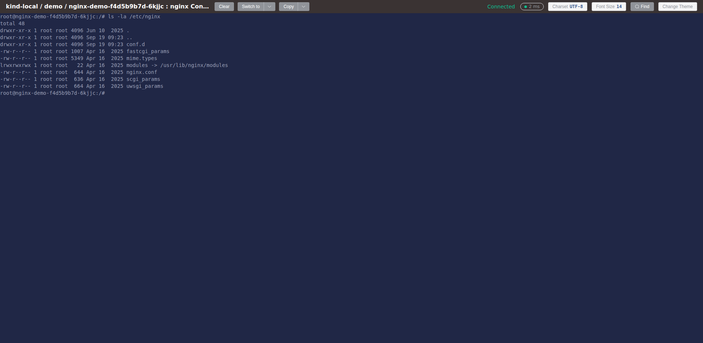
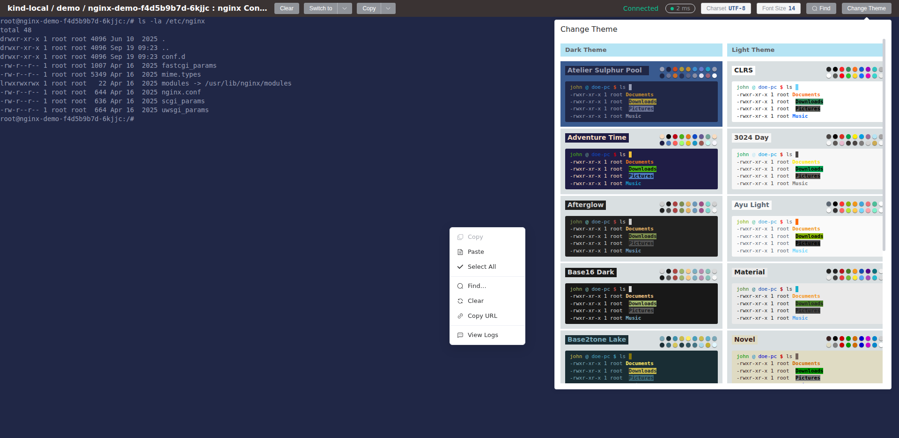
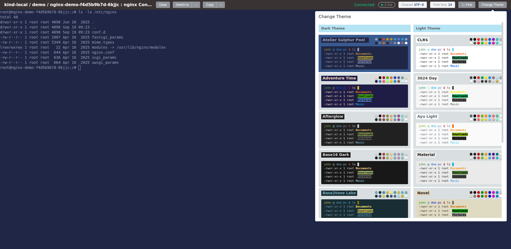

# 终端 Terminal

终端（Terminal）让你在浏览器里直接进入 Pod 容器内部执行命令，无需安装 SSH 或 `kubectl`。你在终端中的每一次操作都会被记录到[审计日志](./audit-log)；查看容器运行日志请见[日志查看](./logs)。

## 打开终端

**入口（任一即可）**

- **列表页**：在 Pod 列表页行内点击 **日志/终端**，弹出容器选择框后选中目标容器，点击 **终端**；
- **详情页**：在 [Pod 详情页](../guide/workload/pods) 的容器卡片底部点击 **终端** 按钮（默认 `bash`，可切换 `sh` / `cmd` / `powershell`）；
- **临时容器**：通过[调试容器 Debug Container](./debug-container) 注入的临时容器同样可以打开终端。

**权限与前提**

- 需要 `pods/exec create` 权限，无权时点击终端会提示"没有权限访问该终端"；
- 目标容器必须处于已启动（Running）状态。

点击 **终端** 后，Kuboard 在新窗口打开终端并自动连接，顶部工具栏显示 `集群 / 名称空间 / 容器组 : 容器` 与连接状态；首次打开会显示两行欢迎提示（仅一次），随后出现命令行提示符即可输入命令。

### 界面速览

| 区域 | 内容 |
| --- | --- |
| 工具栏左侧 | 标题、清空屏幕、切换 Shell、复制（下拉含粘贴/全选）、立即重连（断开时出现） |
| 工具栏右侧 | 连接状态、延迟、字符编码、终端设置、查找、修改主题 |
| 终端区域 | 交互式命令行；任意位置右键弹出快捷菜单 |

## 常用操作

### 切换 Shell（bash / sh / cmd / powershell）

点击工具栏 **切换** 按钮，在菜单中选择目标 Shell。Kuboard 自动重连并以新 Shell 建立会话，执行后终端内容清空、出现新 Shell 的命令行提示符。Linux 容器默认 **bash**（容器内没有 bash 时可选 **sh**），Windows 容器使用 **cmd** / **powershell**。

### 复制、粘贴与全选

选中内容后按 **`Ctrl+Shift+C`** 复制、**`Ctrl+Shift+V`** 粘贴（macOS 为 **`⌘C`** / **`⌘V`**）；快捷键完整清单见文末。

::: tip 为什么复制不用 Ctrl+C
`Ctrl+C` 在终端中用于中断当前命令（向进程发送 SIGINT 信号），所以复制必须带 `Shift`（macOS 用 `⌘C`）。未选中内容时按复制快捷键，Kuboard 会提示正确的按键。
:::

右键点击终端区域弹出快捷菜单：**复制 / 粘贴 / 全选 / 查找… / 清空屏幕 / 复制 URL / 查看日志**（连接断开时还会出现 **立即重连**；**查看日志** 在新窗口打开当前容器的实时日志，详见[日志查看](./logs)）。

### 在终端内查找

点击工具栏 **查找** 按钮，或按 `Ctrl+Shift+F`（macOS `⌘+Shift+F`）打开查找栏；输入字符串回车，命中内容被高亮选中，未命中时提示"未找到"。查找栏提供图标切换的匹配选项：**向后 / 向前**、**正则表达式**、**大小写敏感**、**完整单词**。查找只作用于终端当前显示的内容，不向容器或后端发起请求。

### 清空屏幕

点击工具栏 **清空屏幕** 并确认即清空当前显示内容；不会中断容器内正在运行的进程或命令，也不会删除命令历史。

### 同时打开多个终端 / 复制 URL

终端以独立页面打开，可在多个浏览器标签页同时打开多个终端，分别连接不同容器或集群（连接数过多时会提示"当前集群打开的终端连接过多"，关闭部分终端后重试）。

右键菜单 **复制 URL** 会把当前终端链接（含容器与字符编码参数）复制到剪贴板：发给同事后，对方在浏览器打开即可进入同一容器的终端（对方仍需 `pods/exec` 权限），适合协同排障。

## 个性化设置

终端的外观与行为设置保存在你的用户账户中，跨浏览器、跨设备生效，修改后立即应用。生效优先级：**用户设置 > 管理员全局配置 > 内置默认值**（管理员可在 **系统配置** 的"终端主题配置"中设置全局默认字体大小、行间距与深浅主题）。

### 字体与显示（终端设置）

点击工具栏 **终端设置**（按钮上显示当前字号），弹出面板可调整：

| 设置项 | 可选值 |
| --- | --- |
| 字体大小 | 12 – 20（默认 14） |
| 行间距 | 1.0 – 2.0，步进 0.1（默认 1.2） |
| 字体家族 | 系统默认 / JetBrains Mono / Fira Code / Cascadia Code / Menlo / Consolas / Source Code Pro |
| 光标样式 | 方块 / 下划线 / 竖线 |
| 光标闪烁 | 开 / 关 |
| WebGL 渲染 | 开 / 关（个别显卡或远程桌面下渲染异常时关闭） |

### 主题

点击工具栏 **修改主题**，弹层分 **深色主题** 与 **浅色主题** 两列，每套主题以预览卡片展示；点击某套主题后确认，终端即重绘为新配色（重绘会清空当前输入内容）。

- 深色主题：Atelier Sulphur Pool（默认）、Adventure Time、Afterglow、Base16 Dark、Base2tone Lake、Blazer、Pandora；
- 浅色主题：CLRS、3024 Day、Ayu Light、Material、Novel、Pencil Light、Rose Pine Dawn、Terminal Basic。

### 字符编码

终端输出中文乱码时，点击工具栏 **字符编码**（按钮上显示当前编码，默认 UTF-8），切换为 **GB18030 / GB2312 / GBK**，也可直接输入其他编码；切换后终端页面自动重新加载。Kuboard 按"集群/名称空间/容器组/容器"分别记忆最近使用的编码（保留约一个月），[文件浏览器](./file-browser) 与终端共用这套设置。

::: tip 欢迎横幅与审计提示
首次进入终端时，终端内会显示"欢迎使用 Kuboard"与"您在此终端中的操作将被记录到审计日志"两行提示（仅显示一次）。若管理员开启了终端审计遮罩，首次进入会先出现全屏提示，点击"我知道了"后进入终端。
:::

## 连接状态、断线重连与错误处理

工具栏显示当前连接状态：**正在连接 / 已连接 / 正在关闭 / 已断开**；右侧的**延迟（RTT）** 指示终端往返时延（约每 10 秒探测一次），圆点颜色：绿色 < 200ms、黄色 < 800ms、红色 ≥ 800ms。

网络抖动导致连接中断时，Kuboard 弹窗询问：

| 选项 | 行为 |
| --- | --- |
| 重新连接 | 本次重连，并记住"总是自动重连"，之后中断自动重连 |
| 不再自动重连 | 记住选择，之后中断保持断开，可点击工具栏 **立即重连** |
| 关闭弹窗 | 仅本次不重连 |

自动重连最多尝试 5 次，间隔 5s、15s、45s、45s、45s，期间工具栏显示"正在重连（n/5）…"；5 次仍失败后提示"重连失败，点击重试"。

### 常见错误

| 提示 | 错误码 | 处理 |
| --- | --- | --- |
| 没有权限访问该终端 | 401 / 403 | 刷新页面重新登录；仍失败则联系管理员授予 `pods/exec` 权限 |
| 容器组或容器不存在 | 404 | Pod 可能已被删除或重启，返回检查后重新进入 |
| 当前集群打开的终端连接过多 | 409 | 关闭其他终端后重试 |
| 后端不可达 | 502 | 检查反向代理与 apiserver 连通性，参见[反向代理配置](../install/reverse-proxy) |
| 连接异常断开 | 1006 | 网络抖动或服务重启所致，点击 **立即重连** |

## 命令历史

终端按"集群/名称空间/容器组/容器"分别记住你执行过的命令，保存在本机浏览器中，关闭页面或重启浏览器后仍然有效：

- **↑ / ↓**：上翻 / 下翻历史命令；
- **Ctrl+R**：反向查找包含当前输入内容的最近命令；
- 含 `password=`、`token=`、`api_key=` 等敏感字段的命令不会写入历史；
- 每个作用域最多保留 500 条。

::: warning 谨慎输入敏感信息
命令历史仅保存在当前浏览器，换电脑或浏览器不会跟随；敏感字段虽会自动过滤，仍请不要在终端中明文输入密码、令牌等敏感信息。
:::

## 快捷键清单

| 操作 | Windows / Linux | macOS |
| --- | --- | --- |
| 复制 | `Ctrl+Shift+C` | `⌘C` |
| 粘贴 | `Ctrl+Shift+V` | `⌘V` |
| 终端内查找 | `Ctrl+Shift+F` | `⌘+Shift+F` |
| 中断当前命令 | `Ctrl+C` | `Ctrl+C` |
| 上 / 下翻命令历史 | `↑` / `↓` | `↑` / `↓` |
| 反向搜索命令历史 | `Ctrl+R` | —（⌘R 为浏览器刷新） |

::: tip 相关能力
需要直接在节点操作系统内执行命令，请参见 [NodeShell](./nodeshell)；需要为运行中的 Pod 注入临时调试容器，请参见[调试容器](./debug-container)。
:::
