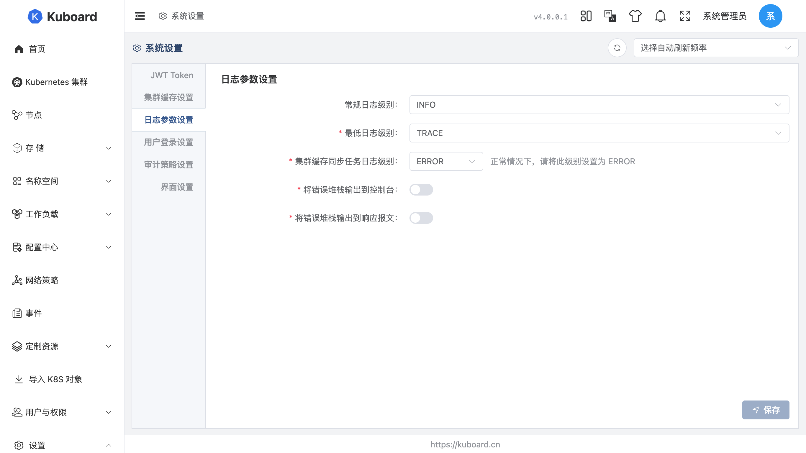

# Kuboard v4 环境变量

部署 Kuboard v4 时，可配置的环境变量包括数据库连接、缓存、时区与端口。下文按用途列出全部变量及默认值。

::: tip 在哪里设置
这些环境变量写在部署 Kuboard 的 `docker-compose.yaml` 或 Kubernetes Deployment 的 `env` 字段中，部署步骤见 [快速开始](../install/quickstart)。
:::

所有变量均可省略，未设置时使用下表默认值；只有多副本（高可用）部署才需要配置 `KUBOARD_CACHE_*` 缓存变量。

## 数据库连接参数

| 环境变量 | 默认值 | 说明 |
| --- | --- | --- |
| `DB_DRIVER` | `com.mysql.cj.jdbc.Driver` | 数据库驱动，按所连数据库选择，见下方示例 |
| `DB_URL` | `jdbc:mysql://localhost:3306/kuboard` | 数据库连接串，按所选数据库编写，见下方示例 |
| `DB_USERNAME` | `kuboard` | 数据库用户名 |
| `DB_PASSWORD` | `Kuboard123` | 数据库密码 |

`DB_DRIVER` 与 `DB_URL` 按数据库类型填写：

- MySQL：驱动 `com.mysql.cj.jdbc.Driver`，连接串 `jdbc:mysql://10.99.0.8:3306/kuboard?serverTimezone=Asia/Shanghai`
- MariaDB：驱动 `org.mariadb.jdbc.Driver`，连接串 `jdbc:mariadb://10.99.0.8:3306/kuboard?&timezone=Asia/Shanghai`
- OpenGauss：驱动 `org.postgresql.Driver`，连接串 `jdbc:postgresql://localhost:5432/kuboard?currentSchema=kuboard&characterEncoding=UTF8`

## 高可用缓存参数

单副本部署无需配置本组变量；多副本（高可用）部署时，将 `KUBOARD_CACHE_PROVIDER` 设为 `redis`，并填写下方 Redis 连接信息。

| 环境变量 | 默认值 | 说明 |
| --- | --- | --- |
| `KUBOARD_CACHE_PROVIDER` | `caffeine` | 缓存提供方式：`caffeine` 内存缓存（仅单副本模式），`redis` 分布式缓存（多副本高可用） |
| `KUBOARD_CACHE_REDIS_MODE` | `standalone` | Redis 连接模式：`standalone`、`sentinel` 或 `cluster` |
| `KUBOARD_CACHE_REDIS_NODES` | `localhost:6379` | Redis 节点地址，多节点用逗号分隔，各模式示例见下方 |
| `KUBOARD_CACHE_REDIS_SENTINEL_MASTER` | `master` | Sentinel 模式下的 master 名称 |
| `KUBOARD_CACHE_REDIS_PASSWORD` | 空 | 连接 Redis 的密码 |
| `KUBOARD_CACHE_REDIS_DATABASE` | `0` | Redis 数据库编号 |

`KUBOARD_CACHE_REDIS_NODES` 各模式写法示例：

- `standalone`：`10.99.0.8:6379`
- `sentinel`：`10.99.0.10:6379,10.99.0.11:6379,10.99.0.12:6379`
- `cluster`：`10.99.0.20:6379,10.99.0.21:6379,10.99.0.22:6379`

## 其他参数

| 环境变量 | 默认值 | 说明 |
| --- | --- | --- |
| `TZ` | `Asia/Shanghai` | Kuboard 使用的时区 |
| `SERVER_PORT` | `80` | 容器内服务端口；本地源码运行默认 `9090`，生产环境对外端口由 docker / nginx 决定（默认暴露 `80`） |
| `KUBOARD_SWAGGER_ENABLED` | `true` | 是否开启 Swagger UI 接口文档，设为 `false` 可关闭（访问方式见 [OpenAPI 接口文档](./api)） |
| `KUBOARD_SPRING_BOOT_ADMIN_ENABLED` | `false` | 是否启用 Spring Boot Admin 监控页面 |
| `SERVER_MGMT_PORT` | `9091` | Spring Boot 管理端点端口，一般无需修改 |

## 排障

遇到启动失败、接口报错、数据不同步等问题时，按本节约三种方式排查：查看日志输出位置、调整日志级别、按请求 ID 定位单次请求。

### 日志输出位置

Kuboard 日志输出到两个位置：

| 位置 | 说明 |
| --- | --- |
| 控制台（全量日志） | `docker logs kuboard` 查看已有日志；`docker logs -f kuboard` 持续跟踪 |
| 宿主目录 `kuboard-log/<主机名>/`（容器内 `/app/logs/<主机名>/`） | 按模块分文件，见下表 |

| 文件 | 内容 |
| --- | --- |
| `api/kuboard-log.log` | 接口调用日志 |
| `audit/kuboard-audit.log` | 审计日志（需在 设置 → 系统设置 启用） |
| `sync/<集群ID>.log` | 集群缓存同步日志 |
| `health.log` | 集群连接状态日志 |
| `main.log` | 启动日志 |

### 设置日志级别

在 Kuboard 界面 **设置 → 系统设置 → 日志参数设置** 中调整日志级别，界面见下图：



### 按请求 ID 定位单次请求日志

生产环境日志量大，难以快速定位单个请求时，可为单个请求单独提高日志级别：请求报文头加 `kb-log-level`（可选 `ERROR`/`WARN`/`INFO`/`DEBUG`/`TRACE`），响应报文头返回 `kb-request-id`，用该 ID 过滤出本次请求的全部日志：

```sh
curl -v 'http://<kuboard 地址>/api/cluster.kuboard.cn/v4/cluster?pageNum=1&pageSize=20' \
  -H 'kb-log-level: TRACE'
```
响应报文头中的 `kb-request-id`（示例 `1qZPF6iNMvC`）即本次请求的日志标识，按该 ID 过滤日志：
```sh
docker logs kuboard | grep 1qZPF6iNMvC
```
::: tip 容器组日志界面
容器组日志查看界面与命令行终端界面也支持临时调整日志级别，在 URL 上添加请求参数 `kb_log_level`（取值同上）。
:::
日志相关配置（审计开关等）见 [审计日志](../ops/audit-log)。
