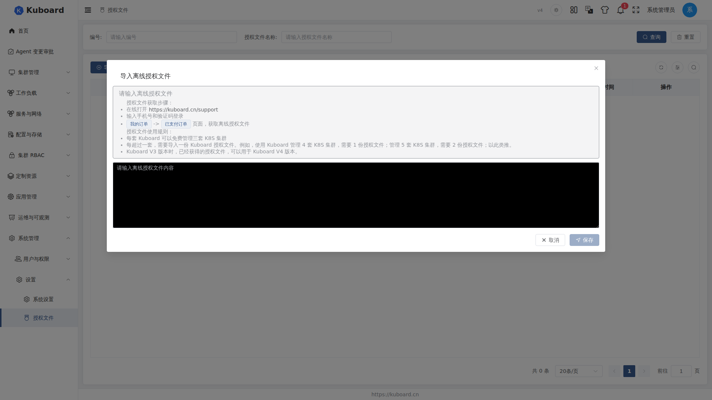
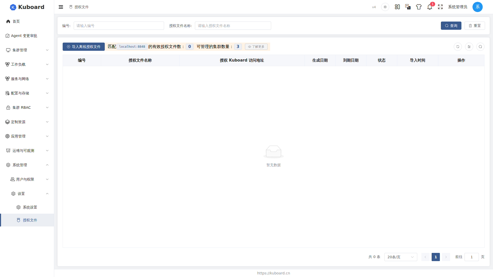
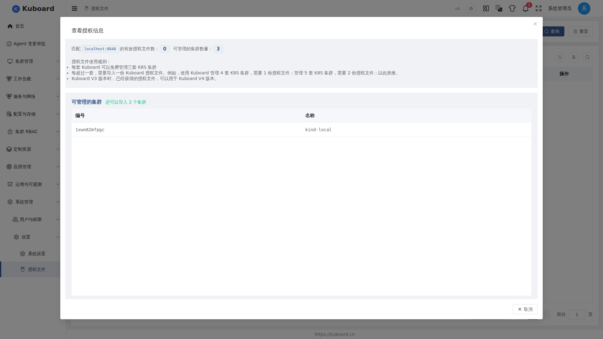

# License 安装

管理超过 3 套 Kubernetes 集群需要导入授权文件（License File）。本文介绍如何获取、导入授权文件，并验证授权是否生效。

## 授权规则

| 场景 | 需要的授权文件 |
| --- | --- |
| 管理 ≤ 3 套集群 | 无需授权文件 |
| 管理 4 套集群 | 1 份 |
| 管理 5 套集群 | 2 份 |
| 每多管理 1 套集群 | 增加 1 份 |

- 授权文件按「授权 Kuboard 访问地址」绑定：列表顶部横幅只统计与当前访问地址匹配的有效授权文件；
- Kuboard V3 版本已获得的授权文件，可直接用于 V4 版本。

## 获取授权文件

1. 打开 [Kuboard 授权与支持](./index) 页面，使用手机号 + 验证码登录；
2. 进入「我的订单」→「已支付订单」页面；
3. 点击「获取离线授权文件」，复制完整的授权文件内容。

授权文件是一段 YAML 格式的文本（含授权内容与数字签名），整段粘贴即可，无需手工修改。

## 导入授权文件

::: warning 权限要求
「授权文件」菜单（系统管理 → 设置 → 授权文件）需要账号具备 Kuboard 作用域下 `license.kuboard.cn` 资源组的权限；普通用户默认看不到该菜单。
:::

1. 使用具备权限的账号登录 Kuboard；
2. 进入「系统管理」→「设置」→「授权文件」，打开授权文件列表页；
3. 点击顶部「导入离线授权文件」，在弹出的对话框中粘贴授权文件内容，点击「保存」；
4. 校验通过 → 提示「已成功将授权安装到此 Kuboard。将要刷新页面，刷新后，Kuboard 授权将生效」，点击「确 定」，页面自动刷新后授权生效；
5. 校验失败 → 提示「授权文件不能通过校验」，请确认粘贴的是完整内容。

## 验证授权是否生效

列表顶部横幅展示：

- 「匹配 `<当前访问地址>` 的有效授权文件数：N」——N 为与当前地址匹配的有效授权文件数量；
- 「可管理的集群数量：N + 3」——有效授权文件数 + 3（免费额度）；
- 「了解更多」按钮——打开「授权信息」对话框，可查看「可管理的集群」列表与剩余可导入额度（「还可以导入 N 个集群」）。

列表中每行显示：ID、授权文件名称、授权 Kuboard 访问地址（附「匹配当前地址 / 不匹配当前地址」标签）、生成日期、到期日期、状态、导入时间。点击操作列的「查看」，可弹出「查看授权信息」对话框，展示功能特性、绑定的访问地址、授权生成/到期时间与授权状态。

## 授权状态说明

| 状态 | 含义 |
| --- | --- |
| valid（有效） | 校验通过，且当前时间在授权生效期内（生成日期 ~ 到期日期） |
| expired（已过期） | 超出授权有效期（早于生成日期或晚于到期日期） |
| invalid（无效） | 校验失败（内容被篡改、粘贴不完整等） |

「**匹配当前地址**」的授权文件计入顶部横幅计数并参与可管理集群数量计算；「**不匹配当前地址**」的不计入，从匹配的地址访问 Kuboard 时才生效。

## 删除授权文件

1. 在列表操作列点击「删除」；
2. 在确认框（提示「删除【授权文件名称】授权文件」）中确认 → 该授权文件从列表移除，顶部横幅计数与可管理集群数量相应减少。

## 常见问题

- **重复导入同一授权文件**：提示「授权文件 xxx 已存在，不能重复导入同一个授权文件」，无需重复导入；
- **导入成功后看不到变化**：导入成功会提示刷新页面，刷新后授权才生效；
- **V3 授权文件能否用于 V4**：可以，V3 已获得的授权文件可直接用于 V4；
- **集群数量达到上限**：对超出授权额度的集群执行操作时，Kuboard 会提示「缺少 License」，可一键跳转到授权文件页面；购买并导入更多授权文件即可解锁。