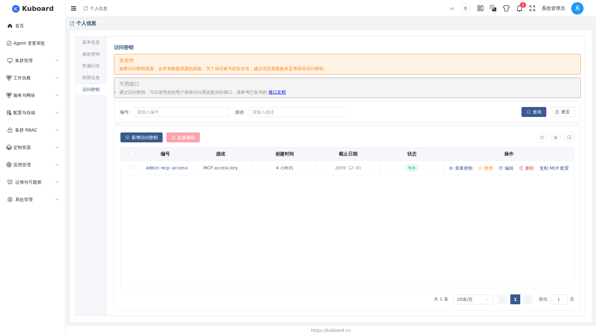
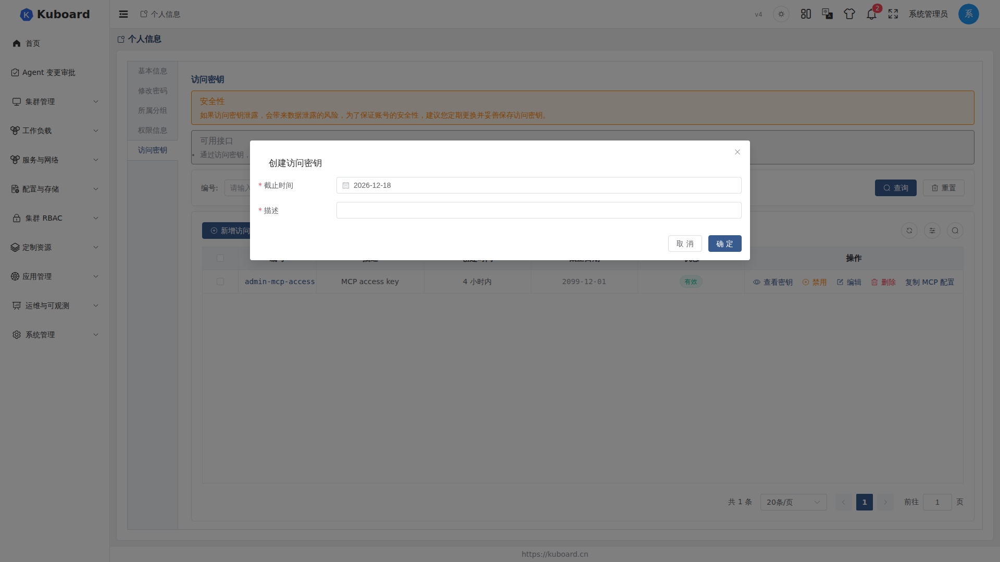

# Kuboard API 访问密钥（Access Key）

访问密钥（Access Key，AK）与保密密钥（Secret Key，SK）是一对 API 凭据，为脚本、CI、MCP 等程序化访问提供免登录认证。

::: tip 与登录密码的区别
登录密码用于 Web 登录，访问密钥用于**程序化访问**（API / MCP）。二者相互独立，可同时存在；密钥只影响程序访问，不影响 Web 登录。
:::

## 创建访问密钥

1. 点击右上角**用户头像** →「**访问密钥**」，进入密钥管理页（「个人信息」页的「访问密钥」页签是同一页面）。
2. 点击「**新增访问密钥**」，填写**描述**（必填，如 `ci-script`、`opencode-mcp`）与**截止时间**（必填，默认 90 天，可选一周至一年）。
3. 点击「**确定**」，密钥创建成功，出现在列表中。

列表展示**访问密钥编号**（AK，全局唯一）、**描述**、**创建时间**、**截止日期**（到期自动失效）与**状态**。




## 使用密钥调用 API

在 HTTP 请求头中添加 **`Kb-Access-Key`**，取值为 `<访问密钥编号>.<访问密钥>`（AK 与 SK 用英文句点拼接），即可代替登录态调用接口。验证密钥是否有效——查看当前用户信息：

```sh
curl -X GET \
  -H "content-type: application/json" \
  -H "Kb-Access-Key: <访问密钥编号>.<访问密钥>" \
  http://<kuboard地址>/api/login.kuboard.cn/v4/login-get-profile
```

返回当前用户的资料即说明密钥有效。更多可用接口见密钥管理页顶部的「可用接口」提示。

::: tip 另一种写法：Authorization: Bearer
也可使用 `Authorization: Bearer <AK>.<SK>` 请求头，格式相同。MCP Server 即以此方式鉴权，详见 [Kuboard MCP 接入](../mcp/)。
:::

## 一键复制 MCP 配置

在密钥列表点击「**复制 MCP 配置**」，在弹出的对话框中：

1. 选择要使用的**访问密钥**；
2. 选择目标 **Agent**（Claude Desktop、Cursor、VS Code、opencode、Claude Code、curl 等）；
3. 点击「**复制**」，得到可直接写入该客户端配置文件的 MCP Server 配置片段。

对话框会提示各客户端的配置文件保存位置；MCP Server 地址为 `https://<kuboard地址>/mcp`。完整接入步骤见 [MCP 接入指南](../mcp/)。

::: warning 不要提交到代码仓库
MCP 配置片段中包含 Secret，属于敏感凭据，**不要提交到代码仓库**，避免密钥随代码泄露。
:::

## 查看密钥

列表只显示密钥编号，Secret 需点击「**查看密钥**」（或点击密钥编号）查看。对话框展示：

| 内容 | 说明 |
| --- | --- |
| 访问密钥编号 | AK |
| 访问密钥 | SK，明文展示，等同密码，请勿泄露 |
| Kb-Access-Key | 拼好的 `AK.SK`，带一键复制按钮，可直接用于请求头 |

同时附带一条验证命令（curl 查看当前用户信息），可复制后直接运行。

## 管理密钥

- **禁用 / 启用**：点击「禁用」并确认后密钥**立即失效**，可随时「启用」恢复；「编辑」可修改描述与截止时间（AK 与 SK 不变）。
- **删除**：支持单个删除与勾选批量删除。删除后立即失效且**无法恢复**，请先确认相关脚本/Agent 已不再使用。
- **状态**：启用（可用于认证）；禁用（手动停用，可重新启用）；已过期（超过截止日期，自动失效）。
- **认证失败（401）**：确认 `Kb-Access-Key` 头格式为 `<AK>.<SK>`（英文句点）、状态为「启用」且未过截止日期；密钥被禁用/删除后立即生效。
- **密钥过期**：无法重新启用，需创建新密钥并替换脚本/Agent 中的旧配置。

::: tip 安全习惯
- Secret 等同密码，妥善保存，不要写入代码仓库或公开文档；
- 为不同用途分别创建密钥，便于审计与单独吊销；
- 定期轮换，删除不再使用的旧密钥；
- 疑似泄露时立即「禁用」或「删除」，并创建新密钥替换。
- 密钥管理页顶部有安全提醒，建议定期更换并妥善保存访问密钥。
:::

## 接口文档

本节涉及的接口详见 [Swagger UI 的「登录接口」分组](../reference/api)。

## 相关文档

- [Kuboard MCP 接入](../mcp/) —— 用访问密钥接入 AI Agent（Claude Code、opencode 等）
- [登录](./login) —— Web 登录与密码
- [多因素认证（MFA）](./mfa) —— 登录时的第二重校验
- [用户管理](./users) —— 账号管理与密码重置