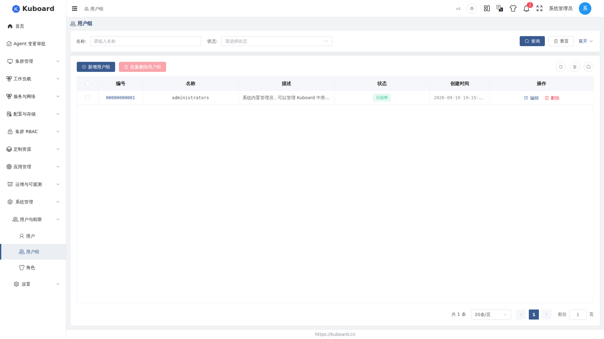

# 用户组（User Groups）

用户组（User Group）把多个用户组织起来、统一绑定角色（Role），组内成员自动获得角色权限，实现批量授权。适用对象：管理员。

授权链路：用户 → 用户组 → 角色 → 权限。

::: tip 适用场景
- **新员工入职**：把账号加入用户组，立即获得组权限
- **员工转岗**：只调整组绑定的角色，全组成员同步生效
- **员工离职 / 临时冻结**：移出成员，或停用用户组，权限即刻失效
:::

## 进入用户组页面

界面路径：**系统管理 → 用户与权限 → 用户组**。列表展示已有的用户组：名称（支持按名称搜索）、描述、状态（enabled 启用 / disabled 禁用）、创建时间（支持按时间范围筛选）。右上角提供「新增用户组」和「批量删除用户组」，每行操作列提供「编辑」「删除」。

## 创建用户组

1. 点击「**新增用户组**」，在右侧弹出的抽屉中填写**名称**（必填）和**描述**，ID 由系统自动生成。
2. 点击「确定」，自动跳转到该用户组的详情页，可以直接开始添加成员、绑定角色。

::: tip 名称创建后不可修改
用户组名称全局唯一，创建后无法编辑；写错只能删除重建。描述与状态随时可以修改。
:::

## 添加成员（关联用户）

1. 在「**关联用户**」页签点击「**新增用户用户组绑定**」，弹出选择用户对话框（已绑定到该组的用户会自动排除）。
2. **多选用户**，并指定**失效日期**（必填）。
3. 点击「确定」，绑定记录出现在列表中，成员即刻获得该组绑定的全部角色权限。

「关联用户」列表展示每个成员的账号信息（用户名 / 姓名 / Email / 来源）、用户状态、绑定状态与失效日期。

::: tip 失效日期只作用于这条绑定关系
到期后该成员自动失去组权限；需要长期有效时，重新指定一个远期日期即可。
:::

<!-- screenshot-todo: 详情页「关联用户」页签 ＋「新增用户用户组绑定」对话框（多选用户 + 失效日期） -->

## 为用户组绑定角色

在用户组详情页的「**关联角色**」页签，把角色绑定到这个组（一条绑定 = 用户组 + 角色 + 作用域），点击「**新增用户组角色绑定**」：

1. 选择**作用域类型**（决定角色在哪个范围内生效）：

| 作用域类型 | 含义 | 还需要选择 |
| --- | --- | --- |
| kuboard | Kuboard 平台级 | 无需选集群 / 名称空间 |
| cluster | Kubernetes 集群级 | 关联集群（可多选，或选「任意集群」） |
| namespace | 名称空间级 | 关联集群 + 关联名称空间（均可选「任意」） |

2. 按作用域类型选择集群 / 名称空间（可直接勾选「任意」）。
3. 选择**角色**：下拉选项已按所选作用域类型过滤，只展示该范围内可用的角色。
4. 点击「确定」，绑定立即对该组**所有成员**生效；一个组可绑定多个角色，同一角色也可分别绑定到不同集群 / 名称空间。

::: warning 作用域需与角色一致
例如只定义了 namespace 作用域的角色，不会出现在 cluster 作用域的候选列表中；请先选作用域类型，再选角色。
:::

<!-- screenshot-todo: 详情页「关联角色」页签 ＋「新增用户组角色绑定」对话框（作用域类型 → 集群/名称空间 → 角色） -->

## 查看用户组拥有的权限

在「**拥有权限**」页签汇总展示该组**实际获得**的授权明细（由全部角色绑定推导而来）：每条记录列出作用域、API 组、资源与可执行的动词，鼠标悬停可查看该条权限「从以下角色中获得」。若这里没有出现期望的权限，按「成员是否在组内 → 组-角色绑定是否存在且启用 → 作用域是否覆盖目标集群 / 名称空间 → 角色本身是否被禁用」逐项排查。

## 管理用户组

- **编辑**：修改描述、切换状态（启用 / 禁用）等。
- **停用**：把状态切为 disabled 后，整组成员暂时失去组权限，重新启用即恢复。
- **删除**：删除用户组会**级联删除**该组的所有用户绑定与角色绑定，相关权限立即失效；支持单条删除与「批量删除用户组」。

::: tip 从用户和角色的另一端也能管理
在 [用户](./users) 详情页可以反查该用户加入了哪些组，并修改绑定关系、失效日期；在 [角色](./roles) 详情页可以反查该角色绑定了哪些用户组，并把组批量绑定到角色。
:::

## 接口文档

本节涉及的接口详见 [Swagger UI 的「用户与权限」分组](../reference/api)。