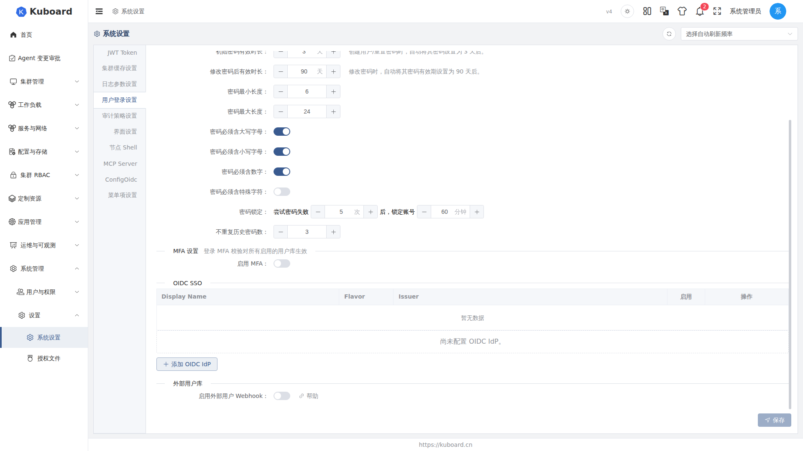
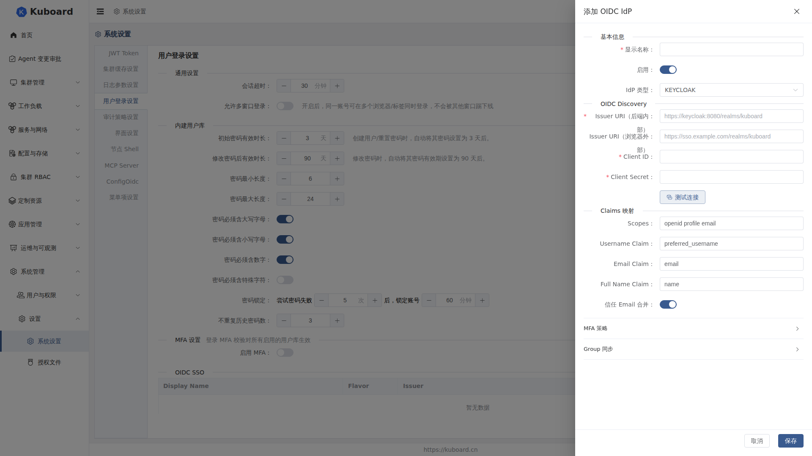

# Kuboard OIDC 单点登录（SSO）

本页说明如何配置 OIDC 单点登录（SSO，基于 OAuth 2.0 的身份认证协议），用户如何用 IdP 账号登录与登出，以及登录失败时如何排查。

**适用对象**：管理员（配置 IdP、管理 OIDC 用户）与普通用户（使用「使用 XXX 登录」按钮登录）。

## 快速开始：5 分钟接入一个 IdP

接入后，用户在登录页点击「使用 XXX 登录」，跳转到 IdP 完成认证，通过后自动回到 Kuboard 首页（首次登录自动创建本地用户）。下面以 **Keycloak** 为例（标准 OIDC，配置与通用 IdP 一致）。

### 第一步：在 Keycloak 中创建客户端

打开 Keycloak 管理台，在 **Clients → Create client** 创建客户端：Client type 选 **OpenID Connect**，Client ID 填 `kuboard`，勾选 **Client authentication** 与 **Standard flow**；记住你的 Realm issuer 地址，形如 `https://sso.example.com/realms/kuboard`。

在 **Valid redirect URIs** 中填入 Kuboard 回调地址（所有 IdP 都填这一个地址，自动识别发起方），再到 **Credentials** 页复制 **Client secret** 留待填用：

```sh
https://<kuboard域名>/api/anonymous.kuboard.cn/v4/oidc/callback
```

### 第二步：在 Kuboard 中添加 IdP

入口：**系统管理 → 系统设置 → 用户登录设置 → OIDC SSO** → **「添加 OIDC IdP」**（向导页签：基本信息 → Discovery 与 Client → Claims 与高级 → 确认保存）。必填项：显示名称、Issuer URI、Client ID、Client Secret。



| 字段 | 示例填写 | 说明 |
| --- | --- | --- |
| 显示名称 | `Keycloak SSO` | 登录按钮文案，用户可见 |
| 启用 | 开 | 关闭后不出现在登录页 |
| IdP 类型 | Keycloak / Red Hat SSO | 见 [支持的 IdP 类型](#支持的-idp-类型)，不确定选「通用 OIDC」 |
| Issuer URI（后端内部） | `http://keycloak:8080/realms/kuboard` | 后端拉取 discovery 用，填内网可达地址 |
| Issuer URI（浏览器外部） | `https://sso.example.com/realms/kuboard` | 浏览器跳转用；留空则取左侧值 |
| Client ID | `kuboard` | 与 Keycloak 中一致 |
| Client Secret | 上一步复制的 secret | 保存后加密存储 |
| Scopes | `openid profile email` | 默认即可；Group 同步时加 `groups` |

填完点击 **「测试连接」**，看到「连接成功 · 延迟 · JWKS 密钥数」后 **保存**；失败则查网络与 Issuer（见 [排查](#常见问题排查)）。



### 第三步：验证登录

① 登录页用户来源选 **OIDC**，点 **「使用 Keycloak SSO 登录」**；② 浏览器跳转到 Keycloak 登录（有 MFA 则二次验证）；③ 通过后自动回到 Kuboard 首页，左侧出现该用户（来源 OIDC）。之后可在 OIDC SSO 列表对该 IdP **启停用 / 编辑 / 删除**（已启用的需先禁用）。

## 支持的 IdP 类型

几乎所有标准 OIDC 服务都可选「通用 OIDC」：

| 类型 | 适配对象 | 说明 |
| --- | --- | --- |
| 通用 OIDC | 任意标准 OIDC | 默认，通用性最强 |
| Keycloak / Red Hat SSO | Keycloak | 标准 OIDC |
| Authing / 阿里云 IDaaS / 腾讯云 CIAM | 国内 SaaS / IDaaS | — |
| Microsoft Entra ID | 原 Azure AD | 部分版本登出不支持回跳登录页 |
| Okta / Auth0 / GitLab | — | GitLab 为标准 OIDC |
| 企业微信 / 飞书 | WeCom、Lark | OIDC discovery 支持 |

::: tip 只影响行为差异，不影响填写结构
无论选哪种类型，填写字段（Issuer / Client ID / Client Secret / Claims）都是 OIDC 标准结构，区别仅在不同厂商的适配。某家 IdP 行为异常时，换成「通用 OIDC」试一下是最快的对照方法。
:::

## 内网 / 外网两个 Issuer 的区别

「Issuer URI（后端内部）」供后端拉取 discovery 元数据，必须后端可达；「Issuer URI（浏览器外部）」供浏览器跳转，仅内外网访问地址不同时填写（如内网 DNS 与公网域名不一致），留空则同前者。两者应为同一 realm，可用下面的命令自检：

```sh
# 自检：后端拉取 discovery 的地址
curl -s http://keycloak:8080/realms/kuboard/.well-known/openid-configuration
```

## Claims 映射

各家 id_token 的 claim 命名略有出入，用下面三个字段做对照；如果 IdP 用了其它 claim（如 `sub`、`upn`），把对应字段改成你本地登录名所在的 claim 即可：

| 字段 | 默认 claim | 用途 |
| --- | --- | --- |
| Username Claim | `preferred_username` | Kuboard 用户名 |
| Email Claim | `email` | 邮箱（预绑定匹配与合并） |
| Full Name Claim | `name` | 显示名 |

**信任 Email 合并**（默认开启）：IdP 返回的 email 与本地其它来源用户相同时自动合并，实现「同一人多方式登录」；关闭则每次登录都视为新身份。

## MFA 策略

OIDC 用户的 MFA 由 **IdP 负责**，Kuboard 依据 id_token 中的 `amr`、`acr`、`auth_time` 标准 claim 判断本次登录是否完成 MFA：

| 选项 | 默认 | 行为 |
| --- | --- | --- |
| 信任 IdP MFA | 开 | 依据 amr/acr/auth_time 判断登录是否完成 MFA；关闭则一律视为未启用 |
| 强制 IdP MFA | 关 | 未在 IdP 完成 MFA 的登录被**拒绝**（回登录页提示错误码） |
| MFA acr_values | `mfa` | 发起授权时携带的参数，告知 IdP 此次登录要求 MFA |
| auth_time 最大间隔（秒） | `300` | auth_time 距今超过该秒数视为「MFA 已过期」；0 关闭检查 |

::: warning 开启强制前先确认 IdP 下发 claim
若 id_token 缺失 `auth_time` 或 `amr`（部分 IdP 默认不开），启用「强制 IdP MFA」后登录会被拒绝。请先在 IdP 侧确认能下发。
:::

## Group 同步（可选）

启用后，登录时读取 IdP 下发的 Group Claim（默认 `groups`），按「IdP Group → Kuboard Group」映射表自动加入对应用户组。请先在 Kuboard 建好目标用户组；受保护的内置组不会被同步修改。

## 用户如何使用 OIDC 登录

**登录**：登录页用户来源选 **OIDC** 后，只有一个 IdP 时直接显示「使用 {显示名称} 登录」按钮，多个 IdP 时先在下拉框选择；点击后整页跳转到 IdP，认证成功后自动回到 Kuboard 首页（浏览器会记住上次选择）。

**单点登出与静默续期**：点击右上角登出时，先清理本地会话，再跳转到 IdP 登出端点注销单点会话，最后回到 Kuboard 登录页；IdP 未提供登出端点时仅完成本地登出。首次登录自动创建 Kuboard 用户（来源 OIDC）；若 IdP 下发刷新令牌（需 `offline_access` scope），本地令牌临近过期时会后台静默续期，用户无感。

## OIDC 用户管理（管理员）

**查看列表**：用户列表把「来源」筛选切到 **OIDC**（仅启用时出现），展示用户名、显示名、邮箱、状态，可搜索与批量删除。

**预建账号（预绑定）**：想在首次登录前确定账号（分配角色 / 组），点列表页 **「+ 预创建 OIDC 用户」**：① 填 **Email**，必须与 IdP 的 email claim **完全一致**；② 可选填显示名，保存后出现「待首次登录」占位行；③ 首次登录成功后占位行替换为真实用户，原角色 / 组保留。若登录后出现的是新用户而非合并到占位行，通常是 email 与 IdP 不一致，请核对大小写与域名后缀。

## 常见问题排查

### 登录页没有「OIDC 登录」按钮 / 测试连接失败

- 登录页没有「OIDC 登录」按钮：用户来源区仅在启用 OIDC 时出现，检查 OIDC SSO 列表是否有**已启用**的 IdP，且「测试连接」通过（Issuer 后端可达）。
- 测试连接失败 / discovery 拉不到：内网地址确认与 IdP 网络互通，公网地址确认域名解析与 TLS；报 `issuer mismatch` 见下方提示。

### 登录失败，跳回登录页并提示错误码

回调失败时登录页携带 `?oidcError=错误码`，对照处理：

| 错误码 | 可能原因 | 处理 |
| --- | --- | --- |
| `state_invalid` | 回调地址被改写；多 IdP 配置不一致 | 重新发起登录；检查回调 URL |
| `code_exchange_failed` | Client ID / Secret 错误；标准流未启用 | 核对 Client 配置；重新生成 secret |
| `id_token_invalid` | 验签失败、issuer / audience 不符、已过期 | 检查 IdP 类型与 Issuer 是否配错 |
| `oidc_mfa_required` | 未完成 MFA 但开启了强制 | 见 [MFA 策略](#mfa-策略) |
| `oidc_mfa_stale` | MFA 完成时间超过「auth_time 最大间隔」 | 重新登录，或调大该间隔 |

::: danger issuer mismatch 最容易犯
discovery 返回的 issuer 必须与配置的 Issuer URI **逐字符一致**；内外网不一致时，请把「Issuer URI（后端内部）」配成 discovery 实际返回的值。
:::

### 回调地址与反向代理

回调地址由后端依据 `X-Forwarded-Proto` / `X-Forwarded-Host` 请求头拼出；反代未正确传递这两个头时会报 `redirect_uri` 不匹配。部署注意事项见 [反向代理](../install/reverse-proxy.md) 与 [Kuboard 代理](../ops/kuboard-proxy.md)。

## 相关文档

[登录页与各认证方式的关系](./login) · [MFA 多因素认证](./mfa) · [用户列表与用户管理](./users) · [密码策略与修改密码](./password)

## 接口文档

本节涉及的接口详见 [Swagger UI 的「权限管理接口」分组](../reference/api)。