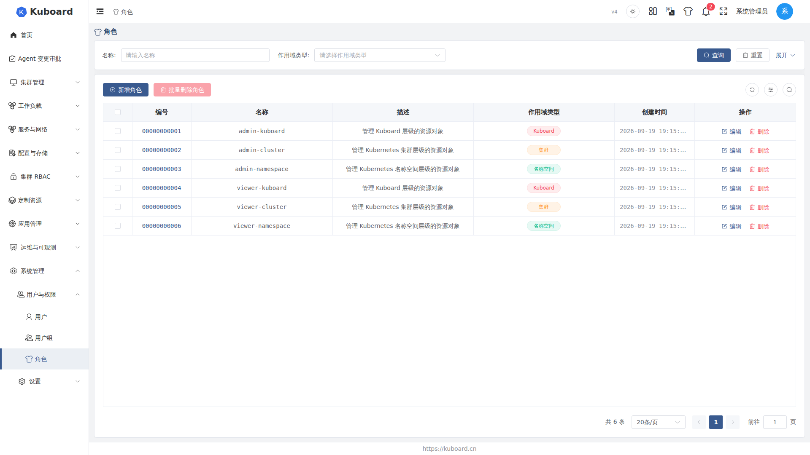
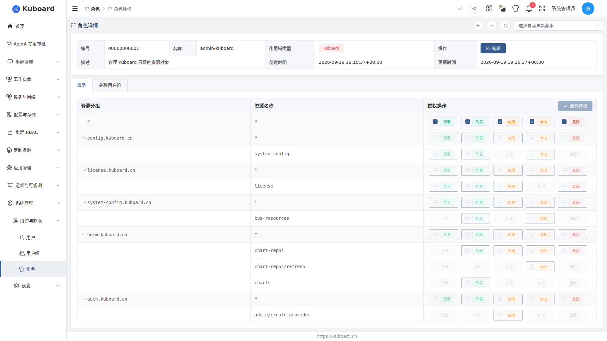
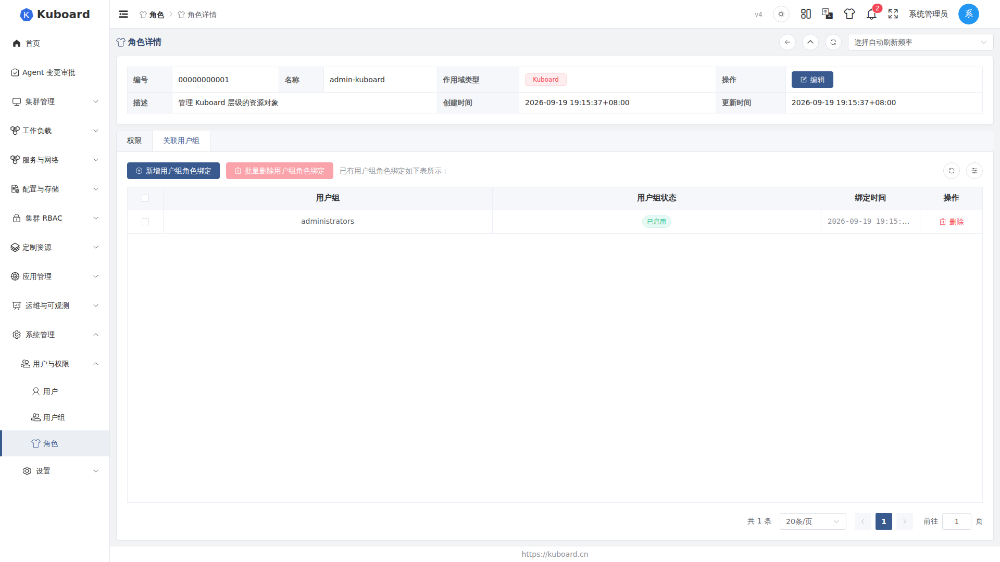

# 角色与权限（Roles）

角色（Role）是权限的集合。管理员创建角色、配好权限后，绑定到用户组（User Group），组员自动获得权限。适用对象：管理员。

## 角色的层级（作用域类型）

每个角色在创建时必须指定**作用域类型（scope type）**，决定其权限在哪个层级生效，创建后不可修改；它与绑定用户组时还要再选的「绑定作用域」（具体到哪个集群 / 名称空间，或「任意」）不是一回事（见下文 [把角色分配给用户组](#把角色分配给用户组)）：

| 作用域类型 | 层级 | 管控的对象示例 |
| --- | --- | --- |
| kuboard | Kuboard 平台级 | 用户、用户组、角色等平台对象 |
| cluster | Kubernetes 集群级 | 节点、Namespace、存储类等跨名称空间资源 |
| namespace | Kubernetes 名称空间级 | 工作负载、Service、ConfigMap 等名称空间内资源 |

角色权限的规则用「资源 + 操作动词」描述。操作动词（verb）为 get / list / create / update / delete，分别对应读取、列出、创建、修改、删除。

## 内置角色与自定义角色

Kuboard 预置 6 个内置角色（admin / viewer 两组、每个层级各一个），覆盖「全权管理」与「只读查看」两类诉求：

| 内置角色 | 作用域 | 权限 |
| --- | --- | --- |
| admin-kuboard | kuboard | 平台级所有资源的所有操作 |
| admin-cluster | cluster | 集群级所有资源的所有操作 |
| admin-namespace | namespace | 名称空间级所有资源的所有操作 |
| viewer-kuboard | kuboard | 平台级所有资源的只读 |
| viewer-cluster | cluster | 集群级所有资源的只读 |
| viewer-namespace | namespace | 名称空间级所有资源的只读 |

内置角色是**系统对象**，只能查看，不能修改或删除。内置用户组 `administrators` 已绑定三个 admin 内置角色（平台级、任意集群、任意集群任意名称空间），因此初始管理员账号开箱即可管理全部内容。除内置角色外，可创建任意数量的**自定义角色**，按团队分工命名（如 `dev-namespace-admin`），随时可编辑、删除。

## 创建自定义角色

1. 进入**系统管理 → 用户与权限 → 角色**，点击「**新增角色**」，右侧弹出表单。
2. 填写字段：

| 字段 | 说明 |
| --- | --- |
| 名称 | 必填；以字母开头，可含数字，长度不小于 3，**创建后不可修改** |
| 描述 | 必填；说明这个角色大致有什么权限 |
| 作用域类型 | 必填；kuboard / cluster / namespace 之一，**创建后不可修改** |
| ID | 系统自动生成，无需填写 |

3. 点击「确定」，自动跳转到该角色的详情页，可直接开始配置权限。

<!-- screenshot-todo: 新增角色抽屉（名称/描述/作用域类型，ID 自动生成） -->

::: warning 名称与作用域类型创建后不可修改
创建前请先想好名称和层级，这两项一旦确定无法编辑；选错可删除重建（自定义角色可以删除）。
:::

## 为角色配置权限

1. 在角色详情页的「**权限**」页签，权限表格按 **API 组 → 资源 → 操作动词** 列出所有可授权项（kuboard 级为平台对象权限，cluster / namespace 级为集群与名称空间对象权限），最上方是 `*`（全部资源）通配行。
2. 逐行勾选动词（get / list / create / update / delete），点击「**保存授权**」。

勾选 `*` 通配行的某个动词后，具体资源行对应动词自动生效并置灰；保存后立即生效，所有绑定了该角色的用户组成员权限即刻刷新。

## 把角色分配给用户组

1. 在角色详情页的「**关联用户组**」页签，点击「**新增用户组角色绑定**」，弹出绑定对话框。
2. **多选用户组**（已绑定该角色的组自动从候选列表排除）。
3. 按角色作用域类型选择**绑定作用域**：

| 角色作用域类型 | 需要选择 | 可选值 |
| --- | --- | --- |
| kuboard | 无需选择 | — |
| cluster | 关联集群 | 某个集群，或「任意集群」 |
| namespace | 关联集群 + 关联名称空间 | 各选具体值，或「任意」 |

4. 点击「确定」。这些用户组的**所有成员立即获得**该角色权限。绑定列表按角色类型展示不同列（「任意」用黄色标签标出）；同一角色可分别绑定到不同集群 / 名称空间。

::: tip 从用户组一端也能绑定
相同的绑定也可在「用户组」详情页的「**关联角色**」页签完成——先选作用域，再选该作用域下可用的角色。两种入口本质相同，见 [用户组](./groups)。
:::

## 管理角色

- **查看最终权限**：在用户 / 用户组详情页的「拥有权限」页签，查看经全部角色绑定推导出的授权明细，悬停可见每条权限的来源角色。排查顺序：用户是否在组内 → 组-角色绑定存在且启用 → 绑定作用域覆盖目标集群 / 名称空间 → 角色权限齐全。
- **编辑**：可修改**描述**与「权限」页签的授权规则；名称、作用域类型、ID 均不可改。
- **删除**：删除角色会**级联删除**其所有用户组绑定，成员权限立即失效；支持单条删除与「批量删除角色」。
- **内置角色**：系统对象，列表与详情页均无编辑、删除入口。

相关页面见 [用户](./users) 与 [用户组](./groups)；角色的详细授权模型见 [RBAC 授权范围参考](../reference/rbac-scopes)。