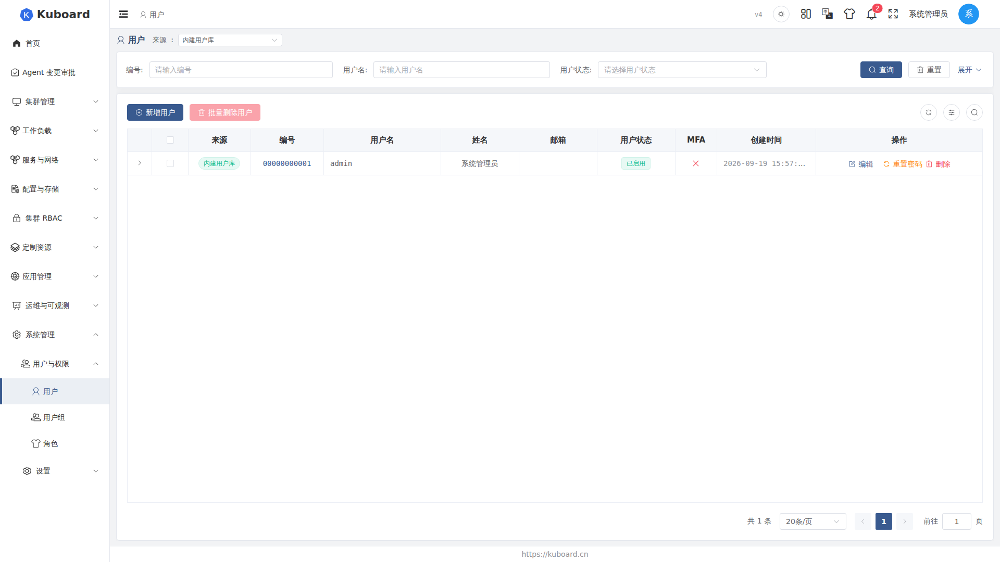
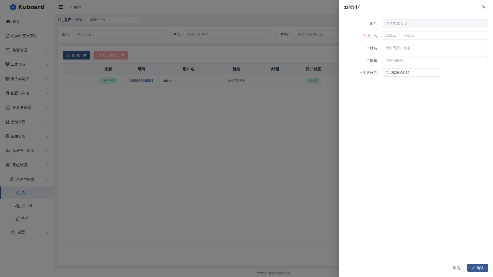

# 用户管理

本页说明管理员如何创建和维护 Kuboard 用户账号、为用户分配权限，并处理启用/禁用、锁定解锁、重置密码、删除等日常操作。

权限通过 **用户 → 用户组（User Group）→ 角色（Role）** 逐级传递：给用户分配权限，实际是「把用户加入已绑定角色的用户组」，概念见 [用户组](./groups) 与 [角色与权限](./roles)。

## 进入用户列表

1. 登录后进入 **系统管理 → 用户与权限 → 用户**。
2. 页面左上角是「来源」下拉框，默认显示**内建用户库**；启用外部用户库后，还可切换 **Webhook 用户库** 与 **OIDC 用户库**（接入方式见 [Webhook 用户库](./webhook-users) 与 [OIDC 单点登录](./oidc)）。

列表主要列：用户名（可搜索，未登录过的用户带「未登录」标签）、姓名、邮箱、用户状态（可按状态筛选）、MFA 绑定情况、失效日期；点击行首箭头可展开该用户的账号与安全信息。

## 创建用户

1. 在用户列表页点击 **新增用户**。
2. 在抽屉表单中填写：

| 字段 | 说明 |
|---|---|
| 用户名 | 必须以字母开头和结尾，可含字母、数字、`-`、`_`、`.`，长度不小于 3；创建后不可修改 |
| 姓名 | 显示名，如「张三」 |
| 邮箱 | 合法的邮箱格式 |
| 失效日期 | 账号有效截止日期，到期后无法登录 |

ID 由系统自动生成，无需填写。点击**确定**后创建成功，并自动进入该用户的详情页。

::: tip 初始密码
创建用户时不要求设置密码。新用户以初始密码 `Kuboard123` 登录，且默认须在 3 天内修改（可在系统配置中调整），详见 [密码策略与修改密码](./password)。
:::

## 用户详情与分配角色

点击列表中的用户进入详情页（创建成功后自动跳转）。详情页标签：

- **关联用户组**：该用户已加入的用户组及绑定失效日期。
- **拥有权限**：实时显示该用户当前的全部权限及来源；**MFA**：查看/重置该用户的 MFA 绑定，仅全局启用 MFA 时显示。

给用户分配角色（加入用户组）：

1. 打开详情页，切换到 **关联用户组** 标签。
2. 点击 **新增用户用户组绑定**，选择一个或多个用户组并指定绑定有效期。
3. 点击确定。该用户立即获得这些用户组所绑定角色的全部权限，可在 **拥有权限** 标签核对。

::: tip
若用户组还没有绑定任何角色，加入用户组不会带来任何权限——请先在 [用户组](./groups) 页面确认组-角色绑定。
:::

## 管理用户

| 操作 | 怎么做 | 说明 |
|---|---|---|
| 启用 / 禁用 | 列表「操作」列或详情页点 **编辑**，切换 **用户状态** 开关后确定 | 禁用后立即无法登录，账号与绑定关系保留 |
| 解锁 | 密码连续错误导致账号锁定时，点 **解锁** 并确认 | 尝试次数清零，恢复正常登录 |
| 重置密码 | 点 **重置密码** 并确认 | 密码重置为 `Kuboard123`，旧密码立即失效，默认 3 天内须修改 |
| 重置 MFA | 用户 MFA 无法验证时，点 **重置 MFA** | 清除 MFA 绑定，用户下次登录重新绑定，见 [MFA 多因素认证](./mfa) |
| 删除 | 单条：点列表「操作」列的删除按钮；批量：勾选多行后点 **批量删除用户** | 不可恢复，并同时清除用户组绑定与访问密钥记录 |

::: warning
用户名以 `000000` 开头的系统内置账号，其状态与失效日期不可修改，也不可删除。
:::

::: warning
删除用户是永久性操作，账号、密码与所有授权关系都会丢失。建议先用「禁用」代替删除，确认无影响后再清理。
:::

## 用户来源差异

不同来源的用户，在本页可做的操作不同：

| 来源 | 账号密码 | 管理员在本页可做的操作 |
|---|---|---|
| 内建用户库 | 密码存于 Kuboard | 创建、编辑、启用/禁用、解锁、重置密码、删除、绑定用户组、重置 MFA |
| Webhook 用户库 | 密码由外部服务校验，本地不存 | 查看、绑定用户组、重置 MFA、删除（仅清本地记录，下次同步会重新创建） |
| OIDC 用户库 | 无密码，由身份提供方（IdP）认证 | 查看、删除（仅清本地记录）、按邮箱预创建占位用户 |

::: tip
切换「来源」下拉框只是切换列表展示的账号体系，并不会把用户从一种来源转换到另一种；不同来源的同名账号是相互独立的记录。
:::

## 接口文档

本节涉及的接口详见 [Swagger UI 的「用户与权限」分组](../reference/api)。