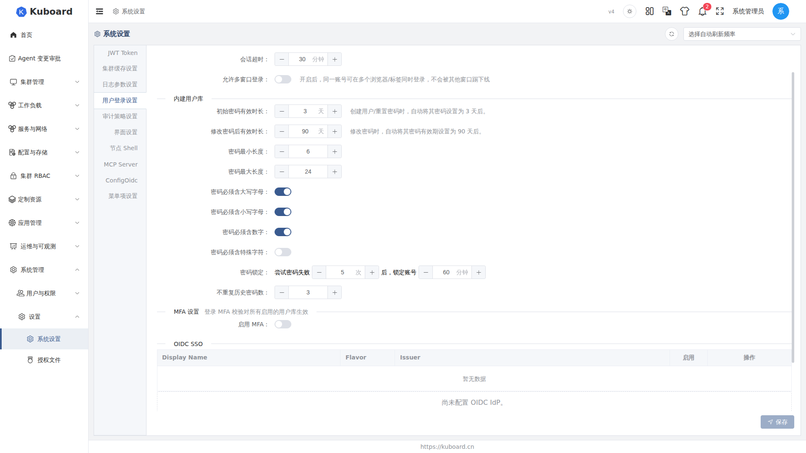

# Webhook 外部用户库

已有用户库（如 LDAP）时，可用 Webhook 把登录校验转发给用户库，员工用现有账号直接登录。本页说明管理员如何准备并启用 Webhook 用户库。

::: warning 这不是单点登录（SSO）
用户仍要在 Kuboard 登录页输入用户名与密码，只是密码校验被转发给外部用户库完成。单点登录请参考 [OIDC 单点登录](./oidc)。
:::

## 工作原理

启用后，Kuboard 只在两个时机调用您的 webhook 地址：**用户登录**时把用户名与密码以 `POST` 发送到该地址认证；**打开用户管理**时以 `GET` 请求实时拉取用户分页列表。外部用户库的密码只存在于您的用户库，Kuboard 不保存、也无法知悉；用户首次登录成功后，Kuboard 会在本地自动落一条记录（不含密码），用于保存 MFA 绑定、用户组绑定等本地状态，授权体系（用户组、角色）同样适用，见 [用户组](./groups) 与 [MFA 多因素认证](./mfa)。

## 第一步：准备 Webhook 用户服务

您只需提供一个 HTTP 地址，并在**同一地址**上实现两种请求：`POST` 用于认证、`GET` 用于用户列表。这个地址就是后面在 Kuboard 里填写的「外部用户 Webhook」URL。

**认证请求（POST）**：登录时发送，成功后返回 `code = 0`：

```json
// 请求：POST {url}
{
  "username": "user01",
  "password": "password1"
}

// 响应：认证成功
{
  "code": 0,
  "message": "ok"
}
```

**用户列表请求（GET）**：打开用户管理页时发送，可带 `username` 过滤，如 `GET {url}?pageNum=1&pageSize=10&username=`，成功返回分页的用户列表：

```json
// 响应：成功
{
  "code": 0,
  "message": "ok",
  "data": {
    "list": [
      {
        "username": "user01",
        "fullName": "User One",
        "email": "user01@example.com",
        "groups": ["developers"],
        "createTime": "2026-01-01T08:00:00.000+08:00"
      }
    ],
    "pageNum": 1,
    "pageSize": 10,
    "total": 1
  }
}
```

**列表项字段说明**：

| 字段 | 必填 | 说明 |
|---|---|---|
| username | 是 | 用户名（登录名），Kuboard 识别该用户的标识 |
| fullName | 否 | 用户全名，展示在「姓名」列 |
| email | 否 | 邮箱，展示在「邮箱」列 |
| groups | 否 | 所属外部组，展示在展开行「外部组」 |
| createTime | 否 | 用户创建时间 |

**返回码**（`POST` / `GET` 响应的 `code` 字段）：

| code | 含义与处理 |
|---|---|
| 0 | 成功：认证通过 / 正常返回列表 |
| 1 | 认证失败：拒绝登录，提示用户名或密码错误 |
| 2 | 用户未找到：拒绝登录，统一提示「用户名或密码错误」，避免暴露账号是否存在 |
| 3 | 内部错误：返回网关错误，并显示 `message` / `details` |

官方提供对接 LDAP 的完整示例 [eip-work/kuboard-v4-ldap-example](https://github.com/eip-work/kuboard-v4-ldap-example)（GitHub），克隆后执行 `docker compose up -d` 即可得到可配置的 webhook 用户服务。

::: danger Webhook 地址安全
Kuboard 以 HTTP 直接调用您填写的 URL，**不附加任何签名或鉴权请求头**。请使用 HTTPS，并在服务端自行校验来源（如限制 IP、校验自定义请求头）；`message` / `details` 会出现在报错中，不要返回敏感信息。
:::

## 第二步：在 Kuboard 中启用并配置

进入 **系统设置 → 用户登录设置**（User Authentication Settings），在「**外部用户库**」区块打开「**启用外部用户 Webhook**」开关，填写「**外部用户 Webhook**」服务地址后点击「**保存**」。



::: tip 地址可达性
该 URL 由 **Kuboard 服务端**访问（而非浏览器），请填写集群内可解析的地址，不要用 `localhost`。
:::

## 第三步：验证登录

退出登录回到登录页，选择「**Webhook 用户库**」单选选项，输入外部用户的用户名与密码登录，返回 `code = 0` 即登录成功。

<!-- screenshot-todo: 登录页「Webhook 用户库」单选并输入用户名密码 -->

## 第四步：查看与管理外部用户

1. 进入 **系统管理 → 用户与权限 → 用户**，点开左上角「**来源**」下拉框，选择「**Webhook 用户库**」，表格即展示外部用户列表。

<!-- screenshot-todo: 用户管理页「Webhook 用户库」来源下的用户列表（含展开行） -->

| 列 | 说明 |
|---|---|
| 来源 | 固定为 webhook |
| ID | 本地记录标识；从未登录过的用户显示「未登录」标签 |
| 姓名 / 邮箱 | 来自 webhook 返回的 `fullName` / `email` |
| MFA | 该用户在 Kuboard 本地的 MFA 绑定状态 |
| 创建时间 | 本地记录的创建时间（即首次登录时间） |

点开行首的展开箭头可查看**外部组**、**登录与安全**、**MFA** 详情；列表每次打开都会实时向 webhook 拉取数据，外部用户库中的账号变更刷新页面即可看到。

### 可用操作

- **关联用户组**：把外部用户加入本地用户组以授予权限（本地尚无记录时自动创建）
- **重置 MFA**：解除该用户在本地的 MFA 绑定

::: warning 删除仅清除本地记录
删除不影响外部用户库中的账号，但会清掉该用户的本地状态（MFA 绑定、用户组绑定）；下次登录或再次被查询时自动重新落地。
:::

## 与内建用户库的对比

| 维度 | 内建用户库（dao） | Webhook 用户库（webhook） |
|---|---|---|
| 密码存放 | Kuboard 本地数据库 | 仅在外部用户库，Kuboard 不保存 |
| 账号创建 | 管理员在 Kuboard 创建 | 由外部用户库维护，首次登录自动落地 |
| 密码管理 | Kuboard 可重置/解锁 | Kuboard 不管理密码，相关操作不适用 |
| 权限授予 | 用户组 + 角色 | 同样通过用户组 + 角色，见 [用户组](./groups) |
| 删除 | 删除本地账号 | 仅清本地记录，不影响外部账号 |

## 接口文档

本节涉及的接口详见 [Swagger UI 的「权限管理接口」分组](../reference/api)。

::: tip 与「用户通知 Webhook」的区别
本文介绍的是**外部用户库**（入站认证）：Kuboard 收到登录请求时回调您的外部账号系统验证身份。

另有一类 **Webhook 通知**（出站推送）：将平台内的关键事件（如集群导入、工作负载变更、用户登录等）以 HTTP 回调方式推送给企业微信、钉钉、Slack、飞书等 IM 平台或自研工单系统。两者方向相反，互不相关。
:::