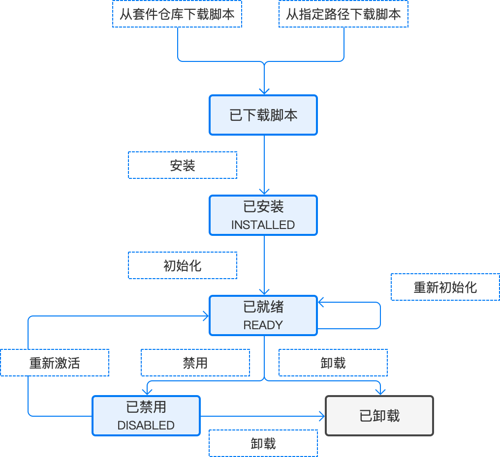
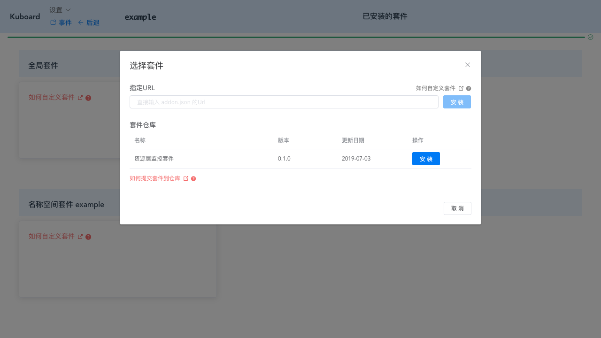
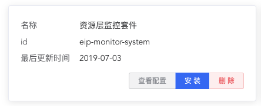
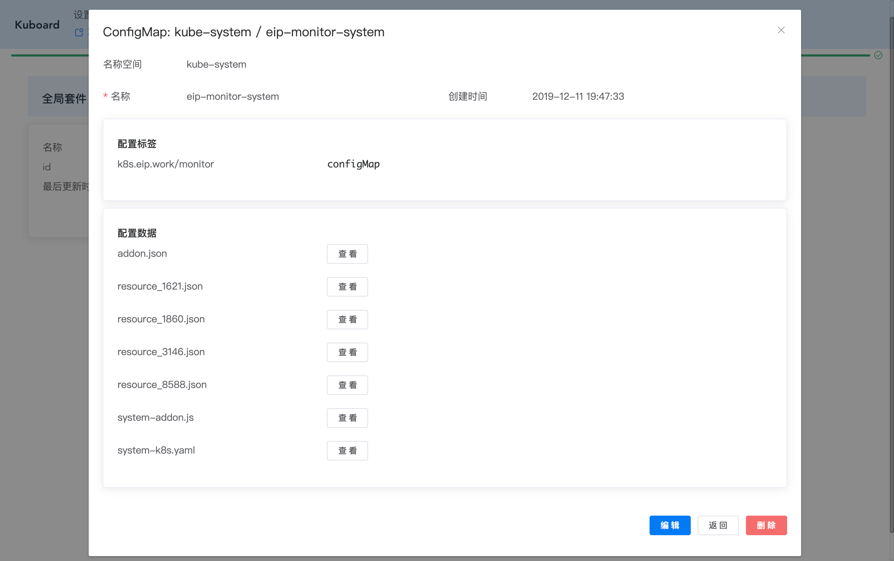
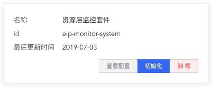
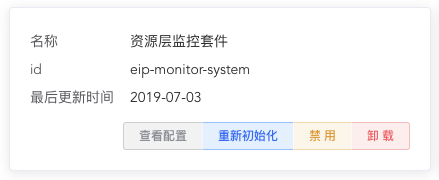
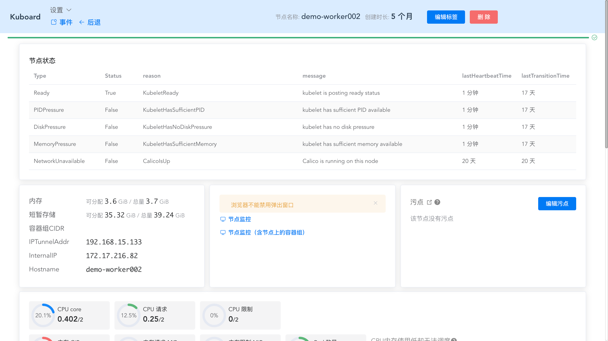
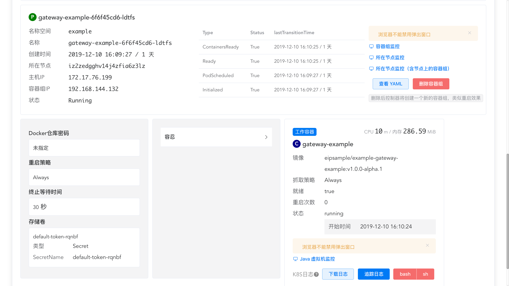
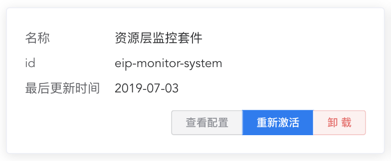

# 自定义套件

<AdSenseTitle/>

> * 请参考 [监控 example](/guide/example/monitor.html) 体验 Kuboard 在监控套件方面的设想
> * 套件以插件的形式整合到 Kuboard，是对 Kuboard 能力的一个扩展。在不使用套件的情况下，Kuboard 的所有功能都可正常工作

<p style="max-width: 560px;">

</p>

上图是 Kuboard 管理一个套件的完整生命周期。为了简化问题的讨论，我们将着重阐述生命周期中的以下几个动作：
* [下载脚本](#下载脚本)
* [安装](#安装)
* [初始化](#初始化)


在了解完上述几个动作以后，您就已经可以实现自己的套件（或者修改已有套件）了。此外，了解下面的动作可以帮助您更完整地理解套件的生命周期：

* [卸载](#卸载)
* [禁用](#禁用)
* [重新激活](#重新激活)

当您对自己的套件比较满意之后，您还可以[发布套件](./repository.html)到仓库，让更多的朋友获益

## 下载脚本

下载脚本是安装套件的准备阶段。在 Kuboard 中，可以从套件仓库下载套件脚本，也可以从指定URL路径下载。下载时的主要依据是 [套件描述文件](#套件描述文件)，套件的所有脚本下载了以后，被保存到 [套件的ConfigMap](#套件的ConfigMap) 中

### 下载方式

Kuboard 提供了两种下载套件脚本的方式：
* 从套件仓库下载
* 从指定路径下载

如下图所示，点击界面中的安装按钮之后，Kuboard 将套件的相关脚本全部存入到名称空间下的 ConfigMap 中。
* 全局套件存入到 kube-system 名称空间
* 名称空间套件存入到所在的名称空间



### 套件描述文件

套件仓库或者指定URL的方式下载套件脚本时，都需要对应到一个套件描述文件。套件描述文件的主要用途是：
* 标识套件的基本信息，如名称、id、更新时间、维护者、文档地址等
* 定义套件所需的资源文件列表：
  * k8s yaml 文件，向 Kubernetes 创建对象
  * java scripts 脚本，向 Kuboard 添加回调函数
  * resources 脚本，额外的资源文件

以 [资源层监控套件](https://addons.kuboard.cn/eip-monitor-system/0.1.1/addon.json) 的描述文件为例：（该文件的 URL 为 `https://addons.kuboard.cn/eip-monitor-system/0.1.1/addon.json`）

``` json {7,8,9}
{
  "name": "资源层监控套件",
  "id": "eip-monitor-system",
  "version": "0.1.1",
  "lastUpdate": "2019-12-11",
  "maintainer": "shaohq@foxmail.com",
  "scripts": ["system-addon.js"],
  "k8s": ["system-k8s.yaml"],
  "resources": ["resource/1621.json", "resource/1860.json", "resource/3146.json", "resource/8588.json"],
  "isGlobal": true,
  "info": {
    "description": "通过prometheus/grafana监控Kubernetes资源层的信息，包括CPU使用、内存使用、网络使用等信息。",
    "document": "https://github.com/eip-work/kuboard-addons/tree/master/repository/eip-monitor-system/0.1.1"
  }
}
```

描述文件包含的字段如下：

| 字段名称         | 字段类型      | 字段描述                                                     |
| ---------------- | ------------- | ------------------------------------------------------------ |
| name             | String        | 套件的中文名字，将显示在仓库中                               |
| id               | String        | 套件的 ID，[发布到套件仓库](./repository.html) 时，该 ID 必须在仓库内全局唯一 |
| version          | String        | 套件的版本标识                                               |
| lastUpdate       | String        | 套件最后更新日期                                             |
| maintainer       | String        | 套件维护者的联系方式                                         |
| scripts          | Array[String] | Java scripts 脚本，用于向 Kuboard 添加界面元素以及回调函数。（相对于套件描述文件的路径） |
| k8s              | Array[String] | kubernetes yaml 文件，用于向 Kubernetes 创建新的对象。（相对于套件描述文件的路径） |
| resources        | Array[String] | 额外资源文件，通常在套件初始化时使用。（相对于套件描述文件的路径） |
| isGlobal         | Boolean       | 是否为 [全局套件](/guide/addon/#类型)                        |
| info.description | String        | 套件的文本描述，将显示在套件仓库中                           |
| info.document    | String        | 套件的文档，将显示在套件仓库中                               |

::: tip 指定URL

* 如果您在定制套件或开发自己的套件，可以把套件的脚本放在自己的服务器上，则必须为其指定跨域名访问，nginx 配置如下：

  ```
  add_header 'Access-Control-Allow-Origin' '*' always;
  ```

* <Badge type="default">推荐</Badge> 也可以简单地将套件所有的脚本上传到 GitHub 任意一个公开仓库中，并通过 github 的 raw 地址引用，例如，通过指定URL（如下所示）的方式，也可以安装 eip-monitor-system 这个套件：
  `https://raw.githubusercontent.com/eip-work/kuboard-addons/master/repository/eip-monitor-system/0.1.1/addon.json`

:::


### 套件的ConfigMap

通过指定URL路径的方式或者从仓库下载的方式下载套件脚本后，可以在套件列表界面看到该套件的显示，下图显示了已下载状态下的 `eip-monitor-system` 套件：




所有内容将被存储到 Kubernetes 名称空间里以套件 id 命名的 ConfigMap 中。例如，前面例子中的套件脚本下载完成后，将被存入到 `kube-system/eip-monitor-system` 这个 ConfigMap 里，点击 ***查看配置*** 按钮，可查看该 ConfigMap 的内容，如下图所示：




如图所示，该 ConfigMap 包含一个标签：
* `k8s.eip.work/monitor=configMap`

包含 7 个配置数据的条目：
* `addon.json`： 套件描述文件
* `system-addon.js`： JavaScript 脚本，在显示 Kuboard 界面时，用于向 Kuboard 添加回调函数，来自于描述文件中的 `scripts` 字段
* `system-k8s.yaml`： k8s yaml 文件，在安装套件时，用于向 Kubernetes 创建对象，来自于描述文件中的 `k8s` 字段
* `resource_1621.json`、`resource_1860.json`、`resource_3146.json`、`resource_8588.json`： resources 脚本，额外的资源文件，通常用于套件的初始化，来自于描述文件中的 `resources` 字段
  * 描述文件 `resources` 字段中的 `/` 被替换为 `_`，例如 `resources/1621.json` 被替换为 `resourdces_1621.json`
  * 具体 `resources` 中包含的内容，可以是套件需要的任何类型的文件，但是建议保持其文件大小不超过 10K。
  * 此处的 [1621](https://grafana.com/grafana/dashboards/1621)、[1860](https://grafana.com/grafana/dashboards/1860)、[3146](https://grafana.com/grafana/dashboards/3146)、[8588](https://grafana.com/grafana/dashboards/8588) 是 grafana dashboard 的 ID。
  * Kuboard 提供了 API 可以在 scripts 定义的 JavaScript 脚本中引用到 resources 文件的内容

## 安装

### 修改配置

在实际安装套件之前，您可以根据自己的需要，对套件的 ConfigMap 中所存储的内容进行修改。以 `eip-monitor-system` 套件为例，该套件在 `system-k8s.yaml` 文件中为 grafana 设定了一个初始密码 `jmx09KT23BClpa7xzs`，您也许想要将此密码修改为自己的初始密码，那么，可以在此时点击下图中的 ***查看配置*** 按钮，并对 `system-k8s.yaml` 的内容做对应的修改。

> 套件描述文件中 `k8s` 字段指定的文件只在安装时使用，安装完成后再修改该文件的内容，将不会起到任何作用。


### 执行安装

点击上图中的 ***安装*** 按钮，将进入 Kuboard [导入应用程序](/guide/example/import.html) 的功能，在界面的引导下，Kuboard 可以将套件描述文件 `k8s` 字段指定的 yaml 内容全部导入到您的集群对应的名称空间当中。

> Kuboard 尚未在安装界面中提供功能直接检测导入的 Deployment、StatefulSet、DaemonSet 等是否成功下载镜像，成功初始化。需要套件作者在文档中给用户足够的提示，确保所有的应用都已经成功安装之后再进行下一步 [初始化](#初始化)。

## 初始化

完成安装后，套件列表中的显示如下图所示。



点击 ***初始化***（请在安装的应用已经成功启动之后再执行）按钮时，Kuboard 将调用套件描述符 `scripts` 字段指定 JavaScript 脚本中的 [window.EIP_MONITOR_ADDON_TO_ACTIVATE.preFlight](./api.html) 回调函数，如果该函数执行成功，套件的状态将被修改为已就绪，如下图所示：



::: tip 重新初始化

* 由于 Kuboard 暂时还不能检测安装过程中导入的工作负载是否完成镜像下载、是否成功启动，心急的用户很有可能在不合适的时候执行了初始化动作。在这种情况下，用户可以点击 ***重新初始化*** 按钮，再次执行初始化动作。
* 初始化动作对应的 [window.EIP_MONITOR_ADDON_TO_ACTIVATE.preFlight](./api.html) 必须是 [幂等的](/glossary/idempotent.html)

:::

### 套件入口

完成初始化之后，**重新刷新Kuboard页面**，将在如下几个位置显示套件向 Kuboard 添加的入口：

#### 节点级别

`eip-monitor-system` 向所有的节点详情页添加了两个按钮，如下图所示：

* 节点监控
* 节点监控（含节点上的容器组）

这两个按钮的信息（图标、标题）及回调函数来自于套件描述文件 `scripts` 字段对应 JavaScript 脚本中的 [window.EIP_MONITOR_ADDON_TO_ACTIVATE.nodes](./api.html) 这个数组




#### Pod级别

`eip-monitor-system` 向工作负载查看页添加了三个按钮，如下图所示：

* 容器组监控
* 所在节点监控
* 所在节点监控（含节点上的容器组）

这三个按钮的信息（图标、标题）及回调函数来自于套件描述文件 `scripts` 字段对应 JavaScript 脚本中的 [window.EIP_MONITOR_ADDON_TO_ACTIVATE.pods](./api.html) 这个数组



#### 容器级别

`eip-monitor-system` 套件并未向 Kuboard 添加容器级别的入口，上图中，有另外一个套件向容器添加了一个套件入口：

* Java虚拟机监控

容器级别入口按钮的信息（图标、标题）及回调函数来自于套件描述文件 `scripts` 字段对应 JavaScript 脚本中的 [window.EIP_MONITOR_ADDON_TO_ACTIVATE.containers](./api.html) 这个数组


## 禁用

禁用后，套件状态被修改为 **已禁用**，此时，重新刷新 Kuboard 界面后，将不再显示该套件向 Kuboard 添加的以下三个级别的入口：

* [节点级别](#节点级别)
* [Pod级别](#pod级别)
* [容器级别](#容器级别)

**已禁用** 状态下，套件列表中的显示如下图所示：

<p style="max-width: 439px;">
  
</p>

## 重新激活

点击 ***重新激活*** 按钮，此时，重新刷新 Kuboard 界面后，将显示该套件向 Kuboard 添加的入口

## 卸载

点击 ***卸载*** 按钮，将打开卸载向导界面，按提示完成操作：
* 将删除套件描述文件 `k8s` 字段对应 yaml 文件中定义的所有 Kubernetes 对象
* 删除 [套件的ConfigMap](#套件的ConfigMap)
