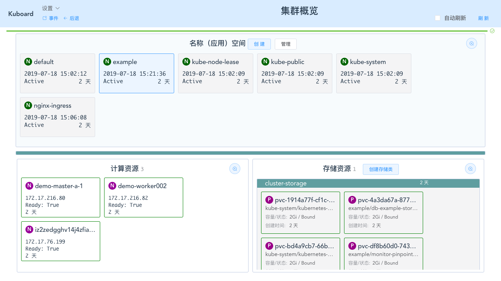

# 计算资源管理

<AdSenseTitle/>

## 前提

必须具备如下条件：

* Kubernetes 集群
* 已在集群中安装 Kuboard

## 添加节点

集群完成安装后，可以随时向集群中添加计算节点，请参考 [初始化 worker 节点](/install/install-k8s.html#初始化-worker节点)


## 查看节点

登录 Kuboard 之后，即可看到集群中的计算资源列表，在左下角，如下图所示：




* 点击 ***demo-worker002*** 可查看该节点的详细信息，如下图所示：


## 移除节点

* 点击 ***节点*** 详情页上方的 ***删除***

  并确认要删除的节点的名称后，即可删除该节点


> * 此时只是从 kubenetes 集群的配置中删除了该节点，该节点上的工作负载将被自动迁移到其他可用节点上。如果重启该节点对应的 linux 操作系统，该节点会重新注册到集群中来。
>
> * 要想彻底删除该节点，您还需要登录该节点所在机器的 linux 终端，并以 root 身份执行如下命令
>
>   ```bash
>   kubadm reset
>   ```
>
>   
