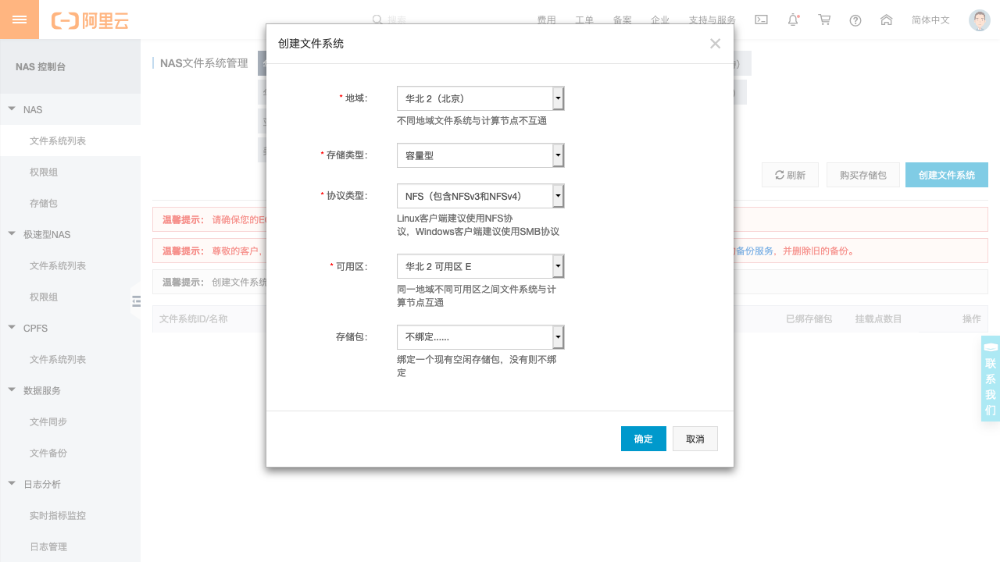
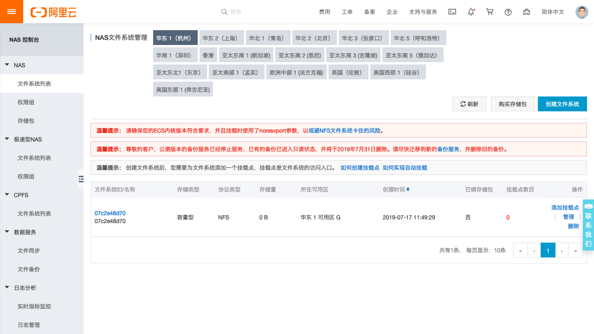
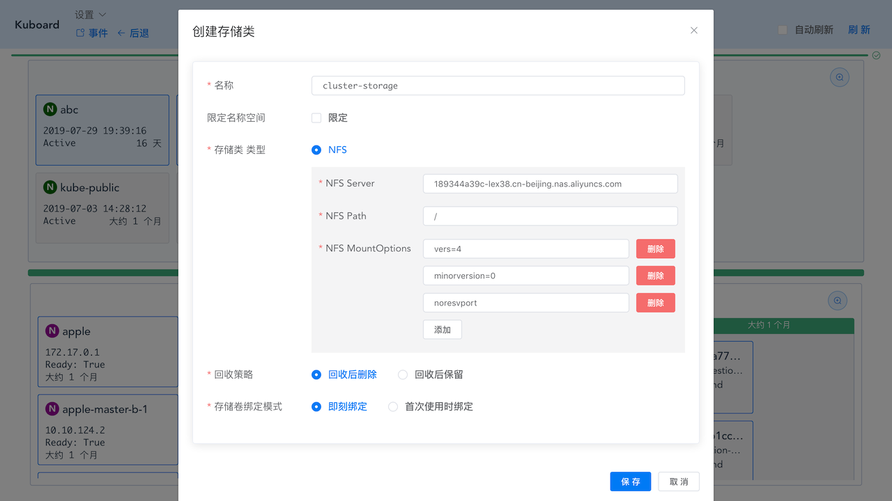
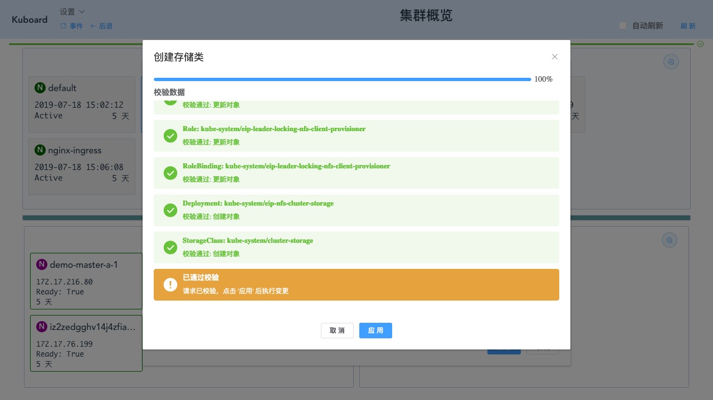

# 存储空间管理

<AdSenseTitle/>

## 创建存储类

前提

必须具备如下条件：

* Kubernetes 集群 （安装在阿里云，本文将使用阿里云的 NFS 服务作为存储资源，Kuboard 也可以运行在其他云环境或者私有环境中。）
* 已在集群中安装 Kuboard

### 在阿里云创建 NAS 服务

如果您在其他 IaaS 供应商搭建了 Kubernetes 集群，请参考该 IaaS 供应商的文档，创建 NFS 服务。您也可以自行搭建 NFS 服务器，用来为 Kubernetes 集群提供存储资源。

* 进入阿里云 ***文件存储 NAS 服务*** 控制台

登录 www.aliyun.com 后，在控制台界面的产品与服务中选择 ***文件存储 NAS***

如下图所示

* 在 ***文件存储 NAS*** 控制台中点击 ***创建文件系统*** 

* 填写表单

| 字段名称 | 填写内容                               | 说明                               |
| -------- | -------------------------------------- | ---------------------------------- |
| 地域     | 请选择您的 Kubernetes 集群所在的地域   | 文件系统所在地域                   |
| 存储类型 | 容量型 / 或 SSD型                      | 测试目的，使用价格便宜的容量型即可 |
| 协议类型 | NFS                                    | 请选择NFS                          |
| 可用区   | 请选择您的 Kubernetes 集群所在的可用区 | 文件系统所在可用区                 |
| 存储包   | 如果当下没有存储包，可以后续绑定       | 不绑定存储包，将无法使用该文件系统 |

* 点击 ***确定***

点击确定后，可查看到该文件系统已创建成功

* 绑定存储包

请自行在阿里云中为该文件系统绑定存储包，如果不绑定存储包，将无法使用该文件系统。

* 点击刚创建文件系统的 ***管理*** 按钮

* 点击 ***添加挂载点***

并填写表单

| 字段名称   | 填写内容                               | 说明           |
| ---------- | -------------------------------------- | -------------- |
| 挂载点类型 | 专有网络                               |                |
| VPC网络    | 请选择您的 Kubernetes 集群所在的VPC    |                |
| 交换机     | 请选择您的 Kubernetes 集群所在的交换机 |                |
| 权限组     | VPC默认权限组（全部允许）              | 请选择全部允许 |

* 点击 ***确定***

点击确定后，将完成挂载点创建，如下图所示：

### 获取 NFS 连接参数

::: tip
您可以使用自己的 NFS 服务，或者其他云供应商的 NFS 服务，具体 NFS 连接参数请参考该 NFS 服务的产品手册。
:::

以阿里云为例，在上图界面中，将 ***V4 Mount*** 的指令复制下来后，如下所示：

  sudo mount -t nfs -o vers=4,minorversion=0,noresvport 189344a39c-lex38.cn-beijing.nas.aliyuncs.com:/ /mnt

其中红色字体的文字为 NFS Server 的地址，蓝色字体的文字为 NFS Path。如下表所示：

| 字段名称     | 字段取值                                     | 说明                           |
| ------------ | -------------------------------------------- | ------------------------------ |
| NFS Server   | 189344a39c-lex38.cn-beijing.nas.aliyuncs.com |                                |
| NFS Path     | /                                            | NFS Server和NFS Path以冒号分隔 |
| mountOptions | vers=4,minorversion=0,noresvport             | 以逗号分隔的数组               |

### 在 Kuboard 创建存储类

* 进入 Kuboard ***集群概览页***

  参考 [访问 Kuboard](/install/v3/install.html?id=访问)

  如下图所示：

* 点击 ***创建存储类***

  填写表单

| 字段名称       | 填写内容        | 说明                                                         |
| -------------- | --------------- | ------------------------------------------------------------ |
| 名称           | cluster-storage | 填写你喜欢的名称                                             |
| 限定名称空间   | 不填写          | 如果限定名称空间， 则在 Kuboard 中，您只能在指定的名称空间中使用该存储类 在 kubectl 中，不受影响 |
| 存储类型       | NFS             | 目前 Kuboard 只支持 NFS，将要增加其他类型的存储，如 CephFS、Cinder 等 |
| 回收策略       | 回收后删除      | 当该存储类创建的 存储卷（Persistent Volume）被删除后，之前该存储卷中的文件可以被：回收后删除 / 回收后保留 |
| 存储卷绑定模式 | 首次使用时绑定  | 即刻绑定：当 存储卷被创建时，就在 NFS 中为其分配空间，并绑定； 首次使用时绑定： 在存储卷被第一次使用到时，才绑定 |

* 点击 ***保存***

* 点击 ***应用***

* 点击 ***完成***

  此时可在存储资源列表中查看到刚创建的存储类

