# 监控 example

<AdSenseTitle/>

## 前提

必须具备如下条件：

* 已完成 [导入 example 微服务](/guide/example/import.html)
* 已配置了 NFS [StorageClass](/learning/k8s-intermediate/persistent/storage-class.html)
* 使用 kuboard-user 这个 ServiceAccount 登录 Kuboard 界面，[kuboard-user](/install/install-dashboard.html#获取token)

## 安装监控套件

* 进入 Kuboard 界面后，点击右上角的 **设置** 按钮（圆形图标），然后在左侧菜单中导航到 **Kuboard** --> **套件**，如下图所示：

  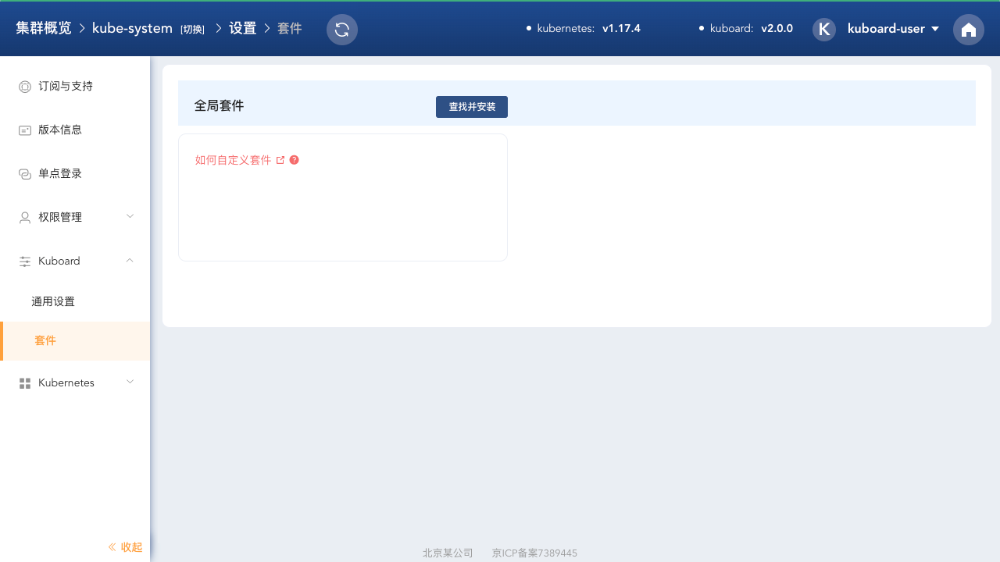

* 点击图中的 **查找并安装** 按钮；

  可以查询到当前套件仓库中的可选套件，如下图所示：

  > 当前只提供了全局资源层监控套件，后续将逐渐提供更丰富的套件功能。

  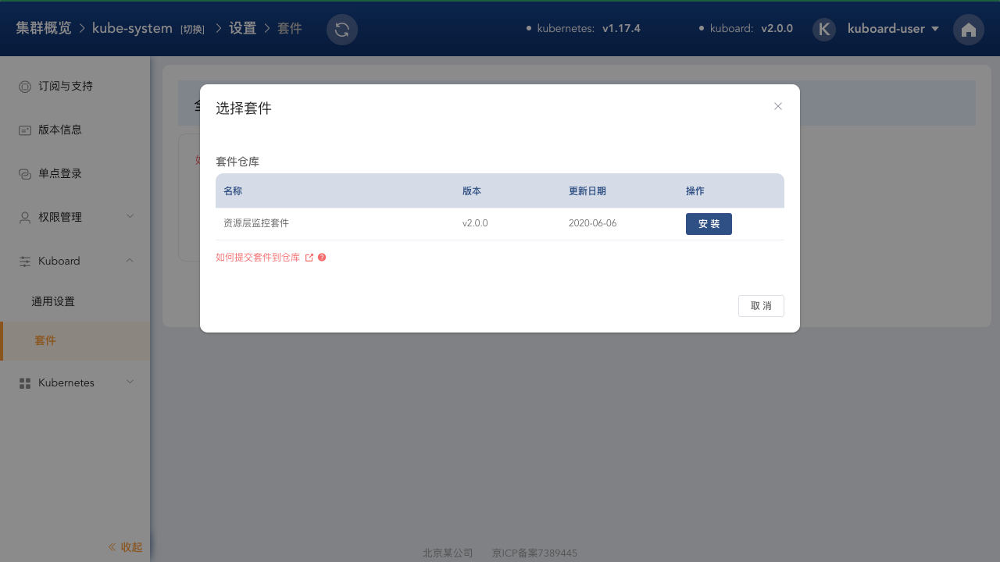

* 点击所选择套件对应的 **安装** 按钮，可将套件所需资源从仓库中加载到您自己的 Kubernetes 集群，并进入该套件的详情页面，如下图所示：

  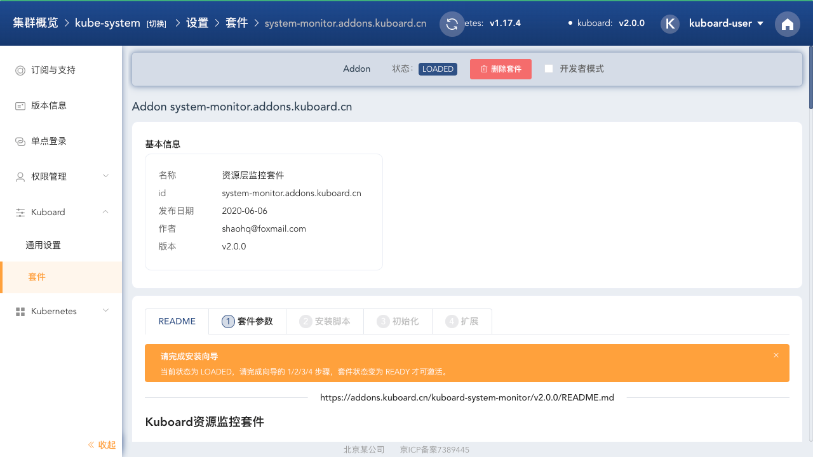

* 点击 **套件参数** Tab 页

  * 在 **套件参数** Tab 页中，调整参数；
  * 按照 **额外步骤** 的提示，执行安装前的必须动作，并勾选 **确认已完成** 按钮
  * 点击 **保存** 按钮

  如下图所示：

  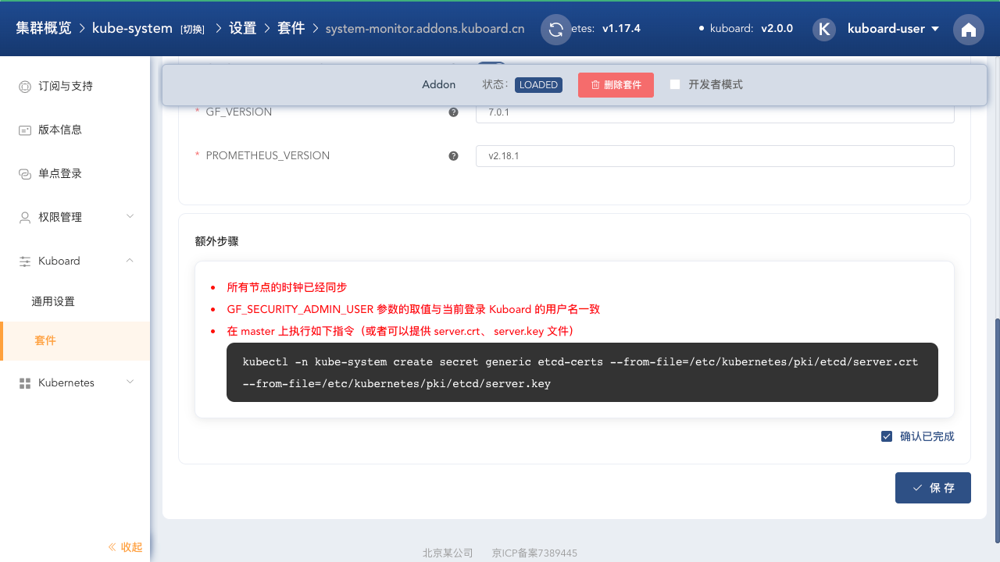

* 在 **套件参数** 页完成保存后，将自动进入 **安装脚本** 页，如下图所示：

  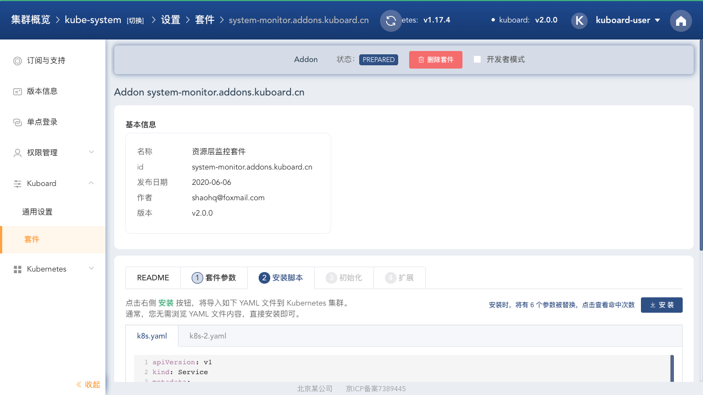

* 点击 **安装** 按钮，进入 **工作负载导入** 界面，将套件所需的 Deployment/Service/ClusterRole 等对象导入到您的 Kubernetes 集群中，如下图所示：

  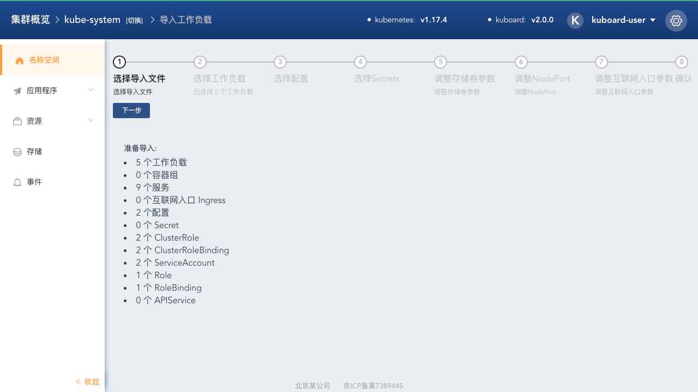

* 请按向导提示，完成套件所依赖对象的导入；

  > * 本文不详细描述此导入过程，请在向导的引导下完成。
  > * 关于第五步，调整存储卷参数，特别说明如下：
  >   * 建议为 monitor-grafana / monitor-prometheus 分别创建新的存储卷声明，需要您事先已经创建好了 [StorageClass](/guide/cluster/storage.html) ；
  >   * 如果您当前没有合适的存储类，为了测试套件的功能，也可以先选择 **emptyDir**，之后再设置合适的存储卷（此时，容器组被删除后，所有的监控数据将丢失）；

  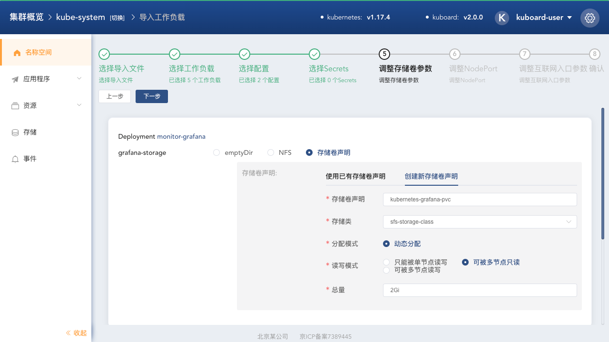

* 完成工作负载导入后，Kuboard 将自动进入套件的 **初始化** 页面，如下图所示：

  * **初始化** 页面将检测所依赖工作负载的就绪情况，如下图所示：

    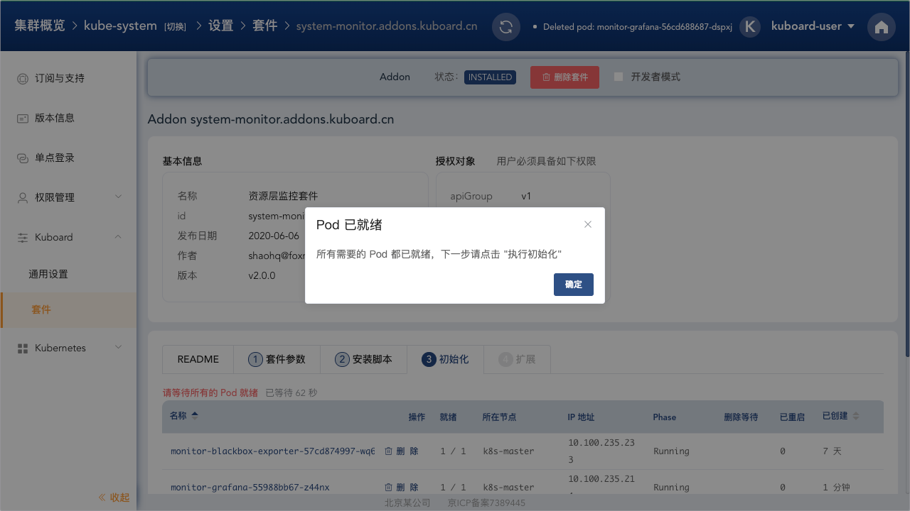

  * 所有被依赖的工作负载就绪之后，将展示初始化时所引用的资源，如下图所示：

    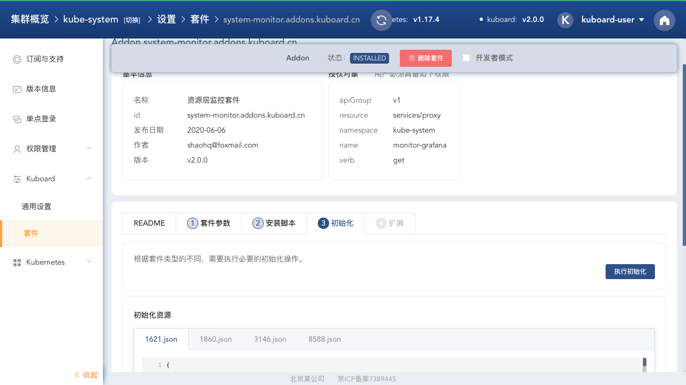

* 点击 **初始化** 页面中的 **执行初始化** 按钮，Kuboard 将完成对 Grafana 的初始化动作，如下图所示：

  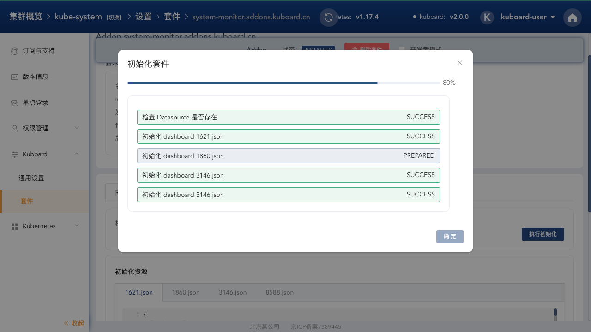

* 点击 **确定** 后，套件详情页将展示该套件支持的 **扩展** 信息，如下图所示：

  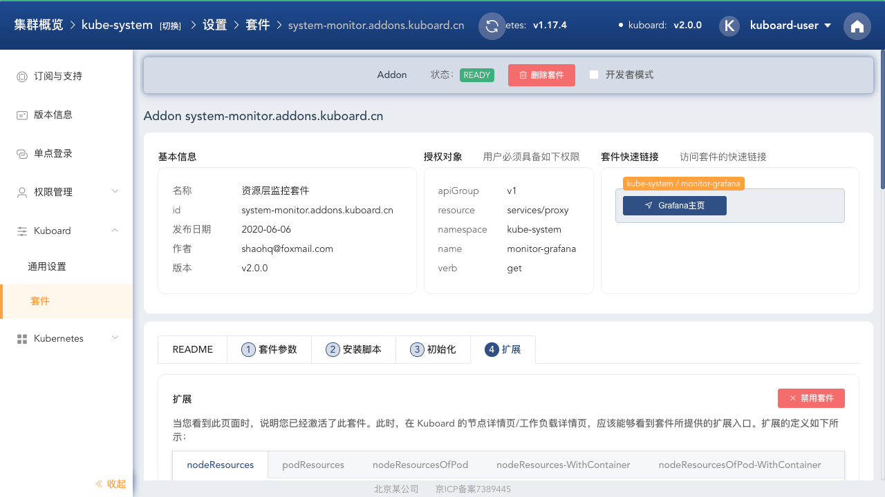

## 查看监控信息

完成此套件安装后，将在 Kuboard 的节点详情页、工作负载详情页显示对应的监控界面入口；

- 节点详情页

  节点详情页增加如下两个监控界面入口：

  - 节点资源监控
  - 节点监控（含节点上的容器组）

  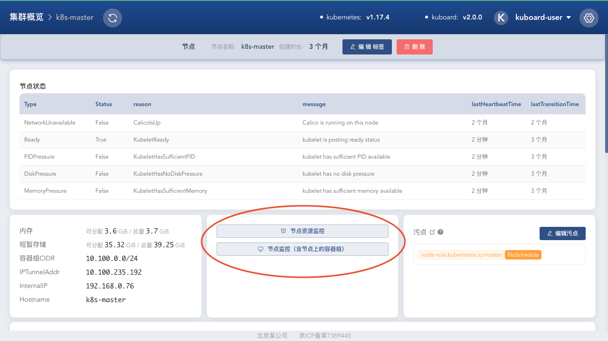

- 工作负载详情页

  工作负载详情页增加如下三个监控界面入口：

  - 容器组监控
  - 所在节点监控
  - 所在节点监控（含节点上的容器组）

  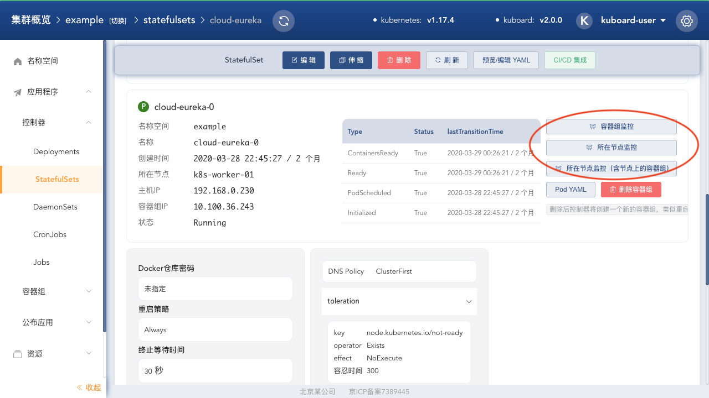

## 直接访问 Grafana 界面

您可能想要自己定义 Grafana 的规则，比如告警通知、授权管理等，如果需要以管理员用户登录到 Grafana 界面，点击下图中的 **Grafana主页** 按钮，即可以当前登录 Kuboard 的用户登录到 Grafana：

关于如何通过 KuboardProxy 访问 Grafana 界面，以及如何实现 Grafana 与 Kuboard 的单点认证，请参考 [KuboardProxy - Auth Proxy](/guide/proxy/auth-proxy.html)

## 开发者模式

在 Kuboard 套件的详情页面，可以点击 **开发者模式** 按钮，此时，您可以修改 Kuboard 套件安装过程的各种脚本，如：

* 增加套件参数
* 修改 YAML 安装脚本
* 修改初始化脚本、添加初始化所需资源
* 添加扩展，修改扩展脚本，实现自定义逻辑
* 修改套件的快速链接

如下图所示：

您还可以将自己的套件提交到套件仓库。

## 授权用户访问套件

请参考具体套件的 **README** 了解如何授权普通用户使用套件。