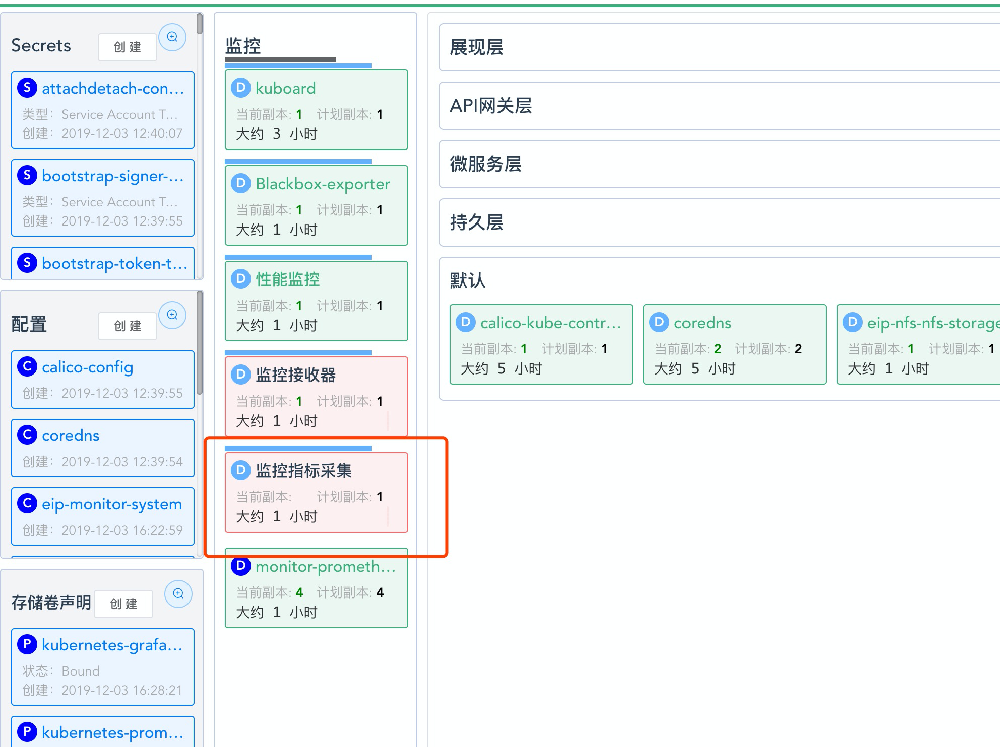
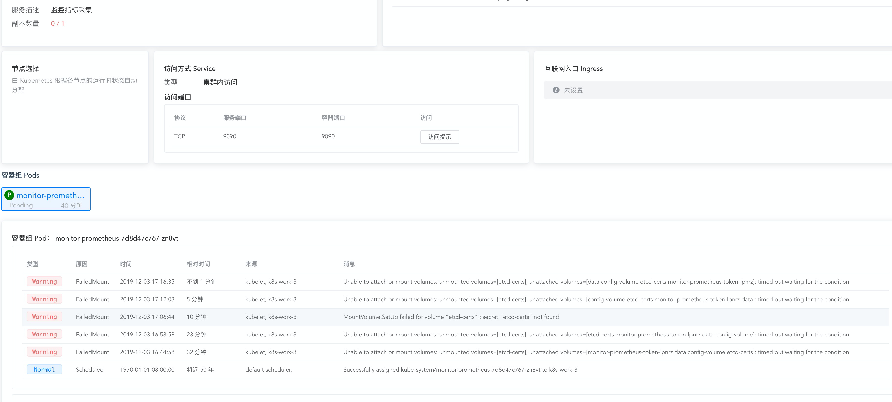

# 监控 example <Badge text="alpha" type="warn"/>

<AdSenseTitle/>

## 前提

必须具备如下条件：

* 已完成 [导入 example 微服务](/guide/example/import.html)
* 已配置了 NFS [StorageClass](/learning/k8s-intermediate/persistent/storage-class.html)

::: warning

监控套件相关的功能目前处于 alpha 状态，虽然在实际投产项目中取得了非常好的效果，但是产品化封装还需要进一步改进。

:::

::: tip
许多网友自己搭建 NFS 测试环境，再创建 NFS存储类，经常碰到 `access denied` 这类权限问题。为了帮助大家更快地完成 NFS 测试环境搭建，Kuboard提供了一篇NFS相关的简明文档，请参考 [搭建NFS Server](/learning/k8s-intermediate/persistent/nfs.html)
:::

假设您已进入 example 名称空间，如下图所示：


## 安装监控套件

### 安装全局监控套件

* 在 master 节点执行 <Badge type="error">此步骤必须执行</Badge>

```bash
kubectl -n kube-system create secret generic etcd-certs --from-file=/etc/kubernetes/pki/etcd/server.crt --from-file=/etc/kubernetes/pki/etcd/server.key
```

* 将鼠标移到 ***设置*** 菜单

  


* 点击 ***监控套件 - example***

  

* 点击 ***全局监控套件 / 查找并安装***

  

* 点击 ***资源层监控套件 / 安装***

  

* 点击 ***全局监控套件 / 资源层监控套件 / 安装***

  

* 根据向导提示，完成工作负载的导入

  

* 点击 ***资源层监控套件 / 初始化***

  ::: danger 需要时间
  由于下载镜像需要时间，您可能需要等待5-10分钟后，才能完成监控套件对应 Pod 的启动。请在所有 Pod 成功启动后再执行初始化。初始化成功的话，您将看到如下提示信息。（如果第一次初始化没有看到 “创建 dashboard 成功” 的消息，可等候一段时间，监控 Pod 启动成功后再“重新初始化”）
  :::

  

<FrequentQuestion fqId="example-monitor-faq">

#### etcd-secrets未找到

在 `kube-system` 名称空间中，查看到 `监控指标采集` 这个部署出现错误，如下图所示：



点击查看详情后，提示 `etcd-secrets not found`，如下图所示： 



此错误出现的原因是，您忽略了本文最开始时要求的一个步骤 [在master节点执行](#安装全局监控套件)，此时，您只需补充该步骤即可：在master节点执行如下命令
```sh
kubectl -n kube-system create secret generic etcd-certs --from-file=/etc/kubernetes/pki/etcd/server.crt --from-file=/etc/kubernetes/pki/etcd/server.key
```


</FrequentQuestion>

### 安装名称空间监控套件

  ::: danger 提示

  名称空间监控套件目前还未达到产品化的程度。您可以体验一下具体的使用，如需要定制到自己的项目上，请联系 Kuboard 作者。

  :::

* 点击 ***名称空间监控套件 example / 查找并安装***

  

* 重复前述过程，安装监控套件

  重复前述过程，完成如下监控套件的安装和初始化：

  * Pinpoint 监控套件
  * Prometheus 监控套件
  * 熔断及限流 Sentinel

  安装完成后，界面如下图所示：

  

### 查看监控套件的工作负载

* 点击 ***后退***

  回到名称空间后，可查看到刚才安装监控套件时导入的监控层工作负载。

  > 全局监控套件安装在 kube-system 名称空间

  

## 重启 example 容器组

* 点击导航栏中的 ***容器组列表***

  在筛选条件中选择

  * 展现层
  * 网关层
  * 服务层
  * 持久层
  * 中间件

  并点击刷新
  
  > * Kuboard 创建工作负载时，默认将其 imagePullPolicy 设置为 **Always**；
  >
  > * 删除容器组时，Kubernetes 将为该工作负载启动一个新的容器组，以尽可能地使工作负载的容器组数量等于该工作负载期望的副本数（replicas）；
  > * Kubernetes 在启动容器组时，根据 imagePullPolicy 的设置 Always，将会尝试从镜像仓库抓取最新镜像，这一特性，可以用于开发环境和测试环境的版本更新，因为您的 devops 系统肯能不会为 daily build 生成新的镜像标签；
  > * 此处删除容器组的目的是，重新启动容器，以便容器中的监控探针能够检测到其对应监控套件的存在。

  

* 在列表中选择

  选中如下容器组：

  * cloud-eureka-0

  * db-example-xxxxxx-xxxx

  * gateway-example-xxxxxx-xxxx

  * svc-example-xxxxxx-xxxx

  * web-example-xxxxxx-xxxx

  

* 点击 ***删除*** 按钮

  


* 点击 ***确定***

  


* 点击 ***应用***

  

* 等待，直到容器组调整完成

  

* 点击 ***后退***

  

## 查看监控信息

### 查看资源层监控信息

* 点击 ***展现层 / web-example***

  如果您在下图中没有看到 ***Nginx 监控***， ***容器组监控*** 等，请刷新您的页面，因为监控套件初始化之后需要刷新页面才能加载并显示。<Badge type="error">刷新很重要</Badge>

  

* 点击 ***所在节点监控***

  可查看所在节点的资源使用情况监控信息

  


### 查看中间件层监控信息

#### 查看 Nginx 监控

* 点击 Nginx 监控

  


#### 查看 MySQL 监控

* 返回 ***example*** 名称空间
* 点击 ***持久层 / example db***
* 点击 ***MySQL 监控***

  


#### 查看 JVM 监控

* 返回 ***example*** 名称空间
* 点击 ***微服务层 / example***
* 点击 ***Java 虚拟机监控***

  


### 查看链路追踪监控信息

* 在 ***微服务层 / example*** 中点击 ***链路追踪***

  


  

## 直接访问全局监控

如果想要直接访问全局监控的 Grafana 界面（通常并不需要这么做），url 如下所示：

```
http://任意节点IP:32567/eip-monitor/namespace/kube-system/service/monitor-grafana/port/3000/login
```

* 用户名为： `admin`
* 密码为：  `jmx09KT23BClpa7xzs`

::: warning Grafana密码
* 全局监控的产品化程度已经比较高，但是，目前仍然为解决安装全局监控时，自定义 grafana 用户名和密码的问题。请使用者知晓。
* 目前的建议是：
  * 将 Kuboard 的访问通路做成相对私有化的方式，例如只能通过 vpn 访问
  * 完成全局监控的安装之后，登录 grafana，并手工修改 grafana 密码
:::
