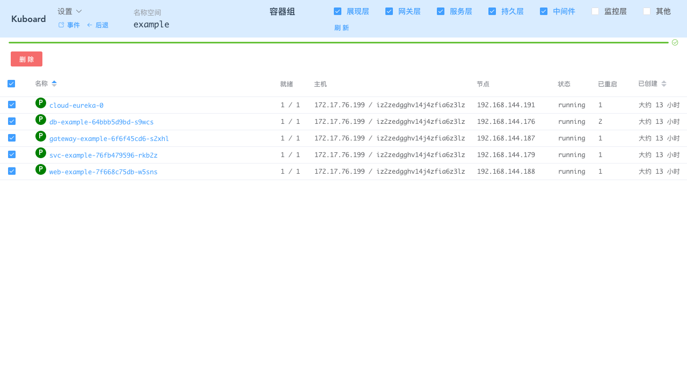
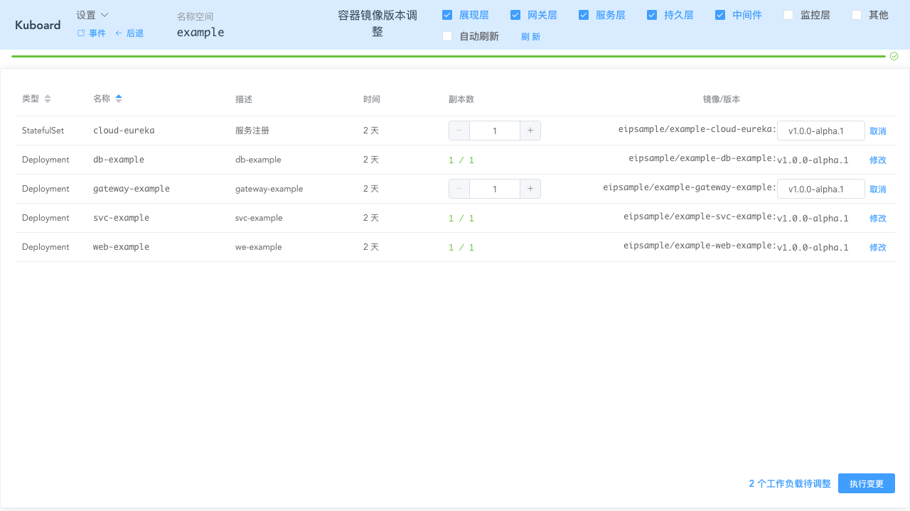
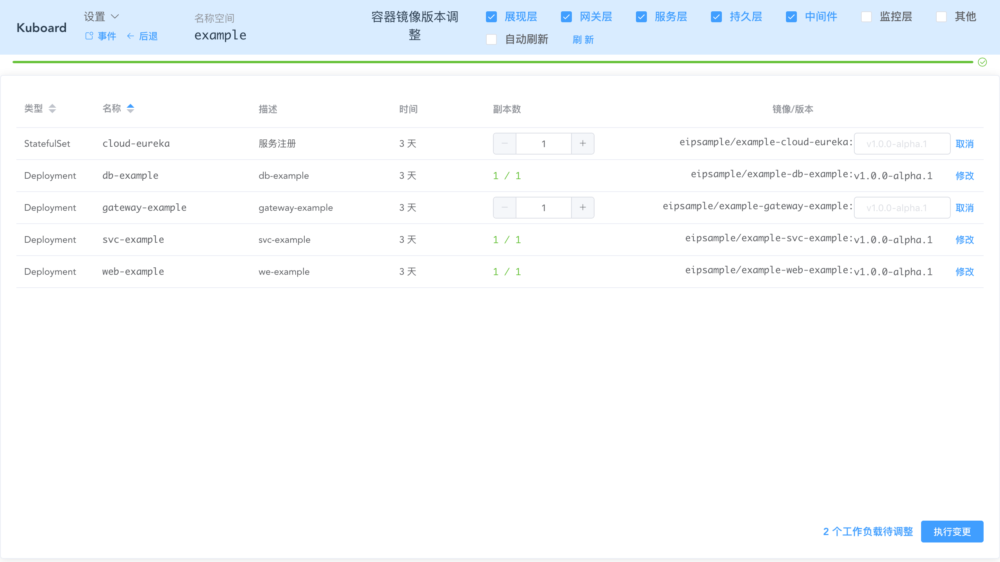

# 日常调整

## 前提

必须具备如下条件：

* Kubernetes 集群 

* 已在集群中安装 Kuboard

假设您一进入 ***example*** 名称空间页面，如下图所示：

## 批量删除容器组

批量删除容器组特别适用于 **开发测试环境的版本更新** 场景，描述如下：

* 开发/测试环境中，开发人员提交代码
* DevOps环境自动构建出 docker 镜像，并将 docker 镜像推送到仓库；
  * 如果您的 devops 环境只在生成新的 branch 或者 tag 时，生成镜像的新 version，那么原镜像标签的实际镜像已发生改变。
* 从 Kubernetes 中删除该镜像的 容器组
* Kubernetes 创建新的 容器组，并且该容器组重新从镜像仓库拉取最新的镜像

在 Kuboard 中，***批量删除容器组*** 的操作步骤为：

* 在名称空间页面点击 ***容器组列表***

  * 选择要筛选的应用分层，并点击刷新，

  * 选择要删除的容器组

  如下图所示：

* 点击 ***删除*** 按钮

* 点击 ***确定***

* 点击 ***应用***

* 点击 ***完成***

  并等待，直到 kubernetes 完成对容器组的调整操作

  > Kuboard 会自动监听 kubernetes 执行此调整操作时的变化，您无需刷新页面，只要等待结果即可。

## 批量调整镜像版本

批量调整镜像版本适用于如下场景：

* 需要更新容器所使用的镜像的版本号

  通常是经过测试的版本，且 DevOps 环境在构建镜像时，为其生成了新的版本号

批量调整镜像版本的操作如下：

* 在名称空间页面点击 ***调整镜像版本***

* 在要调整的镜像上点击 ***修改*** 

  并填写新的镜像版本号，如下图所示：

* 点击 ***执行变更***

* 点击 ***应用***

* 点击 ***完成***

  此时会进入容器组列表界面，请等待 Kubernetes 完成对容器组的调整（无需刷新页面）

## 批量调整工作负载的副本数

***调整容器镜像版本*** 的功能界面中，也可以用来调整工作负载的副本数，如下图所示：

