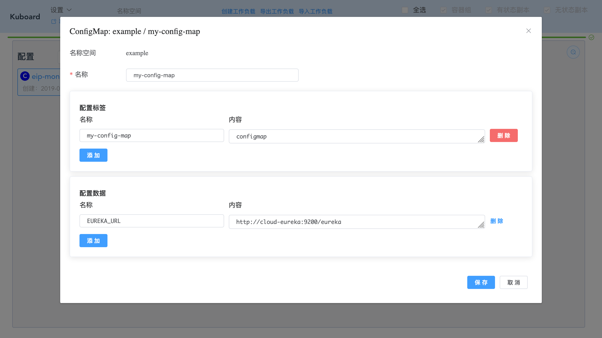
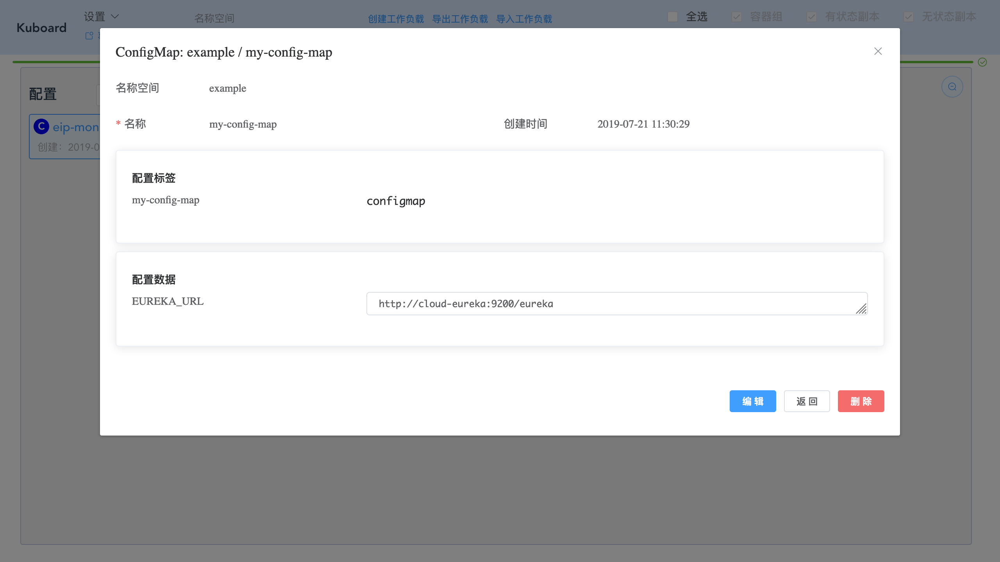

# 配置

配置： Kubernetes ConfigMap

# 查看配置列表

假设您已进入名称空间界面，如下图所示：

配置列表位于图中左侧中部，点击 ***放大*** 按钮，可以将列表显示到更大的区域，如下图所示：

> 点击 **配置** 可以刷新该列表

# 创建配置

* 点击 ***配置 / 创建***

  填写表单如下所示：

| 字段名称        | 填写内容                        | 说明 |
| --------------- | ------------------------------- | ---- |
| 名称            | my-config-map                   |      |
| 配置标签 - 名称 | my-config-map                   |      |
| 配置标签 - 内容 | configmap                       |      |
| 配置数据 - 名称 | EUREKA_URL                      |      |
| 配置数据 - 内容 | http://cloud-eureka:9200/eureka |      |

* 点击 ***保存***

  配置信息创建成功

# 查看/编辑/删除 配置

* 点击列表中的 ***my-config-map***

编辑、删除操作可直接按照提示完成
