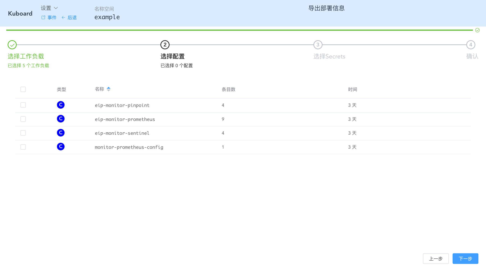

# 多环境

在实际开发项目的过程中，我们必然会碰到如下场景：

1. 创建一个开发环境，并在其中完成应用部署
2. 创建一个测试环境，再次完成应用部署
3. 创建一个准上线环境，再次完成应用部署
4. 创建一个生产环境，再次完成应用部署


当我们的微服务系统较为复杂时，一个环境中可能需要部署许多（几十个甚至更多）的微服务部署单元，这个时候，重复在多套环境中执行部署任务就会变得容易出错。


Kuboard 针对这种场景，提供了导出配置、导入配置的功能，以便运维人员可以轻易的复制多套部署环境。


## 导出配置

### 前提

必须满足如下条件：

* 您已经通过 kuboard 的 [创建工作负载](/guide/namespace/workload.html) 功能完成了微服务的部署。

> 部署微服务过程中，您还可能用到 kuboard 的配置编辑功能、Secrets 编辑功能 等。

假设您已完成微服务部署，并已进入 namespace 界面，如下图所示：


### 操作步骤

* 点击 ***导出工作负载***
  * 选择要导出的分层
  * 点击 ***刷新***
  * 选择要导出的工作负载


* 点击 ***下一步***

  选择要导出的配置（configMap）信息



* 点击 ***下一步***

  选择要导出的 Secrets


* 点击 ***下一步***


* 点击 ***确定***


* 查看已导出文件

  导出文件的命名格式为 kuboard_namespace_date_time.yaml，例如：

  kuboard_example_2019_07_21_09_09_47.yaml
  
  导出文件的内容如下所示：
  
  ```yaml
  ---
  apiVersion: apps/v1
  kind: StatefulSet
  metadata:
    namespace: example
    name: cloud-eureka
    annotations:
      k8s.eip.work/workload: cloud-eureka
      k8s.eip.work/displayName: 服务注册
      k8s.eip.work/service: ClusterIP
      k8s.eip.work/ingress: 'true'
    labels:
      k8s.eip.work/layer: cloud
      k8s.eip.work/name: cloud-eureka
  spec:
    selector:
      matchLabels:
        k8s.eip.work/layer: cloud
        k8s.eip.work/name: cloud-eureka
    template:
      metadata:
      ...
  ```

> 该文件可以通过 kubectl apply -f 命令直接执行，但是建议使用 kuboard 进行导入，以便在导入时在线编辑在特定于新环境的配置信息。


## 导入配置

### 前提

您已经通过 kuboard 导出了配置文件，或者从别处获取到 kuboard 导出的配置文件


### 操作步骤

请参考 [导入 example 微服务](/guide/example/import)


