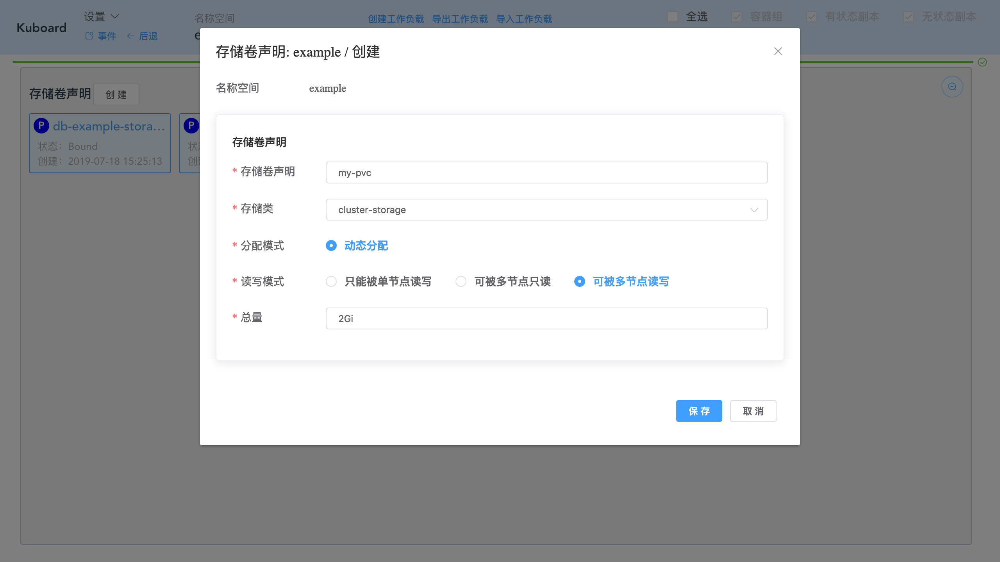

# 存储卷声明

<AdSenseTitle/>

存储卷声明： Kubernetes Persistent Volume Claim

# 查看存储卷声明列表

假设您已进入名称空间界面，如下图所示：

存储卷声明列表位于图中左下角，点击 ***放大*** 按钮，可以将列表显示到更大的区域，如下图所示：

> 点击 **存储卷声明** 可以刷新该列表

# 创建存储卷声明

* 点击 ***存储卷声明 / 创建***

  填写表单如下：

| 字段名称   | 填写内容        | 说明                                                         |
| ---------- | --------------- | ------------------------------------------------------------ |
| 存储卷声明 | my-pvc          |                                                              |
| 存储类     | cluster-storage | 如果不存在，则需要提前 [创建存储类](/guide/cluster/storage.html?id=创建存储类) |
| 分配模式   | 动态分配        |                                                              |
| 读写模式   | 可被多节点读写  |                                                              |
| 总量       | 2Gi             |                                                              |

* 点击 ***保存***

  存储卷声明创建成功

# 查看/编辑/删除 存储卷声明

* 点击 ***my-pvc***

编辑、删除操作可直接按照提示完成
