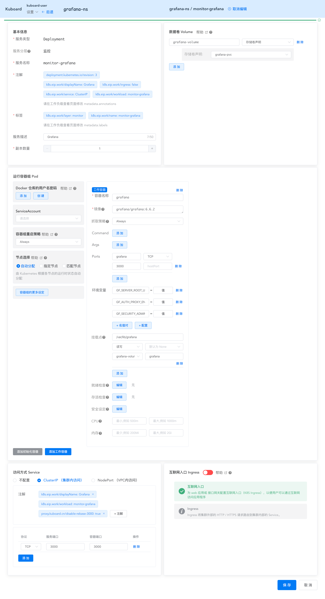

# Kuboard Proxy - Auth Proxy

<AdSenseTitle/>

Kuboard Proxy 提供了 Auth Proxy 的功能，本文以 Grafana 为例，介绍如何使用 Kuboard Proxy 实现 Grafana 与 Kuboard 的单点登录。

参考 [Grafana Auth Proxy Authentication](https://grafana.com/docs/grafana/latest/auth/auth-proxy/) ，我们知道 Grafana 支持多种认证登录方式（Auth Proxy、LDAP、OAuth、Goole、Azure AD、GitHub、GitLab、SAML 等），Auth Proxy 是其中的一种。

一般来说，使用 Auth Proxy，需要在反向代理服务器（Nginx、Apache等）上配置复杂的参数。本文描述了，如何使用 Kuboard Proxy 的功能配置 Grafana Auth Proxy 的步骤。

[[TOC]]

## 前提

* 您已经安装了 Kubernetes 集群（不低于 v1.13），如果没有，请参考 [安装 Kubernetes 单 Master 节点](/install/install-k8s.html)；
* 您已经安装了 Kuboard （不低于 v1.0.7.1），如果没有，请参考 [安装 Kuboard](/install/install-dashboard.html)

## 安装 Grafana

* 创建 `grafana-ns` namespace；

  参考 [名称空间管理](/guide/cluster/namespace.html)

* 在名称空间 `grafana-ns` 中创建 `grafana-pvc` 存储卷声明；

  参考 [创建存储卷声明](/guide/namespace/pvc.html)

* 在名称空间 `grafana-ns` 中创建 `grafana` 工作负载；

  点击 ***创建工作负载*** 按钮，并填写如下表单：

  | 区块     | 字段名称                 | 填写内容                                                     | 字段说明                                                     |
  | -------- | ------------------------ | ------------------------------------------------------------ | ------------------------------------------------------------ |
  | 基本信息 | 服务类型                 | Deployment                                                   |                                                              |
  |          | 服务分层                 | 监控层                                                       |                                                              |
  |          | 服务名称                 | monitor-grafana                                              |                                                              |
  |          | 服务描述                 | Grafana                                                      |                                                              |
  |          | 副本数量                 | 1                                                            |                                                              |
  | 数据卷   | 数据卷名称               | grafana-volume                                               |                                                              |
  |          | 数据卷类型               | 存储卷声明                                                   |                                                              |
  |          | 存储卷名称               | grafana-pvc                                                  |                                                              |
  | 工作容器 | 容器名称                 | grafana                                                      |                                                              |
  |          | 镜像                     | grafana/grafana:6.6.2                                        |                                                              |
  |          | 环境变量                 | GF_SERVER_ROOT_URL= /proxy/http/grafana-ns/monitor-grafana/:/3000/ | Kuboard Proxy 代理后的 web 路径                              |
  |          | 环境变量                 | GF_AUTH_PROXY_ENABLED=true                                   | 为 Grafana 启用 Auth Proxy 认证方式                          |
  |          | 环境变量                 | GF_SECURITY_ADMIN_USER=kuboard-user                          | 将 `kuboard-user` 设置为 Grafana 的默认管理用户              |
  |          | 挂载点 -> 容器内路径     | /var/lib/grafana                                             | 将 grafana 产生的数据存储到数据卷中，避免 grafana 重启后，配置的随容器的销毁而丢失 |
  |          | 挂载点 -> 数据卷         | grafana-volume                                               |                                                              |
  |          | 挂载点 -> 数据卷内子路径 | grafana                                                      |                                                              |
  | 访问方式 | Service类型              | ClusterIP                                                    |                                                              |
  |          | Port -> 协议             | TCP                                                          |                                                              |
  |          | Port -> 服务端口         | 3000                                                         |                                                              |
  |          | Port -> 容器端口         | 3000                                                         | Grafana 的默认端口为 3000                                    |
  
	> Kuboard Proxy 代理后的路径格式如下：
	>
	> /proxy/\<protocol>/\<namespace>/\<service-name>/:/\<port>/
	> * **protocol**： 为容器内应用所接受的传输协议，可选值为 http / https；
	> * **namespace**：被代理对象所在的名称空间；
	> * **service-name**：被代理 Service 的名称；
	> * **port**：目标端口
  

  
  截图如下所示：
  
  

## 配置 Kuboard Proxy

* 完成 Grafana 的部署以后，进入到 `monitor-grafana` 的工作负载查看界面；

* 在工作负载查看页面点击 ***访问方式 Service*** 区域中的 ***代理*** 按钮；

* 点击 ***代理配置信息*** 后的 ***修改*** 按钮，修改 Kuboard Proxy 的代理配置；

  填写表格：

  | 字段名称            | 填写内容         | 填写说明                                                     |
  | ------------------- | ---------------- | ------------------------------------------------------------ |
  | 用户名添加到 Header | X-WEBAUTH-USER   | Grafana Auth Proxy 从请求头中的 X-WEBAUTH-USER获取到当前登录用户的信息；填写此字段后，Kuboard Proxy 会始终将当前登录 Kuboard 的用户名写入到发现后端服务的 HTTP 请求头中，因此，可实现从 Kuboard 到 Grafana 的单点登录 |
  | 组名添加到 Header   | X-WEBAUTH-GROUPS | 同上，但是用于从 KuboardProxy 向 Grafana 传递用户所属分组的信息。 Grafana 只在企业版中处理此字段，请参考 [Team Sync](https://grafana.com/docs/grafana/latest/auth/auth-proxy/#team-sync-enterprise-only) |
  | Cookie TTL          | 空白             | 默认使用环境变量 KUBOARD_PROXY_COOKIE_TTL 的取值，或者 36000 |
  | 禁用 Rebase         | 禁用             | Grafana 系统中配置了环境变量 `GF_SERVER_ROOT_URL` ，并且 Grafana 可以正确处理 web 上下文因此，无需在 Kuboard Proxy 中做 [Rebase](./rebase.html) |

  > 由于 Grafana 只在企业版中处理 X-WEBAUTH-GROUPS 字段，如果您使用的是 Grafana 社区版，请自行在登录后的 Grafana 中配置 Teams 信息。

  截图如下所示：

  

* 填写完成后，点击 ***确定*** 按钮，保存表单。

  > KuboardProxy 的配置信息存储在 Service 的注解 annotation 中。

## 访问 Grafana

* 完成 Grafana 的部署以后，进入到 `monitor-grafana` 的工作负载查看界面；

* 在工作负载查看页面点击 ***访问方式 Service*** 区域中的 ***代理*** 按钮；

* 点击 ***在浏览器窗口中打开*** 按钮，即可在新窗口中打开 Grafana 界面。

  如果您使用 kuboard-user 登录，则您在 Grafana 中是系统管理员的角色，可以对 Grafana 做任何配置，截图如下所示：

  

## 直接导入

本文所创建的 Grafana 部署可以直接导入：
* 请在此处下载 <a :href="$withBase('/statics/guide/proxy/kuboard_grafana_proxy_demo.yaml')" download="kuboard_grafana_proxy_demo.yaml">kuboard_grafana_proxy_demo.yaml</a> ；
* 请参考 [导入 example 微服务](/guide/example/import.html) 了解如何在 Kuboard 中导入配置。
