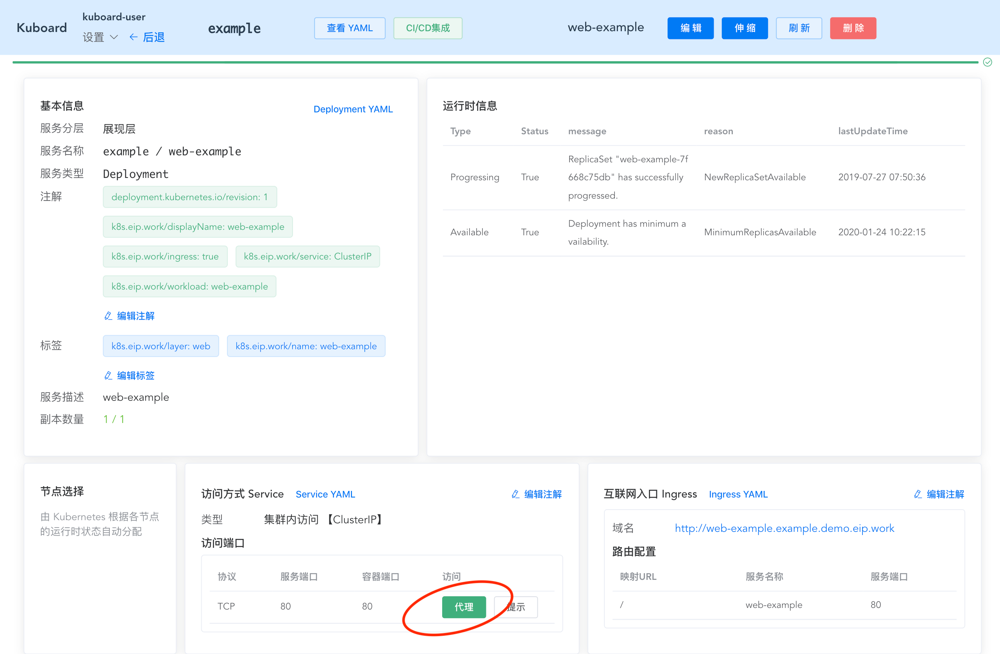
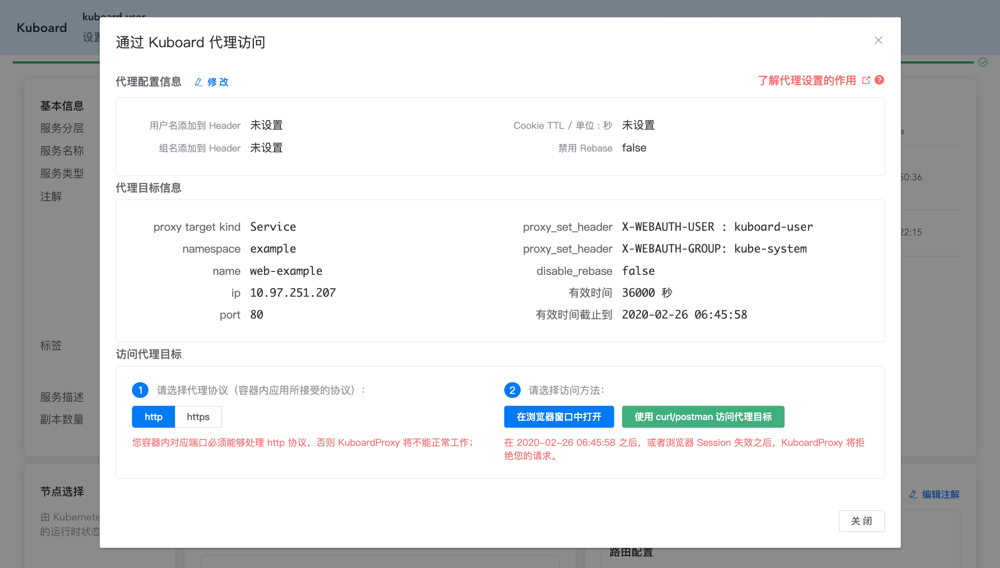
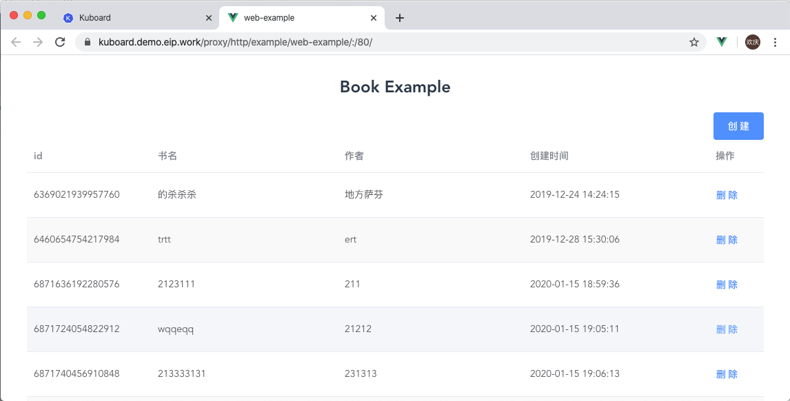
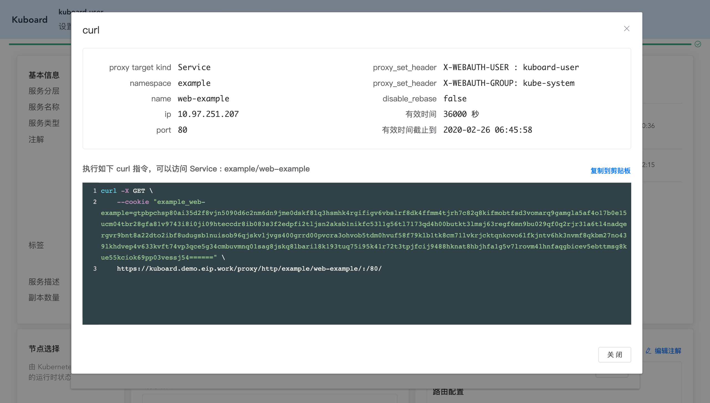
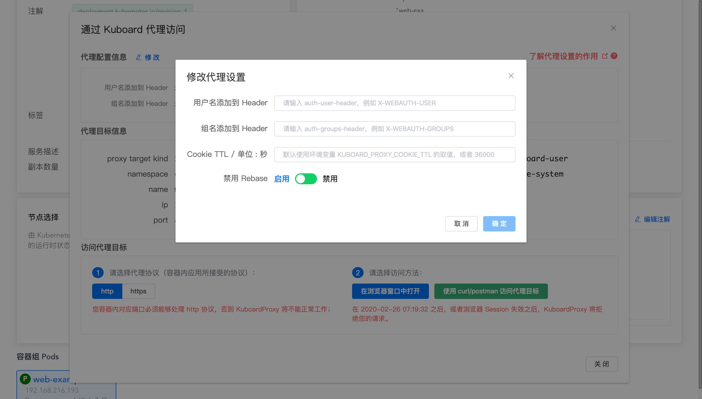

# Kuboard Proxy

<AdSenseTitle/>

借助 Kuboard Proxy，登录 Kuboard 的用户可以直接访问 Service/Pod，而无需为 Service 做额外的 NodePort、Ingress 等配置。Kuboard Proxy 是 `kubectl proxy` 命令一种替代选项。

与 `kubectl proxy` 相比：
* 用户可以直接在 Kuboard 界面进行操作，而无需使用命令行；
* 用户权限控制；
* 支持更加细致的 rebase 控制；
* 可以对接支持 Auth-Proxy 认证方式的后端服务，实现单点登录，例如 [Grafana](https://grafana.com/docs/grafana/v6.5/auth/auth-proxy/)。

本文后面的章节将描述 Kuboard Proxy 的基本使用方法。并有另外三篇文档对 Kuboard Proxy 做进一步的阐述：
* [授权用户访问 Kuboard Proxy](./authorization.html)
* [为什么我的网页通过 Kuboard Proxy 代理后显示不正常 - Rebase - （少数情况）](./rebase.html)
* [通过 Auth-Proxy 实现 Grafana 与 Kuboard 的单点登录](./auth-proxy.html)

## 使用 Kuboard Proxy 访问 Service

按照如下步骤，可以非常方便地使用 Kuboard Proxy：

* 进入工作负载查看页面，此处以 [导入 example](../example/import.html) 中导入的 web-example 作为例子，如下图所示：

  

  如果您看不到图中的 ***代理*** 按钮，很可能是您的 Kuboard 版本低于 v1.0.7-beta.4；也可能是因为您没有该Service 的 `service/proxy` 对应的权限，请参考 [授权用户访问 KuboardProxy](./auth-proxy.html)

* 点击上图中的 ***代理*** 按钮，将打开如下代理发现界面：

  界面中显示了三个区域：

  * KuboardProxy 代理配置信息，点击 ***修改*** 按钮后可以 [修改KuboardProxy配置](#修改KuboardProxy代理配置)；
  * KuboardProxy 代理发现信息（显示了此次所获得 Token 的有效期）；
  * 访问代理目标（显示了代理的进一步操作区）：
    * 选择代理协议，此处支持 `http`、 `https` 两种选择，该协议要访问的容器内端口所支持的协议；
    * 选择访问方法，可以直接在浏览器中打开网页，也可以通过 crul/postman 等测试工具调用容器内的 restful 接口。

  

* 通过代理访问目标 Service

  * 点击 ***在浏览器窗口中打开*** 按钮，将直接打开一个新窗口，并显示目标页面，如下所示：

    

  * 点击 ***使用 curl/postman 访问目标代理***，将显示如下对话框：

    复制对话框中的代码，并在命令行终端执行，可以获得代理目标服务返回的响应。

    > 这种做法在进行 API 测试时非常方便。

    

## 修改KuboardProxy代理配置

KuboardProxy代理的设置有：

* 环境变量
  * 全局生效；
* 代理设置
  * 只针对 Service/Pod 的单个端口代理生效；

### 环境变量

与 KuboardProxy 相关的环境变量有如下两个：

| 名称                     | 变量类型 | 默认值 | 描述                                                         |
| ------------------------ | -------- | ------ | ------------------------------------------------------------ |
| KUBOARD_AUTH_ENCRYPT_KEY | String   | 随机   | <li>如果不配置，每次重启 Kuboard 时，随机生成；</li><li>如果配置，该字段必须为一个长度为32的字符串，可以由字母和数字组成；</li><li>Kuboard 使用 [AES-256算法](https://www.zhihu.com/question/34563299/answer/59176478) 生成加密 Cookie，客户端使用此 Cookie，可以通过 KuboardProxy 认证，并实现代理访问；</li><li>当您的 Kuboard 副本数大于 1 时，请务必配置此参数，否则不同 Kuboard 副本的 ENCRYPT_KEY 不同时，Kuboard Proxy 将不能正常工作；</li> |
| KUBOARD_PROXY_COOKIE_TTL | Long     | 36000  | <li>单位秒，默认值为36000（即10小时）；</li><li>访问代理时，所用 cookie 的有效时长；</li><li>如果 Service/Pod 上没有特殊配置，则使用此处的设置。</li> |


### 代理配置

在 KuboardProxy 对话框上，点击 ***修改*** 按钮，可以修改针对该端口的 KuboardProxy 设置参数，如下图所示：



可以配置的参数有：

| 名称                  | 类型    | 默认值                                        | 描述                                     |
| --------------------- | ------- | --------------------------------------------- | ---------------------------------------- |
| 用户名添加到 Header   | String  | X-WEBAUTH-USER                                | [Auth-Proxy](./auth-proxy.html) 重要参数 |
| 组名添加到 Header     | String  | X-WEBAUTH-GROUP                               | [Auth-Proxy](./auth-proxy.html) 重要参数 |
| Cookie TTL / 单位：秒 | Long    | 环境变量KUBOARD_PROXY_COOKIE_TTL<br />或36000 | Cookie 的有效时长                        |
| 禁用 Rebase           | Boolean | false                                         | 禁用 [Rebase](./rebase.html)             |


## 使用 Kubectl Proxy

使用 `kubectl proxy` 之前，请确保您已经 [在客户端配置 kubectl](/install/config-kubectl.html)。如果已经配置，可按照如下步骤使用 `kubectl proxy`。

* 执行命令以启动 `kubectl proxy` 程序

  ``` sh
  kubectl proxy
  ```

* 通过代理访问您的服务/Pod：
  
  * 以上述 `example` 名称空间的 Service `web-example` 为例，如需要使用 http 协议访问该 Service 的 80 端口，实现上面使用 Kuboard Proxy 的例子中一样的访问效果，请在浏览器打开如下链接：

  ```
  http://localhost:8001/api/v1/namespaces/example/services/http:web-example:80/proxy/
  ```
