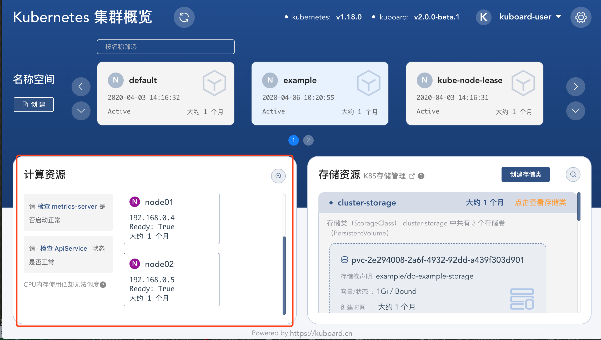

# Metrics server 常见问题

<AdSenseTitle/>

## 问题现象描述

[Metrics server](https://github.com/kubernetes-sigs/metrics-server) 是 Kubernetes 中的一个重要组件，但是却不是内置组件。Kubernetes 许多特性都依赖于 metrics server，

* `kubectl top nodes` / `kubectl top pods` 指令，查看节点/容器组的资源利用率；
* Kuboard 集群概览页显示节点资源利用率；
* HPA 水平自动伸缩，依据节点/容器组资源利用率情况自动执行水平伸缩；


当 metrcis-server 出现异常时，相关依赖组件都会受到影响，例如：

* 执行 kubectl top nodes 指令失败

  ```sh
  # kubectl top nodes
  Error from server (ServiceUnavailable): the server is currently unable to handle the request (get nodes.metrics.k8s.io)
  ```

* Kuboard 不能显示计算资源利用率情况

  


## 诊断

### 确认 metrics-server 是否正常运行

在上图截图中，点击 **检查 metrics-server** 按钮，查看 metrics-server 的运行状态，如果 metrics-server 运行不正常，请先解决此问题；

### 确认 ApiService 是否正常

在上图截图中，点击 **检查 ApiService** 按钮，查看 metrics-server 对应的 ApiService 状态，常见的错误如下所示：

```yaml {25-30}
apiVersion: apiregistration.k8s.io/v1
kind: APIService
metadata:
  annotations:
  ...
  creationTimestamp: '2020-04-03T07:18:41Z'
  name: v1beta1.metrics.k8s.io
  resourceVersion: '9256'
  selfLink: /apis/apiregistration.k8s.io/v1/apiservices/v1beta1.metrics.k8s.io
  uid: edcb1d41-d625-4b0c-bfd9-9049d3e3421e
spec:
  group: metrics.k8s.io
  groupPriorityMinimum: 100
  insecureSkipTLSVerify: true
  service:
    name: metrics-server
    namespace: kube-system
    port: 443
  version: v1beta1
  versionPriority: 100
status:
  conditions:
    - lastTransitionTime: '2020-04-03T07:18:41Z'
      message: >-
        failing or missing response from
        https://10.96.106.114:443/apis/metrics.k8s.io/v1beta1: Get
        https://10.96.106.114:443/apis/metrics.k8s.io/v1beta1: net/http: request
        canceled while waiting for connection (Client.Timeout exceeded while
        awaiting headers)
      reason: FailedDiscoveryCheck
      status: 'False'
      type: Available
```

出现这个错误，是因为您的 Kubernetes ApiServer 不能访问到 metrics-server，通常可能是因为如下几类原因：
* 使用二进制安装方式安装 Kubernetes 集群，但是未在 Master 节点上启用 kube-proxy 组件；
* master 节点与 metrics-server 所在的 worker 节点之间有防火墙，或者不在同一个安全组；

请根据您集群的实际情况做出对应调整后，在 master 节点上执行如下指令，验证网络连通性：
``` sh
# 具体 URL 请从您自己实际得到的消息提示中获得
curl -ik https://10.96.106.114:443/apis/metrics.k8s.io/v1beta1
```

在网络连通性问题解决后，通常等待 1 分钟左右，就可以正常执行 `kubectl top nodes` 指令，刷新 Kuboard 主页后，也将能够正常显示节点资源利用率情况。

### 其他问题

如果按照上述步骤未能解决您所碰到的 metrics-server 的问题，请扫本页面后面的二维码，入群后找群主答疑。
