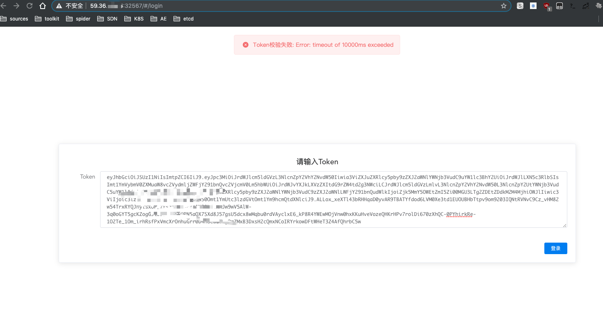

# 输入 Token 后提示 timeout

## 错误描述

如下图所示，显示错误信息：

> Token校验失败：Error: timeout of 10000ms exceeded




## 发生此错误的原因是

Kuboard 不能访问 Kubernetes apiserver。

通常出现此错误时，[Kubernetes Dashboard](https://kubernetes.io/docs/tasks/access-application-cluster/web-ui-dashboard/) 也不能正常工作。

## 此问题产生的根源

多位反馈此问题的网友都是在网上不同的地方找到了不同形式的 Kubernetes 集群安装文档，并依照文档的描述安装集群。他们都缺少如下几个步骤中的一个或多个：


**关闭 防火墙、SeLinux、swap**

``` sh
# 在 master 节点和 worker 节点都要执行
systemctl stop firewalld
systemctl disable firewalld

setenforce 0
sed -i "s/SELINUX=enforcing/SELINUX=disabled/g" /etc/selinux/config

swapoff -a
yes | cp /etc/fstab /etc/fstab_bak
cat /etc/fstab_bak |grep -v swap > /etc/fstab
```

**修改 /etc/sysctl.conf**

``` sh
# 在 master 节点和 worker 节点都要执行
vim /etc/sysctl.conf
```

向其中添加

```
net.ipv4.ip_forward = 1
net.bridge.bridge-nf-call-ip6tables = 1
net.bridge.bridge-nf-call-iptables = 1
```

执行命令以应用

```sh
# 在 master 节点和 worker 节点都要执行
sysctl -p
```

## 解决办法

* 在每一个节点上（包括Master、Worker）补充执行上述步骤，然后重新启动节点机器。
* 或者按照 [安装 Kubernetes 单Master节点](install) 的描述重新安装集群

