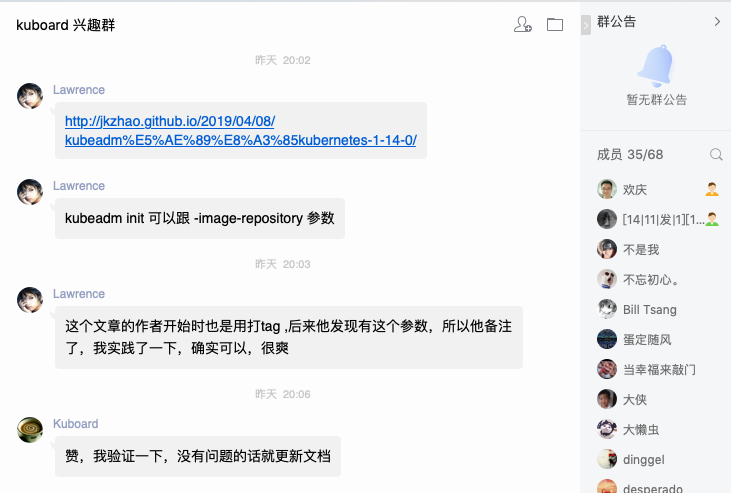
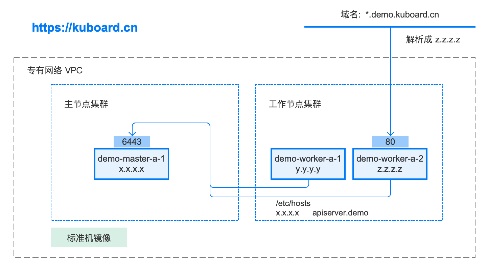

# 最值得参考的 Kubernetes 安装文档在这里

<AdSenseTitle/>

## 文档特点

**网上那么多 Kubernetes 安装文档，为什么这篇文档更有参考价值？**

* **众多网友验证，并在线提出修改意见**

  

* **持续不断地更新和完善**，[更新历史](https://github.com/eip-work/kuboard-press/commits/master/install/install-k8s.md)

  

* **在线答疑** QQ 群
  
  

## 配置要求

对于 Kubernetes 初学者，推荐在阿里云采购如下配置：

* 3台 2核4G 的ECS（突发性能实例 t5 ecs.t5-c1m2.large或同等配置，单台约 0.4元/小时，停机时不收费）
* Cent OS 7.6
  

[领取阿里云最高2000元红包](https://promotion.aliyun.com/ntms/yunparter/invite.html?userCode=obezo3pg)

Kuboard 的 Live Demo 环境使用的是如下拓扑结构，本文档描述了如何在完成该 demo 环境的搭建。

完成安装后，对应的软件版本为：

* Kubernetes v1.15.1
* Docker 18.09.7



::: tip
**关于二进制安装**

网上一直流传着一种 ***“二进制”*** 安装 Kubernetes 的方法，查了许久，未曾在 kubernetes.io 官方网站上看到任何关于此安装方法的介绍，也并没有看到任何关于 ***“二进制”*** 安装的优势，唯一的解释是：
> 由于众所周知的原因，在国内无法直接访问Google的服务。二进制包由于其下载方便、灵活定制而深受广大kubernetes使用者喜爱，成为企业部署生产环境比较流行的方式之一

鉴于目前已经有比较方便的办法获得 kubernetes 镜像，我将回避 ***二进制*** 安装是否更好的争论。本文采用 kubernetes.io 官方推荐的 kubeadm 工具安装 kubernetes 集群。

:::


## 制作标准机镜像

通过使用标准机镜像，可以

- **避免重复执行对测试机安装必要软件的过程**
- **以一种相对标准化的过程管理测试机的维护**

标准机镜像中预装了如下内容：

  - docker
  - nfs-utils
  - kubernetes images

::: tip
* 您也可以不制作标准机镜像，而是在三台机器上都执行 ***制作标准机镜像*** 中的所有操作步骤
:::

**标准机镜像的制作过程描述如下：**

### 安装docker

**卸载旧版本**

``` sh
# 在 master 节点和 worker 节点都要执行
sudo yum remove -y docker \
docker-client \
docker-client-latest \
docker-common \
docker-latest \
docker-latest-logrotate \
docker-logrotate \
docker-selinux \
docker-engine-selinux \
docker-engine
```

**设置 yum repository**

``` sh
# 在 master 节点和 worker 节点都要执行
sudo yum install -y yum-utils \
device-mapper-persistent-data \
lvm2
sudo yum-config-manager \
--add-repo \
https://download.docker.com/linux/centos/docker-ce.repo
```

**安装并启动 docker**

``` sh
# 在 master 节点和 worker 节点都要执行
sudo yum install -y docker-ce-18.09.7 docker-ce-cli-18.09.7 containerd.io
sudo systemctl enable docker
sudo systemctl start docker
```

**检查 docker 版本**

``` sh
# 在 master 节点和 worker 节点都要执行
docker version
```


> **参考文档**
> 
> https://docs.docker.com/install/linux/docker-ce/centos/
> 
> https://docs.docker.com/install/linux/linux-postinstall/


### 安装 nfs-utils

**执行安装命令**

``` sh
# 在 master 节点和 worker 节点都要执行
sudo yum install -y nfs-utils
```

必须先安装 nfs-utils 才能挂载 nfs 网络存储


### K8S基本配置

**配置K8S的yum源**

``` sh
# 在 master 节点和 worker 节点都要执行
cat <<EOF > /etc/yum.repos.d/kubernetes.repo
[kubernetes]
name=Kubernetes
baseurl=http://mirrors.aliyun.com/kubernetes/yum/repos/kubernetes-el7-x86_64
enabled=1
gpgcheck=0
repo_gpgcheck=0
gpgkey=http://mirrors.aliyun.com/kubernetes/yum/doc/yum-key.gpg
       http://mirrors.aliyun.com/kubernetes/yum/doc/rpm-package-key.gpg
EOF
```

**关闭 防火墙、SeLinux、swap**

``` sh
# 在 master 节点和 worker 节点都要执行
systemctl stop firewalld
systemctl disable firewalld

setenforce 0
sed -i "s/SELINUX=enforcing/SELINUX=disabled/g" /etc/selinux/config

swapoff -a
yes | cp /etc/fstab /etc/fstab_bak
cat /etc/fstab_bak |grep -v swap > /etc/fstab
```

**修改 /etc/sysctl.conf**

``` sh
# 在 master 节点和 worker 节点都要执行
vim /etc/sysctl.conf
```

向其中添加

```
net.ipv4.ip_forward = 1
net.bridge.bridge-nf-call-ip6tables = 1
net.bridge.bridge-nf-call-iptables = 1
```

如下图所示


执行命令以应用

```sh
# 在 master 节点和 worker 节点都要执行
sysctl -p
```

**安装kubelet、kubeadm、kubectl**

``` sh
# 在 master 节点和 worker 节点都要执行
yum install -y kubelet-1.15.1 kubeadm-1.15.1 kubectl-1.15.1
```


**修改docker Cgroup Driver为systemd**

> 如果不修改，在添加 worker 节点时可能会碰到如下错误
> ```
> [WARNING IsDockerSystemdCheck]: detected "cgroupfs" as the Docker cgroup driver. The recommended driver is "systemd". 
> Please follow the guide at https://kubernetes.io/docs/setup/cri/
> ```

``` sh
# 在 master 节点和 worker 节点都要执行
vim /usr/lib/systemd/system/docker.service
```

向其中添加

```
--exec-opt native.cgroupdriver=systemd
```

如下图所示


**设置 docker 镜像**

执行以下命令使用 docker 国内镜像，提高 docker 镜像下载速度和稳定性

> 如果您访问 https://hub.docker.io 速度非常稳定，亦可以跳过这个步骤

``` sh
# 在 master 节点和 worker 节点都要执行
curl -sSL https://get.daocloud.io/daotools/set_mirror.sh | sh -s http://f1361db2.m.daocloud.io
```

**重启 docker，并启动 kubelet**

``` sh
# 在 master 节点和 worker 节点都要执行
systemctl daemon-reload
systemctl restart docker
systemctl enable kubelet && systemctl start kubelet
```


**制作镜像**

请参考阿里云基于ECS [制作虚拟机镜像](https://help.aliyun.com/document_detail/35109.html?spm=5176.2020520101.0.0.75fc4df5mtdFmV) 的文档


## 初始化 master 节点

::: tip
以 root 身份在 demo-master-a-1 机器上执行
:::

**配置 apiserver.demo 的域名**

``` sh
# 只在 master 节点执行
echo "x.x.x.x  apiserver.demo" >> /etc/hosts
```

::: warning
请替换其中的 x.x.x.x 为您的 demo-master-a-1 的实际 ip 地址。（如果 demo-master-a-1 同时有内网IP和外网IP，此处请使用内网IP）
:::


**创建 ./kubeadm-config.yaml**

``` sh
# 只在 master 节点执行
cat <<EOF > ./kubeadm-config.yaml
apiVersion: kubeadm.k8s.io/v1beta1
kind: ClusterConfiguration
kubernetesVersion: v1.15.1
imageRepository: registry.cn-hangzhou.aliyuncs.com/google_containers
controlPlaneEndpoint: "apiserver.demo:6443"
networking:
  podSubnet: "10.100.0.1/20"
EOF

```

::: tip
podSubnet 所使用的网段不能与节点所在的网段重叠
:::


**初始化 apiserver**

``` sh
# 只在 master 节点执行
kubeadm init --config=kubeadm-config.yaml --upload-certs
```

::: tip
根据您服务器网速的情况，您需要等候 1 - 10 分钟
:::

执行结果如下图所示：


**初始化 root 用户的 kubectl 配置**

``` sh
# 只在 master 节点执行
rm -rf /root/.kube/
mkdir /root/.kube/
cp -i /etc/kubernetes/admin.conf /root/.kube/config
```


**安装 calico**

``` sh
# 只在 master 节点执行
kubectl apply -f https://docs.projectcalico.org/v3.6/getting-started/kubernetes/installation/hosted/kubernetes-datastore/calico-networking/1.7/calico.yaml
```

> 安装calico， 请参考https://docs.projectcalico.org/v3.6/getting-started/kubernetes/


**等待calico安装就绪：**

执行如下命令，等待 3-10 分钟，直到所有的容器组处于 Running 状态

``` sh
# 只在 master 节点执行
watch kubectl get pod -n kube-system
```


**检查 master 初始化结果**

在 master 节点 demo-master-a-1 上执行

``` sh
# 只在 master 节点执行
kubectl get nodes
```


## 初始化 worker节点

### 获得 join命令参数

**在 master 节点 demo-master-a-1 节点执行**

``` sh
# 只在 master 节点执行
kubeadm token create --print-join-command
```

可获取kubeadm join 命令及参数，如下所示

``` sh
# kubeadm token create 命令的输出
kubeadm join apiserver.demo:6443 --token mpfjma.4vjjg8flqihor4vt     --discovery-token-ca-cert-hash sha256:6f7a8e40a810323672de5eee6f4d19aa2dbdb38411845a1bf5dd63485c43d303
```


### 初始化worker

**针对所有的 worker 节点执行**

``` sh
# 只在 worker 节点执行
echo "x.x.x.x  apiserver.demo" >> /etc/hosts
kubeadm join apiserver.demo:6443 --token mpfjma.4vjjg8flqihor4vt     --discovery-token-ca-cert-hash sha256:6f7a8e40a810323672de5eee6f4d19aa2dbdb38411845a1bf5dd63485c43d303
```

::: tip
* 将 x.x.x.x 替换为 demo-master-a-1 的实际 ip。（如果 demo-master-a-1 同时有内网IP和外网IP，此处请使用内网IP）
* 将 kubeadm join 命令后的参数替换为上一个步骤中实际从 demo-master-a-1 节点获得的参数
:::


### 检查初始化结果

在 master 节点 demo-master-a-1 上执行

``` sh
# 只在 master 节点执行
kubectl get nodes
```


## 移除 worker 节点

::: warning
正常情况下，您无需移除 worker 节点，如果添加到集群出错，您可以移除 worker 节点，再重新尝试添加
:::

在准备移除的 worker 节点上执行

``` sh
# 只在 worker 节点执行
kubeadm reset
```

在 master 节点 demo-master-a-1 上执行

``` sh
# 只在 master 节点执行
kubectl delete node demo-worker-x-x
```

::: tip
* 将 demo-worker-x-x 替换为要移除的 worker 节点的名字
* worker 节点的名字可以通过在节点 demo-master-a-1 上执行 kubectl get nodes 命令获得
:::


## 安装 Ingress Controller

> Ingress官方文档：https://kubernetes.io/docs/concepts/services-networking/ingress/
>
> Ingress Controllers介绍：https://kubernetes.io/docs/concepts/services-networking/ingress-controllers/
>
> 本文中使用如下部署方式：https://kubernetes.github.io/ingress-nginx/deploy/baremetal/#using-a-self-provisioned-edge
>
> kubernetes支持多种Ingress Controllers，本文推荐使用 https://github.com/nginxinc/kubernetes-ingress

**在 demo-master-a-1 上执行**

``` sh
# 只在 master 节点执行
kubectl apply -f https://raw.githubusercontent.com/eip-work/eip-monitor-repository/master/dashboard/nginx-ingress.yaml
```

**配置域名解析**

将域名 *.demo.yourdomain.com 解析到 demo-worker-a-2 的 IP 地址 z.z.z.z （也可以是 demo-worker-a-1 的地址 y.y.y.y）

**验证配置**

在浏览器访问 a.demo.yourdomain.com，将得到 404 NotFound 错误页面

::: tip
由于需要申请域名，过程会比较繁琐，有如下两种替代方案：

* 在您的客户端机器（访问部署在K8S上的 web 应用的浏览器所在的机器）设置 hosts 配置；
* 暂时放弃域名的配置，临时使用 NodePort 或者 `kubectl port-forward` 的方式访问部署在 K8S 上的 web 应用

:::

::: warning
如果您打算将您安装的 Kubernetes 用于生产环境，请参考此文档 [Installing Ingress Controller](https://github.com/nginxinc/kubernetes-ingress/blob/v1.5.2/docs/installation.md)，完善 Ingress 的配置
:::


## 下一步
:tada: :tada: :tada: 

您已经完成了 Kubernetes 集群的安装，下一步请：

[安装 Kuboard](/install/install-dashboard.html)
