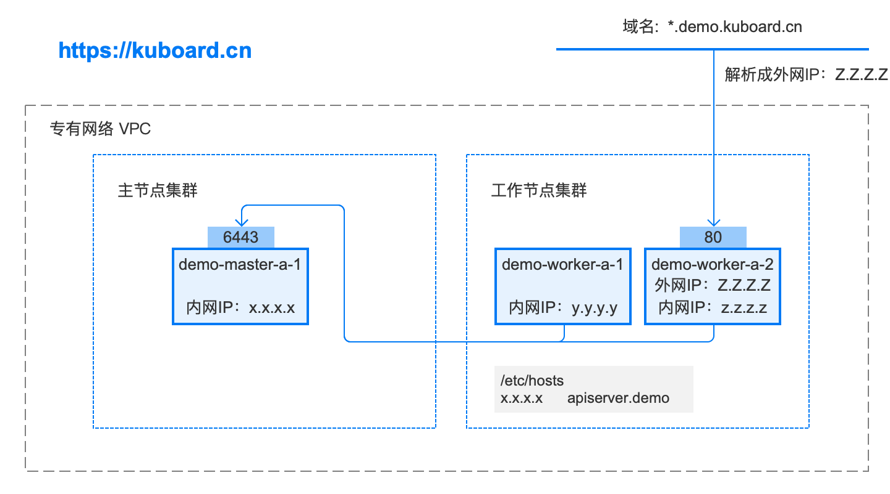

# 最值得参考的 Kubernetes 安装文档在这里

<AdSenseTitle/>

## 文档特点

**网上那么多 Kubernetes 安装文档，为什么这篇文档更有参考价值？**

* **众多网友验证，并在线提出修改意见**

  

* **持续不断地更新和完善**
  * 始终有最新的 Kubernetes 稳定版安装文档，当前版本 v1.15.2
  * 当前已更新了 <font color="red"> 39 次 </font>， [查看更新历史](https://github.com/eip-work/kuboard-press/commits/master/install/install-k8s.md)

  

* **在线答疑** QQ 群
  
  

## 配置要求

对于 Kubernetes 初学者，推荐在阿里云采购如下配置：（您也可以使用自己的虚拟机、私有云等您最容易获得的 Linux 环境）
[领取阿里云最高2000元红包](https://promotion.aliyun.com/ntms/yunparter/invite.html?userCode=obezo3pg)

* 3台 **2核4G** 的ECS（突发性能实例 t5 ecs.t5-c1m2.large或同等配置，单台约 0.4元/小时，停机时不收费）
* **Cent OS 7.6**

**安装后的软件版本为**

* Kubernetes v1.15.2
  * calico 3.8
  * nginx-ingress 1.5.3
* Docker 18.09.7

> 如果要安装 Kubernetes 历史版本，请参考：
>
> * [安装 Kubernetes 1.15.1 单Master节点](/install/history-k8s/install-k8s-1.15.1.html)

安装后的拓扑图如下：<a :href="$withBase('/kuboard.rp')" download="www.kuboard.cn.rp">下载拓扑图源文件</a> <font color="#999">使用Axure RP 9.0可打开该文件</font>



::: tip
**关于二进制安装**

网上一直流传着一种 ***“二进制”*** 安装 Kubernetes 的方法，查了许久，未曾在 kubernetes.io 官方网站上看到任何关于此安装方法的介绍，也并没有看到任何关于 ***“二进制”*** 安装的优势，唯一的解释是：
> 由于众所周知的原因，在国内无法直接访问Google的服务。二进制包由于其下载方便、灵活定制而深受广大kubernetes使用者喜爱，成为企业部署生产环境比较流行的方式之一

鉴于目前已经有比较方便的办法获得 kubernetes 镜像，我将回避 ***二进制*** 安装是否更好的争论。本文采用 kubernetes.io 官方推荐的 kubeadm 工具安装 kubernetes 集群。

:::

## 检查 centos / hostname

``` sh
# 在 master 节点和 worker 节点都要执行
cat /etc/redhat-release

# 此处 hostname 的输出将会是该机器在 Kubernetes 集群中的节点名字
# 不能使用 localhost 作为节点的名字
hostname

# 请使用 lscpu 命令，核对 CPU 信息
# Architecture: x86_64    本安装文档不支持 arm 架构
# CPU(s):       2         CPU 内核数量不能低于 2
lscpu
```

**操作系统兼容性**

| CentOS 版本 | 本文档是否兼容                          | 备注                                |
| ----------- | --------------------------------------- | ----------------------------------- |
| 7.6         | <span style="font-size: 24px;">😄</span> | 已验证                              |
| 7.5         | <span style="font-size: 24px;">😄</span> | 已验证                              |
| 7.4         | <span style="font-size: 24px;">🤔</span> | 待验证                              |
| 7.3         | <span style="font-size: 24px;">🤔</span> | 待验证                              |
| 7.2         | <span style="font-size: 24px;">😞</span> | 已证实会出现 kubelet 无法启动的问题 |

## 安装 docker / kubelet

使用 root 身份在所有节点执行如下代码，以安装软件：
- docker
- nfs-utils
- kubectl / kubeadm / kubelet


<b-card>
<b-tabs content-class="mt-3">
  <b-tab title="快速安装" active>

``` sh
# 在 master 节点和 worker 节点都要执行

curl -sSL https://kuboard.cn/install-script/v1.15.2/install-kubelet.sh | sh

```

  </b-tab>
  <b-tab title="手动安装">

手动执行以下代码，效果与快速安装完全相同。

<<< @/.vuepress/public/install-script/v1.15.2/install-kubelet.sh

::: warning
如果此时执行 `service status kubelet` 命令，将得到 kubelet 启动失败的错误提示，请忽略此错误，因为必须完成后续步骤中 kubeadm init 的操作，kubelet 才能正常启动
:::

  </b-tab>
</b-tabs>
</b-card>

## 初始化 master 节点

::: tip
* 以 root 身份在 demo-master-a-1 机器上执行
* 初始化 master 节点时，如果因为中间某些步骤的配置出错，想要重新初始化 master 节点，请先执行 `kubeadm reset` 操作
:::

::: warning
* POD_SUBNET 所使用的网段不能与 ***master节点/worker节点*** 所在的网段重叠。该字段的取值为一个 <a href="/glossary/cidr.html" target="_blank">CIDR</a> 值，如果您对 CIDR 这个概念还不熟悉，请不要修改这个字段的取值 10.100.0.1/20
:::

<b-card>
<b-tabs content-class="mt-3">
  <b-tab title="快速初始化" active>

``` sh
# 只在 master 节点执行
# 替换 x.x.x.x 为 master 节点实际 IP（请使用内网 IP）
# export 命令只在当前 shell 会话中有效，开启新的 shell 窗口后，如果要继续安装过程，请重新执行此处的 export 命令
export MASTER_IP=x.x.x.x
# 替换 apiserver.demo 为 您想要的 dnsName (不建议使用 master 的 hostname 作为 APISERVER_NAME)
export APISERVER_NAME=apiserver.demo
export POD_SUBNET=10.100.0.1/20
echo "${MASTER_IP}    ${APISERVER_NAME}" >> /etc/hosts
curl -sSL https://kuboard.cn/install-script/v1.15.2/init-master.sh | sh
```

  </b-tab>
  <b-tab title="手动初始化">

``` sh
# 只在 master 节点执行
# 替换 x.x.x.x 为 master 节点实际 IP（请使用内网 IP）
# export 命令只在当前 shell 会话中有效，开启新的 shell 窗口后，如果要继续安装过程，请重新执行此处的 export 命令
export MASTER_IP=x.x.x.x
# 替换 apiserver.demo 为 您想要的 dnsName (不建议使用 master 的 hostname 作为 APISERVER_NAME)
export APISERVER_NAME=apiserver.demo
export POD_SUBNET=10.100.0.1/20
echo "${MASTER_IP}    ${APISERVER_NAME}" >> /etc/hosts
```

<<< @/.vuepress/public/install-script/v1.15.2/init-master.sh


  </b-tab>
</b-tabs>
</b-card>


**检查 master 初始化结果**

``` sh
# 只在 master 节点执行

# 执行如下命令，等待 3-10 分钟，直到所有的容器组处于 Running 状态
watch kubectl get pod -n kube-system -o wide

# 查看 master 节点初始化结果
kubectl get nodes
```


## 初始化 worker节点

### 获得 join命令参数

**在 master 节点上执行**

``` sh
# 只在 master 节点执行
kubeadm token create --print-join-command
```

可获取kubeadm join 命令及参数，如下所示

``` sh
# kubeadm token create 命令的输出
kubeadm join apiserver.demo:6443 --token mpfjma.4vjjg8flqihor4vt     --discovery-token-ca-cert-hash sha256:6f7a8e40a810323672de5eee6f4d19aa2dbdb38411845a1bf5dd63485c43d303
```


### 初始化worker

**针对所有的 worker 节点执行**

``` sh
# 只在 worker 节点执行
# 替换 ${MASTER_IP} 为 master 节点实际 IP
# 替换 ${APISERVER_NAME} 为初始化 master 节点时所使用的 APISERVER_NAME
echo "${MASTER_IP}    ${APISERVER_NAME}" >> /etc/hosts

# 替换为 master 节点上 kubeadm token create 命令的输出
kubeadm join apiserver.demo:6443 --token mpfjma.4vjjg8flqihor4vt     --discovery-token-ca-cert-hash sha256:6f7a8e40a810323672de5eee6f4d19aa2dbdb38411845a1bf5dd63485c43d303
```

### 检查初始化结果

在 master 节点上执行

``` sh
# 只在 master 节点执行
kubectl get nodes
```
输出结果如下所示：
```sh
[root@demo-master-a-1 ~]# kubectl get nodes
NAME     STATUS   ROLES    AGE     VERSION
demo-master-a-1   Ready    master   5m3s    v1.15.2
demo-worker-a-1   Ready    <none>   2m26s   v1.15.2
demo-worker-a-2   Ready    <none>   3m56s   v1.15.2
```


## 移除 worker 节点

::: warning
正常情况下，您无需移除 worker 节点，如果添加到集群出错，您可以移除 worker 节点，再重新尝试添加
:::

在准备移除的 worker 节点上执行

``` sh
# 只在 worker 节点执行
kubeadm reset
```

在 master 节点 demo-master-a-1 上执行

``` sh
# 只在 master 节点执行
kubectl delete node demo-worker-x-x
```

::: tip
* 将 demo-worker-x-x 替换为要移除的 worker 节点的名字
* worker 节点的名字可以通过在节点 demo-master-a-1 上执行 kubectl get nodes 命令获得
:::


## 安装 Ingress Controller

> Ingress官方文档：https://kubernetes.io/docs/concepts/services-networking/ingress/
>
> Ingress Controllers官网介绍：https://kubernetes.io/docs/concepts/services-networking/ingress-controllers/
>
> 本文中使用如下部署方式：https://kubernetes.github.io/ingress-nginx/deploy/baremetal/#using-a-self-provisioned-edge
>
> kubernetes支持多种Ingress Controllers (traefic / Kong / Istio / Nginx 等)，本文推荐使用 https://github.com/nginxinc/kubernetes-ingress


<b-card>
<b-tabs content-class="mt-3">
  <b-tab title="快速安装" active>

**在 master 节点上执行**

``` sh
# 只在 master 节点执行
kubectl apply -f https://kuboard.cn/install-script/v1.15.2/nginx-ingress.yaml
```


  </b-tab>
  <b-tab title="YAML文件">

<<< @/.vuepress/public/install-script/v1.15.2/nginx-ingress.yaml

  </b-tab>
</b-tabs>
</b-card>


**配置域名解析**

将域名 *.demo.yourdomain.com 解析到 demo-worker-a-2 的 IP 地址 z.z.z.z （也可以是 demo-worker-a-1 的地址 y.y.y.y）

**验证配置**

在浏览器访问 a.demo.yourdomain.com，将得到 404 NotFound 错误页面

::: tip
由于需要申请域名，过程会比较繁琐，有如下两种替代方案：

* 在您的客户端机器（访问部署在K8S上的 web 应用的浏览器所在的机器）设置 hosts 配置；
* 暂时放弃域名的配置，临时使用 NodePort 或者 `kubectl port-forward` 的方式访问部署在 K8S 上的 web 应用

:::

::: warning
如果您打算将 Kubernetes 用于生产环境，请参考此文档 [Installing Ingress Controller](https://github.com/nginxinc/kubernetes-ingress/blob/v1.5.3/docs/installation.md)，完善 Ingress 的配置
:::


## 下一步
:tada: :tada: :tada: 

您已经完成了 Kubernetes 集群的安装，下一步请：

[安装 Kuboard](/install/install-dashboard.html)

安装 Kuboard 之前先
  <a target="_blank" :href="`http://demo.kuboard.cn/dashboard?k8sToken=${$site.themeConfig.kuboardToken}`">
    在线体验 Kuboard
  </a>

::: tip
* Kubernetes 初学者，[点击这里获取 Kubernetes 学习路径](/overview/#kubernetes-%E5%88%9D%E5%AD%A6%E8%80%85)
:::
