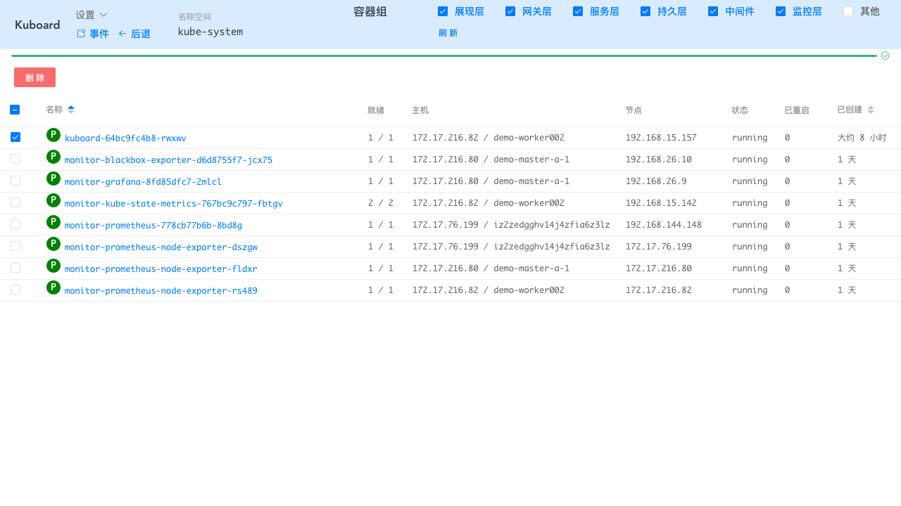

# 升级 Kuboard

## 最新版本

稳定版： v1.0.2
发布日期： 2019-09-01

测试版： v1.0.3-beta.5
发布日期： 2019-09-19

[查看更新日志](/overview/change-log.html)

## latest 标签升级

按照 [安装 Kuboard](install-dashboard.html) 文档完成 Kuboard 安装后，您使用的 Kuboard 镜像是 latest 标签。每次 Kuboard 版本更新后，latest 标签对应的镜像也更新为最新版本。您需要执行下述操作，以完成 latest 镜像更新：

::: tip

* 安装 Kuboard 时，指定了 Kuboard 的 [imagePullPolicy](https://kubernetes.io/docs/concepts/containers/images/#updating-images) 为 Always。
* 在您的生产环境中，请避免使用 latest 标签，以确保版本的稳定性。

:::

* 进入 Kuboard 首页，完成登录，进入 Kuboard ***集群概览*** 页

* 点击 ***名称空间 / kube-system*** 进入 **kube-system** 名称空间

* 点击 ***容器组列表*** 按钮

* 勾选 ***监控*** 筛选项，点击刷新

  选择 kuboard-xxxxxxxxxx-xxxxx 容器组，如下图所示：

* 点击 ***删除*** 按钮

  点击 ***应用*** 按钮

  点击 ***完成*** 按钮

  等待容器组调整完毕

* 刷新浏览器页面

* 验证版本更新结果

  如下图所示

## 指定版本升级

* 进入 Kuboard 首页，完成登录，进入 Kuboard ***集群概览*** 页
* 点击 ***名称空间 / kube-system*** 进入 **kube-system** 名称空间
* 点击 ***调整镜像版本*** 按钮
* 勾选 ***监控*** 筛选项，点击刷新

  并修改 Deployment / Kuboard 的镜像版本为您要升级到的目标版本，如下图所示

* 点击 ***执行变更***

  点击 ***应用***

  点击 ***完成***

  等待容器组调整完毕。

* 刷新浏览器页面

* 验证版本更新结果

  如下图所示

